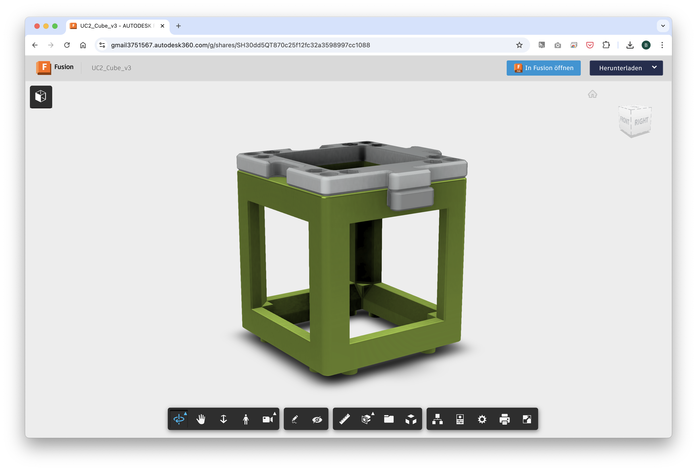
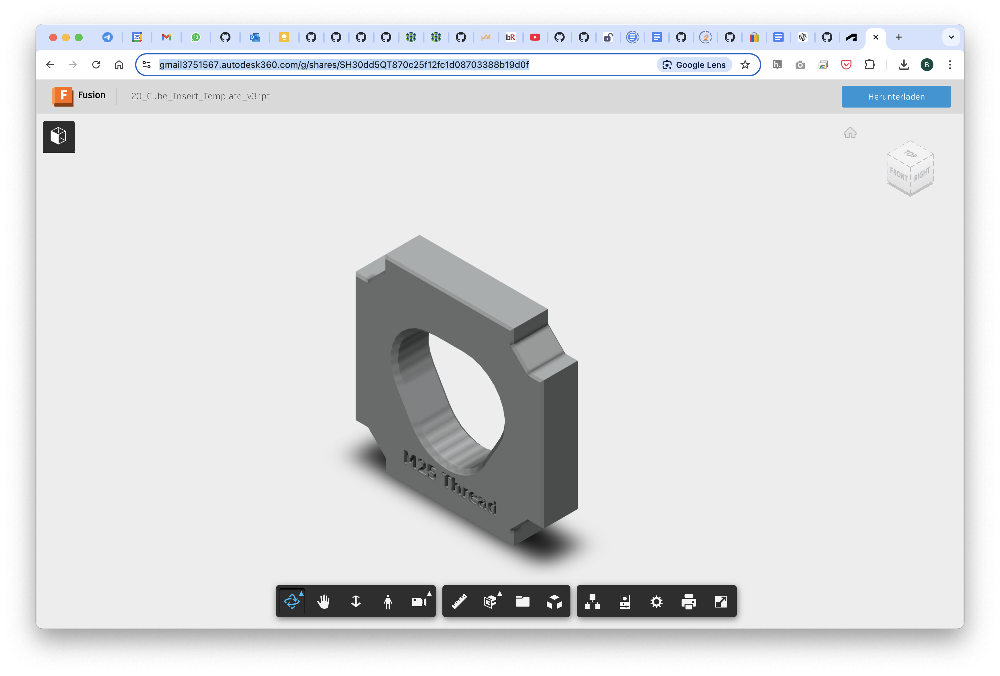
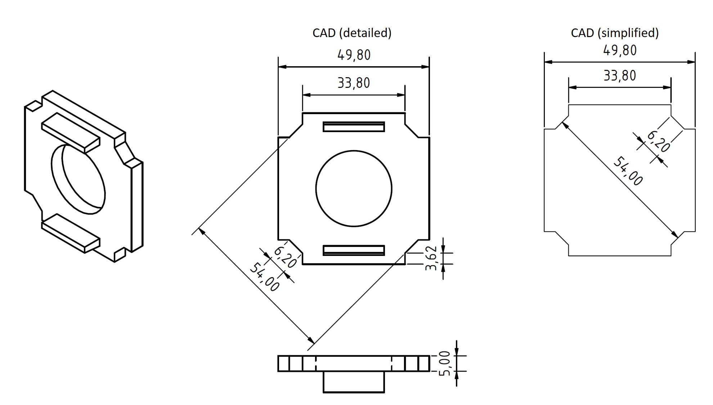
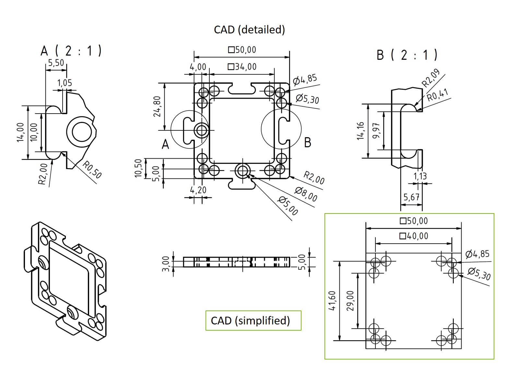
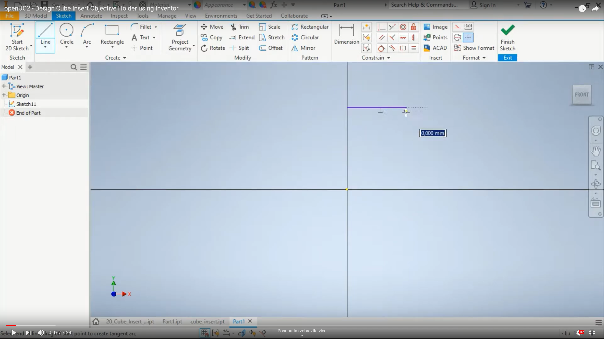
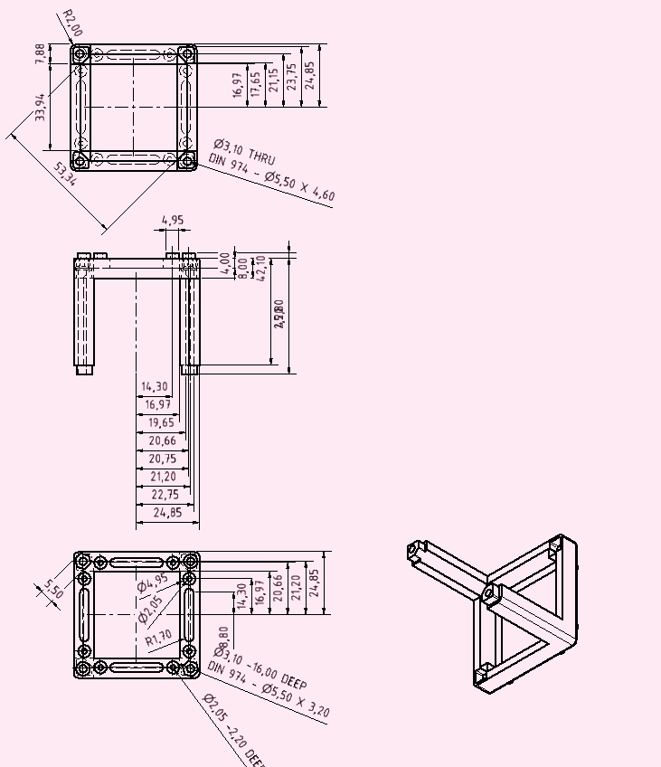

# openUC2 Template for your own Insert


We try to keep UC2 as open as possible. One important step is to give you the tools at hand to create your own insert in Order to add own functionalities, parts, modules, etc.
This repository should help you creating inserts and understand the core idea behind the shape and how it can be used to add e.g. lenses, mirros, motors.

If you have a more complex idea for a module, say a rotating diffuser, please feel free to reach out to us! We are happy to support your research with open-source tools!

A good resource is also the [***Module Developer Kit (MDK)***](https://github.com/openUC2/UC2-GIT/tree/master/MDK) that summarizes the core concept of UC2's modularity.


***What you will see here:***

* UC2 Cube Inserts
* Design files for
	* Autodesk Inventor
	* OpenSCAD
	* Fusion360
	* STP- and STL-files
* Technical drawings to replicate module in e.g. metal?
* Tutorial to design your modules in Autodesk


## UC2 v4 Design

This is a new version of the cube that has some minor yet very important changes to improve usability and assembly. The main changes are:
- grooves along the optical axis to work together with the master insert in order to lock an insert (e.g. lens) perfectly perpendicular to the optical axis and not movable
- no edges to cut your fingers anymore! 
- moved hole position for the through holes to align it with the new puzzle piecs
- capable of loading 5mm ball magnets to snap them to the grid magnetically 
- same knob foodprint to keep compatibility with v3 baseplates


### Insert Design


### Design your own Insert in Tinkercad

Below you can find a step-by-step guide to create your own insert in Tinkercad, a free online 3D design tool. For this you need a free Tinkercad account.

Feel free to copy the template design we created for you: [Tinkercad UC2 Insert Template](https://www.tinkercad.com/things/j9oYjW6ftqo-openuc2-insert-template)


The link to this file can be found here:
https://www.tinkercad.com/things/j9oYjW6ftqo-openuc2-insert-template


### Design your own insert in Fusion 360 

We provide an example Fusion360 file for a lens insert that you can modify to create your own insert design. Since we exported it from Autodesk Inventor, the ability to alter the design is lost unfortunately. It is very similar to a STP file in that sense. 
You can find the file here: https://a360.co/3ZvHHal

The editable Fusion360 design files for the UC2 v4 cube and baseplate can be found here: https://a360.co/4rjtYiu 


### Design for the Masterinsertt

*Coming Soon*... Eager to wait? Write us a messae *support @ openuc2 . com*. 

### Design Files 

#### STP

[Insert Awsembly as STP](/INVENTOR/v4/STP/SUB - 0026 - LEND40F-50 - V04 - virt ass.stp)

#### INVENTOR

[Inventor Part (Lens)](/INVENTOR/v4/INVENTOR/BUY - Lens - f-50 D43 sA10 sI5 bi-cv.ipt)
[Inventor Part (Nut)](/INVENTOR/v4/INVENTOR/PRT - 2005 - NUTD43.ipt)
[Inventor Part (Insert)](/INVENTOR/v4/INVENTOR/PRT - 2027 - INSLEND43F-50 - V04.ipt)
[Inventor Part (Perameters)](/INVENTOR/v4/INVENTOR/MAS - 0001 - Main Parameters - V03-04.ipt)
[Inventor Part (Insert)](/INVENTOR/v4/INVENTOR/MAS - 2013 - Square Inserts - V04.ipt)
[Inventor Assembly (Assembly)](/INVENTOR/v4/INVENTOR/SUB - 0026 - LEND40F-50 - V04 - virt ass.iam)

#### STL 

[Insert as STL (Lens)](/INVENTOR/v4/STL/SUB - 0026 - LEND40F-50 - V04 - virt ass_BUY - Lens - f-50 D43 sA10 sI5 bi-cv_3.stl)
[Insert as STL (Insert)](/INVENTOR/v4/STL/SUB - 0026 - LEND40F-50 - V04 - virt ass_PRT - 2027 - INSLEND43F-50 - V04_1.stl)
[Insert as STL (Nut)](/INVENTOR/v4/STL/SUB - 0026 - LEND40F-50 - V04 - virt ass_PRT - 2005 - NUTD43_2.stl)


## UC2 v3 Design

## Fusion360 Design Files

#### Cube and Base

This is a close-to-the-injection-molding design. The press-fit can vary. It's optimized for 3D printing.

You can find the latest Inventor Design files in the Fusion360 cloud: https://a360.co/3ZwHhl7



You can download and export this in multiple CAD formats.

#### Insert

This serves as a template for your optics. Fill it with whatever you have and model it in your 3D CAD software: https://a360.co/3MYo0RX




#### UC2 Cube Inserts

The cube inserts can be fully customized to adapt any optical element to the cubes. So far a perpendicular and diagonal version exists. The design files for Autodesk Inventor and OpenSCAD are available. Once you have a customized version, please share it so that the open-aspect of the system reaches its full potential :)


A Youtube tutorial showing you how to create your own insert can be found [here](https://youtu.be/CUzuymscB5k)

Since the cube is point symmetric around the origin, the inserts can be rotated in all directions and bridges external components to the modules by acting as an open-standard.

When you create a new insert, you have to make sure it follows the following design criteria (e.g. dimensions):



For the baseplate you must follow these dimensions:



The CAD templates for Autodesk Inventor 2022 (```.ipt```) and ```STL/STEP```-standard can be found in the [INVENTOR](./INVENTOR)-folder and  [STL](./STL)/ [STP](./STP)-folder .


### Autodesk Inventor 2022 Design files

All files can be found in the folder [INVENTOR](./INVENTOR).

***Steps to work on the files:***

1. Open Autodesk Inventor 2022
2. Create a new project
3. Open the Assembly file: `Assembly_Cube_Template_v3.iam`
4. Get yourself familiar with the:
- Cube
- Baseplate
- Insert
5. Try modifying the file `20_Cube_Insert_Template_v3.ipt` so that you can mount your inidividual files

### Videotutorial

We have a dedicated video tutorial to show how you can create your own insert.
**Video Tutorial on How to design a Cube Insert (Perpendicular to the optical axis)**  
**The tutorial shows a v2 insert - the principle is the same but the dimensions differ!**

[](https://www.youtube.com/watch?v=q2DNw-Q1KEo&t=2s)


## OpenSCAD Design files

All files can be found in the folder [OPENSCAD](./OPENSCAD).

*Alternatively* you can also find the files in the Thingiverse Universe that allows you to modify certain parameters in the file without installing openSCAD. You can find it here [Thingiverse](https://www.thingiverse.com/openuc2/designs).

***Steps to work on the files:***

1. Open OpenSCAD
2. Open the file `UC2_Lens_insert_v2.scad`
3. Try to understand what each parameter modifies in the geometry of the cube insert
4. Render and export as STL

## Technical Drawings

You can find additional information about the cube in the folder [CAD](./CAD).

### CAD file for the cube (injection molded / IM)



## Get Involved

This project is open so that anyone can get involved. You don't even have to learn CAD designing or programming. Find ways you can contribute in  [CONTRIBUTING](https://github.com/openUC2/UC2-GIT/blob/master/CONTRIBUTING.md)


## License and Collaboration

This project is open-source and is released under the CERN open hardware license. Our aim is to make the kits commercially available.
We encourage everyone who is using our Toolbox to share their results and ideas, so that the Toolbox keeps improving. It should serve as a easy-to-use and easy-to-access general purpose building block solution for the area of STEAM education. All the design files are generally for free, but we would like to hear from you how is it going.

You're free to fork the project and enhance it. If you have any suggestions to improve it or add any additional functions make a pull-request or file an issue.

Please find the type of licenses [here](https://github.com/openUC2/UC2-GIT/blob/master/License.md)

REMARK: All files have been designed using Autodesk Inventor 2019 (EDUCATION)


## Collaborating
If you find this project useful, please like this repository, follow us on Twitter and cite the webpage! :-)
