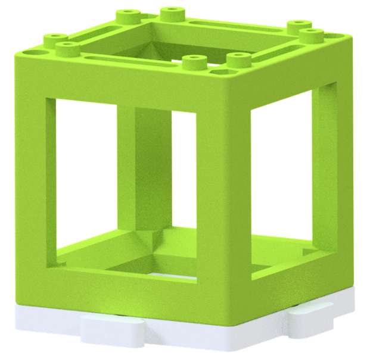
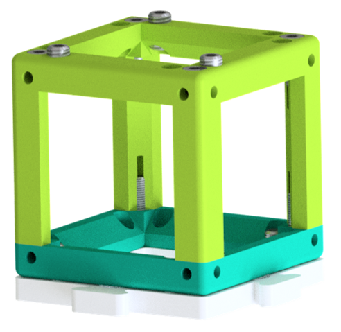
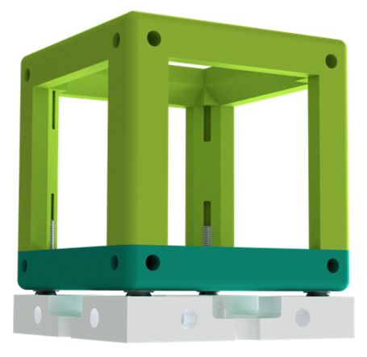
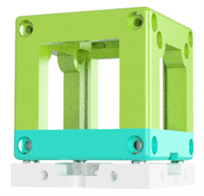

# openUC2 Module Developer Kit for your own Ideas (for current Version V4)

We try to keep UC2 as open as possible. One important step is to give you the tools at hand to create your own Modules, in Order to add own functionalities, parts, optical setups, etc. This documentation should help you creating inserts and understand the core idea behind the shape and how it can be used to add e.g. lenses, mirros, motors.

If you have a more complex idea for a module, say a rotating diffuser, please feel free to reach out to us! We are happy to support your research with open-source tools!

---

## Cube
The cube is the cornerstone of UC2 framework. Its purpose is to create a bridge between the toolbox and any external component. The cube itself is universal and thanks to the modular design of the inserts, it can be adapted for any application.

*   Interface to bridge UC2 and any external component
*   Beam path is perpendicular and through center of the cube's faces
*   Centrosymmetric
*   Compatible with Thorlabs 1" Cage System
*   Function can be put into the cube by a special insert
*   Dimensions of the "50 mm" Cube unit  
    *  The baseplate puzzle piece has the size of 50×50 mm2
    *   Distance from face to face is ~49,8 mm – to incorporate imprecision of the 3D-printer cube and to avoid adding up error in larger setups
*   (IM) The pins of the cube fit into the holes of the baseplate
*   (3D) Technical pins connect the cube with the baseplate

##### STL und CAD Files
It is important to pay attention to calibration of your printer according to the guide in the [baseplate CAD page](../CAD/ASSEMBLY_Baseplate).

##### technical Drawing

you can find the PDF Document [here](https://github.com/openUC2/openUC2-MDK/tree/main/CAD/technical%20drawing)

## Baseplate Puzzle
The Baseplate is the “skeleton” of the UC2 framework and holds the different modules in place and in given mutual position. The baseplate is made of its single units - baseplate puzzles. The Baseplate can have any shape any size, depending on how many puzzles you use and how you put them together. It allows you to build setups in three dimensions when you 'sandwich' the layers of cubes and baseplates.
The baseplate puzzles are the same whether you print them with a 3D printer or you use the IM ones. They can also be freely combined together.

* Baseplates puzzles can be arbitrarily combined into large or small baseplates
* Module finds its place on a grid
* The system can be built in the 3rd dimension by sandwiching layers of cubes and baseplates
* Holes for pins to create a stable lego-like connection between the cube and the baseplate
* Dimensions:
    *   Base-plate unit: 50×50 mm2
    *   Distance: Magnet-Magnet: 40 mm
* (IM) The pins of the cube fit into the holes of the baseplate
* (3D) Technical pins connect the cube with the baseplate

##### STL und CAD Files
It is important to pay attention to calibration of your printer according to the guide in the [baseplate CAD page](../CAD/ASSEMBLY_Baseplate).

##### technical Drawing

you can find the PDF Document [here](https://github.com/openUC2/openUC2-MDK/tree/main/CAD/technical%20drawing)

## Inserts
The cube inserts can be fully customized to adapt any optical element to the cubes. So far a perpendicular and diagonal version exists. The design files for Autodesk Inventor and OpenSCAD are available. Once you have a customized version, please share it so that the open-aspect of the system reaches its full potential :)

Since the cube is point symmetric around the origin, the inserts can be rotated in all directions and bridges external components to the modules by acting as an open-standard.

## Insert(perpendicular)
* This can be slided into the cube
* Allows variation in the position along the optical axis, three different orientations of the insert inside the cube are possible

##### STL und CAD Files
The CAD templates for Autodesk Inventor 2019 (.ipt) and STL/STEP-standard can be found in the CAD-folder.
##### technical Drawing

you can find the PDF Document [here](https://github.com/openUC2/openUC2-MDK/tree/main/CAD/technical%20drawing)
##### Tutorial

### Insert (diagonal)
* This can be slided into the cube
* Allows variation in the position with an angle of 45° w.r.t. the optical axis
##### STL und CAD Files
##### technical Drawing

you can find the PDF Document [here](https://github.com/openUC2/openUC2-MDK/tree/main/CAD/technical%20drawing)

##### Tutorial

## Definition
The UC2 framework requires the introduction of several new concepts. These terms are defined in the table below

Name | Description
:---:|:---:
**PUZZLE (Baseplate)** | The **BASE puzzle pieces**, the basic units, are joined into the **BASEPLATE** (“skeleton” of the setups). The Baseplate can have any shape any size, depending on how many puzzles you use and how you put them together. It allows you to build setups in three dimensions when you 'sandwich' the layers of cubes and baseplates. This is the frame and backplane of the UC2 project, determining the size and layout of the optical system. 3D-printed UC2 modules attach to the square baseplate positions using ball-magnets and ferro-magnetic screws. The injection moulded cubes attach via their lego-like pins. Find the details of the baseplates on their [CAD page](../CAD/ASSEMBLY_Baseplate). *(Git: ASSEMBLY_Baseplate)*
**CUBE (IM)** | The injection moulded (IM) is a half of the cube. The **ASSEMBLY CUBE (empty)** cube is composed of these two identical halves and can be easily assembled by their press-fit mechanism. The assembled IM cube has two sides with eight lego-like pins each to attach to the baseplate. *(Git: ASSEMBLY_CUBE_BASE)*
**CUBE (3D)** | Alternatively, the whole cube can also be 3D-printed.
**ASSEMBLY CUBE (empty)** | The raw cube - the basic building block comes in two versions: 3D-printed and injection moulded. Both of them have the same dimensions and symmetry, so the insert fit them all. The similarities and differences of the two systems are explained under this table in the *UC2 version history section*. Note that the MDK only details the specification of the Cube and Base to the extent that it is necessary for module developers to develop modules. Find the details of the Cube on its [CAD page](../CAD/ASSEMBLY_CUBE_Base). *(Git: ASSEMBLY_CUBE_BASE)*
**CUBE INSERTS** | Cube Inserts are physical components that implement various functions into the system by adapting **EXTERNAL PARTS** to the **ASSEMBLY CUBE INSERT**. They fit the inner dimensions of the cube. There are two types of inserts: perpendicular (to the optical axis) and diagonal. They serve as holders for various components like  lenses, mirrors, cameras, filters, and other components demanded by the application. Existing inserts can be adjusted to fit specific parts (i.e. lens diameters).
**EXTERNAL PARTS** | Everything which is not part of the UC2-system or can not be 3D printed is termed as an EXTERNAL PART. This can be commercially available parts like objectives, lenses, LEDs, etc., but also 3D-printed parts from other projects (e.g. openflexure stage).
**ASSEMBLY CUBE (insert)** | This is the combination of the ASSEMBLY CUBE (empty) and a CUBE INSERTS. Since the ASSEMBLY CUBEs are the building blocks of a UC2 setup, adding features is accomplished by hardware plugins also called CUBE INSERTS.
**EXTERNAL MODULES** | Using EXTERNAL MODULES one adapt EXTERNAL PARTS that typically do not fit inside a cube but give function to it. This can be for example cellphones, stages projectors, etc. By providing customized hardware-adapter they interface with the ASSEMBLY CUBE.
**COMPLETE MODULES**  | Entire Functional modules that can be swapped to the system. They have the correct screws and dimensions to adapt to baseplate. They are fully independent, but follow the optical path (e.g. SIM-module, ISM-module, projector, etc.).
**OPTICAL SYSTEM** | APPLICATIONs are complete optical setups or microscopes. They are composed of several baseplate puzzles and modules with different functions. The GitHub-repository provides a list of basic optical systems which are also compiled into a ready-to-use list called "TheBOX".

---

### UC2 version history
When you search through the repository, you find that not all the images show the same cubes and baseplates. This is due to the evolution of the basic building blocks. In order to help you not to get lost, here is a short explanation of how the cubes evolved.

#### V4 = 3D-printed AND Injection Moulded with Riffles
*March 2025*
**This is the current version.**
There are still tweo fully compatible versions, now with Riffles for better alligment and anti-kippen, as well as rounded edges.

Additionaly in the printing version you connect the cubes not via screws or magnets but with technical LEGO Pins 2760.

It is important to pay attention to calibration of your printer according to the guide in the [baseplate CAD page](../CAD/ASSEMBLY_Baseplate).
If you are still working with the v3 version of the cube, you find the documentation in the [UC2-V3 Module Developer Kit](https://github.com/openUC2/UC2-GIT/tree/master/MDK).

#### v3 = 3D-printed AND Injection Moulded
*November 2020*  
The cube comes in two versions that are fully compatible with each other. You can either print all the baseplates and cubes and assemble and connect them using screws and magnets, or you can use the IM cubes and baseplate puzzles that connect via the lego-like pins.

The IM cube is shown in the first picture. The two identical halves fit perfectly together and each of the two pinned sides of the cube fits to the baseplate.

The 3D-printed cube is in the next picture. The body and the lid are held together by the M3 screws that attach to the magnets of the baseplate. Additionally, M5 screws are added to the position of the pins for better alignment precision.

The 3D-printed baseplate puzzles are fully compatible with both types of cubes and with the IM puzzles. It is important to pay attention to calibration of your printer according to the guide in the [baseplate CAD page](../CAD/ASSEMBLY_Baseplate).

#### v2 = point symmetric
*July 2019*  
The v2 version looks pretty much like v3 without pins. The cube is point symmetric, therefore the insert can be used in various orientations. The baseplates have to be assembled in Inventor and printed in the desired size - mostly 4×1, 4×2, 4×4. The cube is also made of the Body and the Lid and can vary in size (e.g. 1×1, 2×1, etc.).  
They seem to be the same as the IM cubes - but not completely. The dimensions are slightly different. It isn't anything you couldn't fix with a file and sticky tape but it's advisable to use the matching cubes and inserts.

You can still find a lot of pictures with v2 cubes in the GitHub - many of the applications we tested are simply shown in the version, which we first build them with.   
Knowing that it’s mechanically overdefined, the 4-point interface with screws and magnets gives the degree of freedom to level out mechanical imprecisions e.g. due to 3D printing etc. by adjusting the positions of the screws.

:grey_exclamation: If you are still working with the v2 version of the cube, you find the documentation in the [UC2_v2 branch](https://github.com/bionanoimaging/UC2-GIT/tree/UC2_v2).

#### v0 = the early cube
*2017*  
Why is there no v1? Because all the slow and steady development from the very beginning until the real modular microscopes is covered in this one. The v0 cube had a rail system similar to the cage system used by e.g. Thorlabs or Newport. The baseplate wasn't very different from v2.

The old cube is not compatible with the current design and currently isn't shown anywhere in the repository.

#### Other versions
Have we tried other designs? Sure, we have. The cubes are nice to play with and nice for planning a setup but the design is mechanically over-determined. We tried to put the cube on [3-point connection](./CAD/ALTERNATIVE_DESIGN/UC2_with_3-holes-cubes) and use the [hexagonal building blocks](./CAD/ALTERNATIVE_DESIGN/UC2_with_Hexagonal_Block). Have a look at the attempts and issues to see why we stick with the cubes as they are.

---
# Get Involved
This project is open so that anyone can get involved. You don't even have to learn CAD designing or programming. Find ways you can contribute in CONTRIBUTING

# License and Collaboration

This project is open-source and is released under the CERN open hardware license. Our aim is to make the kits commercially available. We encourage everyone who is using our Toolbox to share their results and ideas, so that the Toolbox keeps improving. It should serve as a easy-to-use and easy-to-access general purpose building block solution for the area of STEAM education. All the design files are generally for free, but we would like to hear from you how is it going.

You're free to fork the project and enhance it. If you have any suggestions to improve it or add any additional functions make a pull-request or file an issue.

Please find the type of licenses here

# Collaborating
If you find this project useful, please like this repository, follow us on Twitter and cite the webpage! :-)
