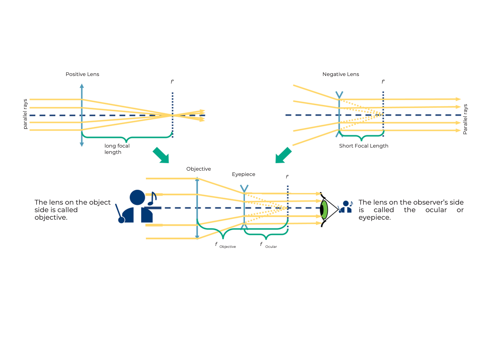
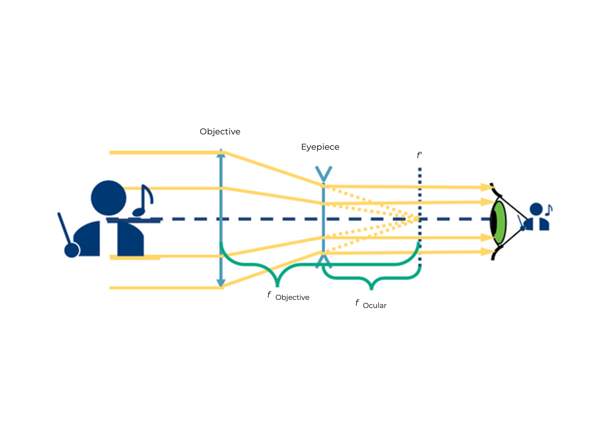
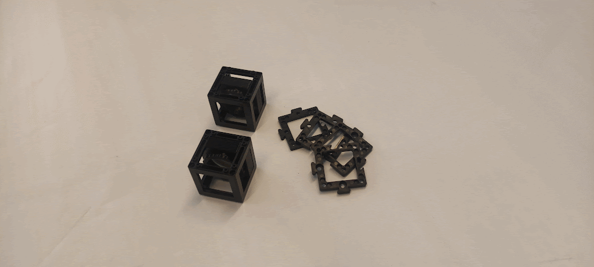

## ما هو تلسكوب غاليليو؟
المدة: 10 دقائق

ضع مكعبات العدسة على الورقة كما هو موضح في المخطط، ثم انظر عبر التلسكوب إلى البعيد.

كيف تبدو الصورة؟
كيف يكون اتجاه الصورة؟

 

أثناء النظر من خلال التلسكوب، قم بضبط المسافات بين المكونات لرؤية صورة واضحة!

 

## هذا هو تلسكوب غاليليو

التلسكوب هو أداة بصرية تجعل الأشياء البعيدة تبدو أقرب أو أكبر بكثير.

العدسة على جانب الجسم تُسمى العدسة الشيئية.

العدسة المواجهة للعين تُسمى العدسة العينية.

يُستخدم تلسكوب غاليليو أيضًا في نظارات الأوبرا.

## كيف يعمل تلسكوب غاليليو؟

ما هو التكبير في هذا التلسكوب؟

معادلة حساب التكبير:

الصورة تكون دائمًا:

* مكبرة وفقًا للمعادلة أعلاه
* قائمة
* تُقرأ بشكل صحيح

لكن مجال الرؤية صغير.

 

## دليل عملي: تلسكوب غاليليو

### المواد المطلوبة:
- أربع قواعد
- عدسة موجبة 100 مم (في مكعب)
- عدسة سالبة -50 مم (في مكعب)

### التعليمات:

**الخطوة 1: ضع القواعد على العدسات**

**الخطوة 2: ضع القواعد على الأسفل**

**الخطوة 3: ركب المكعبات**

**الخطوة 4: اضبط المسافة بين العدسات**

**الخطوة 5: استخدم التلسكوب!**

## ما هو تلسكوب كبلر؟

كيف تبدو الصورة؟
كيف يكون اتجاه الصورة؟

 

قم بضبط المسافات بين المكونات للحصول على صورة واضحة!

 

## كيف يعمل تلسكوب كبلر؟

ما هو التكبير في هذا التلسكوب؟

معادلة حساب التكبير:

الصورة تكون دائمًا:

* مكبرة وفقًا للمعادلة أعلاه
* مقلوبة
* الجوانب معكوسة

ومجال الرؤية أكبر من تلسكوب غاليليو.

 

## دليل عملي: تلسكوب كبلر

### المواد المطلوبة:
- ثماني قواعد
- عدسة موجبة 100 مم (في مكعب)
- عدسة موجبة 50 مم (في مكعب)
- مكعبان فارغان

### التعليمات:

**الخطوة 1: محاذاة المكعبات**

**الخطوة 2: تثبيت المكعبات بالقواعد**

**الخطوة 3: ضبط المسافة**

**الخطوة 4: استخدام التلسكوب**

## ما هو منظار الرصد؟

كيف تقارن الصورة هنا مع تلسكوب كبلر؟

 

قم بضبط المسافات بين المكونات للحصول على صورة واضحة!

 

## كيف يعمل منظار الرصد؟

التكبير مشابه لتلسكوب كبلر، لكن عدسة التوجيه تغير الاتجاه فقط دون تغيير التكبير.

الصورة تكون:

* مكبرة بنفس مقدار تلسكوب كبلر
* قائمة
* معكوسة أفقيًا

 
