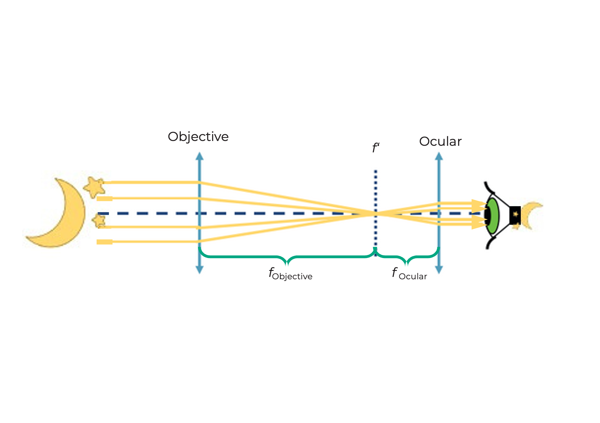

## What is a Galileo telescope?
Duration: 10

Place the lens cubes on the sheet as shown in the diagram, then peer through the telescope into the distance.

What does the picture look like?
How is the image oriented?

 

As you look through the telescope, adjust the distances between the components to see a sharp image!

 

## This is a Galileo telescope

A telescope is an optical instrument that makes distant objects appear many times closer or larger.

The lens on the object side is called the lens.

The lens facing the eye is called the eyepiece.
The Galileo telescope is also used in opera glasses.

## This is how the Galileo telescope works

What is the magnification of this Galileo telescope?

Formula for calculating magnification

It is not possible to achieve very high magnification with this telescope. But it is very compact.

The picture is always

* Magnified with the magnification from the formula above
* Upright
* Right reading

The field of view is small.

 

## What is a Kepler telescope?

Set the lenses in the correct positions as shown in the diagram. Then look through the telescope into the distance.

What does the picture look like?
How is the image oriented?

 

As you look through the telescope, vary the distances between the components to see such a sharp image!

 

## This is a Kepler telescope

This type of telescope is often used in astronomy.

## This is how the Kepler telescope works

What is the magnification of this Kepler telescope?

Formula for calculating magnification

This telescope can achieve a higher magnification than the Galilean telescope. But it creates the opposite picture. However, this is not a problem for observing the stars.

The picture is always

* Magnified by the magnification from the formula above
* Vice versa
* Sides reversed

The field of view is
larger than with the Galileo telescope.

 

## What is a spotting scope?

The spotting scope is long, so the scheme is not the same size.
Set the lenses in the correct positions as shown in the diagram and look into the distance through the telescope.

which results into

How does the image here compare to the Kepler telescope?

 

As you look through the telescope, adjust the distances between the components to see a sharp image!

 

## This is how the spotting scope works

The magnification is like that of the Kepler telescope. The erecting lens only changes the orientation (the image is reversed), not the magnification.

An upright image is necessary for terrestrial observations. True terrestrial telescopes use prism systems to rotate the image and keep it compact.

The picture is

*Magnified at the same magnification as the Keppler telescope
*Upright
*mirrored

 
