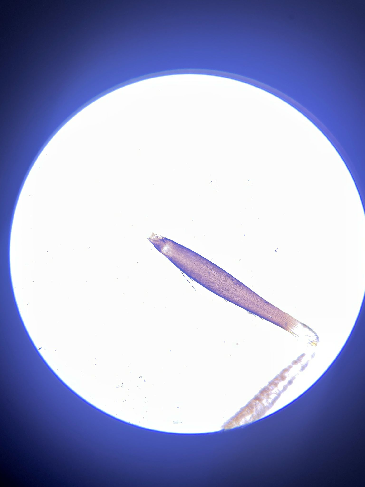

## Troubleshooting and Improving the Smartphone Microscope

It may happen that the imaging result doesn't look as good as it could look like. For this we provide a series of explanations to correct for this
Overall, with the updated components, the setup should look like something like this:

## Perfect Imaging Condition

## Wrong Flashlight Mode

## Flashlight too much focussed

## Flashlight too bright

## Distance between Smartphone and Eyepiece too large

## Oblique Angle between Flashlight and Sample (kinda darkfield)

## Ok Imaging with diffuser between flashlight and sample

## Overexposed but good imaging (koehler illumination)

## Oblique Illuimation (Darkfield)

