## Instructions for Kepler's Telescope

### Elements:

- Eight base plates.
- 100 mm positive lens (in cube).
- 50 mm positive lens (in cube).
- Two empty cubes.

### Diagram (side view):

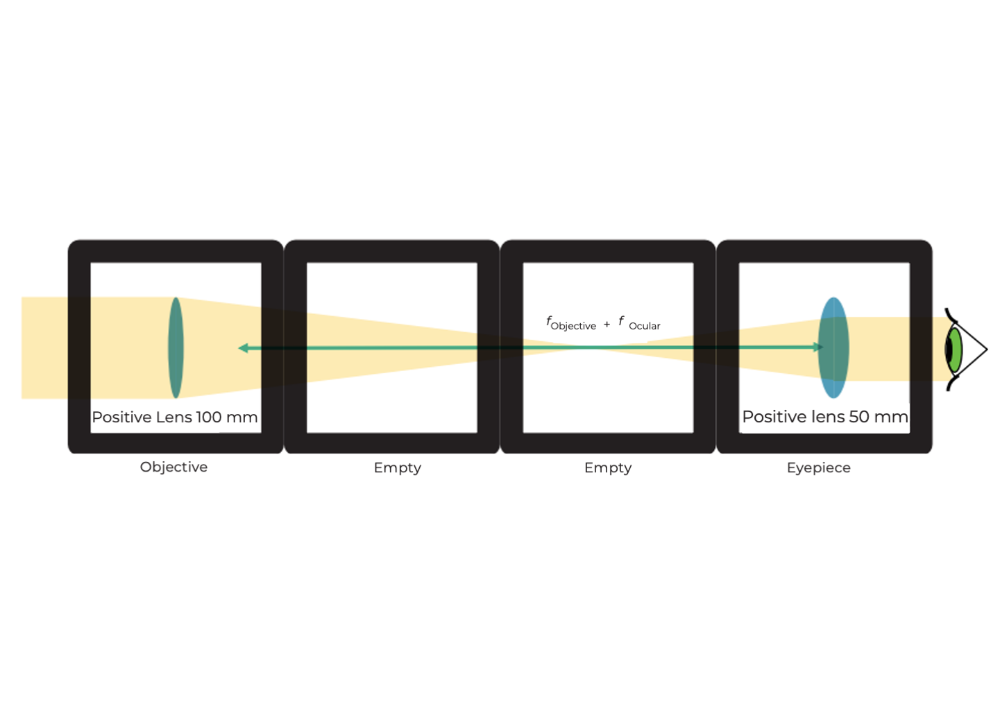

### Instructions:

**Step 1: Align the cubes**

Align the cubes such that the two lenses lay at the extremes and the two empty cubes in the middle.

**Step 2: Fix the cubes with base plates**

Fix the cubes with the base plates placing them on top and on the bottom.

**Step 3: Adjust the distance**

Adjust the distance between the lenses as shown in the image.

**Step 4: Use Kepler's telescope**

Look for an object to the distance and use Kepler's telescope to look at it.

## Instructions for the Light Microscope with Infinity Optics

### Elements:

- Kepler's telescope.
- Torch lamp.
- Sample holder (in cube) with sample.

### Diagram (side view):

### Instructions:

**Step 1: Add the sample**

Add the sample cube behind to the 50 mm positive lens. Don’t forget to add the base plates.

**Step 2: Fix the cubes with base plates**

Use the torch to illuminate the sample. Look for a screen (notebook, piece of paper) to project the image onto.

**Step 3: Adjust the distance**

Turn off ambient light to see the image on the screen clearly. Adjust the distance between the microscope and the screen until you see a sharp focused image (check the diagram).

## Instructions for the Light Microscope with Infinity Optics and Eyepiece

### Elements:

- Kepler's telescope.
- Torch lamp.
- Eight base plates.
- Sample holder (in cube) with sample.
- Mirror (in cube).
- Empty cube.
- Eyepiece (in cube).

### Diagram (side view):

### Instructions:

**Step 1: Add the sample-holder cube**

Add the sample-holder cube in the Kepler's telescope next to the 50 mm converging lens.

**Step 2: Assemble next to the 100 mm lens**

Next to the 100 mm converging lens, assemble one empty cube and the mirror cube next to it.

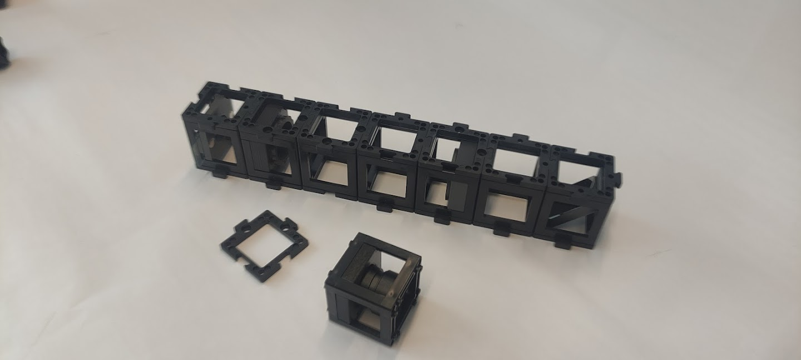

**Step 3: Place the eyepiece**

Place the eyepiece on top of the mirror cube with the right orientation. Illuminate the sample from a considerable distance.

**Step 5: Adjust for a sharp image**

Look through the eyepiece. Adjust the lenses distance until you see a focused sharp image. Note: If you don’t see the specimen try to adjust the slide’s position carefully until you see the specimen.

## Instructions for the Light Microscope with Finite Optics and Eyepiece

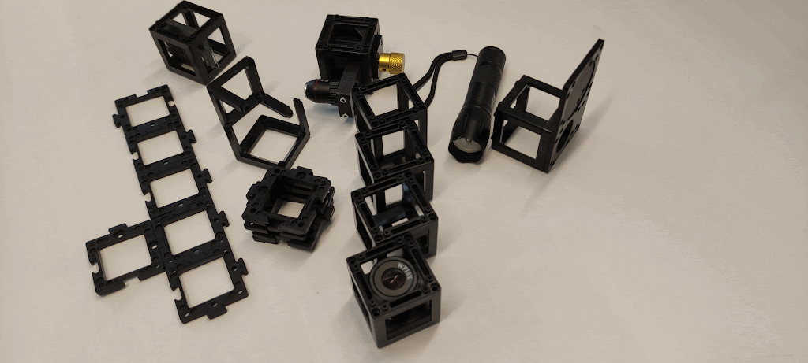

### Elements:

- Microscope objective (4x) with gear mount (linear stage).
- Torch lamp with lamp base.
- Twelve base plates.
- Sample holder (in cube) with sample.
- Mirror (in cube).
- Three empty cubes.
- Eyepiece (in cube).

### Diagram (side view):

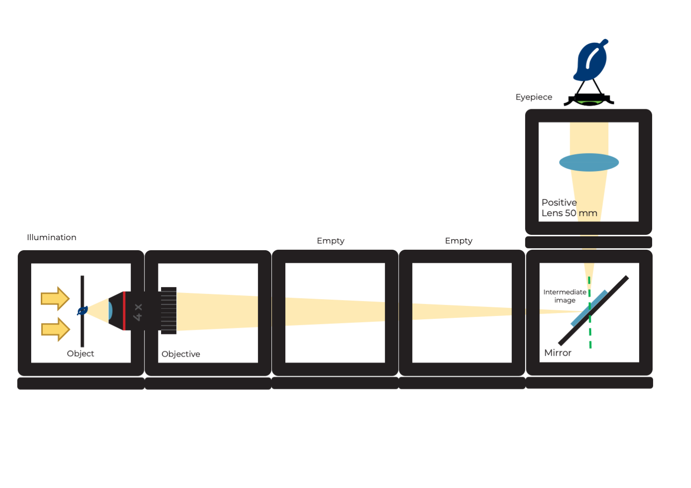

## Instructions for Assembling the Microscope with Finite Optics

**Step 1: Connect the base plates**

Connect the base plates in the following way.

**Step 2: Place the sample**

Place the sample on the leftmost plate.

**Step 3: Build and place the cubes**

Build a cube with the microscope objective inside and place both microscope objective and gear cubes in the next two base plates. Include all additional images as shown.

**Sub Step 1:**

**Sub Step 2:**

**Sub Step 3:**

**Step 4: Reflect the light**

Place two empty cubes and the cube with the mirror at the last base plate such that it reflects the light coming from the sample upwards.

**Step 5: Secure the cubes**

Place the base plates on top of the cubes to fix them tightly.

**Step 6: Attach the eyepiece**

Place the eyepiece on top of the mirror cube. Mind the right orientation of the eyepiece.

**Step 7: Illuminate the sample**

Fix the lamp with a base and illuminate the sample from a considerable distance. Look through the eyepiece and adjust the microscope distance using the gear until you see a focused image of the specimen.

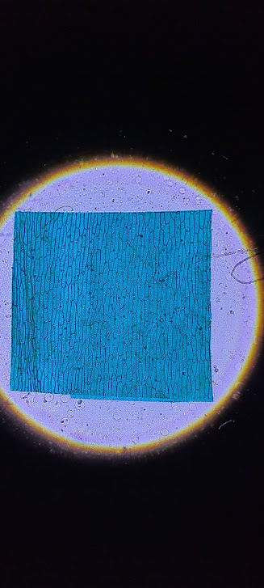

## Smartphone Microscope

### Elements:

- Microscope objective 4x.
- Microscope objective long mount with gear.
- Ramsden-Eyepiece (in cube).
- Two non-kinematic mirrors (in cubes).
- Sample holder (in cube).
- Three empty cubes.
- 11 base plates.
- Smartphone base plate.
- Torch lamp.
- 50 mm lens (in cube).

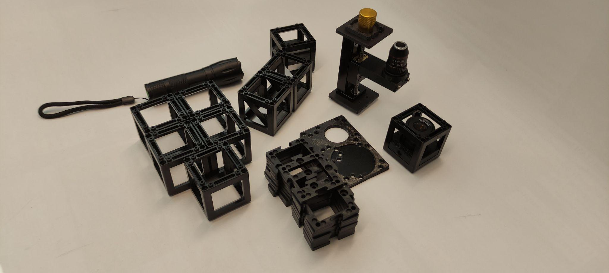

### Diagram (Side view):

## Instructions for Smartphone Microscope Assembly:

**Step 1: Build a four-base plate line**

**Step 2: Assemble the components**

Place the Microscope objective mount on one extreme followed by the two mirrors facing each other and one empty cube in the other extreme. Fix them with base plates.

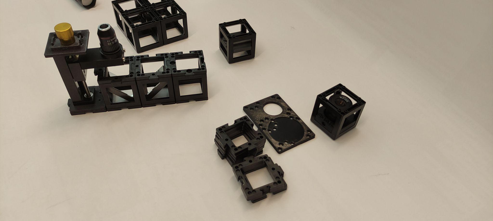

**Step 3: Adjust the objective**

Build one cube with the microscope objective inside. Adjust the objective's height if necessary by using the gear.

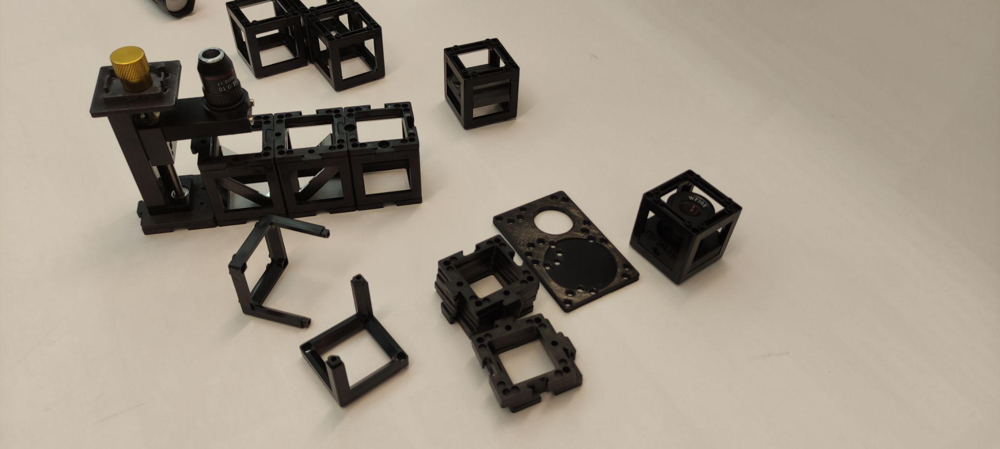

**Step 4: Place the eyepiece**

Place the eyepiece next to the microscope objective and one empty cube next to it. Mind the right orientation of the eyepiece.

**Step 5: Align the smartphone base**

Place the smartphone base with the hole aligned with the eyepiece. Note: You can adjust the orientation of the smartphone base to adapt your smartphone's size.

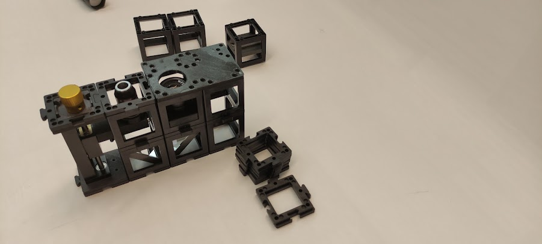

**Step 6: Set up the sample holder**

Place the sample holder cube on top of the microscope objective. Mind the distance between them. You can adjust the coarse distance by sliding the sample holder inside the cube and the finer distance by using the gear.

**Step 7: Add the converging lens and lamp**

Place a converging lens cube on top of the sample holder cube and place the torch lamp on top. Place the smartphone aligned to the eyepiece.

**Step 8: Adjust for clarity**

Try to move the smartphone such that the whole eyepiece circle appears illuminated. Then, turn the gear to focus and get a sharp image of the specimen.

## Michelson Interferometer

### Elements

- Laser diode
- Hikrobot Camera (MV-CE060-10UC) with USB cable.
- Stage with gear with mirror.
- Three kinematic mirrors (in cubes).
- Beam splitter in cube.
- Sample holder (in cube).
- One empty cube.
- 16 base plates.
- Screen.
- Pinhole in cube.
- Screwdriver to adjust alignment (1,5x60)

### Diagram

### Instructions

**Step 1: Build a four base plate**

Build a four base plate as shown. This will be used to connect the laser diode, pinhole, the beamsplitter, and an empty cube. Add the base plates to fix them.

*Note: At this point the laser diode should be turned off the whole time. Don't look at the laser directly. Always use screens to look for the laser light.*

**Step 2: Place the pinhole**

Place the pinhole such that it is as far as possible to the laser diode.

**Step 3: Close the diaphragm**

Close the diaphragm as much as possible to end up with a small hole.

**Step 4: Place the screen and align the laser**

Place the screen after the pinhole and turn the laser on. The alignment is most likely off. So to align the laser you should use the screwdriver and adjust the laser mount screws so that the beam is centered on the pinhole. Turn the laser off.

**Step 5: Replace the pinhole with a kinematic mirror**

Without touching the screws of the laser, remove the pinhole from the group of cubes and add a kinematic mirror instead.

**Step 6: Align the beam with the pinhole**

Using the top and bottom base plates, place the pinhole after the beamsplitter connecting the pinhole and the kinematic mirror in a straight line. Place the screen after the pinhole, turn the laser on and align the beam to the center of the pinhole as shown. Turn the laser off.

**Step 7: Set the Michelson interferometer arms**

Remove the pinhole and set other base plates as shown. These are the variable and reference arms of the Michelson interferometer. Place the reference and movable mirrors as shown. Place the pinhole in the detection spot. Fix everything with base plates.

**Step 8: Align and observe the interference**

Place the screen after the pinhole, turn the laser on. You will see two beam spots, one from each mirror. Adjust the movable mirror angles with the screwdriver so that you can see an improvement in brightness of one of the spots and look for the maximum.

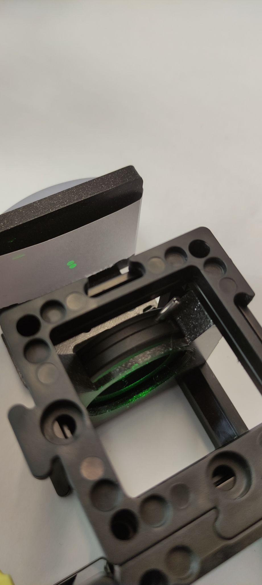

**Step 9: Adjust the reference mirror**

Adjust the screws of the reference mirror so that the two beams overlap as much as possible.

**Step 10: Observe the interference pattern**

Remove the pinhole and place the screen only. You will see two extended beams. Adjust the reference mirror screws to overlap the beams perfectly. You will see the interference pattern emerging. Then try to center the pattern on the screen. Turn the laser off.

**Step 11: Set up the camera**

Place the camera and fix it with the base plates. Connect it to the computer and open the MV Software. To check the MVS tutorial click here.

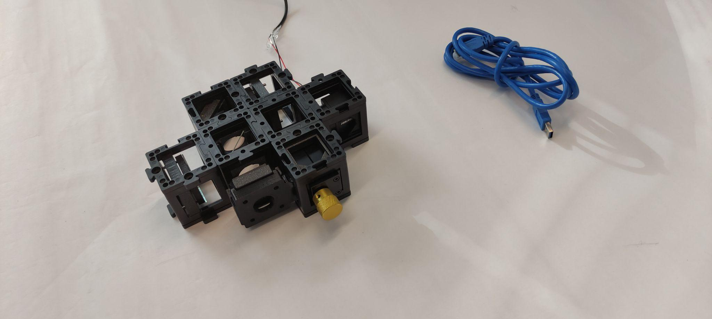

**Step 12: Adjust the camera exposure**

Adjust the exposure time of the camera. You should see a fringe pattern. Try to adjust the reference mirror screws finely to bring the center of the interference pattern to the center of the camera.

## Mach-Zender Interferometer

### Elements

- Laser diode
- Hikrobot Camera (MV-CE060-10UC) with USB cable.
- Small stage with gear.
- Two kinematic mirrors (in cubes).
- Two beam splitters in cube.
- Sample holder (in cube).
- Two empty cubes.
- Base plates.
- Screen.
- Pinhole in cube.
- Screwdriver to adjust alignment (1,5x60)
- Two 100 mm converging lenses.

### Instructions

**Step 1: Build the base plate configuration**

Build the base plate configuration as shown. Note: At this point the laser diode should be turned off the whole time. Don't look at the laser directly. Always use screens to look for the laser light.

**Step 2: Align the laser diode with the pinhole**

Place the laser diode, an empty cube, and a 100 mm convergent lens in a straight line. Then, place the pinhole two cube units from the lens and place the screen after the pinhole. Turn the laser on and align it using by using the screws to center the beam with the pinhole.

**Step 3: Check beam collimation**

Check if the beam is collimated by placing the screen at different distances. The beam diameter should stay relatively the same size. If it is not the same size, this means that the distance between the laser and the lens should be adjusted. Turn the laser off.

**Step 4: Set up the beam splitter and mirror**

Place the beam splitter and the kinematic mirror as shown. Place the pinhole two cube units away from the mirror and the screen behind it. Turn the laser on and align the kinematic mirror using the screws. Once it's done, turn the laser off.

**Step 5: Adjust the microscope objective and lens**

Place the microscope objective, followed by an empty cube and the 100 mm lens. You should adjust the distance between the objective and the 100 mm lens so that the beam is collimated after going through both. Place the screen after the lens. Turn the laser on and check the collimation. Adjust the distance as necessary. Turn the laser off.

**Step 6: Setup and alignment**

Place the camera on the sample arm as shown. Put the screen on the other arm exit. Place the sample holder using one half of the cube at a time to not collide with the microscope objective.

Turn the laser on and use the screen to align both beams using the screws on the reference mirror.

**Step 7: Connect and adjust in the MVS app**

Connect the camera to the computer and open the MVS app. Block the reference beam. Move the coverslide such that your sample enters the FoV (Field of View). Unblock the reference beam. Zoom into the image to distinguish the fringe pattern in the MVS camera display. Adjust the angles of the reference mirror using the screws to change the fringe pattern as shown.

**Step 7: Data processing**

Process the data. Phase unwrapping possible.

### First Tests with Modifications to the Original Setup

Using Lei code, the need of a linear stage for the sample was identified. Adjusting the objective and tube lens enhances the interference, making it crucial to use the ImSwitch interface to see the FFT in real time and optimize. The final goal is to move the position of the first order interference to use Lei algorithm (or some Phase unwrapping algorithm) to retrieve the Phase. To achieve this, two images need to be acquired: a sample image and a background image (without a cover slide or a slide region with no specimen).

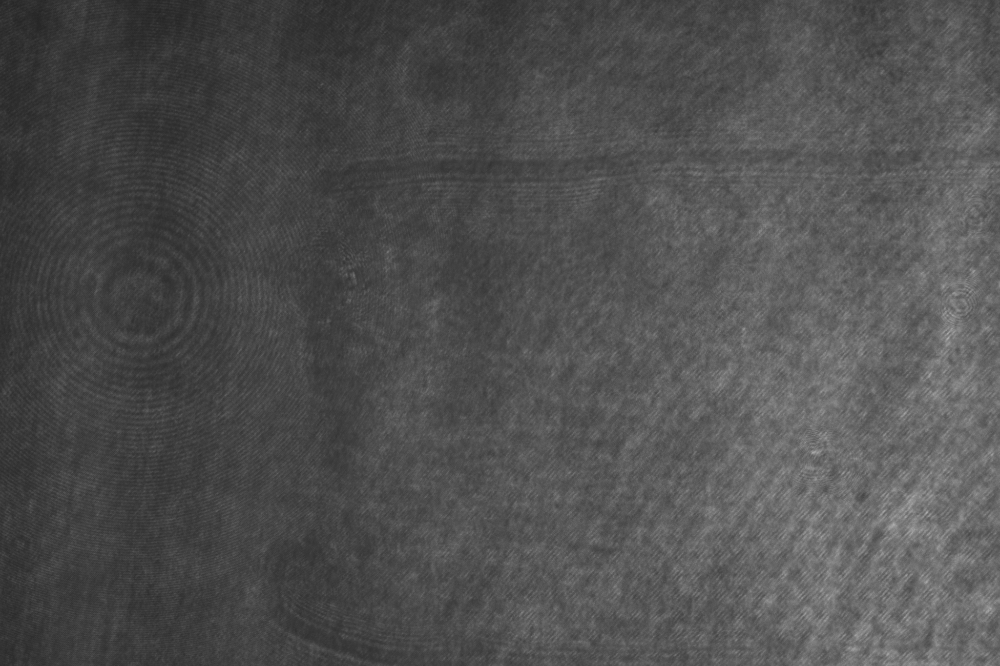

### Result of Phase Unwrapping

### Install MVS App for Camera Utilization

Camera model: MV-CE060-10UC. Visit the HIKROBOTICS website and download the MVS software suitable for your computer. Below are steps exemplifying the software installation for Mac.

Install the downloaded file.

Open the MVS Software.

You should see the following window.

Connect the camera. Refresh the USB line to detect the camera.

Select the make-link button on the detected camera.

The following window should be displayed.

Click on the play button in the actions bar of the camera.

If properly connected, you should see a real-time image. Adjust the exposure if the image is overexposed.

To adjust the exposure time, go to the Feature tree, select the Acquisition Control Category, and change the Exposure Auto option to *Continuous*.

Now, a clear image with good contrast should be visible.

To stop recording, click on the stop button in the camera's actions bar.

To disconnect the camera, click on the break-link button next to the detected camera in the USB devices list.

