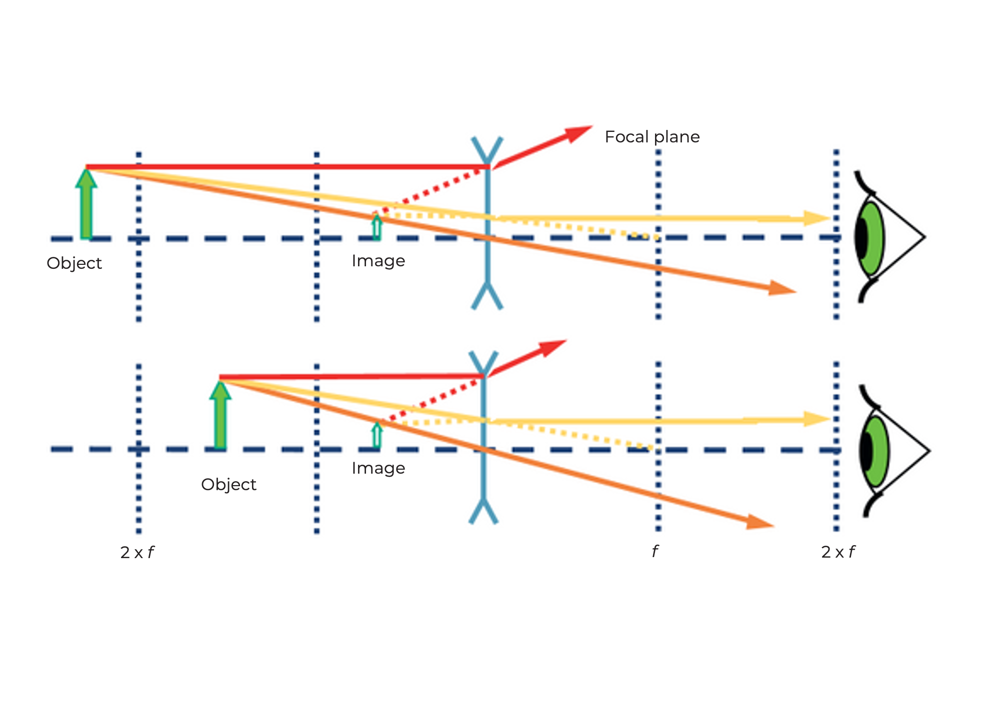
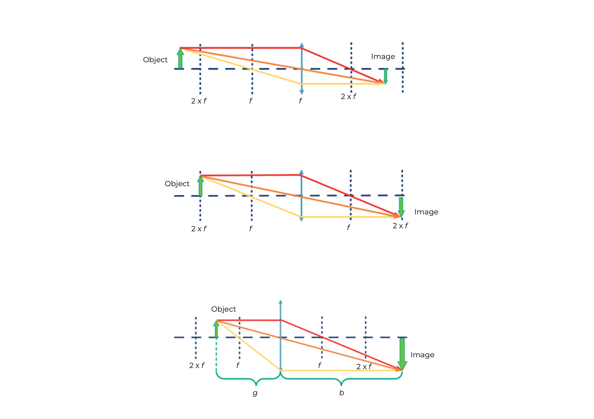
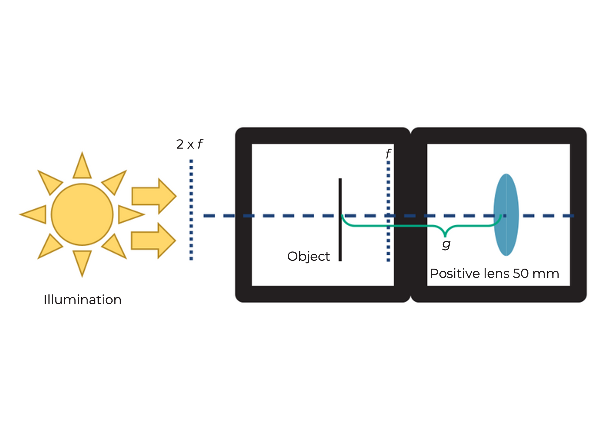
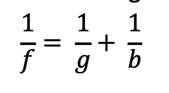
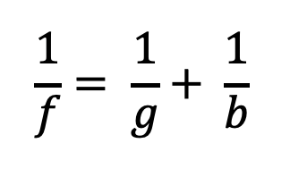

## Linsen

In der Strahlenoptik wird Licht als Bündel von Strahlen (Pfeilen) dargestellt, was die physikalischen Eigenschaften des Lichts vereinfacht. Ein Strahl hat eine Richtung und wird daher mit einem Pfeil gezeichnet. Eine Linse „bricht“ den Strahl und ändert dessen Richtung.

Die **Brennweite** einer Linse entspricht der Entfernung von der Linse zur Brennebene, auf der der Brennpunkt liegt. Sie wird in Millimetern angegeben (f = mm).

### Sammellinsen (positiv) und Zerstreuungslinsen (negativ)

Sammellinsen brechen die Lichtstrahlen, die parallel zur optischen Achse verlaufen, in einem Punkt, der Brennpunkt genannt wird.

Die Zerstreuungslinsen brechen die Lichtstrahlen, die parallel zur optischen Achse verlaufen, so, als ob sie von einem Punkt, dem „virtuellen“ Brennpunkt, ausgingen.

## Linsen „brechen“ die Lichtstrahlen

Sie können die Brennweite der Linse als aufgedruckte Zahl am Linsenhalter finden. Die MiniBOX erhält eine 100mm Sammellinse, zwei 40mm Sammellinsen und eine -50mm negative Linse. Die Zahlen geben die Brennweite an.

Die Sammellinse wird auch positive oder konvexe Linse genannt. Der mittlere Teil der Linse ist immer dicker als der Rand.

Die Sammellinse vergrößert das Bild. Die Vergrößerung unterscheidet sich zwischen der 40mm Linse und der 100mm Linse. Das Bild kann aufrecht oder invertiert sein.

 

Die negative Linse (Streulinse) wird manchmal auch negative oder konkave Linse genannt. Der mittlere Teil der Linse ist immer dünner als der Rand.

Mit der negativen Linse (hier: -50 mm Linse) wird das Bild immer verkleinert und immer aufrecht dargestellt.

 

Wir gehen davon aus, dass unsere Linsen sogenannte „dünne Linsen“ sind. Das bedeutet, dass wir sie als eine Ebene betrachten können und uns nicht um ihre Dicke kümmern müssen. Das macht Erklärungen und Berechnungen viel einfacher.

Haben die Antworten weitere Fragen aufgeworfen? Dann fahren Sie fort, um genau zu verstehen, wie Linsen funktionieren...

 

## Linsenbild

Nehmen Sie jetzt die Linsenwürfel. Versuchen Sie mit der richtigen Linse, die Brennweiteninformation in den Würfeln zu entziffern. Bewegen Sie die Linse über die Schrift, bis sie dieselbe Größe wie der Text "UC2" hat.

Können Sie den Text in derselben Größe und Ausrichtung wie das "UC2" sehen? Was passiert, wenn Sie den Abstand zwischen Linse und Bild ändern?

 

Was passiert, wenn Sie eine Linse mit der falschen Brennweite verwenden?

 

## Bild eines Objekts durch eine positive Linse

Nehmen wir die Sammellinse als Beispiel. Wir starten mit einem Objekt (grüner Pfeil) und sehen, was mit den Strahlen passiert, die von der Spitze ausgehen. Es gibt unendlich viele Strahlen in alle Richtungen, aber für die Zeichnung der Figur reichen die folgenden drei Strahlen aus:

1. Der **Zentralstrahl** (orange) passiert ungestört das Zentrum der Linse.
2. Der **Fokusstrahl** (gelb) startet ebenfalls von der Spitze des Pfeils, geht aber durch den objektseitigen Fokus bei Brennweite f. Nach der Linse geht er in gleicher Höhe, aber jetzt parallel zur optischen Achse weiter.
3. Der **Parallelstrahl** (rot) verläuft zunächst parallel zur optischen Achse, wird dann aber an

 der Linse so gebrochen, dass er durch den bildseitigen Brennpunkt bei Brennweite f verläuft.

Das Bild entsteht dort, wo alle Strahlen sich schneiden. Dieses Prinzip wird für alle Punkte oder die von ihnen ausgehenden Strahlen eines Objekts verwendet. Je nach verwendeter Linse und Position des Objekts ändern sich die Eigenschaften des Bildes, wie Größe, Orientierung und Position.

## Bild eines Objekts durch eine negative Linse

Im Fall der negativen Linse verwenden wir dieselbe Methode, um den Strahlengang abzubilden. Anders als bei der Sammellinse ist das Bild immer verkleinert und virtuell. Die Vergrößerung hängt von der Position des Objekts vor der Linse ab. Anders als bei der Sammellinse wird das Bild auf der Objektseite erzeugt und daher als virtuelles Bild bezeichnet. Sie können es direkt mit Ihren Augen sehen, aber nicht auf einen Bildschirm projizieren.

Die Art, wie eine Linse ein Bild erzeugt, ist vorhersehbar, wenn man die Brennweite dieser Linse kennt. Daher muss ein bestimmter Abstand eingehalten werden, damit Sie die Schrift mit der angegebenen Linse auf dem vorherigen Blatt sehen können.

 

Die Vergrößerung und der Ort, an dem das Bild entsteht, hängen von der Brennweite der Linse und dem Abstand zwischen Linse und Objekt ab.

 

Mit der Zerstreuungslinse (f = -50 mm) sehen Sie immer ein verkleinertes virtuelles Bild. Ein virtuelles Bild kann nur mit dem Auge betrachtet werden. Bisher haben wir nur virtuelle Bilder gesehen.

 

## Die Sammellinse als Lupe

Nehmen Sie den UC2-Linsenwürfel mit einer Brennweite von f=40mm und verwenden Sie ihn als Lupe.

Können Sie die kleinen Buchstaben durch die Sammellinse lesen? Was steht dort?

 

Eine Linse in Aktion finden Sie hier:

<iframe width="560" height="315" src="https://www.youtube.com/embed/rCtZjRKU8" title="YouTube-Video-Player" frameborder="0" allow="accelerometer; autoplay; clipboard-write; encrypted-media; gyroscope; picture-in-picture" allowfullscreen></iframe>

## Das machen Sammellinsen

Mit den Sammellinsen hängen Bild und Vergrößerung von der Position des Objekts ab.

Wenn der Abstand zwischen Objekt und Linse mehr als das Doppelte der Brennweite der Linse beträgt, dann ist das Bild...
- Umgekehrt
- Seitlich getauscht
- Verkleinert
- Real

Wenn der Abstand zwischen Objekt und Linse genau das Doppelte der Brennweite der Linse beträgt, dann ist das Bild...
- Umgekehrt
- Seitlich getauscht
- Gleiche Größe
- Real

Wenn der Abstand zwischen Objekt und Linse mehr als die Brennweite und weniger als das Doppelte der Brennweite der Linse beträgt, dann ist das Bild...
- Umgekehrt
- Seitlich getauscht
- Vergrößert
- Real

### Objektabstand (g)
Der Abstand zwischen dem Objekt und der Linsenebene wird als g bezeichnet.

### Bildweite (b)
Der Abstand zwischen der Linsenebene und dem durch die Linse gebildeten Bild wird als b bezeichnet.

Die Sammellinse kann ein reales Bild erzeugen. Das reale Bild kann dann auf einem Schirm gesehen werden.

## Deshalb vergrößert die Lupe

### Lupeneffekt!

Wenn der Abstand zwischen dem Objekt und der Linse weniger als die Brennweite der Linse beträgt, dann ist das Bild...
- Aufrecht
- Richtig herum
- Vergrößert
- Virtuell

Die Lupe ist das einfachste aller optischen

 Geräte, da sie nur aus einer einfachen Sammellinse mit geeigneter Brennweite besteht. Warum vergrößert der Würfel mit 50 𝑚𝑚 den kleinen Text? Wenn das Objekt vor der Brennweite der Linse liegt – also weniger als 50 𝑚𝑚 vor der Linse – erzeugt die Linse ein virtuelles Bild, das hinter dem eigentlichen Objekt liegt. Das Auge nimmt es vergrößert wahr. Schauen Sie sich das obenstehende Diagramm an.

 

Berechnen Sie die Vergrößerung der Lupe mit der folgenden Formel:

250 𝑚𝑚 ist der Abstand der klaren Sehweite – d. h. der Abstand zwischen dem Objekt und dem Auge, bei dem die meisten Menschen gut lesen können. Mehr dazu später bei der „Akkommodation“ des Auges.

## Wie funktioniert ein Kinoprojektor?

Nehmen Sie den UC2-Linsenwürfel mit einer Brennweite von 𝑓 =40 𝑚𝑚 und platzieren Sie ihn hinter dem Probenhalterwürfel. Der Abstand zwischen dem Objekt und der Linse (also der Objektabstand g) sollte ca. 50 mm betragen. Wenn Sie das Objekt jetzt mit der Taschenlampe beleuchten, sehen Sie es in etwa 200 mm Entfernung scharf an der Wand. Ein Kinoprojektor hat anstelle des Objekts einen Filmstreifen und natürlich eine viel stärkere Lichtquelle.

Verwenden Sie eine Taschenlampe (z. B. von Ihrem Handy) als Lichtquelle und halten Sie sie vor das Objekt

 

Verwenden Sie das Bild oder den Text auf dem Mikroskopobjektträger als Objekt

 

Wie ist das Bild ausgerichtet?
Schieben Sie die Linse hin und her im Würfel und sehen Sie, wann das Bild scharf ist. Finden Sie das Bild für g = 50mm, 60mm, 65mm und messen Sie den Abstand zwischen der Linse und dem Bild.

 

## Wie funktioniert ein Kinoprojektor?

### Wo ist das Bild?
Wenn ein Objekt durch eine Sammellinse abgebildet wird, hängen Position und Größe des Bildes von der Entfernung (g) des Objekts zur Linse und deren Brennweite (f) ab.
Die Linsengleichung beschreibt die Beziehung zwischen Bildweite (b) und Objektabstand (g):

### Wie groß ist das Bild?
Die Vergrößerung des Objekts auf der Leinwand kann einfach mit der folgenden Formel berechnet werden:

## Wie der Projektor funktioniert

Überprüfen Sie, ob Ihre Beobachtung mit der Berechnung übereinstimmt

Berechnen Sie die Vergrößerung des Projektors für die verschiedenen Werte von g und b.

Unsere Linse hat eine Brennweite von f= 40 mm.

Für g = 50mm → b = 200mm

Für g = 60 mm → b = 120 mm\

Für g = 65 mm → b = 104 mm\

 

Der Projektor erzeugt immer ein vergrößertes, invertiertes (umgekehrtes) Bild.
Die Position des Bildes und seine Vergrößerung hängen von der Position und Größe des Objekts ab.

 

## Tutorial: Bestimmung der Brennweite einer positiven Linse

### Benötigte Materialien:
- Lichtquelle (z. B. Raumbeleuchtung)
- Positive Linse
- Schirm (z

. B. Tisch, Stück Papier usw.)

### Anleitung:
1. Positionieren Sie die positive Linse so, dass sie der Lichtquelle zugewandt ist. Richten Sie einen Schirm parallel zur Brennebene der Linse aus.
2. Ändern Sie den Abstand zwischen Linse und Schirm.
3. Beobachten und dokumentieren Sie sorgfältig die Position, an der die Lichtquelle ein klares Bild auf der Oberfläche des Schirms bildet.

