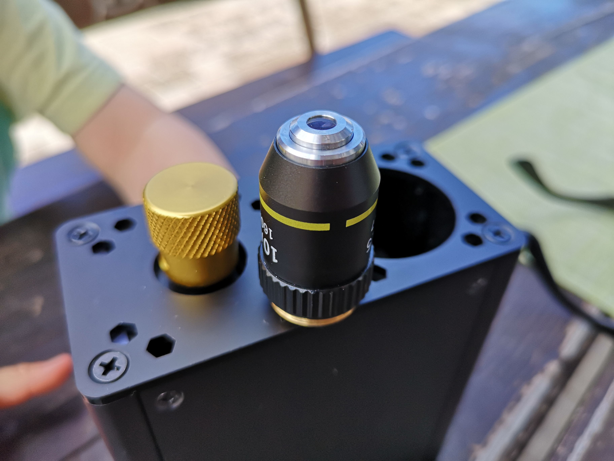
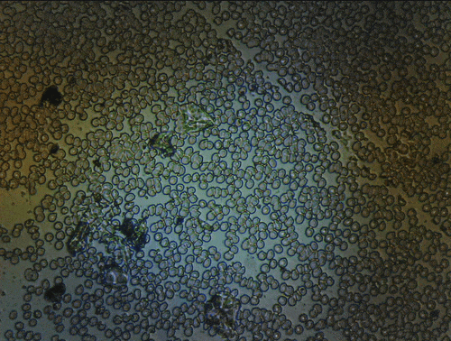

# openUC2 XIAO Microscope Documentation

:::warning **OpenUC2 Forum and Helpdesk**

If you have any question, please refer to our forum: openuc2.discourse.group

:::

## Introduction

The openUC2 XIAO Microscope is a revolutionary step towards making high-quality, automated microscopy accessible to everyone. Created in collaboration with Seeed Studio, this device is ideal for hackers, optics newcomers, and biologists. It offers more functionalities than a standard USB microscope, including timelapse, autofocusing, and autonomous operation with image storage on an SD card. This guide will help you understand the capabilities of the openUC2 XIAO Microscope and provide a comprehensive tutorial for its use.

*From Rapid Prototyping in Optics to a powerful microscopy-engine for your tinkering project*

## Key Features

- **Powerful Camera**: Equipped with the ESP32-S3 camera and an OV2560 sensor, it streams high-resolution microscopic images to your screen, supported by Arduino and CircuitPython.
- **Micrometer-Precise Focus**: The met kal-based focusing mechanism ensures precise movement of the objective lens, allowing for detailed studies. It supports motorized focus stacking for automation.
- **Robust Power Design**: The solid housing ensures reliability for everyday field research.
- **Swappable Microscope Objectives**: Easily change magnifications to observe live samples from different angles.
- **Customized Firmware**: Utilizes TinyML for on-the-fly image processing directly on the MCU, integrating sensors and other hardware for automated experiments.

*It's so easy to operate that even a 3-year old can do it 😃*

## Product Description

The openUC2 XIAO Microscope features a solid body, a high-quality camera for image transfer, and optics for magnification. The modular design allows for the integration of various optical elements like lenses, mirrors, or cameras housed in cubes. These cubes can be combined to create sophisticated optical assemblies, including microscopes, with the flexibility to add autofocusing modules or motorized stages.

*It's very compact and can be transported in your backpack. Ideal e.g. for a hike*

### Specifications

| Parameter           | Description                                                        |
|---------------------|--------------------------------------------------------------------|
| Processor           | ESP32-S3 SoC with a RISC-V single-core 32-bit chip, up to 160 MHz  |
| Wireless            | 2.4GHz Wi-Fi, Bluetooth 5.0/Bluetooth mesh                        |
| Optical Resolution  | 10x, 0.3 NA Objective Lens, resolution down to 4µm                |
| Interface           | UART, IIC, SPI, 11x GPIO (PWM), 4x ADC, Reset button, Boot button |
| Dimensions          | 150 x 100 x 50 mm                                                 |
| Power               | Input voltage (VIN): 5V                                           |
| Working Temperature | -40°C to 85°C                                                     |

## Main Applications

- **Timelapse Imaging**
- **Education**
- **Environmental Research**
- **Field Research**
- **Health Monitoring**
- **Rapid Prototyping**

## Comparison with Existing Microscopes

Traditional microscopes are often limited by fixed functionalities and high costs. The openUC2 XIAO Microscope's modular, open-source design offers unparalleled flexibility and affordability, making advanced microscopy accessible for educational, research, and field applications.

*The objective lens can easily be swapped by unscrewing it from the RMS thread*

## Getting Started

The openUC2 XIAO Microscope is a combination of the MatchboxScope (based on the ESP32 camera) and the UC2 modular system. The firmware is open-source and can be flashed using a web interface.

1. Connect the Xiao via USB-C to your computer.
2. Visit [Matchboxscope Firmware](https://matchboxscope.github.io/firmware/FLASH.html) to flash the Xiao firmware.
3. The microscope creates a Wi-Fi hotspot named `OpenUC2xSeeed-XXXXX` (where `XXXXX` is the MAC address).
4. Connect to this hotspot using your laptop, tablet, or smartphone.
5. Access the web interface at `192.168.4.1` to stream images and adjust settings.

For enhanced functionality, download the [Anglerfish APP](https://github.com/Matchboxscope/Anglerfish-APP/releases) for additional features like video storage and external hardware control.

## Experiments

### Experiment 1: Field Tripping
- Take the microscope and explore the microverse wherever you go

### Experiment 2: Autofocus and Miniaturized Stage for Large Samples with the UC2 Electronic
- Implement a motorized stage for precise sample positioning and autofocusing.
- Use external electronics to control fluid samples and capture images as they move. Curious? Click [here](./)

### Experiment 3: Timelapse of Yeast Cells
- Capture the growth of yeast cells over time to study their behavior and development.

# Experiment 1 - Field Tripping

## Experiment 1: Field Microscopy with the openUC2 XIAO Microscope

In this experiment, we will take the Seeed Studio openUC2 XIAO Microscope on a field trip to explore microscopic details of water samples from various natural sources. This tutorial will guide you through setting up the microscope, collecting samples, and analyzing them.

### Materials Needed

- openUC2 XIAO Microscope
- USB cable
- Power bank or smartphone (for power)
- Flashlight (for illumination)
- Plastic petri dish
- Syringe or spoon (for collecting samples)
- Android device with the openUC2 app (optional)

### Steps

#### 1. Preparation

1. **Pack the Equipment**: Secure the openUC2 XIAO Microscope in a protective box. Ensure you have a USB cable, a power bank or smartphone, a flashlight, and a plastic petri dish.

2. **Collect Samples**: During your field trip, use a syringe or spoon to collect water samples from ponds, lakes, or puddles. Transfer the water into the plastic petri dish.

#### 2. Setting Up the Microscope

1. **Power Up**: Connect the openUC2 XIAO Microscope to a power source using the USB cable. This can be either a power bank or your smartphone.

2. **Illumination**: Use the flashlight to illuminate the sample from above or below, as needed.

#### 3. Analyzing the Sample

1. **Connecting to the Microscope**:
    - Turn on the openUC2 XIAO Microscope.
    - Connect your smartphone to the microscope's Wi-Fi hotspot, named `OpenUC2xSeeed-XXXXX` (where `XXXXX` is the MAC address).
    - Open a web browser and navigate to `192.168.4.1` to access the microscope's web interface.
    - Alternatively, you can use the openUC2 Android app to view the live stream.

2. **Placing the Sample**:
    - Place the petri dish with your water sample on the microscope stage.
    - Ensure that the sample is directly under the objective lens.

3. **Focusing the Microscope**:
    - Start the live stream on the web interface or the Android app.
    - Observe the live feed and adjust the position of the sample to find areas with potential microscopic details.
    - Use the focus knob to move the objective lens up and down while observing the live stream for changes in contrast and sharpness.
    - Continue adjusting until the sample is in sharp focus.

4. **Exploring the Sample**:
    - Once focused, move the sample in the XY direction to explore different areas.
    - Look for interesting microscopic structures such as single-celled organisms, fibers, or particles.

*This is our Android APP that enables you to save video files as well*

#### 4. Sharing Your Findings

- Capture images or record videos of interesting findings directly from the web interface or app.
- Share your discoveries on social media using the hashtag #openUC2. You can also post your images on the openUC2 Twitter channel to share with the community.

### Tips and Tricks

- Ensure the sample is relatively still to get clear images.
- If the sample contains a lot of debris, let it settle before placing it under the microscope.
- Use different lighting angles to enhance the visibility of certain structures.

### Example Observations

During our field trip to the Bavarian Alps, we collected various water samples and observed the following:
- **Microplastics**: Small fibers from textiles and plastics were clearly visible.
- **Microorganisms**: Single-celled organisms were observed moving through the water, searching for food.
- **Debris**: Various small particles, including tiny stones, were also present.

*Is this a fiber or a worm?*

### Conclusion

Field microscopy with the openUC2 XIAO Microscope allows for real-time exploration of microscopic worlds directly in nature. This portable setup is perfect for educational purposes, environmental research, and hobbyist exploration. Enjoy your microscopy adventures and share your findings with the openUC2 community!

*It's alive and hunting for prey*

# Experiment 2 - UC2e + Microscopy

**More coming soon!**

## Add motorized focussing

## Add motorized flow-stop microscopy

## Add stage scanning

# Experiment 3 - Timelapse Imaging

HeLa Cells

## Community and Support

Join our community on Discord in the #tinyml channel for support and collaboration. Explore the extensive library of UC2-compatible parts to expand the capabilities of your microscope.

For detailed tutorials and further information, visit [openUC2 GitHub Repository](https://github.com/openUC2/openUC2-SEEED-XIAO-Camera).

By combining the best components from the MatchboxScope and UC2 modular systems, the openUC2 XIAO Microscope offers a powerful and flexible tool for a wide range of applications, making advanced microscopy accessible to a broader audience.
