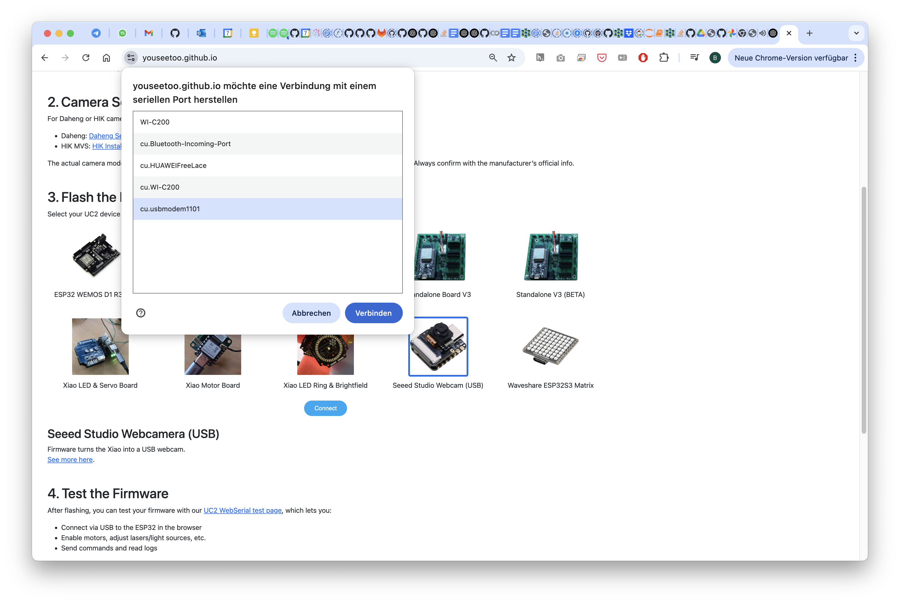
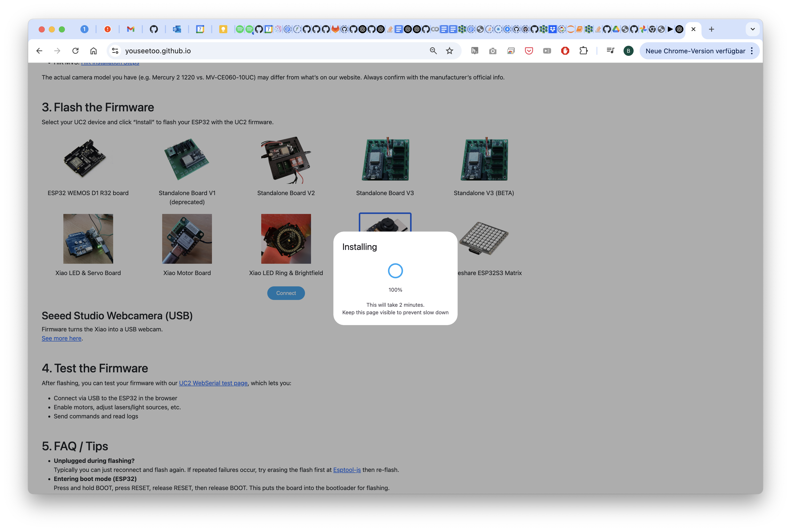
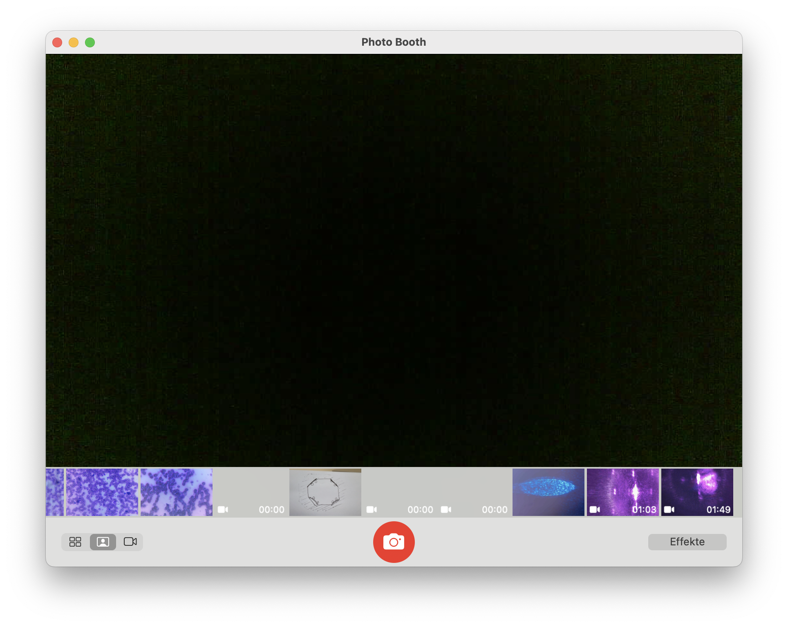

# openUC2 Microscopy Workshop @ AQLM/MBL Woods Hole

Welcome to the openUC2 Workshop on Modular and Digital Microscopy. This hands-on session will introduce participants—especially those with a biology background—to accessible, customizable microscopy using open-source tools. We will walk through building and extending microscopes, from simple lens assemblies to digital microscopy. 👩‍💻🔬

## Scientific Background

Microscopy is important -obviously! Traditional microscopes, however, can be expensive, inflexible, and non-transparent in design.
The openUC2 ecosystem offers an open-source, modular alternative. With 3D-printed components, low-cost electronics, and standardized 50mm cube modules, users can build anything from a simple smartphone microscope to a fully automated fluorescence light-sheet setup.

Feel free to share any of your data under **`#openUC2AQLM`

*What you are going to learn:*

| Chapter | Topic                              | Est. Time |
| ------- | ---------------------------------- | --------- |
| 1       | openUC2 **coreBOX** basics         | 45 min    |
| 2       | openUC2 **Seeed** Microscope setup | 30 min    |
| 3       | Fluorescence add‑on                | 30 min    |
| 4       | LED‑Matrix illumination & contrast | 45 min    |
| 5       | Jupyter workflow (DPC)             | 60 min    |
| 6       | Light‑sheet hands‑on               | 60 min    |

## Some References

Please go through the following links to check about the:
- [coreBOX](https://openuc2.github.io/docs/Toolboxes/DiscoveryCore/ENGLISH/uc2miniboxEN)
-  [openUC2 x Seeed Studio AI Microscope](https://openuc2.github.io/docs/Toolboxes/DiscoveryElectronics/04_1_seeedmicroscope)
- [openUC2 Electronics](https://openuc2.github.io/docs/Toolboxes/DiscoveryElectronics/automation_intro)

## Chapter 1: Getting Started with the openUC2 coreBOX

### Goals

* Understand the concept of modular optics
* Build a basic telescope and a smartphone microscope

### Instructions

1. Unpack your **coreBOX** and review the included printed or digital manual.
2. Assemble a **[simple telescope](https://openuc2.github.io/docs/Toolboxes/DiscoveryCore/ENGLISH/CoreTelescope)** to understand lens focusing.
3. Build the **[smartphone microscope](https://openuc2.github.io/docs/Toolboxes/DiscoveryCore/ENGLISH/coreMicroscope#smartphone-microscope)** using the RMS objective holder and phone adapter.
4. Place a sample and capture an image.

Find a cool sample and take pictures of your setup and share them on social media using `#openUC2AQLM` if you like :)

---

## Chapter 2: Upgrading Illumination with LED Matrix

### Goals

* Replace the flashlight with programmable LED matrix
* Explore the impact of illumination patterns on image contrast

### Theory

Illumination geometry affects how transparent samples scatter light. Oblique, ring-shaped, or side-specific lighting can enhance features invisible under uniform illumination.

### Instructions

1. Replace the flashlight with the **openUC2 LED matrix**.
2. Flash the firmware onto the LED controller (see LED Matrix Flash Guide).
3. Connect to the Jupyter notebook and test control commands: `left`, `right`, `top`, `bottom`, `ring`, etc.
4. View your sample again using the matrix lighting and observe contrast changes:

   * Outer ring: **Darkfield illumination** (black background, white features)
   * Side lighting: **Gradient effects**

Take photos of the visual effects and share your results.

---

## Chapter 3: Digital Microscopy with the Seeed Studio Microscope

### Goals

* Use the Seeed Studio UC2 microscope as a USB webcam
* Prepare for digital contrast enhancement

### Instructions

1. Assemble the Seeed Studio UC2 microscope with a transmissive LED base and flash the right firmware
2. Focus on your sample using the live preview on your computer (macOS: Photo Booth / Windows: Camera App).
3. Upgrade firmware (WebCam Mode). **Note:** This change is irreversible without reflashing.

#### 1 Setup the Microscope and flash the right firmware

In order to get the microscope running it's best to use it in a wired mode. We have prepared a firmware that can convert the Wifi-enabled XIAO ESP32 camera into a UVC type webcam so that you can use it from any webcam software using a usb cable.

:::error
This process cannot easily be undone! You have to disassemble the microscope to bring the microcontroller into boot mode, so better think about this step twice!
More information here: https://openuc2.github.io/docs/Toolboxes/DiscoveryElectronics/04_3_seeedmicroscoperepair#flashing-the-esp32s3-in-case-the-bootloader-is-not-responding
:::

In order to flash the firmware, follow the following steps:

##### 1. Reset the firmware
*This will remove the current firmware. Go to https://espressif.github.io/esptool-js/*

*Connect to the openUC2 Seeed Studio Microscope*

*Hit the **Erase Flash** button*

*Wait for a moment and then disconnect/close the page*

##### 2 Install the new firmware

*Go to our website (https://youseetoo.github.io/) and select the **XIAO WEBCAM FIRMWARE** by clicking on the button*

*Connect to the Seeed Microscope*

*Select the right port*

*Flash the firmware and wait patiently*

*If it says 100% -> well done, refresh/close the page*

##### 3 Use the Webcam

*Open your beloved Webcam Programm and open the camera (e.g. on Mac => Photo Booth, on Windows Camera APP*)

*With no light you should only see noise*

## Chapter 4: Fluorescence Microscopy Extension

### Goals

* Add fluorescence capability using UV LED and emission filter cubes

#### Instructions

3. Test both **transmission mode** and **darkfield mode**.
4. Handle UV LEDs with care—avoid eye and skin exposure.
*Get the parts ready. For this you need the fluorescence filter slider and the UV LED/Torch*

*Insert an appropriate emission filter (e.g., 500–550 nm bandpass). Sandwich it through the sample insert in the objective lens*

*Attach the UV LED cube to the Seeed microscope from above or....*

*From the side to enable some sort of darkfield Fluorescence. This has the potential to block more direct light*

#### Result

This is a z-stack of lens tissue labelled with a yellow text marker (Stabilo) in darkfield configuration. You nicely see the fluorescence that is attached to the Fibers:

## Chapter 5: Digital Phase Contrast using LED Matrix + Webcam

### Goals

* Use programmable lighting for digital differential phase contrast (DPC)
* Automate image acquisition and processing via Jupyter Notebook

### Instructions

1. Open the Jupyter Notebook provided.
2. Run the cell that synchronizes camera snapshots with lighting directions.
3. Capture four images (top, bottom, left, right illumination).
4. Compute: `(left - right) / (left + right)` and `(top - bottom) / (top + bottom)`.
5. Combine into a qualitative phase gradient map resembling DIC microscopy.

Optional: Reconstruct the **quantitative phase image** using inverse filtering and estimated optical transfer function.

---

## Chapter 6: Light-Sheet Microscopy Hands-On

### Goals

* Explore 3D imaging using a robotic light-sheet setup

### Resources

Please visit the dedicated light-sheet documentation at:
**[https://openuc2.com/lightsheet-docs](https://openuc2.com/lightsheet-docs)** (placeholder link)

### Instructions

* Use the sample stage to scan your specimen through the light-sheet
* Record and stack images to create a volume
* Visualize using 3D rendering tools such as FIJI or napari

---

## Summary & Discussion

By completing this workshop, you've explored the openUC2 toolkit from analog to digital microscopy, built programmable lighting systems, and gained insight into contrast-enhancing techniques. You now have the tools and knowledge to build your own flexible microscopy setup tailored to your biological application.

If you enjoyed this, please share your results under `#openUC2AQLM` and consider contributing improvements or documentation back to the openUC2 community!

---

## Appendix

* Flashing Instructions for LED Matrix and Webcam Mode
* Jupyter Notebook Template
* Component Overview (coreBOX, LED Matrix, Seeed Microscope)
* Safety Notes on UV Illumination
* Links to open-source repositories and documentation
