# openUC2 XIAO Microscope Documentation

:::warning **OpenUC2 Forum and Helpdesk**

If you have any question, please refer to our forum: openuc2.discourse.group

:::


:::info **First Step: Flash The Firmware**

To get the lastest firmware for the Xiao Microscope, please follow this link: https://matchboxscope.github.io/firmware/FLASH.html


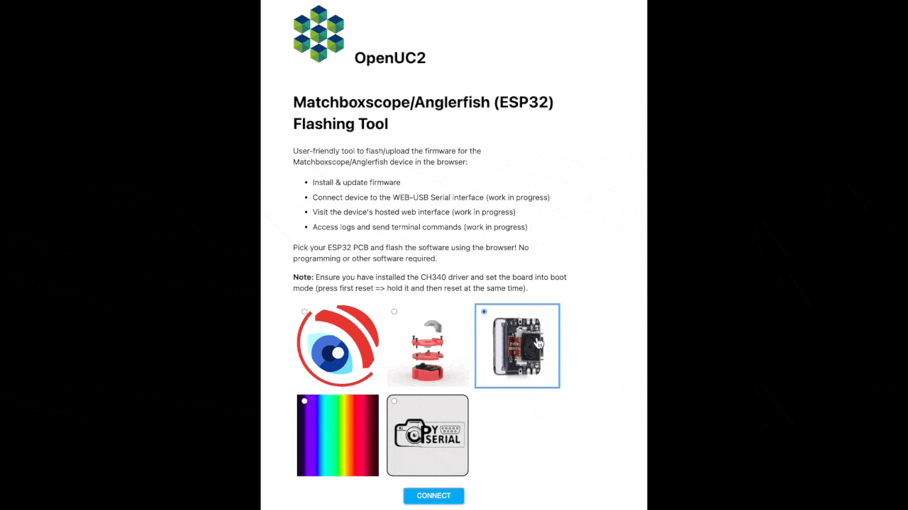
:::


## Introduction

The openUC2 XIAO Microscope is a revolutionary step towards making high-quality, automated microscopy accessible to everyone. Created in collaboration with Seeed Studio, this device is ideal for hackers, optics newcomers, and biologists. It offers more functionalities than a standard USB microscope, including timelapse, autofocusing, and autonomous operation with image storage on an SD card. This guide will help you understand the capabilities of the openUC2 XIAO Microscope and provide a comprehensive tutorial for its use.


*From Rapid Prototyping in Optics to a powerful microscopy-engine for your tinkering project*

## Key Features

- **Powerful Camera**: Equipped with the ESP32-S3 camera and an OV2560 sensor, it streams high-resolution microscopic images to your screen, supported by Arduino and CircuitPython.
- **Micrometer-Precise Focus**: The met kal-based focusing mechanism ensures precise movement of the objective lens, allowing for detailed studies. It supports motorized focus stacking for automation.
- **Robust Power Design**: The solid housing ensures reliability for everyday field research.
- **Swappable Microscope Objectives**: Easily change magnifications to observe live samples from different angles.
- **Customized Firmware**: Utilizes TinyML for on-the-fly image processing directly on the MCU, integrating sensors and other hardware for automated experiments.


*It's so easy to operate that even a 3-year old can do it 😃*


## Product Description

The openUC2 XIAO Microscope features a solid body, a high-quality camera for image transfer, and optics for magnification. The modular design allows for the integration of various optical elements like lenses, mirrors, or cameras housed in cubes. These cubes can be combined to create sophisticated optical assemblies, including microscopes, with the flexibility to add autofocusing modules or motorized stages.


*It's very compact and can be transported in your backpack. Ideal e.g. for a hike*


### Specifications

| Parameter           | Description                                                        |
|---------------------|--------------------------------------------------------------------|
| Processor           | ESP32-S3 SoC with a RISC-V single-core 32-bit chip, up to 160 MHz  |
| Wireless            | 2.4GHz Wi-Fi, Bluetooth 5.0/Bluetooth mesh                        |
| Optical Resolution  | 10x, 0.3 NA Objective Lens, resolution down to 4µm                |
| Interface           | UART, IIC, SPI, 11x GPIO (PWM), 4x ADC, Reset button, Boot button |
| Dimensions          | 150 x 100 x 50 mm                                                 |
| Power               | Input voltage (VIN): 5V                                           |
| Working Temperature | -40°C to 85°C                                                     |

## Main Applications

- **Timelapse Imaging**
- **Education**
- **Environmental Research**
- **Field Research**
- **Health Monitoring**
- **Rapid Prototyping**

## Comparison with Existing Microscopes

Traditional microscopes are often limited by fixed functionalities and high costs. The openUC2 XIAO Microscope's modular, open-source design offers unparalleled flexibility and affordability, making advanced microscopy accessible for educational, research, and field applications.


*The objective lens can easily be swapped by unscrewing it from the RMS thread*

| Feature                           | openUC2 XIAO Microscope                              | Standard USB Microscopes                       |
|-----------------------------------|------------------------------------------------------|------------------------------------------------|
| **Camera Quality**                | High-resolution with ESP32-S3 camera and OV2560 sensor | Moderate resolution, varying by model          |
| **Focusing**                      | Micrometer-precise motorized focusing, focus stacking supported | Manual focusing, often less precise           |
| **Modularity**                    | Modular design with swappable objectives, customizable with 3D-printed parts and additional modules | Fixed design, limited customization            |
| **Connectivity**                  | Wi-Fi enabled with a dedicated hotspot, supports external app control | USB connection only                           |
| **Image Processing**              | Onboard TinyML for real-time image processing         | No onboard processing, relies on external software |
| **Power Source**                  | USB-C, can be powered by a smartphone or power bank   | USB power, requires connection to a computer   |
| **Timelapse & Autonomous Operation** | Supports timelapse imaging, autonomous operation, image storage on SD card | Typically no support for timelapse or autonomous operation |
| **Field Research Suitability**    | Portable, robust design suitable for field research   | Generally not designed for field use, less robust |
| **Firmware**                      | Open-source, customizable firmware                   | Proprietary firmware, limited or no customization |
| **Use Cases**                     | Suitable for education, environmental research, health monitoring, and prototyping | Basic educational or hobbyist use              |
| **Expandability**                 | Supports additional components like motorized stages, external sensors | Limited expandability, mostly standalone       |
| **Ease of Use**                   | Easy setup, even for beginners, with app and web interface | Simple plug-and-play setup                     |
| **Cost**                          | Higher, due to advanced features and modularity       | Lower, but with fewer features and capabilities |
| **Weight & Portability**          | Lightweight and compact, easy to carry in a backpack  | Typically lightweight but less robust for fieldwork |


## Getting Started

The openUC2 XIAO Microscope is a combination of the MatchboxScope (based on the ESP32 camera) and the UC2 modular system. The firmware is open-source and can be flashed using a web interface.

1. Connect the Xiao via USB-C to your computer.
2. Visit [Matchboxscope Firmware](https://matchboxscope.github.io/firmware/FLASH.html) to flash the Xiao firmware.
3. The microscope creates a Wi-Fi hotspot named `OpenUC2xSeeed-XXXXX` (where `XXXXX` is the MAC address).
4. Connect to this hotspot using your laptop, tablet, or smartphone.
5. Access the web interface at `192.168.4.1` to stream images and adjust settings.

For enhanced functionality, download the [Anglerfish APP](https://github.com/Matchboxscope/Anglerfish-APP/releases) for additional features like video storage and external hardware control.

## Experiments


### Experiment 1: Field Microscopy with the openUC2 XIAO Microscope

*Take the microscope and explore the microverse wherever you go*
In this experiment, we will take the Seeed Studio openUC2 XIAO Microscope on a field trip to explore microscopic details of water samples from various natural sources. This tutorial will guide you through setting up the microscope, collecting samples, and analyzing them.


#### Materials Needed

- openUC2 XIAO Microscope
- USB cable
- Power bank or smartphone (for power)
- Flashlight (for illumination)
- Plastic petri dish
- Syringe or spoon (for collecting samples)
- Android device with the openUC2 app (optional)

#### Steps

##### 1. Preparation

1. **Pack the Equipment**: Secure the openUC2 XIAO Microscope in a protective box. Ensure you have a USB cable, a power bank or smartphone, a flashlight, and a plastic petri dish.

2. **Collect Samples**: During your field trip, use a syringe or spoon to collect water samples from ponds, lakes, or puddles. Transfer the water into the plastic petri dish.


##### 2. Setting Up the Microscope

1. **Power Up**: Connect the openUC2 XIAO Microscope to a power source using the USB cable. This can be either a power bank or your smartphone.

2. **Illumination**: Use the flashlight to illuminate the sample from above or below, as needed.

##### 3. Analyzing the Sample

1. **Connecting to the Microscope**:
    - Turn on the openUC2 XIAO Microscope.
    - Connect your smartphone to the microscope's Wi-Fi hotspot, named `OpenUC2xSeeed-XXXXX` (where `XXXXX` is the MAC address).
    - Open a web browser and navigate to `192.168.4.1` to access the microscope's web interface.
    - Alternatively, you can use the openUC2 Android app to view the live stream.

2. **Placing the Sample**:
    - Place the petri dish with your water sample on the microscope stage.
    - Ensure that the sample is directly under the objective lens.

3. **Focusing the Microscope**:
    - Start the live stream on the web interface or the Android app.
    - Observe the live feed and adjust the position of the sample to find areas with potential microscopic details.
    - Use the focus knob to move the objective lens up and down while observing the live stream for changes in contrast and sharpness.
    - Continue adjusting until the sample is in sharp focus.

4. **Exploring the Sample**:
    - Once focused, move the sample in the XY direction to explore different areas.
    - Look for interesting microscopic structures such as single-celled organisms, fibers, or particles.


*This is our Android APP that enables you to save video files as well*

##### 4. Sharing Your Findings

- Capture images or record videos of interesting findings directly from the web interface or app.
- Share your discoveries on social media using the hashtag #openUC2. You can also post your images on the openUC2 Twitter channel to share with the community.

#### Tips and Tricks

- Ensure the sample is relatively still to get clear images.
- If the sample contains a lot of debris, let it settle before placing it under the microscope.
- Use different lighting angles to enhance the visibility of certain structures.

#### Example Observations

During our field trip to the Bavarian Alps, we collected various water samples and observed the following:
- **Microplastics**: Small fibers from textiles and plastics were clearly visible.
- **Microorganisms**: Single-celled organisms were observed moving through the water, searching for food.
- **Debris**: Various small particles, including tiny stones, were also present.


*Is this a fiber or a worm?*

#### Conclusion

Field microscopy with the openUC2 XIAO Microscope allows for real-time exploration of microscopic worlds directly in nature. This portable setup is perfect for educational purposes, environmental research, and hobbyist exploration. Enjoy your microscopy adventures and share your findings with the openUC2 community!


*It's alive and hunting for prey*


# Experiment 2: Autofocus and Miniaturized Stage for Large Samples with the UC2 Electronic

## Introduction

Why would one need a modular microscope like the openUC2 XIAO when a $10 USB microscope from AliExpress might suffice? The answer lies in the versatility and expandability of the openUC2 XIAO. This hackable microscope allows for the adaptation of various modules, enhancing its functionality significantly. In this tutorial, we will demonstrate how to add autofocus and stage scanning capabilities using simple components and a few 3D-printed parts.

## Connectivity of openUC2 with the Microscope

The general idea of connecting various microscope components like an X-stage or a focus motor to the Xiao Microscope is illustrated in the diagram below. The microscope provides a server and an access point for Wi-Fi. An app connects to the microscope to start the image stream and control camera commands. Another ESP32 with our firmware connects to the microscope via Wi-Fi, performing a handshake so the microscope recognizes devices like LEDs or focus motors. Control commands are sent from the app through the microscope to the motor, all using HTTP REST commands.

- Camera: [GitHub - Matchboxscope Simple Camera](https://github.com/Matchboxscope/matchboxscope-simplecamera/tree/openUC2xSEEED)
- UC2 ESP32 Firmware: [GitHub - UC2 ESP32 Firmware](https://github.com/youseetoo/uc2-esp32/)
- For questions, please visit our [Forum](https://openuc2.discourse.group/)

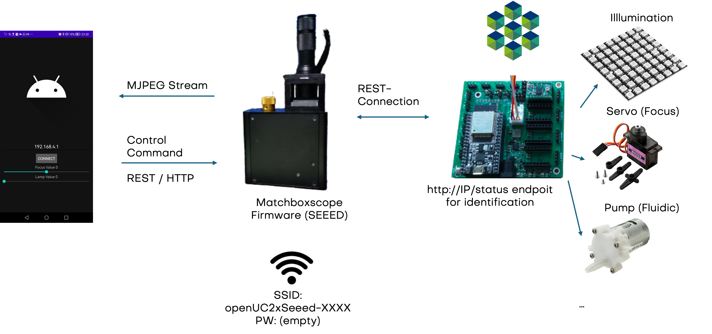

## Adding Motorized Focusing

The Xiao Microscope has a high-precision micrometer screw for moving the objective lens along the optical axis to achieve focus. For high magnification, a motor can help move the focus knob precisely without manual intervention. A simple and inexpensive servo motor can move the focus knob by ±90°, connected via a slip clutch to avoid damage.


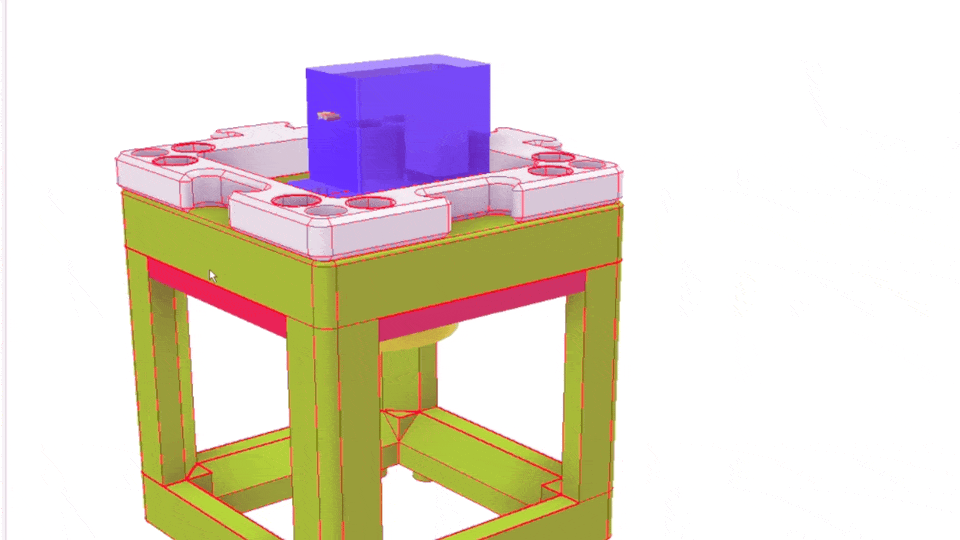

**Simple Rendering of the even simpler motorized Focus cube module**


### Printing Parts

Print the following parts using a 3D printer with PETG filament at 20% infill and 0.2mm layer height:

- [Knob Adapter](./IMAGES/OpenUC2xSeeed/Assembly_Cube_MiniServoCenteredFocus_v3_20_Cube_Insert_MiniServoFocus_Knobadapter_20mm_6.stl)
- [Servo Holder](./IMAGES/OpenUC2xSeeed/Assembly_Cube_MiniServoCenteredFocus_v3_20_Cube_Insert_MiniServoFocus_5.stl)

### Additional Components

- Servo Motor 9G
- M2 screws
- UC2 ESP32-capable board (available at UC2-Shop)

### Assembly

1. Gather all the parts:
   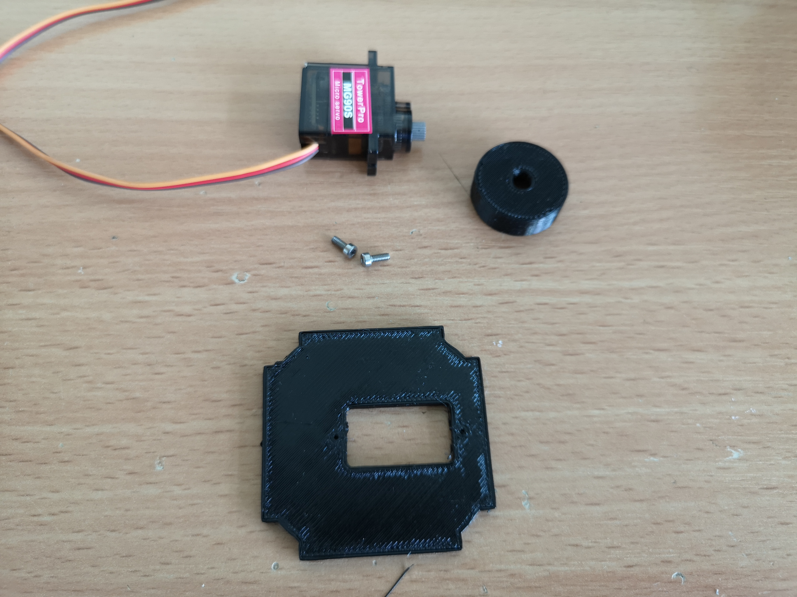

2. Add the Cube to the Microscope base:
   

3. Insert the Servo into the UC2 Cube:
   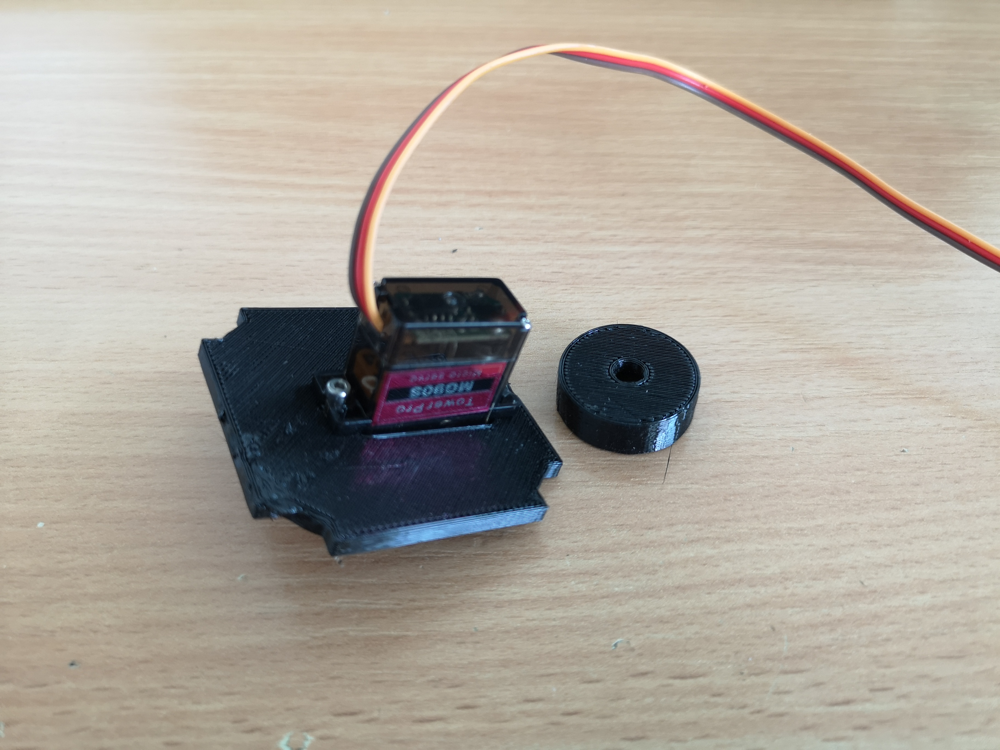

4. Close the cube and attach it to the focus knob:
   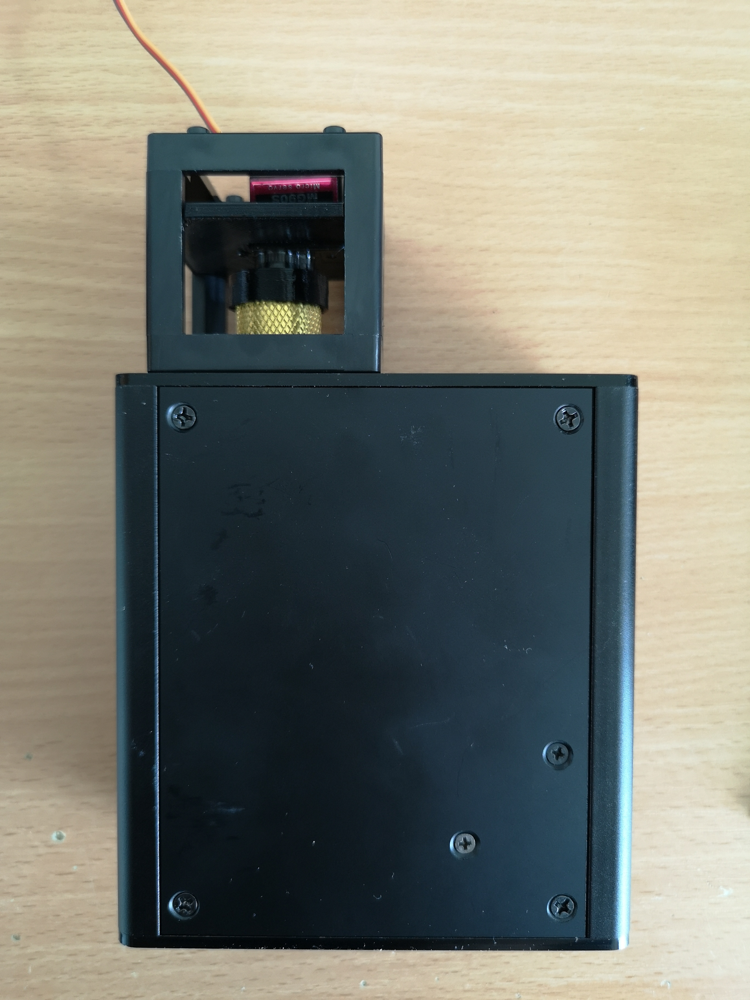

5. Observe the motorized focus in action:
   

## Adding Stage Scanning

Stage scanning allows the automatic movement of the sample to enlarge the visible field. We use a simple servo motor to move a rubber-band-fitted sled, carrying the sample along an axis. This method provides a reliable movement path using steel rods salvaged from old CD/DVD drives.


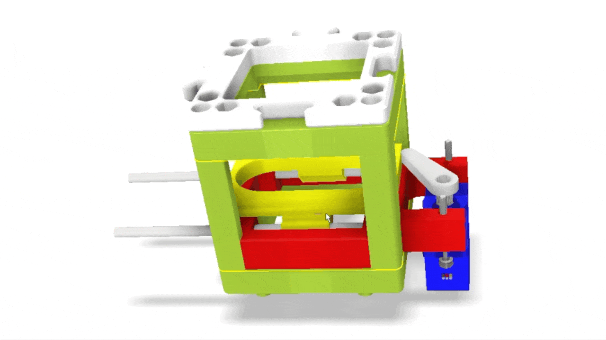

*Simple rendering of an even simpler device*


### Printing Parts

Print the following parts using a 3D printer with PETG filament at 20% infill and 0.2mm layer height:

- [Base](./IMAGES/OpenUC2xSeeed/Assembly_Cube_Linear_Sampleslide_Servo_20_Cube_Insert_linearslide_servodriven_v2_6.stl)
- [Slide](./IMAGES/OpenUC2xSeeed/Assembly_Cube_Linear_Sampleslide_Servo_20_Cube_Insert_linearslide_servodriven_slide_v2_8.stl)

### Additional Components

- Servo Motor 9G
- M2 screws
- UC2 ESP32-capable board (available at UC2-Shop)
- Rubber band
- 2x 3mm diameter, >50mm length steel rods (chrome), e.g., from an old DVD/CD drive or from online retailers.

### Assembly

1. Assemble the base and slide components as illustrated:
   

2. Ensure the servo motor moves the slide smoothly to scan the sample area.

For more information and community support, visit our [GitHub Repository](https://github.com/openUC2/openUC2-SEEED-XIAO-Camera) and [Forum](https://openuc2.discourse.group/).


##### Assembly

*Comming Soon*

##### Results

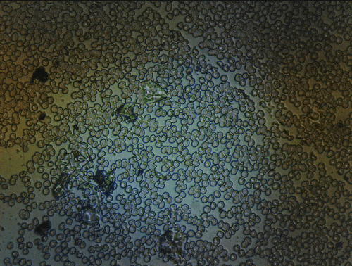

*Scanning of red blood cells contaminated with malaria in the field*

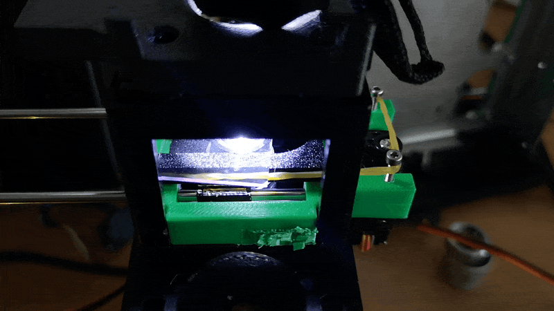

*Stage in Action in continous mode*

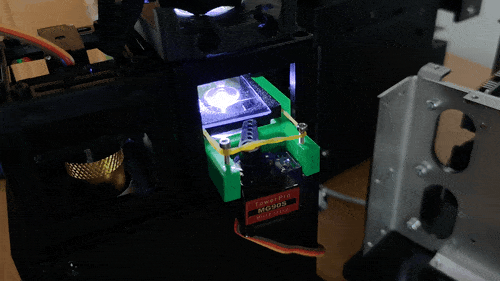

*Stage in Action in continous mode*


#### Add motorized flow-stop microscopy


**More coming soon**


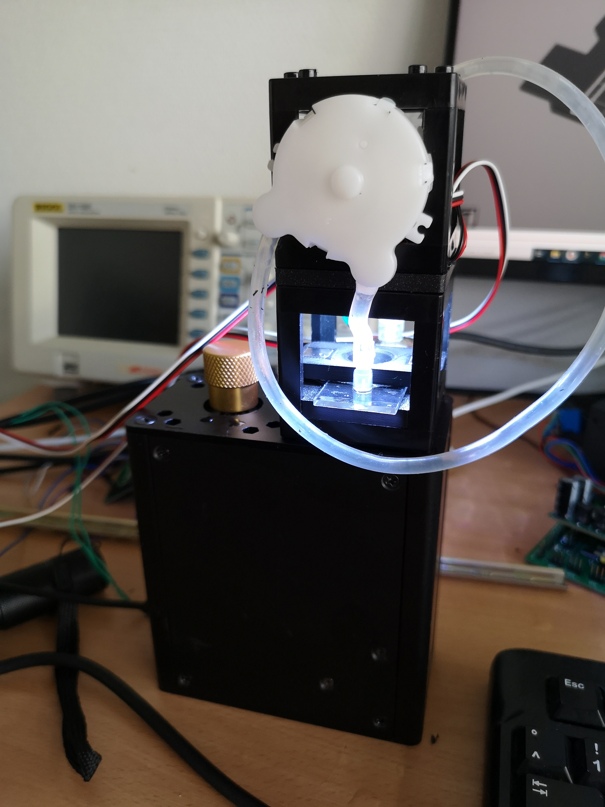


### Experiment 3: Timelapse of Yeast Cells

Here’s an enhanced version of the documentation for your GitHub tutorial:

---

### Experiment 3: Timelapse of HeLa Cells (or Any Other Moving Subject)

In this experiment, you will capture a timelapse of growing yeast cells (or any other subject that changes over time) to observe and study their behavior and development. The setup process can be easily managed via the Web GUI.

#### Step-by-Step Instructions

1. **Prepare the SD Card**:
   - Insert a FAT32-formatted SD card into your Xiao device.
   - Verify that the SD card mounts correctly by monitoring the USB Serial output. The output should indicate successful mounting, e.g., as "SDHC".
   - If you need to format your SD card to FAT32, use the official SD Card Formatter tool. You can download it [here](#).

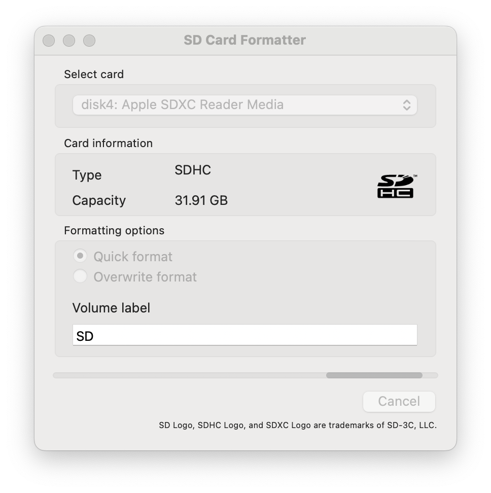

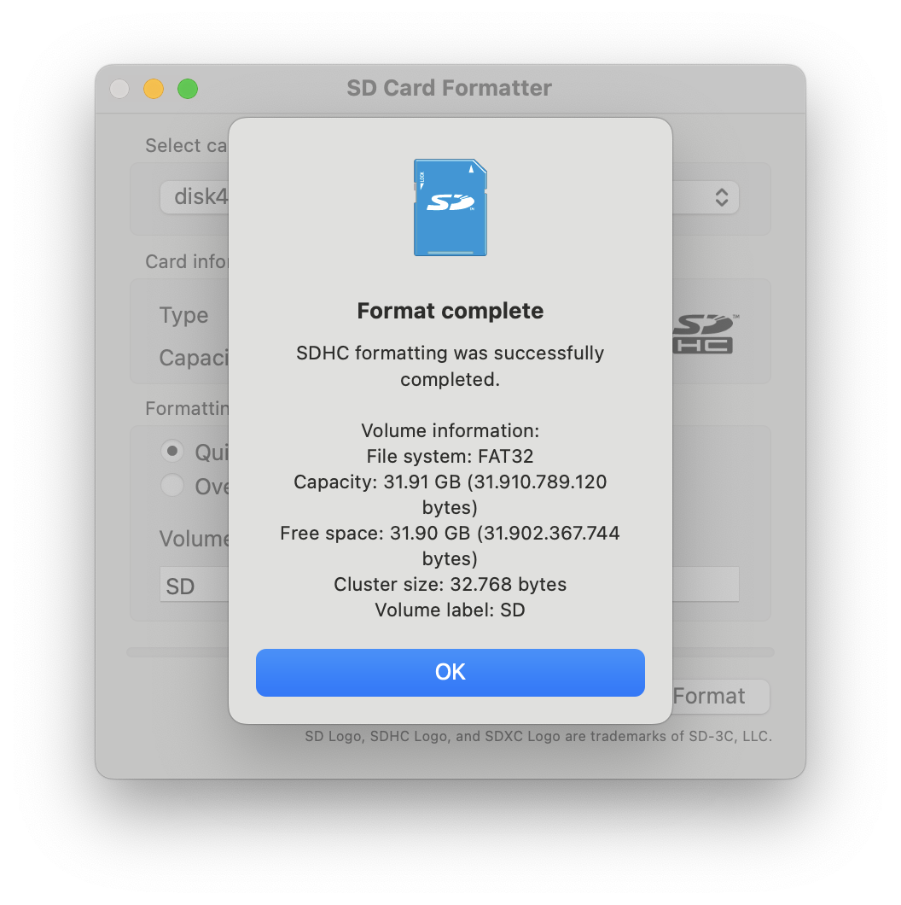


2. **Insert the SD Card**:
   - Insert the SD card into the SD card slot on the Xiao device. The slot is larger than the card, so using tweezers can help with precise insertion.
   - Check the Serial Output on startup to confirm that the SD card has been mounted correctly. If mounted, the card type (e.g., SDHC) will be displayed.

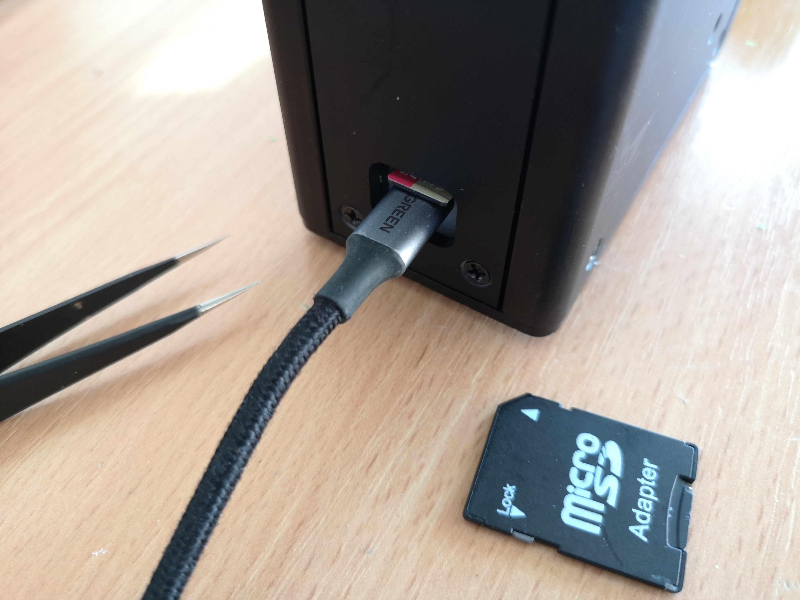


3. **Configure the Timelapse Settings**:
   - **Set the Timelapse Interval**: Access the Web GUI at `http://192.168.4.1`. Use the slider to set a suitable interval for capturing images (e.g., 60 seconds for one image per minute).
   - **Enable Timelapse Mode**: Activate the timelapse feature by toggling the timelapse switch in the Web GUI.
   - **Verify SD Card Mounting**: Ensure the SD card is still mounted by checking the SD card name; it should show a value greater than 0.

4. **Start Capturing the Timelapse**:
   - Once the timelapse is enabled, the device will start capturing images at the set interval.
   - Note that the live stream may temporarily go off after each image is captured. This is normal behavior.
   - You can refresh the Web GUI page to see the image counter increase, indicating that new images are being saved to the SD card.

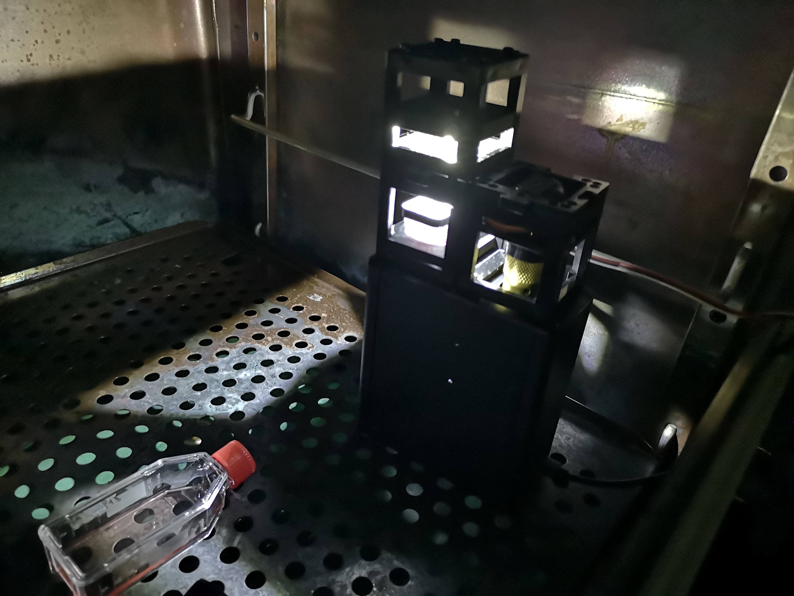


5. **Retrieve the Images**:
   - After the timelapse is complete, carefully remove the SD card from the Xiao device.
   - Transfer the images from the SD card to your computer.
   - The images will be named with an incremental number corresponding to each timelapse capture and include a CPU timestamp measured in microseconds for precise timing information.

#### Tips and Troubleshooting

- **SD Card Compatibility**: Not all SD cards may work with the Xiao device. If your card is not recognized, try a different one.
- **Timelapse Duration**: Consider the length of your experiment when setting the timelapse interval to avoid excessive data or missed events.
- **Web GUI Connection**: Ensure your device is connected to the correct network to access the Web GUI. If you encounter issues, try restarting the Xiao or rechecking the network configuration.

By following these steps, you should be able to successfully capture and analyze a timelapse of cellular or other biological processes with ease.


*HeLa Cells in a cell incubator*


#### Code to convert images from the SD card into a video

Once the experiment is done, you would need to convert the images into a video. This can be done by carefully removing the micro SD card from the microscope and inserting it into your computer. We used a microSD card adapter and inserted that into the SD card slot of our macbook. Then we download all images into a local folder and execute the below script. The SD card will have multiple files in one single folder (base-folder) which may cause problems if you had mutiple timeseries acquired one after another. Therfore, the camera writes an `index.txt` file where the file names are stored in consecutive order. The below script will read the files based on this index file and outputs the videofile (or TIF file respectively). Adjust the filepaths accordingly.

```py
import numpy as np
import tifffile as tif
import os
import cv2
import matplotlib.pyplot as plt

# load the images from the list
basePath = '/Users/bene/Downloads/2024_08_27-Cells_XiaoMicroscope_Lena'
savePathFile = 'ImageStack.tif'
fileIndexList = os.path.join(basePath, 'index.txt')

# read the list of files
mAllFiles = []
with open(fileIndexList, 'r') as f:
    for line in f:
        mAllFiles.append(line.strip())

# select images from the list
mSelectedFiles = mAllFiles[2500:-1]
mSelectedFiles

#video writer
width, height, _ = plt.imread(basePath + mSelectedFiles[0] + '.jpg').shape
fourcc = cv2.VideoWriter_fourcc(*'mp4v')
fourcc = cv2.VideoWriter_fourcc(*'XVID')
out = cv2.VideoWriter(os.path.join(basePath, 'output.avi'), fourcc, 40, (height,width))

# read images and save as tiff/mp4
for iFile in mSelectedFiles:
    # read the image
    try:

        mImage = plt.imread(basePath + iFile + '.jpg')
        frame = cv2.convertScaleAbs(mImage)
        out.write(frame)

        print("read image: ", iFile, " with shape: ", mImage.shape)
        # save the image as tiff
        # tif.imsave(os.path.join(basePath, savePathFile), mImage, append=True, bigtiff=True)
    except:
        continue

out.release()
```

The result (Sorry for the bad compression of the result):

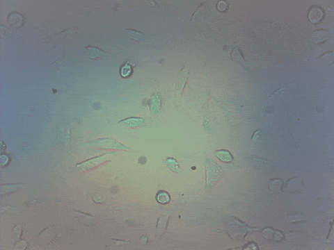

and also as a youtube video in slighlty better quality (next time I'll share the raw video :)

<iframe width="560" height="315" src="https://www.youtube.com/embed/omXEBV_astQ?si=XFezMBOowycvvTLO" title="YouTube video player" frameborder="0" allow="accelerometer; autoplay; clipboard-write; encrypted-media; gyroscope; picture-in-picture; web-share" referrerpolicy="strict-origin-when-cross-origin" allowfullscreen></iframe>

#### Heat Dissipation of the microscope

The microscope did not show any heat buildup when placed in the cell incubator. So the effect of massive abopotosis may be found in an infection event.


## Community and Support

Join our community on Discord in the #tinyml channel for support and collaboration. Explore the extensive library of UC2-compatible parts to expand the capabilities of your microscope.

For detailed tutorials and further information, visit [openUC2 GitHub Repository](https://github.com/openUC2/openUC2-SEEED-XIAO-Camera).

By combining the best components from the MatchboxScope and UC2 modular systems, the openUC2 XIAO Microscope offers a powerful and flexible tool for a wide range of applications, making advanced microscopy accessible to a broader audience.
