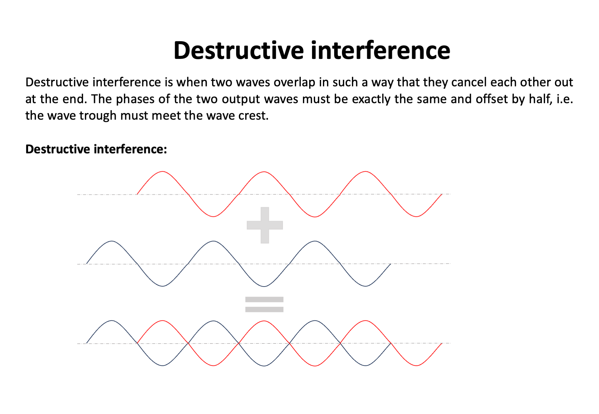

## Workshop Manual: Building a Michelson Interferometer using UC2

In this workshop, we will construct a Michelson Interferometer using the UC2 modular microscope toolbox. The Michelson Interferometer is a device that measures the interference properties of light. We will treat light as a wave, with a very high frequency, and use it to perform interesting experiments.

### Materials Needed

1. Green Laser Pointer with a relatively high temporal coherence.
2. Lenses for beam expansion.
3. Beam splitter plate or cube with a partially reflective mirror coating.
4. Three mirrors.
5. Screen or camera sensor (e.g., ESP32 camera module) with USB cable.
6. UC2 Modular Microscope Toolbox (cubes, puzzle pieces, and holders).

### Theory of Operation

A Michelson Interferometer splits a laser beam into two equal parts using a beam splitter. The two beams are then reflected by mirrors and recombined to interfere with each other. When the paths of the two beams are equal, they constructively interfere, resulting in a bright output. However, if one path is shifted by 1/4 of the wavelength, the beams destructively interfere, resulting in a dark output.
Certainly! Let's delve into more theoretical background about interference and how the Michelson Interferometer was historically used to measure the speed of light.

## Theoretical Background: Interference

Interference is a phenomenon that occurs when two or more waves overlap in space and combine their amplitudes. When the waves are in-phase (their crests and troughs align), they constructively interfere, resulting in a larger amplitude. On the other hand, if they are out of phase (their crests and troughs are misaligned), they destructively interfere, resulting in a smaller or zero amplitude. Interference is a fundamental concept in wave physics and plays a crucial role in understanding the behavior of light.

## Michelson Interferometer and Measurement of the Speed of Light

The Michelson Interferometer, invented by Albert A. Michelson in the late 19th century, is a classic optical device that exploits the principles of interference to measure various optical properties, including the speed of light.

In the Michelson Interferometer setup, a light beam is split into two equal parts using a beam splitter. One part is directed towards a stationary mirror (the reference mirror) while the other part is directed towards a movable mirror (the sample mirror). The two beams are then reflected back towards the beam splitter, and they recombine. Depending on the path difference between the two beams, they may interfere constructively or destructively.

By moving the sample mirror, the path difference between the two beams changes. When the path difference corresponds to an integral number of wavelengths (constructive interference), the interference pattern exhibits bright fringes. Conversely, when the path difference corresponds to a half-integral number of wavelengths (destructive interference), the pattern exhibits dark fringes.

The key to measuring the speed of light with the Michelson Interferometer lies in precisely measuring the movement of the sample mirror. As the mirror is displaced, the fringe pattern shifts, and by measuring this shift, we can determine the change in path difference and, consequently, the speed of light.

Michelson used this interferometer in an elegant experiment to measure the speed of light by comparing the time it took for light to travel in two perpendicular directions. This famous experiment was performed in 1879 and yielded a remarkably accurate value for the speed of light.

The Michelson Interferometer remains an essential tool in modern optics and has found applications in diverse fields, including astronomy, spectroscopy, and interferometric microscopy.

Interference is a fundamental concept in wave physics, and the Michelson Interferometer is a classic optical device that exploits this phenomenon to make precise measurements. By understanding the principles of interference and the working of the Michelson Interferometer, we gain valuable insights into the nature of light and its behavior in different optical setups. It stands as a testament to the ingenuity of scientific instruments and continues to play a significant role in advancing our understanding of the physical world.

### Assembly Steps

We want to replicate the following setup:

1. Build the telescope using two lenses with different focal lengths to expand the laser beam. (Depending on the laser beam shape this step can be ignored)

2. Use the beam splitter plate/cube to split the enlarged beam into two equal beams.

3. Place mirrors at the end of each beam path and adjust their positions.

4. Position the camera or screen at the exit of the interferometer to observe the interference patterns.

5. Cover one mirror path and adjust the other mirror so that the beam on the camera is in the center of the sensor.

6. Repeat step 5 for the other arm to align the reference and sample arms.

7. Remove the covers from both arms, and you should see interference patterns on the camera.

8. Carefully align one of the mirrors to remove the interference patterns by turning the screws slightly.

9. The Michelson Interferometer is now aligned and ready for use.

Aaron Proposal with bunch of details:
*Note: After realizing the alignment of each element remember to turn off the Laser for safety!*

1. Insert the Laser diode in two nested cubes.
  _Image_
2. Insert a diaphragm in a cube and connect it to the other two. Then, close the diaphragm until you get a pinhole and with the screws, align the Laser beam.
  _Image_
3. Remove the cube with the diaphragm, leave it aside for later use and in the same spot add the tilted kinematic mirror.
  _Image_
4. Place the rest of cubes to build one arm of the interferometer including the beamsplitter and instead of placing the Linear movable Mirror, place the diaphragm cube.
  _Image_
5. Align the Laser beam so that it hits the pinhole in the diaphragm center. After aligning replace the diaphragm cube with the Linear movable mirror.
  _Image_
6. Place the cubes to build the detection and reference arm of the interferometer with the kinematic mirror. Place the diaphragm cube in the detection arm end and use the screws of both kinematic mirrors if needed to make the two beams overlap as much as possible.
  _Image_

7. Use a screen after the pinhole produced by the diaphragm to see two beams and adjust both kinematic mirrors so that the beams overlap.
  _Image_
8. At this point you should see the interference ring-like pattern somewhere on the diaphragm. Align the center of the pattern to the center of the pinhole using the kinematic mirrors.
  _Image_
9. Insert the camera in a cube and replace the diaphragm cube with it. Check alignment again.
  _Image_

## Experimental Data

This is the fully assembled UC2 interferometer with a green laser diode, a camera representing a scree and to digitize the inteference, a beamsplitter, a kinematic mirror and a mirror that can be translated along Z.

If you bring the two beams on top of each other, you will be able to observe the interference pattern, which in case of one beam exactly overlaying the other will be a ring pattern. These rings are also called Newton rings and come from the fact that we interfere two divergent beams, leading to a super position of two spherical caps/waves.

Using the ESP32 camera, we can quantify the motion of the beams and e.g. measure distances or angles.

### Conclusion

Congratulations! You have successfully built a Michelson Interferometer using the UC2 modular microscope toolbox. This device allows you to explore the interference properties of light and perform fascinating experiments. As you move one of the arms, you will observe constructive and destructive interference patterns on the camera, demonstrating the wave-like nature of light. Have fun experimenting with different setups and learning more about the wave-particle duality of light!
