### Install MVS App for Camera Utilization

Camera model: MV-CE060-10UC. Visit the HIKROBOTICS website and download the MVS software suitable for your computer. Below are steps exemplifying the software installation for Mac.

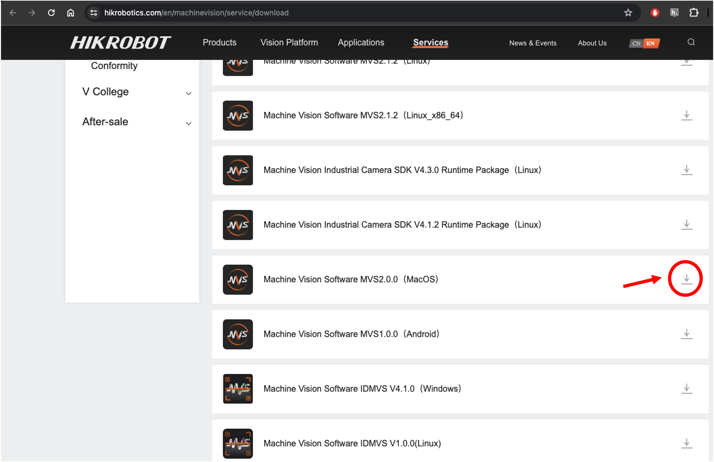

Install the downloaded file.

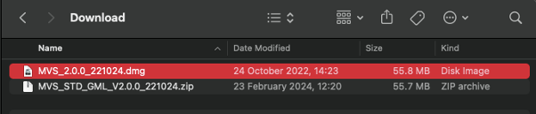

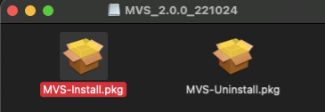

Open the MVS Software.

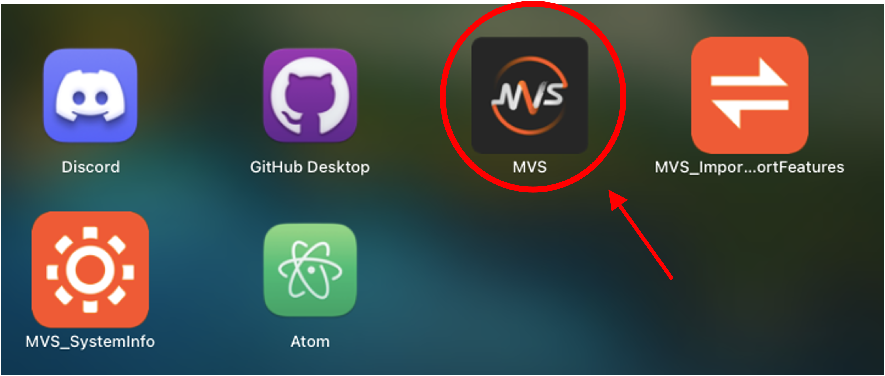

You should see the following window.

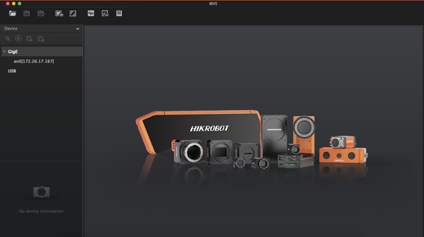

Connect the camera. Refresh the USB line to detect the camera.

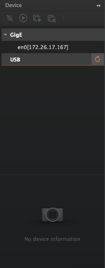
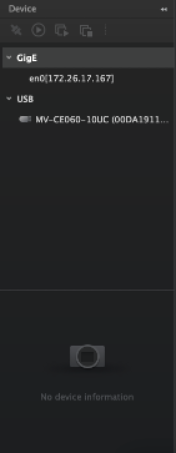

Select the make-link button on the detected camera.

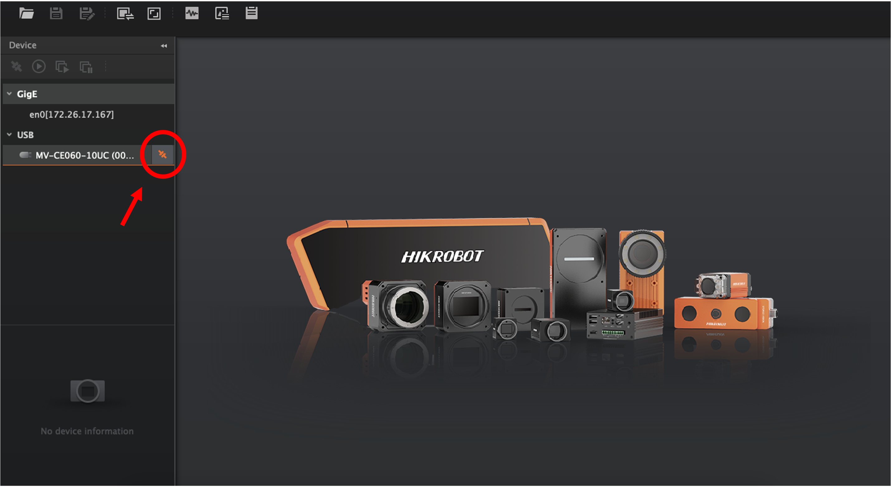

The following window should be displayed.

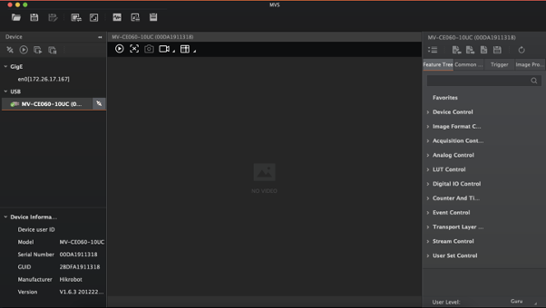

Click on the play button in the actions bar of the camera.

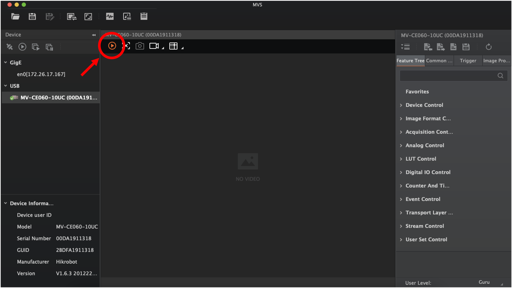

If properly connected, you should see a real-time image. Adjust the exposure if the image is overexposed.

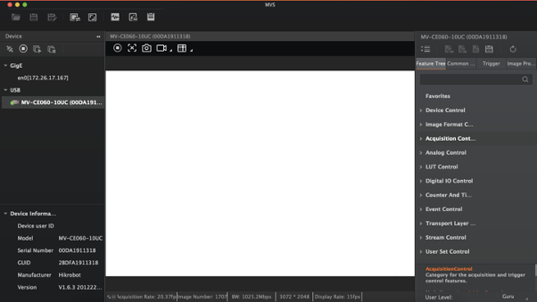

To adjust the exposure time, go to the Feature tree, select the Acquisition Control Category, and change the Exposure Auto option to *Continuous*.

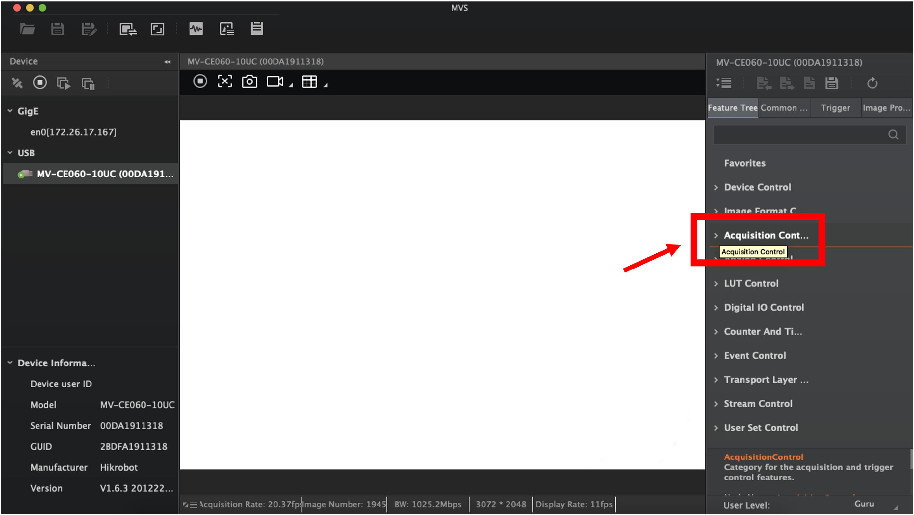

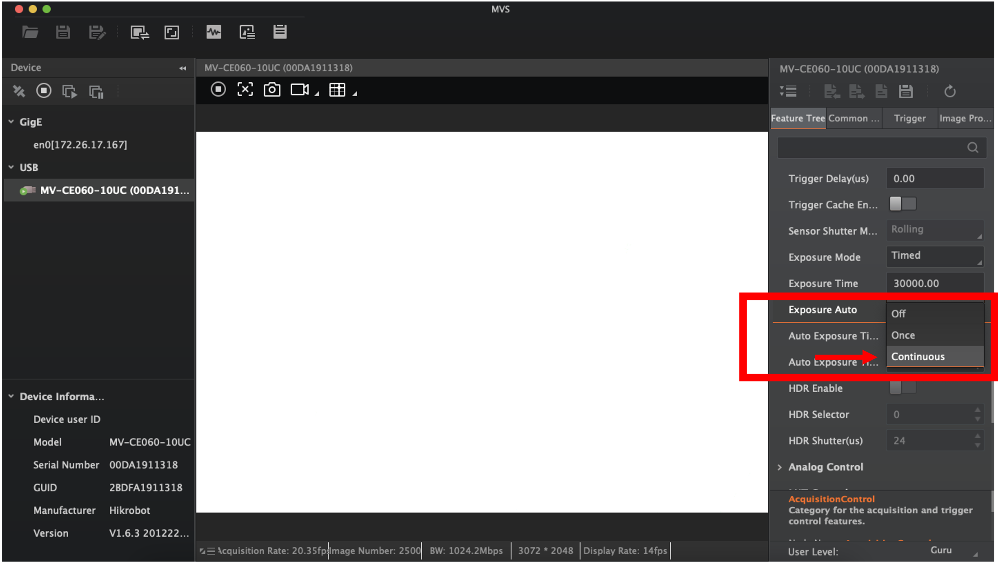

Now, a clear image with good contrast should be visible.

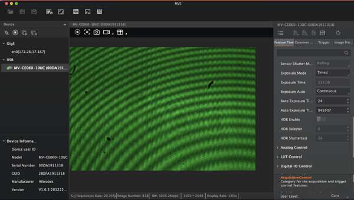

To stop recording, click on the stop button in the camera's actions bar.

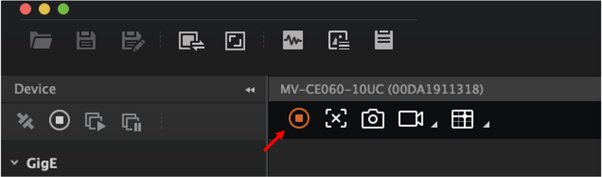

To disconnect the camera, click on the break-link button next to the detected camera in the USB devices list.

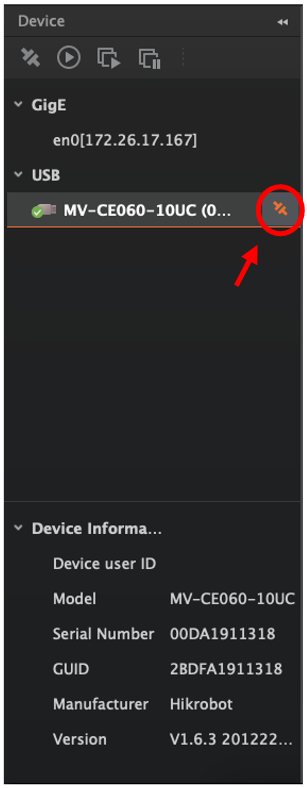
