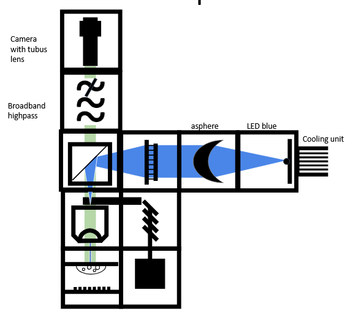

id: LED_Fluoresence_microscope
title: openUC2 LED Fluoresence microscope
---

# Workshop Manual: Building a smart LED powered fluoresence microscope

In this workshop, we will construct a LED-powered fluoresence microscope to perform interesting experiments.

Image einfügen, vollständiger Aufbau / Fluoresence Bild

### Materials Needed

1. Blue LED for exitation of the fluoresence moleculs - fluoresence microscopy
2. white LED for bright Field microscopy
3. electronic Z-stage
4. PS4 Controller for controlling the Z-Stage
5. infinity-objective
6. Beamsplitter
7. Emissionfilter
8. aspherical lens for beam-collimation
9. bikonvex lens (f'=100mm) for focusing
10. camera with tubelense
11. UC2 Electronicsbox, Infinity Box and Corebox (cubes, puzzle pieces and holders)

Image einfügen Foto real nur Bauteile erst nach CAD optimierung

### Diagram


### Theory of Operation

A fluorescence microscope is a specialized optical microscope that uses high-energy light (such as UV or blue light) to excite fluorescent molecules in a sample. These molecules absorb the light and then emit it at a longer wavelength, producing a glowing image. Special filters ensure that only the emitted fluorescence is detected by the camera, allowing for high-contrast visualization of specific structures, such as cells, proteins, or organelles. This technique is widely used in biology and medicine to study microscopic details with high sensitivity.


### Theoretical Background: Fluoresence
Fluorescence is a photophysical process that describes the spontaneous emission of light shortly after an electron is excited to a higher-energy state.
First, an electron is excited from the ground state to the higher-energy state  through absorption. After a short time (approximately 10⁻⁹ s), the excited electron returns to the ground state, releasing energy in the form of radiation. Due to the Stokes-shift within the S₁ state, the emitted light has a longer wavelength (λ₂) than the radiation used for excitation (λ₁).


# Tutorial: LED-powered fluoresence microscope

## Step 1: Assembly the microscope
In the first step you are going to click the microscope together piece by piece. For educational purpose this instruction will go by functional groups, but feel free to do it by yourself, following the diagramm a section above.

### 1.1: Assembly the bright field microscope
 1. build a baseplate as shown. This will be used to connect the LED-Array, probe instert, the movable infinity-objective, the beamsplitter, the filter insert and the Camera. The Camera already is connected to the tube-lens.

 2. start with the LED-Array and place the probe insert behind it. fix both with two baseplates on top
 3. For the movable infinity-onjetive, drill the objective into the attatchment of the electronic Z-stage and place the objective behind the probe insert. Place the Z-Stage next to it as shown below. You don't need an extra cube for the objective, but you should use a base plate on top for stability.
 4. next in line is the beamsplitter.you can leave the cube empty for now, though you only need it when you assembly the fluoresence microscope
 5. after that comes the emission filter insert. As before, for the bright field microscope you don't need to insert the filter just jet.
 6. the last step is to place the camera  behind the emission filter. Now your bright field microscope is already built.


 ### 1.2: Assembly the fluorescent Microscope
 1. For the fluoresence microscope lets follow the path of light. First build a 4x1 baseplate and attach it to the beamsplitter cube.
 2. Then lets start from the spot furthest away and place the blue LED there.
 3. next lets collimate the light the LED emitts with an asphere and place it next to it. Between the LED and the asphere shouldn't be more than 30mm space
 4. now we want to focus the collimated light into the objective. Herefore we first place an emty cube and then the biconvex lensbehind it. We need the extra cube to have enouhght space between the asphere and the biconvex-lens. to be precisly, the space between the two lenses equals the sum of the focal leghts of those lenses.
 The asperical lens has a focal length of 20mm, the biconvex lens 100mm so you need round about 120mm space between them.
 5. now we insert the Beamsplitter. Insert it as shown below and don't mix up the filter sides, otherwhise you block exactly the wrong wavelegths ;)
 6. to focus the light into the infinity objective, between the biconvexlens and the infinty objective there should a distance of 100mm between them. you can mesure it as shown below
 7. lastly insert the emission filter into it's insert. As before don't mess up the sides and after that you're done with the assembly, nice job!


 ## Step 2: turn your microscope into a smart one - aka the electronics  

### 2.1: plug in the electronics as you see below


<div style="background-color: rgba(255, 255, 0, 0.3); padding: 10px; border-radius: 5px;">
  <strong style="font-size: 20px;">⚠️ Caution!</strong>
  <p> if you need to change any of the cables or their position, always plug the 12V-Power cable out, bevor you do. Otherwhise the electronic components my get damaged!
</p>
</div>

- connect the Z-stage to ``Z-Motor`` on the main board, make shure there's a driver.
- connect the blue LED to the LED driver (red plate) at ``out1``
  - cable at ``-`` goes to ``-``
  - cable at ``+`` goes to ``+``
- connect the LED driver to the main board
  - cable at ``in 1`` goas to ``PM2- PMW2``
  - cable at ``V In -`` goes to ``12V - GND``
  - cable at ``V IN +`` goas to ``12V - 12V``
- plug in the micro-USB an connect to your PC
- Plug in the 12V Power Cable


### 2.2: Flashing the ESP32 Firmware
1. Before proceeding, ensure your ESP32 board has the latest firmware. You can download and flash the firmware via the official
 [openUC2 website](https://youseetoo.github.io/), selecting your version
 (row 2, colum 1) and click on the ``connect``-button.

The source-code can be found [here](https://github.com/youseetoo/uc2-esp32)

2. Connect the ESP32 to your computer using the micro-USB cable.


3. In your Chrome browser a dialog will prompt you to select the COM port for your
 ESP32, wich should be shown as `CP2102 USB to UART Bridge Controller`. Once connected, you can install the latest firmware by simply clicking the "Install" button. If nothing shows up, you can install the drivers from the following propmpt that results when you hit anywhere on the screen:


4. Wait until the firmware has been flashed successfully.

### 2.3: Connecting to the Web Interface
1. After flashing the firmware, go to the testing section on the same website.

2. Connect to your ESP32 board using the "Connect" button again, ensuring the correct COM port is selected.


3. Once connected, test the system by sending a simple command:

```json
{"task":"/motor_act", "motor": { "steppers": [ { "stepperid": 3, "position": -1000, "speed": 1000, "isabs": 0, "isaccel": 0} ] } }
```

This command will move the Z-axis motor by -1000 steps (1 full rotation) at a speed of 1000 steps per second. Each step corresponds to a movement of 300nm when using microstepping. You’ll see the motor rotate, adjusting the focus.

> **Note:** Ensure the command string has no line breaks.

4. Connect the LED-Arry panel with another USB-cable to your PC. Dublicate the current tab, and again connect the LED-Array via the button. Choose the right COM Port again.
Now you can test all the compontents via these two tabs.


### 2.4: Testing in the web Interface
1. After that test go back to the first tab all the other Components via buttons:
-  ``Laser 2(on)``and ``Laser 2(off)``controlls the blue exitation LED
- ``Motor Z(+)`` and ``Motor Z(-)`` controlls the Z-Stage
- ``LED (on)`` and ``LED (off)`` controlls the LED-Array panel, you have to change the tab to controll it.

2. Pairing the PS4 Controller
The UC2-ESP firmware is designed to support various input devices, including the PS4 controller, making it easier to interact with the microscope. You’ve already worked with USB Serial commands, but using the PS4 controller will give you a more flexible, hands-on approach.For more detailed instructions on pairing, refer to the [UC2 PS4 Controller Pairing Guide](https://openuc2.github.io/docs/Electronics/PS4-Controller). But briefly:

  1. First, put your PS4 controller into pairing mode by holding down the ``Share`` button and the ``PS``-button simultaneously until the light bar starts blinking.
  2. klick the Button ``Pair Controlller`` in the web Interface. Alternatively open the serial prompt in your browser (connected to the ESP32 board) or use the web interface and enter the command:

    ```json
    {"bt_scan":1}
    ```
This will initiate the Bluetooth scan on the ESP32, which will detect and pair with the controller.

  3. Once paired, you should be able to control the motorized stage using the analog sticks on the controller and switch the LED array on/off using the buttons.

  - **Move the Z-stage**: Use the **left analog stick** to move the stage up and down (adjust focus).
  - **Control the LEDs**: Use the **controller buttons** to turn the LED array on/off and cycle through different illumination patterns.


 ### 2.5: Setup and use the camera-software
 1. conect the camera with you PC
 2. For the installation process follow these instructions https://openuc2.github.io/docs/Toolboxes/DiscoveryInterferometer/SoftwareTutorial/#install-mvs-app-for-camera-utilization

# Congraduation! You did all the Setup Steps! Now lets use the microscope

 ## Experiment 1: bright field illumination
 1. Turn the LED-array on and the blue LED off.
 2. put the probe in the probe insert
 3. start the camera via pressing the play &#9654; button
 4. make shure, your probe is centered, shift it around until you see some structure on your screen
 5. the imgae you see might be very blurry or to be axact, out of foucs. with the PS-controller, move the Z-stage up or down to get a sharp inmage.
 6. now you can move arround your probe an inspect it properly


 ## Experiment 2: fluoresence microscopy
 1. To turn your microscope into a fluoresence microscope, turn the LED-Array off, and the blue LED on.
 2. the Probe should still be in the probe insert and the camera still on
 3. now your likely are seeing nothing but black. This is because the fluoresence (the photons emitted by the probe) is much weaker than the bright LED-Array. To fix this, open the feature Tree, go to Acquisition Control and move the Gain all he way up. Now you should see something like this.


--------
Benedicts stuff

--------


  ### Step 1: Installing ImSwitch

  There are two ways to install ImSwitch, depending on your system preferences.

  #### Method 1: Install ImSwitch via Python Package (with Napari support)

  A more detailed explantion can be found here: https://openuc2.discourse.group/t/imswitch-installation-on-mac-and-windows/37

  1. **Set up your Python environment** (using Conda or Mamba):
     ```bash
     mamba create -n imswitchhackathon python=3.9 -y
     mamba activate imswitchhackathon
     ```

  2. **Install ImSwitch**:
     ```bash
     pip install https://github.com/openUC2/ImSwitch/archive/refs/heads/master.zip # this installs the lastest master
     # do the same if you want to update the system
     # alternative:
     git clone https://github.com/openUC2/ImSwitch/
     cd ImSwitch
     pip install -e .
     ```

  3. **Optional**: Install the required dependencies for QT and Napari:
     ```bash
     pip install pyqtgraph qdarkstyle
     ```

  This setup will allow you to run ImSwitch with full functionality, including graphical user interface (GUI) support for Napari.

  #### Method 2: Running ImSwitch using Docker

  For a simpler, platform-agnostic solution, you can run ImSwitch using Docker:

  1. **Pull the Docker container**:
     ```bash
     sudo docker pull ghcr.io/openuc2/imswitch-noqt-x64:latest
     ```

  2. **Run the Docker container**:
     ```bash
     sudo docker run -it --rm -p 8001:8001 -p 2222:22 \
     -e HEADLESS=1 \
     -e HTTP_PORT=8001 \
     -e CONFIG_FILE=example_uc2_hik_flowstop.json \
     -e CONFIG_PATH=/config \
     -v ~/Downloads:/config \
     --privileged ghcr.io/openuc2/imswitch-noqt-x64:latest
     ```

  Once you have ImSwitch installed and running, you can access the web interface at `localhost:8001` to control the system.

  For detailed instructions on Docker installation, visit the [ImSwitch Docker Guide](https://openuc2.github.io/docs/ImSwitch/ImSwitchDocker/).

  ---

  ### Step 2: Using the ImSwitch Config File

  Now that ImSwitch is installed, you need to configure it for your specific setup. Here is an example configuration file (`uc2_hik_histo.json`) for controlling the UC2 system:

  ```json
  {
    "positioners": {
      "ESP32Stage": {
        "managerName": "ESP32StageManager",
        "managerProperties": {
          "rs232device": "ESP32",
          "stepsizeX": -0.3125,
          "stepsizeY": -0.3125,
          "stepsizeZ": 0.3125,
          "homeSpeedX": 15000,
          "homeSpeedY": 15000,
          "homeSpeedZ": 15000
        },
        "axes": ["X", "Y", "Z"],
        "forScanning": true
      }
    },
    "rs232devices": {
      "ESP32": {
        "managerName": "ESP32Manager",
        "managerProperties": {
          "host_": "192.168.43.129",
          "serialport": "COM3"
        }
      }
    },
    "lasers": {
      "LED": {
        "managerName": "ESP32LEDLaserManager",
        "managerProperties": {
          "rs232device": "ESP32",
          "channel_index": 1
        },
        "wavelength": 635
      }
    },
    "detectors": {
      "WidefieldCamera": {
        "managerName": "HikCamManager",
        "managerProperties": {
          "isRGB": 1,
          "hikcam": {
            "exposure": 0,
            "gain": 0,
            "blacklevel": 100,
            "image_width": 1000,
            "image_height": 1000
          }
        },
        "forAcquisition": true
      }
    },
    "autofocus": {
      "camera": "WidefieldCamera",
      "positioner": "ESP32Stage",
      "updateFreq": 10,
      "frameCropx": 780,
      "frameCropy": 400
    }
  }
  ```

  This file configures the ESP32 stage, LED control, and the camera for widefield imaging. Ensure the `host_` and `serialport` match your system setup.

  ---

  ### Step 3: Running the Microscope with ImSwitch

  1. **Launch ImSwitch**:
     ```bash
     python -m imswitch
     ```

  2. **Select the Configuration**:
     Upon launch, choose **"Virtual Microscope"** or load your custom configuration file, such as `uc2_hik_histo.json`.

  3. **Control the System**:
     Use the ImSwitch GUI to move the motorized stage, control the LED array, and capture images. The interface allows you to automate tasks such as focus stacking and digital phase-contrast imaging.


## Install Raspberry Pi + ImSwitch

1. Download Raspberry PI Imager
2. Flash Raspberry Pi OS 64Bit Bookworm Lite on an SD card with appropriate size (e.g. 64GB ) -> add the necessary settings (i.e. SSH, wifi password, uc2/youseetoo password/login ) )> Flash
3. Boot Raspberry Pi and wait until it's full there; ~5 minutes => It should be connected to you r wifi; you're computer should be in the same network
4. You should be able to log into that using ssh => (Windows + R => CMD ) = > Terminal opens and then type `ssh uc2@IP-OF-YOURRASPI` (You can find this using e.g. angry ip scanner or a screen connected to your rapsberry pi)
5. Install imswitch; Go to https://github.com/openUC2/ImSwitchDockerInstall?tab=readme-ov-file#imswitch--docker-on-raspi and then follow the procedures:
```bash
mkdir Downloads
mkdir Desktop
sudo apt-get install git -y
cd ~/Downloads
git clone https://github.com/openUC2/ImSwitchDockerInstall
cd ImSwitchDockerInstall
chmod +x install_all.sh
./install_all.sh
```
This will:
- install docker
- install all necessary camera drivers
- install imswitch via Python
- create necessray startup files on the desktop
- You can launch it by doing; `bash ~/Desktop/launch_docker_container.sh`

6. Go to your browser and enter the `https://IP-OF-YOUR-RASPI:8001/imswitch/index.html`
7. Have a look for additional information here: https://openuc2.github.io/docs/ImSwitch/ImSwitchOnRaspi/
8. Close the applicaiton by hitting ctrl + c
9. update the applicaoin by executing `bash ~/Desktop/update_docker_container.sh`

## launch imswitch
if you have installed it alredy execute the following

```
bash ~/Desktop/launch_docker_container.sh
```


  ### Video Tutorial

  For a visual guide on how to set up ImSwitch and control the UC2 system, watch the following video:

  <iframe width="700" src="https://www.youtube.com/embed/Iw_Bg9aYe1U?si=VQgLP854Hg29dwxW" title="YouTube video player" frameborder="0" allow="accelerometer; autoplay; clipboard-write; encrypted-media; gyroscope; picture-in-picture; web-share" referrerpolicy="strict-origin-when-cross-origin" allowfullscreen></iframe>
