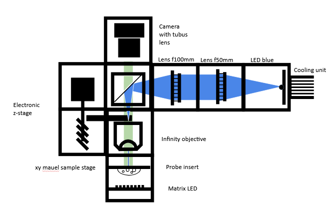

id: LED_Fluoresence_microscope
title: openUC2 LED Fluoresence microscope


# Workshop Manual: Building a Smart LED-Powered Fluorescence Microscope

In this workshop, we will guide you through assembling a LED-powered fluorescence microscope, allowing you to explore fascinating experiments with microscopic details.


### Materials Needed

1. Blue LED (for exciting fluorescence molecules)
2. White LED (for bright-field microscopy)
3. Electronic Z-stage with 8 grub screws
4. PS4 Controller (for controlling the Z-stage)
5. Infinity objective
6. Beamsplitter
7. Emission filter
8. Aspherical lens (for beam collimation)
9. Biconvex lens (f' = 100mm, for focusing)
10. Camera with tube lens
11. UC2 Electronics box, Infinity Box, and Corebox (cubes, puzzle pieces, and holders)


### Diagram



<<<<<<< HEAD
---
=======
>>>>>>> 71c0398dd737fa5c1183ae087bf67ad92c0a9f37

### Theory of Operation

Fluorescence is a photophysical process that describes the spontaneous emission of light shortly after an electron is excited to a higher-energy state.
First, an electron is excited from the ground state to the higher-energy state  through absorption. After a short time (approximately 10⁻⁹ s), the excited electron returns to the ground state, releasing energy in the form of radiation. Due to the Stokes-shift within the S₁ state, the emitted light has a longer wavelength (λ₂) than the radiation used for excitation (λ₁).


### Theoretical Background: Fluorescence

Fluorescence is a photophysical process that describes the spontaneous emission of light shortly after an electron is excited to a higher-energy state.
First, an electron is excited from the ground state to the higher-energy state  through absorption. After a short time (approximately 10⁻⁹ s), the excited electron returns to the ground state, releasing energy in the form of radiation. Due to the Stokes-shift within the S₁ state, the emitted light has a longer wavelength (λ₂) than the radiation used for excitation (λ₁).


## Tutorial: LED-Powered Fluorescence Microscope

### Step 1: Assemble the Microscope

This guide will walk you through building the microscope step by step. You can follow the assembly process according to the functional groups or refer to the diagram above.

#### 1.1: Assembling the Bright-Field Microscope

1. **Build the Baseplate**: This will connect the LED-matrix, probe insert, movable infinity objective, beamsplitter and the camera (which is already connected to the tube lens).Attach wo extra baseplates for the Z-stage
2. **Attach the LED-matrix**: Place the LED-matrix and than the probe insert behind it, securing both with two baseplates on top.
3. **Install the movable Infinity-Objective**: Drill the objective into the attachment of the electronic Z-stage. Because in this Assembly the Z-stage lays flat on the ground use the insert thats closest to the Z-stage. As shown below the lettering "stage" is placed upward. If the Z-stage isn't already set up, insert the 8 grub screws on the long sides to attach the baseplates.
4. **Position the beamsplitter cube**: Insert the beamsplitter cube (you can leave it empty for now, it will be needed when assembling the fluorescence microscope).
5. **Add the camera**: Finally, attach the camera unit behind the beamsplitter and secure everything with a second layer of baseplates.

Now, your bright-field microscope is ready!


#### 1.2: Assembling the Fluorescence Microscope
But of course if you got this box you want more, so now let#s start buidling the fluorescene Microscope

1. **Prepare a 4x1 Baseplate**: After that, attach it to the beamsplitter cube.
2. **Position the Blue LED**: Place the blue LED at the furthest point from the beamsplitter.
3. **Collimate the Light**: The blue LED is a divergent light source, so use the aspherical lens to collimate the light. Place the aspherical lens right after the LED with a gap no larger than 30mm.
4. **Focus the Light**: To focus the collimated light into the objective, insert an empty cube, followed by the biconvex lens. The space between the aspherical lens and the biconvex lens should be the sum of their focal lengths. The aspherical lens has a focal length of 20mm, and the biconvex lens has 100mm, so you need approximately 120mm between the two.
5. **Insert the Beamsplitter**: Place the beamsplitter carefully. Make sure the filter sides are oriented correctly to avoid blocking the wrong wavelengths.
6. **Focus Light into the Infinity Objective**: to correctly focus the ligth into the infinity objective, position the biconvex lens and infinity objective with about 100mm of space between them.

After completing these steps, you're done with the assembly, nice job!


# Step 2: Turn Your Microscope Into a Smart One - aka the Electronics  

### 2.1: Plug in the Electronics as Shown Below

:::caution
**⚠️ Caution!**
If you need to change any of the cables or their position, always unplug the 12V power cable before doing so. Otherwise, the electronic components might get damaged!
:::

<<<<<<< HEAD
- connect the LED-matrix panel by plugging in the micro-USB and connect it to your PC.
- Connect the Z-stage to the ``Z-Motor`` on the main board. Ensure there's a motor driver.
- Connect the blue LED to the LED driver (red plate) at ``out1``:
  - The cable at ``-`` goes to ``-``
  - The cable at ``+`` goes to ``+``
=======
- connect the LED-Array panel by plugging in the micro-USB and connect it to your PC.
- Connect the Z-stage to the `Z-Motor` on the main board. Ensure there's a motor driver.
- Connect the blue LED to the LED driver (red plate) at `out1`:
  - The cable at `-` goes to `-`
  - The cable at `+` goes to `+`
>>>>>>> 71c0398dd737fa5c1183ae087bf67ad92c0a9f37
- Connect the LED driver to the main board:
  - The cable at `in 1` goes to `PM2 - PMW2`
  - The cable at `V In -` goes to `12V - GND`
  - The cable at `V IN +` goes to `12V - 12V`
- Plug in the micro-USB and connect to your PC.
- Plug in the 12V power cable.


### 2.2: Flashing the ESP32 Firmware

1. Before proceeding, ensure your ESP32 board has the latest firmware. You can download and flash the firmware via the official [openUC2 website](https://youseetoo.github.io/), selecting your version (**row 2, column 1**), then click on the `connect` button.


The source code can be found [here](https://github.com/youseetoo/uc2-esp32).

2. Connect the ESP32 to your computer using the micro-USB cable.  


3. In your Chrome browser, a dialog will prompt you to select the COM port for your ESP32, which should be shown as `CP2102 USB to UART Bridge Controller`. Once connected, you can install the latest firmware by simply clicking the "Install" button.
  

  

  If nothing shows up, you can install the drivers from the prompt that appears when you click anywhere on the screen:

   

4. Wait until the firmware has been successfully flashed.

5. &#x1F4A1; **flash your LED-matrix**. Repeat the same steps, but this time for the LED-matrix
   


### 2.3: Connecting to the Web Interface

1. After flashing the firmware, go to the testing section on the same website.

2. Connect to your ESP32 board using the "Connect" button again, ensuring the correct COM port is selected.  

   

3. Once connected, test the system by sending a simple command:

```json
{"task":"/motor_act", "motor": { "steppers": [ { "stepperid": 3, "position": -1000, "speed": 1000, "isabs": 0, "isaccel": 0} ] } }
```


This command will move the Z-axis motor by -1000 steps (1 full rotation) at a speed of 1000 steps per second. Each step corresponds to a movement of 300nm when using microstepping. You’ll observe the motor rotating, adjusting the focus.

**Note:** Ensure that the command string has no line breaks.

4. &#x1F4A1;**Connect your LED-matrix as well**. Duplicate the current tab and connect the LED-matrix again via the button. Choose the correct COM Port.  
Now you can test all components through these two tabs.


### 2.4: Testing in the Web Interface

1. After completing the test, go back to the first tab to control the other components via buttons:
   - `Laser 2(on)` and `Laser 2(off)` control the blue excitation LED.
   - `Motor Z(+)` and `Motor Z(-)` control the Z-stage.
   - `LED (on)` and `LED (off)` control the LED-matrix panel (&#x1F4A1;you must change tabs to control it).


### 2.5: Pairing the PS4 Controller &#x1F3AE;

The UC2-ESP firmware supports various input devices, including the PS4 controller, to make interacting with the microscope easier. While you've already worked with USB serial commands, using the PS4 controller offers a more flexible, hands-on approach. For more detailed instructions on pairing, refer to the [UC2 PS4 Controller Pairing Guide](https://openuc2.github.io/docs/Electronics/PS4-Controller). Here’s a brief summary:

1. **Put your PS4 controller into pairing mode** by holding down the `Share` button and the `PS` button simultaneously until the light bar starts blinking.
2. Click the `Pair Controller` button in the web interface. Alternatively, open the serial prompt in your browser (connected to the ESP32 board) or use the web interface and enter the following command:


```json
{"bt_scan":1}
```

  This will initiate the Bluetooth scan on the ESP32, which will detect and pair with the controller.

  Once paired, you can control the motorized stage using the analog sticks and switch the LED-matrix on/off using the buttons:

  - **Move the Z-stage**: Use the **left analog stick** to move the stage up and down (adjust focus).
  - **Control the LEDs**: Use the **controller buttons** to turn the LED-matrix on/off and cycle through different illumination patterns.


### 2.6: Setup and Use the Camera Software

1. Connect the camera to your PC.
2. For the installation process, follow these instructions: [Install MVS App for Camera Utilization](https://openuc2.github.io/docs/Toolboxes/DiscoveryInterferometer/SoftwareTutorial/#install-mvs-app-for-camera-utilization).


**Congratulations! You Have Completed All the Setup Steps! Now Let's Use the Microscope**


## Experiment 1: Bright Field Illumination

1. Turn the LED-matrix on and the blue LED off.
2. Insert the probe into the probe insert.
3. Start the camera by pressing the play button (▶).
4. Make sure your probe is centered. Shift it around until you see some structure on your screen.
5. The image you see might be blurry or, to be precise, out of focus. Use the PS4 controller to move the Z-stage up or down to get a sharp image.
6. Now you can move the probe around and inspect it properly.


## Experiment 2: Fluorescence Microscopy

1. To turn your microscope into a fluorescence microscope, turn the LED-matrix off and the blue LED on.
2. The probe should still be in the probe insert, and the camera should still be on.
<<<<<<< HEAD
3. At this point, you're likely seeing a black screen. This is because the fluorescence (the photons emitted by the probe) is much weaker than the bright LED-matrix. To adjust, open the feature tree, go to ``Acquisition Control``, and increase the ``exposure time`` to 300000ms. You should now see the fluorescence image.
Optional you can go to ``Analog Control``, and increase the ``Gain``.
=======
3. At this point, you're likely seeing a black screen. This is because the fluorescence (the photons emitted by the probe) is much weaker than the bright LED-Array. To adjust, open the feature tree, go to `Acquisition Control`, and increase the `exposure time` to 300000ms. You should now see the fluorescence image.
Optional you can go to `Analog Control`, and increase the `Gain`.
>>>>>>> 71c0398dd737fa5c1183ae087bf67ad92c0a9f37


--
Benedicts stuff

--


  ### Step 1: Installing ImSwitch

  There are two ways to install ImSwitch, depending on your system preferences.

  #### Method 1: Install ImSwitch via Python Package (with Napari support)

  A more detailed explantion can be found here: https://openuc2.discourse.group/t/imswitch-installation-on-mac-and-windows/37

  1. **Set up your Python environment** (using Conda or Mamba):
     ``bash
     mamba create -n imswitchhackathon python=3.9 -y
     mamba activate imswitchhackathon
     ``

  2. **Install ImSwitch**:
     ``bash
     pip install https://github.com/openUC2/ImSwitch/archive/refs/heads/master.zip # this installs the lastest master
     # do the same if you want to update the system
     # alternative:
     git clone https://github.com/openUC2/ImSwitch/
     cd ImSwitch
     pip install -e .
     ``

  3. **Optional**: Install the required dependencies for QT and Napari:
     ``bash
     pip install pyqtgraph qdarkstyle
     ``

  This setup will allow you to run ImSwitch with full functionality, including graphical user interface (GUI) support for Napari.

  #### Method 2: Running ImSwitch using Docker

  For a simpler, platform-agnostic solution, you can run ImSwitch using Docker:

  1. **Pull the Docker container**:
     ``bash
     sudo docker pull ghcr.io/openuc2/imswitch-noqt-x64:latest
     ``

  2. **Run the Docker container**:
     ``bash
     sudo docker run -it --rm -p 8001:8001 -p 2222:22 \
     -e HEADLESS=1 \
     -e HTTP_PORT=8001 \
     -e CONFIG_FILE=example_uc2_hik_flowstop.json \
     -e CONFIG_PATH=/config \
     -v ~/Downloads:/config \
     --privileged ghcr.io/openuc2/imswitch-noqt-x64:latest
     ``

  Once you have ImSwitch installed and running, you can access the web interface at `localhost:8001` to control the system.

  For detailed instructions on Docker installation, visit the [ImSwitch Docker Guide](https://openuc2.github.io/docs/ImSwitch/ImSwitchDocker/).


  ### Step 2: Using the ImSwitch Config File

  Now that ImSwitch is installed, you need to configure it for your specific setup. Here is an example configuration file (`uc2_hik_histo.json`) for controlling the UC2 system:

  ```json
  {
    "positioners": {
      "ESP32Stage": {
        "managerName": "ESP32StageManager",
        "managerProperties": {
          "rs232device": "ESP32",
          "stepsizeX": -0.3125,
          "stepsizeY": -0.3125,
          "stepsizeZ": 0.3125,
          "homeSpeedX": 15000,
          "homeSpeedY": 15000,
          "homeSpeedZ": 15000
        },
        "axes": ["X", "Y", "Z"],
        "forScanning": true
      }
    },
    "rs232devices": {
      "ESP32": {
        "managerName": "ESP32Manager",
        "managerProperties": {
          "host_": "192.168.43.129",
          "serialport": "COM3"
        }
      }
    },
    "lasers": {
      "LED": {
        "managerName": "ESP32LEDLaserManager",
        "managerProperties": {
          "rs232device": "ESP32",
          "channel_index": 1
        },
        "wavelength": 635
      }
    },
    "detectors": {
      "WidefieldCamera": {
        "managerName": "HikCamManager",
        "managerProperties": {
          "isRGB": 1,
          "hikcam": {
            "exposure": 0,
            "gain": 0,
            "blacklevel": 100,
            "image_width": 1000,
            "image_height": 1000
          }
        },
        "forAcquisition": true
      }
    },
    "autofocus": {
      "camera": "WidefieldCamera",
      "positioner": "ESP32Stage",
      "updateFreq": 10,
      "frameCropx": 780,
      "frameCropy": 400
    }
  }
  ``

  This file configures the ESP32 stage, LED control, and the camera for widefield imaging. Ensure the `host_` and `serialport` match your system setup.


  ### Step 3: Running the Microscope with ImSwitch

  1. **Launch ImSwitch**:
     ``bash
     python -m imswitch
     ``

  2. **Select the Configuration**:
     Upon launch, choose **"Virtual Microscope"** or load your custom configuration file, such as `uc2_hik_histo.json`.

  3. **Control the System**:
     Use the ImSwitch GUI to move the motorized stage, control the LED-matrix, and capture images. The interface allows you to automate tasks such as focus stacking and digital phase-contrast imaging.
````

## Install Raspberry Pi + ImSwitch

1. Download Raspberry PI Imager here: https://www.raspberrypi.com/software/


2. Flash Raspberry Pi OS 64Bit Bookworm Lite on an SD card with appropriate size (e.g. 64GB ) -> add the necessary settings (i.e. SSH, wifi password, uc2/youseetoo password/login ) )> Flash (was ist damit gemeint..? Keine Screenshots vorhanden..)


3. Boot Raspberry Pi and wait until it's full there; ~5 minutes => It should be connected to you r wifi; you're computer should be in the same network (startet das booten, wenn man auf `weiter` klickt? siehe bild)
4. You should be able to log into that using ssh => (Windows + R => CMD ) = > Terminal opens and then type `ssh uc2@IP-OF-YOURRASPI`


(You can find the IP-Adress of your Raspberry using e.g. angry ip scanner or a screen connected to your rapsberry pi)

5. Install imswitch; Go to https://github.com/openUC2/ImSwitchDockerInstall?tab=readme-ov-file#imswitch--docker-on-raspi and then follow the procedures: (wrong code on the website, no other than crack know what a sudo is)

  in the last line copypaste the following code: (not completly correct.. do you have to type ~ $ before as shown in picture?)

``bash
mkdir Downloads
mkdir Desktop
sudo apt-get install git -y
cd ~/Downloads
git clone https://github.com/openUC2/ImSwitchDockerInstall
cd ImSwitchDockerInstall
chmod +x install_all.sh
./install_all.sh
``
This will:
- install docker
- install all necessary camera drivers
- install imswitch via Python
- create necessray startup files on the desktop

6. launch it by doing; `bash ~/Desktop/launch_docker_container.sh`
(hier fehlt auch ein screenshot.. wo soll ich das eingeben? in die reine cmd console oder muss davor wieder irgendwas aufgerufen werden..?)

8. Go to your browser and enter the `https://IP-OF-YOUR-RASPI:8001/imswitch/index.html`
9. Have a look for additional information here: https://openuc2.github.io/docs/ImSwitch/ImSwitchOnRaspi/ (nicht wirklich hilfreich)
8. Close the applicaiton by hitting ctrl + c
9. update the applicaoin by executing `bash ~/Desktop/update_docker_container.sh`

## launch imswitch
if you have installed it alredy execute the following

``
bash ~/Desktop/launch_docker_container.sh
``
(hier auch unbedingt screenshot machen!)


## altternaive :

Flash the pre-built image from this link using this software


  ### Video Tutorial

  For a visual guide on how to set up ImSwitch and control the UC2 system, watch the following video: (link wird nicht angezeigt. außerdem zeigt das video nur wie man das programm benutzt nicht wie man es intalliert.)

  <iframe width="700" src="https://www.youtube.com/embed/Iw_Bg9aYe1U?si=VQgLP854Hg29dwxW" title="YouTube video player" frameborder="0" allow="accelerometer; autoplay; clipboard-write; encrypted-media; gyroscope; picture-in-picture; web-share" referrerpolicy="strict-origin-when-cross-origin" allowfullscreen></iframe>
