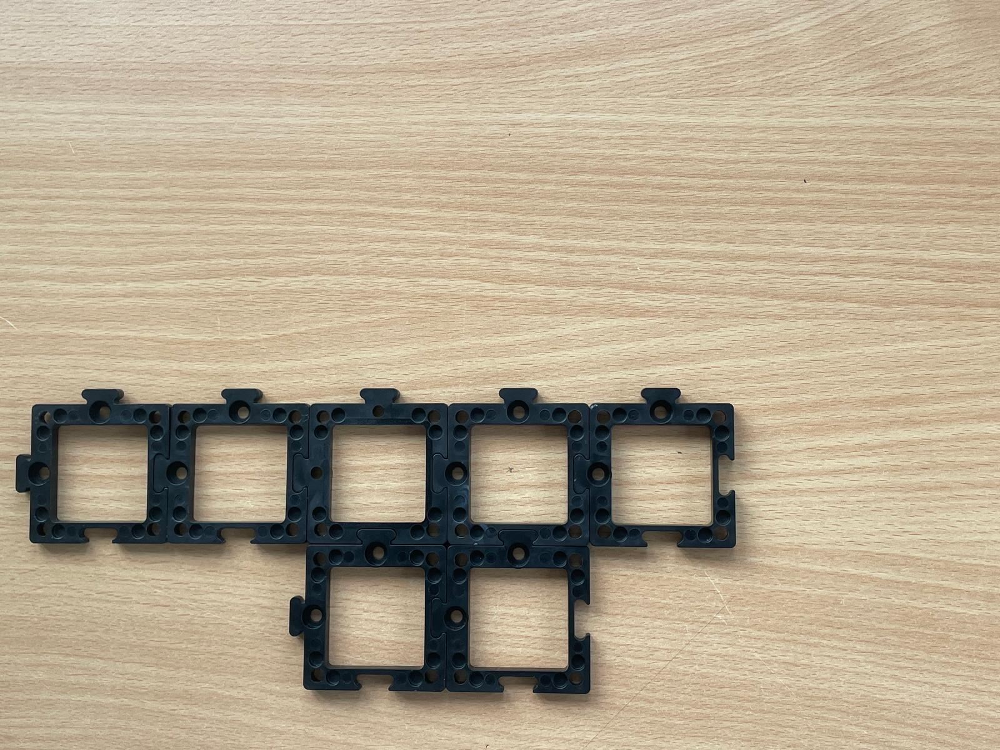
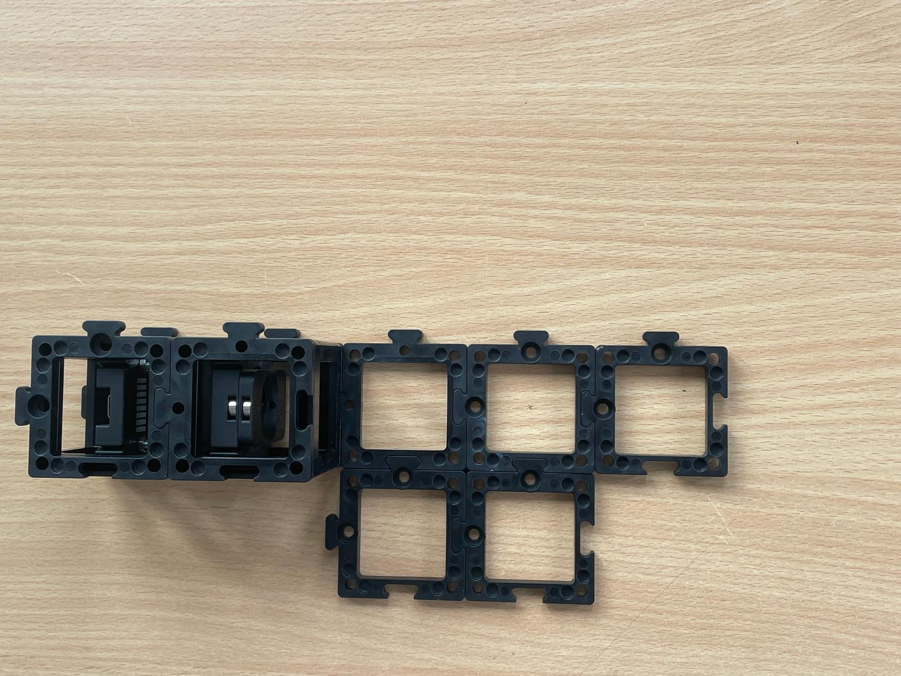

# Manual: Building a Smart LED-Powered Fluorescence Microscope

In this workshop, we will guide you through assembling a LED-powered fluorescence microscope, allowing you to explore fascinating experiments with microscopic details.


### Materials Needed

1. Blue LED (for exciting fluorescence molecules).
2. LED Lid
3. LED-Matrix with USB-C cable (for bright-field microscopy)
4. Electronic Z-stage with some technical nobs
5. Mainboard with UBC-mini cable
6. PS4 Controller (for controlling the Z-stage)
7. Infinity objective
8. Beamsplitter
9. Aspherical lens (for beam collimation)
10. Biconvex lens (f' = 100mm, for focusing)
11. Diaphragm
12. Camera with tube lens
13. Probe insert
14. Probes
15. cubes and base plates


### Diagram


### Theory of Operation

Fluorescence is a photophysical process that describes the spontaneous emission of light shortly after an electron is excited to a higher-energy state.
First, an electron is excited from the ground state to the higher-energy state  through absorption. After a short time (approximately 10⁻⁹ s), the excited electron returns to the ground state, releasing energy in the form of radiation. Due to the Stokes-shift within the S₁ state, the emitted light has a longer wavelength (λ₂) than the radiation used for excitation (λ₁).


### Theoretical Background: Fluorescence

Fluorescence is a photophysical process that describes the spontaneous emission of light shortly after an electron is excited to a higher-energy state.
First, an electron is excited from the ground state to the higher-energy state  through absorption. After a short time (approximately 10⁻⁹ s), the excited electron returns to the ground state, releasing energy in the form of radiation. Due to the Stokes-shift within the S₁ state, the emitted light has a longer wavelength (λ₂) than the radiation used for excitation (λ₁).


## Tutorial: LED-Powered Fluorescence Microscope


### Step 1: Assemble the Microscope

This guide will walk you through building the microscope step by step. You can follow the assembly process according to the functional groups or refer to the diagram above.

#### 1.1: Assembling the Bright-Field Microscope

1. **Build the Baseplate**: This will connect the LED-matrix, probe insert, movable infinity objective, beamsplitter and the camera (which is already connected to the tube lens).Attach wo extra baseplates for the Z-stage.


2. **Attach the LED-matrix**: Place the LED-matrix and than the probe insert behind it, securing both with two baseplates on top.



3. **Install the movable Infinity-Objective**: Drill the objective into the objective mount of the electronic Z-stage. As you can see, there are two RMS-inserts for the Objective, how to choose the right one? In this assembly, because the Z-stage lays flat on the ground choose the insert thats closest to the Z-stage (50mm distance). As shown below the lettering "stage" is placed upward. The second option on the other side (55mm distance) you need when you built the microscope not flat laying, but standing on the ground. Why? Because then there will be an extra puzzle piece between the electronic z-stage and the objektive-mount, so to make shure the obejctive is still in fokus you need 5mm more distance to accomodate für the puzzle piece.
Lastly insert the technical pins on the long sides to attach the baseplates.


4. **Position the beamsplitter cube**: Insert the beamsplitter cube (you can leave it empty for now, it will be needed when assembling the fluorescence microscope).


5. **Add the camera**: Finally, attach the camera unit behind the beamsplitter and secure everything with a second layer of baseplates.


Now, your bright-field microscope is ready!


#### 1.2: Assembling the Fluorescence Microscope
But of course if you got this box you want more, so now let#s start buidling the fluorescene Microscope

1. **Prepare a 4x1 Baseplate**: After that, attach it to the beamsplitter cube.


2. **Position the Blue LED**: Place the blue LED at the furthest point from the beamsplitter. Place the LED lid in front of it, to reduce stray light.


3. **Collimate the Light**: The blue LED is a divergent light source, so use the aspherical lens to collimate the light. Place the aspherical lens right after the LED with a gap no larger than 30mm.Insert the diaphragm right next to it in the same cube. It's used as a field diaphragm and defines the size of the illuminated area and prevents unnecessary stray light outside the desired field of view.


5. **Focus the Light**: To focus the collimated light into the objective, insert an empty cube, followed by the biconvex lens. The space between the aspherical lens and the biconvex lens should be the sum of their focal lengths. The aspherical lens has a focal length of 20mm, and the biconvex lens has 100mm, so you need approximately 120mm between the two.


6. **Insert the Beamsplitter**: Place the beamsplitter carefully. Make sure the filter sides are oriented correctly to avoid blocking the wrong wavelengths.


7. **Focus Light into the Infinity Objective**: to correctly focus the ligth into the infinity objective, position the biconvex lens and infinity objective with about 100mm of space between them.


After completing these steps, you're done with the assembly, nice job!


# Step 2: Turn Your Microscope Into a Smart One - aka the Electronics  

### 2.1: Plug in the Electronics as Shown Below

**⚠️ Caution!**
If you need to change any of the cables or their position, always unplug the 12V power cable before doing so. Otherwise, the electronic components might get damaged!
:::

- connect the LED-Matrix panel by plugging in the micro-USB and connect it to your PC.


- Connect the blue LED to the Mainboard at `PMW2`
  - The **white** cable goes to `PMW2-GND`


- Plug in the micro-USB at your ESP32 and connect to your PC.


- Plug in the 12V power cable.


### 2.2: Flashing the ESP32 Firmware

1. Before proceeding, ensure your ESP32 board has the latest firmware. You can download and flash the firmware via the official [openUC2 website](https://youseetoo.github.io/), selecting your version (most likely **ESO32-DEV-based UC2 standalone board V3 (beta)**), then click on the `connect` button.


The source code can be found [here](https://github.com/youseetoo/uc2-esp32).

2. Connect the ESP32 to your computer using the micro-USB cable.  


3. In your Chrome browser, a dialog will prompt you to select the COM port for your ESP32, which should be shown as `CP2102 USB to UART Bridge Controller`. Once connected, you can install the latest firmware by simply clicking the "Install" button.
  

  

  If nothing shows up, you can install the drivers from the prompt that appears when you click anywhere on the screen:

   

4. Wait until the firmware has been successfully flashed.

5. &#x1F4A1; **flash your LED-matrix**. Repeat the same steps, but this time for the LED-matrix
   


**TROUBLE SHOOT: The firmware doesn't flash**

Sometimes the ESP32(s3) doesn't enter the bootloader. Then you have to first erase the flash and then flash the firmware. For this go here and follow the following steps: https://espressif.github.io/esptool-js/

- connect to the board
- erase flash
- wait
- refresh the page and free the serial connection


### 2.3: Connecting to the Web Interface

1. After flashing the firmware, go to the testing section on the same website.

2. Connect to your ESP32 board using the `connect` button again, ensuring the correct COM port is selected.  

   

3. Once connected, test the system by sending a simple command:

```json
{"task":"/motor_act", "motor": { "steppers": [ { "stepperid": 3, "position": -1000, "speed": 1000, "isabs": 0, "isaccel": 0} ] } }
```


This command will move the Z-axis motor by -1000 steps (1 full rotation) at a speed of 1000 steps per second. Each step corresponds to a movement of 300nm when using microstepping. You’ll observe the motor rotating, adjusting the focus.

**Note:** Ensure that the command string has no line breaks.

4. &#x1F4A1;**Connect your LED-matrix as well**. Duplicate the current tab and connect the LED-matrix again via the button. Choose the correct COM Port.  
Now you can test all components through these two tabs.


### 2.4: Testing in the Web Interface

1. After completing the test, go back to the first tab to control the other components via buttons:
   - `Laser 2(on)` and `Laser 2(off)` control the blue excitation LED.
   - `Motor Z(+)` and `Motor Z(-)` control the Z-stage.
   - `LED (on)` and `LED (off)` control the LED-matrix panel (&#x1F4A1;you must change tabs to control it).


### 2.5: Pairing the PS4 Controller &#x1F3AE;

The UC2-ESP firmware supports various input devices, including the PS4 controller, to make interacting with the microscope easier. While you've already worked with USB serial commands, using the PS4 controller offers a more flexible, hands-on approach. For more detailed instructions on pairing, refer to the [UC2 PS4 Controller Pairing Guide](https://openuc2.github.io/docs/Electronics/PS4-Controller). Here’s a brief summary:

1. **Put your PS4 controller into pairing mode** by holding down the `Share` button and the `PS` button simultaneously until the light bar starts blinking.
2. Click the `Pair Controller` button in the web interface. Alternatively, open the serial prompt in your browser (connected to the ESP32 board) or use the web interface and enter the following command:


```json
{"bt_scan":1}
```

  This will initiate the Bluetooth scan on the ESP32, which will detect and pair with the controller.

  Once paired, you can control the motorized stage using the analog sticks and switch the LED-matrix on/off using the buttons. The complete pinout of the diffrent function you can find here: https://openuc2.github.io/docs/Electronics/PS4-Controller/


### 2.6: Setup and Use the Camera Software

1. Connect the camera to your PC.


2. For the installation process and useage of the software, follow these instructions: [Install MVS App for Camera Utilization](https://openuc2.github.io/docs/Toolboxes/DiscoveryInterferometer/SoftwareTutorial/#install-mvs-app-for-camera-utilization).


**Congratulations! You Have Completed All the Setup Steps! Now Let's Use the Microscope**


## Experiment 1: Bright Field Illumination

1. Turn the LED-matrix on and the blue LED off.
2. Insert the probe into the probe insert.
3. Start the camera by pressing the play button (▶).
4. Make sure your probe is centered. Shift it around until you see some structure on your screen.
5. The image you see might be blurry or, to be precise, out of focus. Use the PS4 controller to move the Z-stage up or down to get a sharp image.
6. Now you can move the probe around and inspect it properly.


## Experiment 2: Fluorescence Microscopy

1. To turn your microscope into a fluorescence microscope, turn the LED-matrix off and the blue LED on.
2. The probe should still be in the probe insert, and the camera should still be on.
3. At this point, you're likely seeing a black screen. This is because the fluorescence (the photons emitted by the probe) is much weaker than the bright LED-Array. To adjust, open the feature tree, go to `Acquisition Control`, and increase the `exposure time` to 300000ms. You should now see the fluorescence image.
Optional you can go to `Analog Control`, and increase the `Gain`.


## Experiment 3: Smart Microscopy Using ImSwitch and openUC2

For this, please refer to the installation instructions [here](https://openuc2.github.io/docs/ImSwitch/ImSwitchOnRaspi#install-raspberry-pi--imswitch).

On top of this, you can use the following `ImSwitchClient` template to remote control your microscopy using google colab or jupyter notebook. This gives some hints on the use of the API:

<a target="_blank" href="https://colab.research.google.com/drive/1W3Jcw4gFn0jtQXa3_2aCtJYJglMNGkXr?usp=sharing">
  
</a>
This makes use of the default URL hosted publicly on https://imswitch.openuc2.com/imswitch/index.html, but you can change this to the `PORT` (i.e. 8001) and `URL` (e.g. the Raspberry Pi's IP address that runs ImSwitch in docker and is in the same network as you computer).
