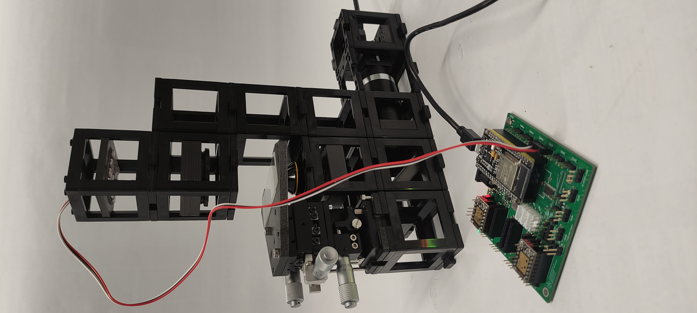

# Differential Phase Contrast

Differential Phase Contrast Microscopy is a Computational Microscopy technique that uses partial coherent sources to illuminate a sample at various angles (oblique illumination). The angle determines the illumination NA which contributes to the final resolution. Throughout this tutorial we are going to revise the theory and implementation of DPC using OpenUC2! The tutorial will explain how to build your own DPC setup and we provide with the reconstruction algorithm given the physical parameters (based on Waller's Lab reconstruction algorithm).

## Weak Object Transfer Function

## Condenser lens

## Tutorial: DPC setup

### Materials needed:

- LED array (4x4)
- Hikrobot Camera (MV-CE060-10UC) with USB cable ([Hikrobot Camera Software installation](Camera_Software_tutorial.md))
- ESP32 Module
- XYZ sample mount stage
- Microscope Objective (0.25 _NA_ x10 )
- Motorized Linear stage
- Non-Kinematic Mirror
- Positive lens with 50 mm focal length
- Five empty cubes
- 15 base plates
- Tube lens (with camera adapter)

### Diagram:

### Instructions for assembling the DPC setup:
**Step 1: Download Imswitch and the ESP32 microcontroller drivers**

Once the drivers are installed you can visit ([youseetoo.github.io](https://youseetoo.github.io/indexWebSerialTest.html)) to test the LED array pattern sequences.

**Step 2: Mount the LED array**

Mount the LED array into the LED array base plate and insert it in a cube as shown.

**Step 3: Build the DPC setup**

**Substep 1**

Build the camera module as shown. It comprises of a tube lens and a Hikrobot Camera. Adjust the screw which binds the camera to the camera base plate to get the right distance between the camera and the tube lens.

**Substep 2**

Insert the non-kinematic mirror, the microscope objective in the fixed mount and the XYZ stage accordingly.

**Substep 3**

Build the illumination module which comprises of the LED array and the condenser lens as shown.

**Substep 4**

Finally, on top of the module built in substep 2 add the illimination module.

**Step 4: Adjust the Source-sample distance**

First, adjust the distance between the LED array and the condenser lens by placing them a focal distance (_f_ = 50 mm) apart. This assures the plane wave illumination. Then, adjust the XYZ to the central positions. Adjust the Microscope objective position so that it matches roughly the working distance.

**Step 5: Focus on the sample**

 Use Imswitch to turn one of the central LEDs, place a test sample to focus on it by coarse moving the microscope objective and finely tuning the height using the XYZ stage. Once it is in focus, adjust the distance from the condenser to the sample to be the focal length (_f_ = 50 mm).  In this geometry the LED array dimensions are near the match illumination condition. Hence, some LEDs illuminate at the objective _NA_ (_NAi_ = _NAobj_).

*Note:* If your sample is transparent be careful not to crash the sample with the microscope objective! For more information about this experimental setup look at: [3D differential phase-contrast microscopy with computational illumination using an LED array](http://dx.doi.org/10.1364/OL.39.001326).

Example of illuminating sample with one half circle illumination. We should be able to see the phase gradient using oblique illumination. In the figure we can compare a defocused and focused image of a cheek cells sample.

**Step 6: Run the ImDPC experiment!**

Once you have focused on the sample, adjust the desired FoV. Now you are set. Click _Start_ on the DPC widget!

Congrats! You have created a DPC microscope with OpenUC2!

## DPC Images

Using the reconstruction algorithm we can retrieve the phase of the sample.

First test with the OpenUC2-DPC setup:

In the animation you can compare the contrast that we can get with brightfield illumination and the DPC reconstruction generated by the four images taken with the half circle illumination.

Taking a series of DPC images at different focal planes. Cropped DPC image of Unknown cells (top) and Cheek cells (bottom) captured with 0.25 NA microscope objective with 10x magnification.

Left:Cropped DPC image captured with 0.17 NA microscope objective with 4x magnification.

## Reconstruction algorithm (Waller-Lab)

The reconstruction algorithm works with the development of the Weak Object Transfer Function (WOTF). Using the code implemented by Waller ([Waller-Lab/DPC](https://github.com/Waller-Lab/DPC)), we are able to reconstruct the absorption and phase of the samples. Here we explain each step and implementation of the code using Imswitch.
