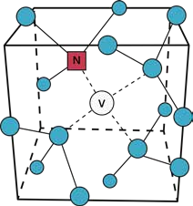

## ODMR – Optically Detected Magnetic Resonance (English)

# Table of Contents

* 02 – Safety Instructions
* 05 – Experiments with the Optics Cubes
* 06 – Parts List
* 07 – Bling bling – Luxury in the Physics Lab (NV Diamonds)
* 08 – Experiment Instructions
* 13 – Technology in Application

# SAFETY INSTRUCTIONS

## Laser

* The laser is only turned on when it is mounted on the base plate.
* The laser must be turned off each time it is repositioned.
* Before switching on, verify the direction of the beam. It should always run parallel to the table surface.
* Remove or cover reflective jewelry (rings, watches, bracelets).
* Remove reflective objects from the table (e.g. cases, rulers, wallets, phones).

## Magnets

* Individuals with implants must inform the supervisor. Special precautions may be necessary.
* Keep devices like phones, tablets, computers, and credit cards away from the experiment.
* Loose magnets must never be swallowed. Inform the instructor immediately if a magnet comes loose.

## Optics Cubes

* All gold-colored parts are functional components.
* White components are used to adjust the functional parts.

# What is ODMR?

Optically detected magnetic resonance (ODMR) is a method where the spin state of a system ("magnetic") is manipulated by microwave radiation ("resonance"). The resulting state is measured via laser illumination and the resulting fluorescence ("optically detected").

The microwave frequency at which resonance occurs is directly dependent on the magnetic field strength. This allows for precise measurement of magnetic fields.

# Parts List

1. Base plate
2. Green laser diode
3. 45° mirrors (2x)
4. Beam splitter with filter
5. Lens
6. Light sensor
7. Electronics control box
8. XY-stage with NV diamond
9. Screen
10. Color filter
11. Magnet

## NV Diamonds

NV stands for Nitrogen-Vacancy. It refers to a diamond with a specific "impurity," usually visible as a pink coloration.

### How Are NV Diamonds Formed?

Diamonds consist of a carbon atom lattice. In an NV diamond, one carbon atom is missing and replaced by a nitrogen atom. A vacancy is left next to the nitrogen.

### What Makes NV Diamonds Special?

* Their spin states can be manipulated and read out via laser light, magnetic fields, and microwaves.
* NV centers are stable quantum systems at room temperature, making them candidates for quantum computing.

* Build the setup as shown.
* Align the laser so that it hits the center of the lens.
* Adjust the XY-stage to place the diamond in the focus of the lens.
* The diamond should glow brightly when viewed through the red filter.

* Complete the setup as shown in the figure.
* Connect to the light sensor user interface.

* Adjust the 45° mirror so that as much light as possible hits the light sensor.

* Connect the microwave antenna to the control box.
* Install the magnet cube.
* Observe any intensity changes when changing the magnet's position.

## Is This Technology Already in Use?

NV diamonds are currently used in basic research and ODMR prototypes. They are not yet commercially used.

## What Is the Future Potential?

* Use as quantum sensors (e.g., temperature, magnetic field, pH values inside cells)
* Application in nuclear magnetic resonance (as a supplement to MRI)
* Use as stable, controllable qubits in quantum computers

# The QuantumMiniLabs Project

## Motivation

Quantum technologies remain inaccessible and abstract for most people. Even at universities, relevant experiments are often only possible with expensive, complex equipment.

## Goals and Approach

The QuantumMiniLabs project is developing an open-source ecosystem that enables low-cost, scalable, modular, and repairable quantum tech experiments. The goal is to deploy the system at 100 educational locations across Germany.

## Innovation and Outlook

QuantumMiniLabs offer the first affordable DIY platform for experimenting with second-generation quantum systems. NV diamonds allow for stable experiments at room temperature.

The aim is wide distribution to reach a critical mass of users so the project continues and evolves beyond its initial funding.

