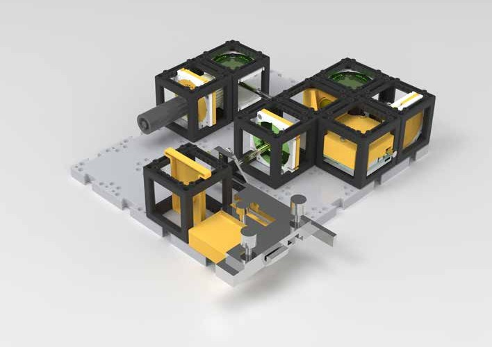
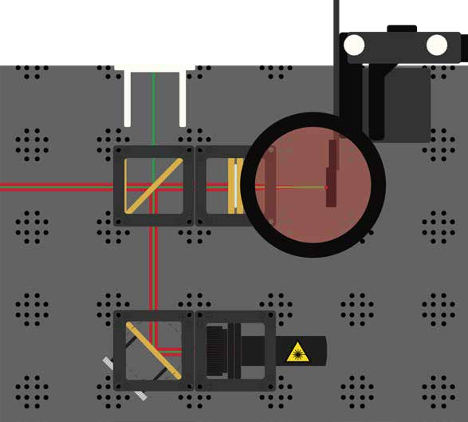

## ODMR – Optically Detected Magnetic Resonance (Deutsch)

# Inhaltsverzeichnis

* 02 – Sicherheitshinweise
* 05 – Experimente mit den Optik-Würfeln
* 06 – Teileliste
* 07 – Bling bling – Luxus im Physiklabor (NV-Diamanten)
* 08 – Anleitung Experiment
* 13 – Technologie in der Anwendung

# SICHERHEITSHINWEISE

## Laser

* Der Laser wird nur eingeschaltet, wenn er sich auf der Grundplatte befindet.
* Der Laser wird jedes Mal ausgeschaltet, wenn er neu positioniert wird.
* Vor dem Einschalten wird überprüft, in welche Richtung sich der Strahl ausbreitet. Der Laserstrahl sollte immer parallel zur Tischplatte verlaufen.
* Reflektierender Schmuck wird abgelegt oder abgeklebt, insbesondere Ringe, Uhren, Armbänder.
* Reflektierende Gegenstände werden vom Tisch entfernt (Etui, Geodreieck, Lineal, Geldbörse, Handy).

## Magnete

* Personen mit Implantaten informieren die Lehrperson. Eventuell müssen besondere Vorkehrungen getroffen werden.
* Geräte wie Handy, Tablet, Computer, EC-Karte vom Tisch entfernen oder fernhalten.
* Lose Magnete dürfen niemals verschluckt werden. Lehrkraft informieren, falls sich ein Magnet löst.

## Optik-Würfel

* Alle goldenen Teile sind Funktionsbauteile.
* Weiße Bauteile dienen der Einstellung der Funktionsbauteile.

# Was ist ODMR?

Optisch detektierte magnetische Resonanz ist ein Verfahren, bei dem der Spinzustand eines Systems ("magnetisch") durch Mikrowellenstrahlung manipuliert wird ("Resonanz"). Dieser Zustand kann durch Beleuchtung mit Laserlicht und der daraus resultierenden Fluoreszenz gemessen werden ("optisch detektiert").

Die Frequenz der Mikrowellenstrahlung, bei der Resonanz auftritt, hängt direkt von der Magnetfeldstärke ab. So kann ein Magnetfeld präzise bestimmt werden.

# Teileliste

1. Grundplatte
2. Laserdiode, grün
3. 45° Spiegel (2x)
4. Strahlteiler mit Filter
5. Linse
6. Lichtsensor
7. Steuerkasten Elektronik
8. XY-Stage mit NV-Diamanten
9. Schirm
10. Farbfilter
11. Magnet

## NV-Diamanten

NV steht für Nitrogen-Vacancy, also Stickstoff-Fehlstelle. Es handelt sich um einen Diamanten mit einer besonderen "Verunreinigung", meist an einer pinken Färbung erkennbar.

### Wie entstehen NV-Diamanten?

Diamanten bestehen aus Kohlenstoffatomen in einem Gitter. Bei einem NV-Diamanten fehlt ein Kohlenstoffatom, dafür sitzt dort ein Stickstoffatom. Neben diesem entsteht eine Vakanz.

### Was ist das Besondere an NV-Diamanten?

* Die Spin-Zustände können durch Laser, Magnetfelder und Mikrowellenstrahlung manipuliert und ausgelesen werden.
* NV-Zentren sind bei Raumtemperatur stabile Quantensysteme und daher potenziell nutzbar für Quantencomputer.

* Baue den Aufbau wie abgebildet.
* Justiere den Laser so, dass er die Linse mittig trifft.
* Justiere die XY-Stage so, dass der Diamant im Fokus der Linse liegt.
* Der Diamant sollte durch den roten Filter hell leuchten.

* Ergänze den Aufbau wie auf der Abbildung.
* Verbinde dich mit der Benutzeroberfläche des Lichtsensors.

* Justiere den 45°-Spiegel, sodass möglichst viel Licht in den Lichtsensor fällt.

* Schließe die Mikrowellenantenne an den Steuerkasten an.
* Baue den Magnetwürfel ein.
* Überprüfe Veränderungen der Lichtintensität bei Positionsänderung.

## Wird die Technologie heute schon eingesetzt?

NV-Diamanten finden Anwendung in der Grundlagenforschung und in Prototypen für ODMR. Eine kommerzielle Nutzung ist noch nicht etabliert.

## Was erhofft man sich?

* Einsatz als Quantensensoren (z. B. Temperatur, Magnetfelder, pH-Werte in Zellen)
* Anwendung in der Nuklearen Magnetresonanz (Ergänzung zur MRT)
* Nutzung als stabile, manipulierbare Qubits in Quantencomputern

# Das Verbundprojekt QuantumMiniLabs

## Motivation

Quantentechnologien sind für viele Menschen unzugänglich und abstrakt. Selbst an Hochschulen sind entsprechende Experimente oft nur mit großem Aufwand möglich.

## Ziele und Vorgehen

Ein Open-Source-Ökosystem wird entwickelt, das günstige, skalierbare, modulare und reparierbare Quantentechnologie-Experimente ermöglicht. 100 Lernorte in Deutschland sollen damit ausgestattet werden.

## Innovation und Perspektiven

QuantumMiniLabs bieten erstmals eine kostengünstige DIY-Umgebung für Experimente mit Quantensystemen der zweiten Generation. NV-Diamanten erlauben stabile Experimente bei Raumtemperatur.

Ziel ist eine weitreichende Verbreitung, um eine kritische Masse an Nutzenden zu erreichen und das Projekt nachhaltig weiterzuführen.

