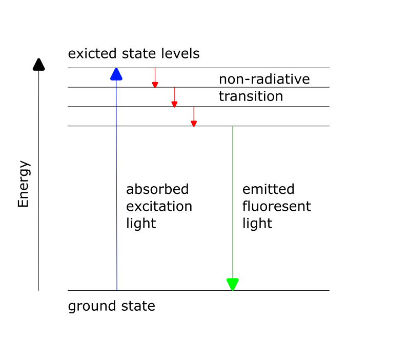

# Workshop Manual: Building a smart Light Sheet Fluorescence Microscope

In this workshop, we will guide you through assembling a light sheet fluorescence microscope. This technique enables fast, gentle, and high-contrast imaging of biological samples by illuminating only a thin slice of the specimen. By systematically shifting the sample in x, y, and z directions and stacking the resulting images, you can reconstruct detailed three-dimensional visualizations of microscopic structures.


### Materials Needed

1. laser diode 488 nm
2. biconvex lens f'=25 mm
3. Zylinder lens f'=xxx mm
4. Mirror
3. LED-Sattelite-Matrix (enables bright-field microscopy for allinging)
4. Electronic Z-stage (for camera fokus)
4. Electronic XYZ-Stage (for moving the Probe)
5. Mainboard with UBC-mini cable
6. PS4 Controller (for controlling the Z-stage)
7. Infinity objective 10x
8. Objective 4x with RMS Insert
8. Probe Chamber
8. Probes
9. Emission filter
9. Camera with tube lens
12. Cubes and base plates


### Diagram


### Theory of Operation

Light-sheet microscopy is based on the principle of fluorescence and like confocal microscopy, it is a technique that creates optical sections that can then be reconstructed into a coherent image. It differs from traditional microscopy technologies in its special type of illumination and detection, which enables gentler and faster acquisition of 3D images, making it particularly suitable for the three-dimensional visualization of biological samples.

To illuminate the sample, a thin light sheet is used, which is guided through the sample perpendicular to the optical axis of the detection optics. This enables layer-by-layer illumination within the depth of field ∆d of the objective, whereby only the focal plane of the sample is illuminated, while all other planes remain in darkness.

Initially, a slit created in various ways was used to generate the light sheet, but for biological fluorescently stained samples, it has now been switched to directing an expanded laser beam through a cylindrical lens.

The cylindrical lens has an effective cut in which it refracts the light rays like a centered lens in the meridional section (principal section) and focuses the light in a line (XY plane). In the YZ plane, however, it acts like a plane-parallel plate,
in which the geometry of the beam is preserved. This creates a light sheet,
where the height h corresponds to the diameter of the expanded laser beam.
The light sheet then strikes the sample to be examined and can be moved through it layer by layer (translation in the Y direction). It is aligned perpendicular to the optical axis of the detection optics, with the
light sheet being within the depth of field (d < ∆d) of the objective lens. This ensures that the recorded image contains no out-of-focus components. To ensure this even when moving in the Y direction through the sample, the position of the objective lens is continuously readjusted. Alternatively, instead of the light sheet, the sample itself can be shifted in the Y direction. In fluorescence microscopy, in particular, the red-shifted radiation emitted from the respective sample plane is detected. Using image processing software, the images of all layers can then be superimposed, creating a 3D image (3D stack) of the sample.

### Theoretical Background: Fluorescence

Fluorescence is a photophysical process that describes the spontaneous emission of light shortly after an electron is excited to a higher-energy state.
First, an electron is excited from the ground state to the higher-energy state  through absorption. After a short time (approximately 10⁻⁹ s), the excited electron returns to the ground state, releasing energy in the form of radiation. Due to the Stokes-shift within the S₁ state, the emitted light has a longer wavelength (λ₂) than the radiation used for excitation (λ₁).




## Tutorial: Light-sheet fluorescence microscope


## Step 1: Assemble the Microscope

This guide will walk you through building the microscope step by step. You can follow the assembly process according to the functional groups or refer to the diagram above.

1. **Place the laser**: Connect the fiber end to the fiber coupler insert and screw it down.

2. **Add the biconvex lens**:  
to collimate the light, place the f'=25mm lens behind the laser. Check if you have a something placed as a beam trap, so you don't send light across the whole room, than check if your Laser is collimated before you proceed, the focus diameter shouldn't change no matter where you measure it.

3. **leave Space**: for the cylindrical lens. You want to insert it later after you aligned the beam.

4. **place the Mirror**: to direct the beam around the corner. Don't forget to replace your beam trap, before turning the laser back on!

5. **assemble the 4x Objective**: take the 4x objective and unscrew it like you see in the picture. this is needed to get the objective focus plane can get close enough to the sample to align everything correctly. then screw it on the RMS-Insert.

6. **place the probe chamber**: and fill it with water.

7. **attach the electronic z-stage**: place the stage as you can see in the picture with the 10x infintiy objective screwed on.

8. **add the emission filter**: if the emission filter is preassembled go to the next step. If not and you don't know were to find the emission filter, it's in the beamsplitter cube insert from the FluoBox, the one on the back side (on the diagonal side is a dirchoric mirror). deassamble the beamsplitter and put the emission filter into it's new insert.

9. **place the camera unit**: together with it's tube lens, place the camera behind the emission filter.

10. **add the LED-Sattelite-Matrix**: in line with the camera path. The Matrix is not a part if the light-sheet-microscope but it is usefull for alligning the microscope in Step 3.

11. **leave Space**: for the XYZ-Stage. for now you do not need it, you can attach it now or after you completed the allignment. Leaving it for now allows you more space to work with while alliging the microscope.

12. **connect everything**: with puzzle pieces, but make sure to leave space für the cylindrical lens so you can easely place it in your microscope.

## Step 2: Electronics

### 2.1: Plug in the Electronics as Shown Below

**⚠️ Caution!**
If you need to change any of the cables or their position, always unplug the 12V power cable before doing so. Otherwise, the electronic components might get damaged!
:::

- connect the LED-Matrix to the Mainboard at `LED1`

- Connect the Z-stage to the postion `Z-Motor` on the main board. Ensure there's a motor driver.

- Connect the 3 Motors of the XYZ-Stage to the respective positions `A-Motor`,  `X-Motor`,  `Y-Motor`. Ensure there are motor drivers as well.

- Connect the Laser to the Mainboard at `PMW1`and to `12V` Power:

- Plug in the micro-USB at your ESP32 and connect to your PC.

- Plug in the 12V power cable.


### 2.2: Flashing the ESP32 Firmware

1. Before proceeding, ensure your ESP32 board has the latest firmware. You can download and flash the firmware via the official [openUC2 website](https://youseetoo.github.io/), selecting your version (most likely **ESO32-DEV-based UC2 standalone board V3 (beta)**), then click on the `connect` button.


The source code can be found [here](https://github.com/youseetoo/uc2-esp32).

2. Connect the ESP32 to your computer using the micro-USB cable.  


3. In your Chrome browser, a dialog will prompt you to select the COM port for your ESP32, which should be shown as `CP2102 USB to UART Bridge Controller`. Once connected, you can install the latest firmware by simply clicking the "Install" button.
  

  

  If nothing shows up, you can install the drivers from the prompt that appears when you click anywhere on the screen:

   

4. Wait until the firmware has been successfully flashed.

5. &#x1F4A1; **flash your LED-matrix**. Repeat the same steps, but this time for the LED-matrix
   


### 2.3: Connecting to the Web Interface

1. After flashing the firmware, go to the testing section on the same website.

2. Connect to your ESP32 board using the "Connect" button again, ensuring the correct COM port is selected.  

   

3. Once connected, test the system by sending a simple command:

```json
{"task":"/motor_act", "motor": { "steppers": [ { "stepperid": 3, "position": -1000, "speed": 1000, "isabs": 0, "isaccel": 0} ] } }
```


This command will move the Z-axis motor by -1000 steps (1 full rotation) at a speed of 1000 steps per second. Each step corresponds to a movement of 300nm when using microstepping. You’ll observe the motor rotating, adjusting the focus.

**Note:** Ensure that the command string has no line breaks.

4. &#x1F4A1;**Connect your LED-matrix as well**. Duplicate the current tab and connect the LED-matrix again via the button. Choose the correct COM Port.  
Now you can test all components through these two tabs.


### 2.4: Testing in the Web Interface

1. After completing the test, go back to the first tab to control the other components via buttons:
   - `Laser 1(on)` and `Laser 1(off)` control the laser diode.
   - `Motor Z(+)` and `Motor Z(-)` control the Z-stage.
   - `Motor X(+)/Y(+)/A(+)` and `Motor X(-)/Y(-)/A(-)` control the XYZ-stage.
   - `LED (on)` and `LED (off)` control the LED-matrix panel


### 2.5: Pairing the PS4 Controller &#x1F3AE;

The UC2-ESP firmware supports various input devices, including the PS4 controller, to make interacting with the microscope easier. While you've already worked with USB serial commands, using the PS4 controller offers a more flexible, hands-on approach. For more detailed instructions on pairing, refer to the [UC2 PS4 Controller Pairing Guide](https://openuc2.github.io/docs/Electronics/PS4-Controller). Here’s a brief summary:

1. **Put your PS4 controller into pairing mode** by holding down the `Share` button and the `PS` button simultaneously until the light bar starts blinking.
2. Click the `Pair Controller` button in the web interface. Alternatively, open the serial prompt in your browser (connected to the ESP32 board) or use the web interface and enter the following command:


```json
{"bt_scan":1}
```

  This will initiate the Bluetooth scan on the ESP32, which will detect and pair with the controller.

  Once paired, you can control the motorized stage using the analog sticks and switch the LED-matrix on/off using the buttons:

  - **Move the Z-stage**: Use the **left analog stick** to move the stage up and down (adjust focus).
  - **Control the LEDs**: Use the **controller buttons** to turn the LED-matrix on/off and cycle through different illumination patterns.


### 2.6: Setup and Use the Camera Software

1. Connect the camera via cable to your PC.

2. For the installation process and useage of the software, follow these instructions: [Install MVS App for Camera Utilization](https://openuc2.github.io/docs/Toolboxes/DiscoveryInterferometer/SoftwareTutorial/#install-mvs-app-for-camera-utilization).

3. it's unlikley you will see anything and that's fine, because now let's got to step 3..


## Step 3: allinging the microscope
This diagram shows hwo the light sheet needs to be aligned. The focal  point of the light sheet (thinnest part of it) has to be on the optial axis of the detection optic.
Following these steps meticulously will ensure that the light-sheet is accurately aligned both within the FOV's center and in-focus with the detection objective lens. This alignment process is essential for obtaining reliable and high-quality imaging results with the openUC2 light-sheet microscope.

for Tips and tricks look here: https://openuc2.github.io/docs/Investigator/Lightsheet/LightSheet%20Sample

0. **Fill the probe chamber with water**: Then, to make the water fluoresent, dip the tip of a text marker into the water.

1. **align the 4x Objective:**: now you can turn the laser on and allign the Objective so the focus is on the optical axis of the detection optics, the dot should be as tiny as possible. How to know where's the middle? for better visualization of the detection optical axis you can use a ruler or pen.


2. **insert the cylindrical lens**: to form the light sheet. The cylindrical lens should focuses the primary light-sheet in the back focal plane of the illumination objective (4x, 0.1 NA). You should now see the light sheet in the water. As you are looking on it from the top, you'll notice that the light sheet is thinnest in the middle. This is the focus point that you aligned before.
for aligning your cylindrical lens its focal length should match the focal length of the 4x objective. For that try to get your light sheet as thin as possible, then the two focal lengths match.

Once the cylindrical lens is back in, you can readjust the light-sheet wr.t. to the focus plane of the objective lens since they may be a slight variation after reassembly.

Notably, this step doesn't need to be repeated each time the light-sheet is activated. The position of the cylindrical lens is relatively stable and doesn't require frequent recalibration.

3. **turn on the camera**:
Check if its working with the LED (camera should see something)

Exposure time 500.000 ms for laser
Gain to 20.000
remove filter
stir up the fluoresent particals in the water - you should see big dots
make the dots as small as possible --> move Z-Stage so that the light sheet is inside the 10x objectives depth of field.
--> you should see a line --> line shall not be blurred but sharp (perfect focus)

https://openuc2.github.io/docs/Investigator/Lightsheet/LightsheetCalibration

## Experiment 1: insert Probe, scroll through it via controller

sample preparation: https://openuc2.github.io/docs/Investigator/Lightsheet/LightSheet%20Sample/#sample-preparation-%C3%A1-la-agarose-in-syringe-method

## Experiment 2: Smart Microscopy Using ImSwitch and openUC2

For this, please refer to the installation instructions [here](https://openuc2.github.io/docs/ImSwitch/ImSwitchOnRaspi#install-raspberry-pi--imswitch).

On top of this, you can use the following `ImSwitchClient` template to remote control your microscopy using google colab or jupyter notebook. This gives some hints on the use of the API:

<a target="_blank" href="https://colab.research.google.com/drive/1W3Jcw4gFn0jtQXa3_2aCtJYJglMNGkXr?usp=sharing">
  
</a>
This makes use of the default URL hosted publicly on https://imswitch.openuc2.com/imswitch/index.html, but you can change this to the `PORT` (i.e. 8001) nad `URL` (e.g. the Raspberry Pi's IP address that runs ImSwitch in docker and is in the same network as you computer).
