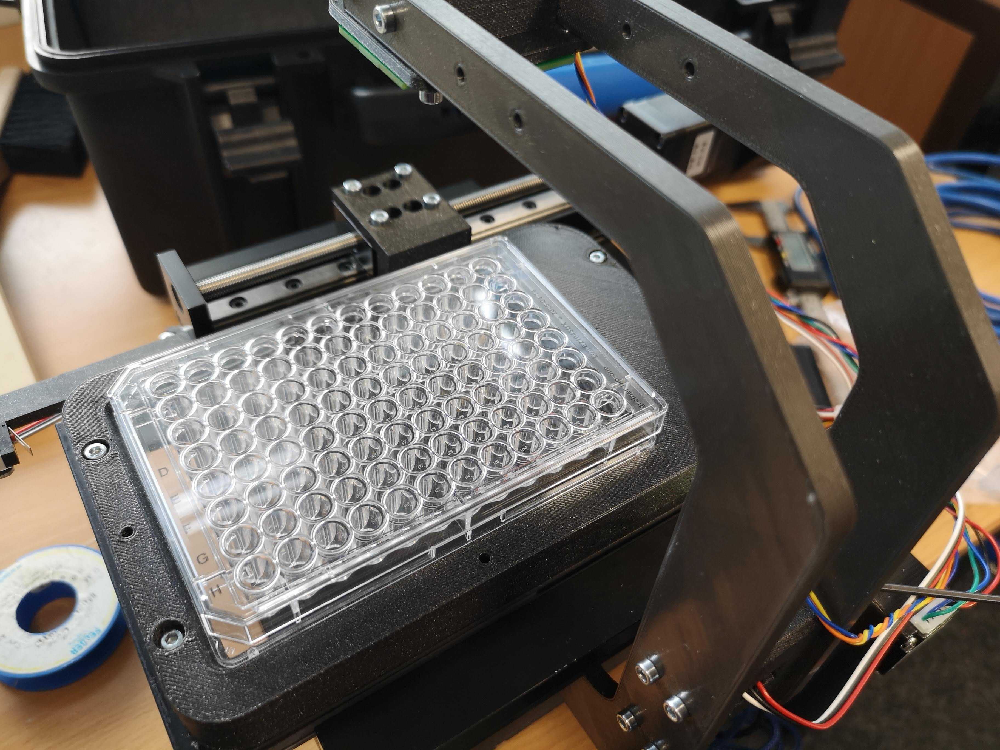
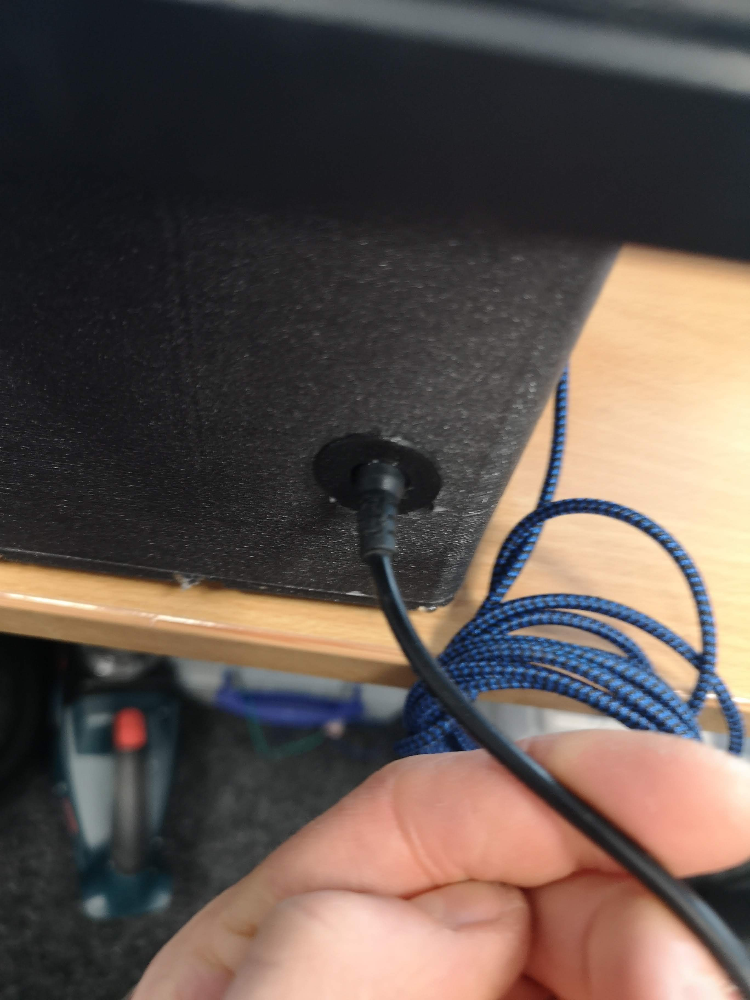

## Unpacking the microscope

The hardcover plastic case contains all you need for the microscope:

 - USB micro cable
 - USB3 camera cable
 - 12V power-supply
 - Sweet treat (optional ;D)
 - The actual microscope
 - The objective lens
 - The Illumination unit
 - A heavy Box

The actual Box looks like this:

**Optional** Please also find the treat and make sure you provide yourself with enough sugar throughout this unpacking routine :-)

The foam holds the microscope in place (the actual colour may differ from what you may see):

Remove the foam parts (please keep them for later reuse) to end up like this here:

## Getting started

### Mounting the illumination unit

For this you need a 2.5mm Hex key and the M3 cylindrical screws. Mount the LED Arm like so:

It should look like this:

### Wiring up the microscope

First of all we need to wire up the microscope. For this we will start with the 12V power supply. Unfortunately the powersocket is inside the case, hence you have to first eat some candy in order to better find the spot ;-)

The USB Cable is permanently mounted to the ESP32 UC2e unit:

**Note**: Please make sure you have sufficient USB Power. In case the full LED array is turning on, it may happen that the ESP's voltage drops and the USB serial connection fails. A reconnect will help.

The same holds true for the USB connection to the microcontroller board. You need to hook it up like that:

Once done, we continue with inserting the objective lens. Eventually the lens is already inserted and you just need to check if the lens is centered correctly

## Wire up the microscope to your computer

In order to get the microscope working, we first need to install additional drivers. For the Daheng Camera, this would be:

- Daheng SDK for windows which can be downloaded from this link: https://www.get-cameras.com/SoftwareDevelopmentKit-Industrial-camera
- the openUC2 electronics board uses an ESP32, which needs the CH340 USB-Serial driver: https://learn.sparkfun.com/tutorials/how-to-install-ch340-drivers/all

For additional information and an in-depth explanation for the UC2e system, please have a look [here](https://openuc2.github.io/docs/Electronics/uc2e1)
