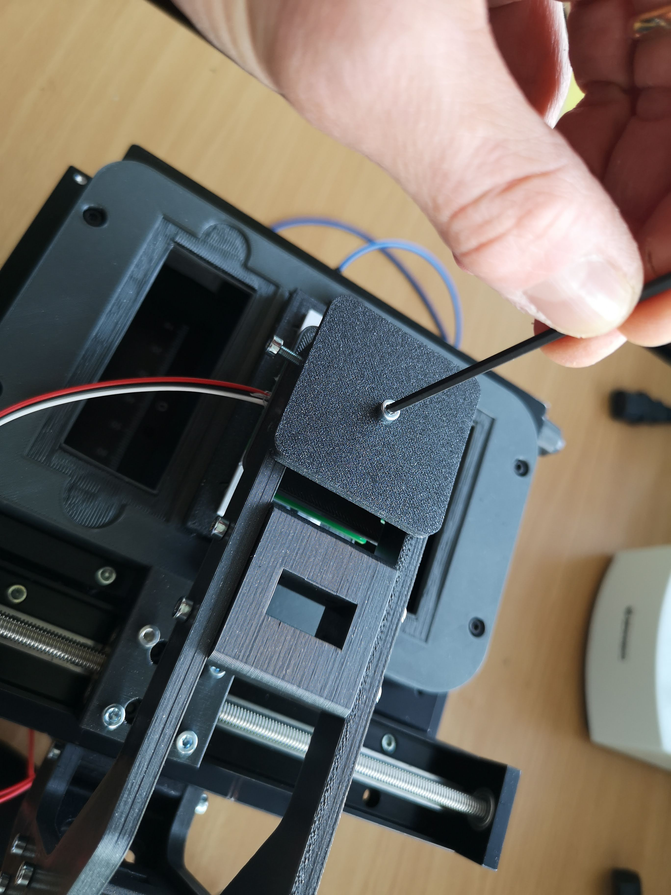
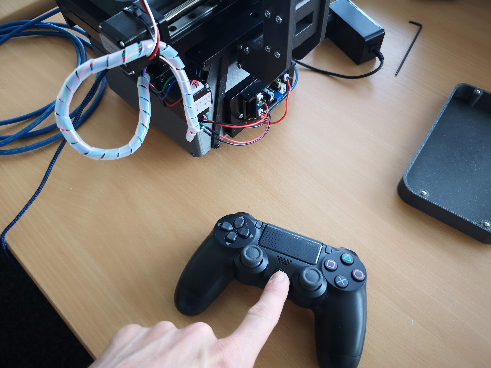

## Design Files

:::warn
https://github.com/openUC2/openUC2_XYZ_Stagescanning_Microscope/
:::


## Version 2

This is a slightly updated version of the XYZ microscope that also includes fluorescence imaging. The here presented documentation has an extra feature since it can be operated vertically to image plants growing upwards. Also we use an adapter to mount Ropods magnetically.

### Assembly

Open the Box:


Find the microscope and the cables:


The second layer has the controller and the microscope body:


Carefully take out the microscope out of the box using *two* hands please:


These parts should have arrived at your fingertips:


The first part is to slide in the Illumination arm and mount it using a hex key:


Ensure the Light-source is centered w.r.t. the objective lens


Mount the LED Matrix centric w.r.t. the objective lens by sliding it in


Fix it in place using the hex key


### Adding Cables

Plug in the 12V Power plug in the round hole (a bit tricky)


Connect the USB micro cable in the bespoke slot (also a bit improvised - sorry)


Connect the Camera using the USB3 cable


Add the sample using magnets


Make sure everything is in place


If everything is connected to the computer, hit the connect button on the PS4 controller and wait until the blinking white LED is continuing to shine, meaning it's connected


For fluorescence imaging, please add the Laser cover


It's easier to add the laser mount if you remove the brightfield lamp first


Once mounted, mount the brightfield lamp back in


### Swapping the objective lens

This part is yet a bit tricky (Sorry).. The mount for the objective mount features a special adapter that follows a bajonett design. Once the three pits fit in the three holes, a 40° clockwise rotation will fix the objective in place. If it gets too complicated, take a hex key and remove the sample mount to better access the objective.


Remove the sample mount:


Remove the lens by unscrewing it counter-clockwise:


Carefully take the lens out:


In motion:


### Veritcal Operation


## Troubleshoot

We learn from mistakes. So lets start learning. The system is fully open, meaning, you can adjust and change the vast majority of the parts on your own. The entire system consists of the openUC2 frame / skeleton and the 3D printed housing to shield it from dust and light. By removing all M3 cylindrical screws, you can detach the housing from the inner structure to eventually repair or alter the system.

You can find a full description of how to dissassemble the microscope here: https://openuc2.github.io/docs/PRODUCTION/INVESTIGATOR/ProductionXYZMicroscope

## In Action

We scanned arabidopsis in darkfield (LEDs >9 on):


## Connecting the microscope to the browser and controll it

We encourage you to use the UC2ified ImSwitch software to control the microscope. You can find it in this repository: https://github.com/openUC2/ImSwitch/

However, if you want to quick-start the microscope and see if it works, you can open your browser and use the WEB-Serial interface to interact with the microscope.

Go to https://youseetoo.github.io/ and connect to your board (most right option saying **ESP32 DEV-based UC2 standalone board V2**). Select the COM Port which is holding the ESP32 and hit the *LOG* option, once the dialog opens. The alternative option will help you updating the firmware on the device. An in-depth explanation on how the firmware works can be found [here](https://openuc2.github.io/docs/Electronics/uc2e1).

In general, you need to send `JSON` strings in order to control the system. The strings relevant for the Z-microscope are:

### Home the XY-axis

It's important to always home the Motors in order to avoid them from getting stuck in an end position (**ATTENTION!**). The following string will move the motor until the endstop is hit. Afterwards it will release the switch:

```json
{"task":"/home_act", "home": {"steppers": [{"stepperid":1, "timeout": 2000, "speed": 15000, "direction":1, "endposrelease":3000}]}}
```

and

```json
{"task":"/home_act", "home": {"steppers": [{"stepperid":2, "timeout": 2000, "speed": 15000, "direction":1, "endposrelease":3000}]}}
```

Afterwards the internal position is set to 0. You can check that by entering:

```json
{"task": "/motor_get"}
```


### Move the Z-axis:

The motor (Nema12) with 200 steps/revolution runs with 16 microstepps and offers a leadscrew with 1mm/revolution. Hence, one step corresponds to `312.5nm`. Running the motor can be issued with the following command:

```json
{"task":"/motor_act",
    "motor":
    {
        "steppers": [
            { "stepperid": 3, "position": 1000, "speed": 15000, "isabs": 3, "isaccel":0}
        ]
    }
}
```

- `stepperid`: 3 correpsonds to the Z-axis
- `position`: steps to go (not physical units!)
- `speed`: steps / minute (do not exceed 20000)
- `isabs`: absolute or relative motion
- `isaccel`: for now, use only non-accelerated motion!


## Safety

- in case of shattered glass, make sure you don't cut yourself
- Make sure you don't hurt yourself
- The moving parts can potentially hurt your finger
- The electronics - if used in a wrong way - can harm you
- edges may be sharp, make sure you don't cut yourself
