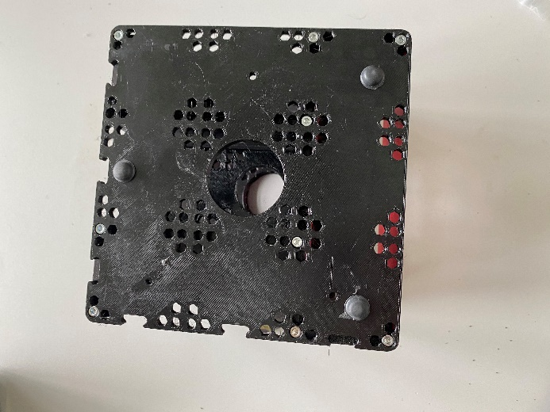
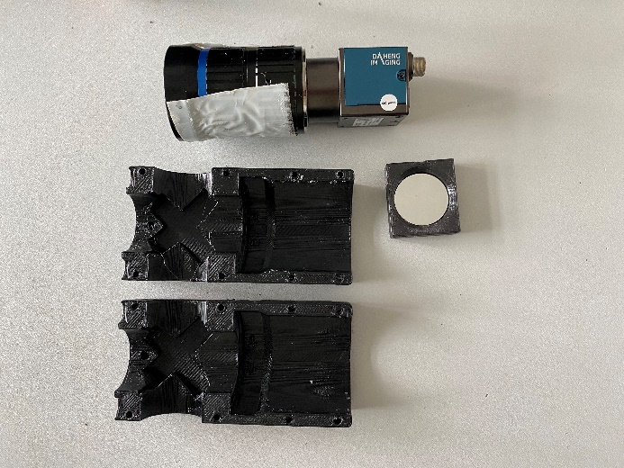
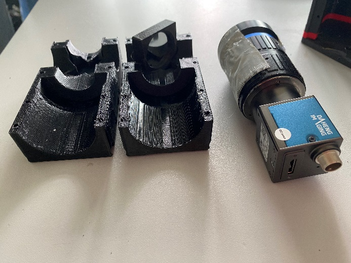
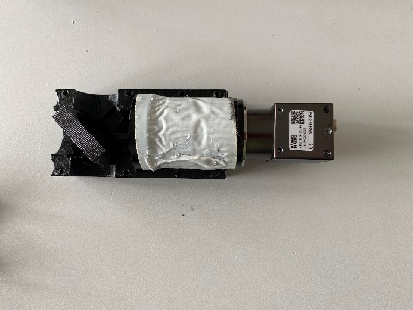
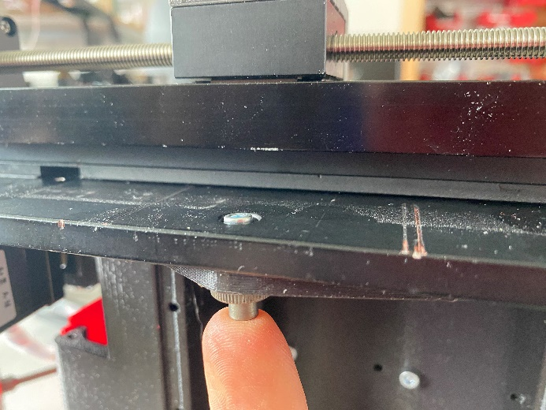
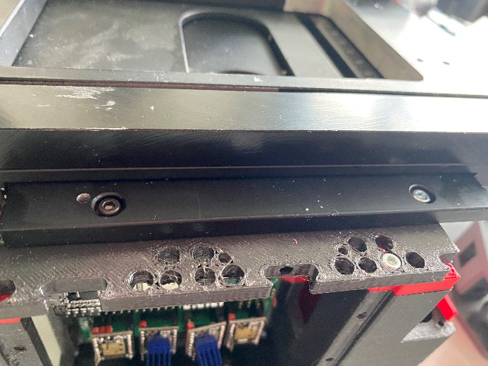
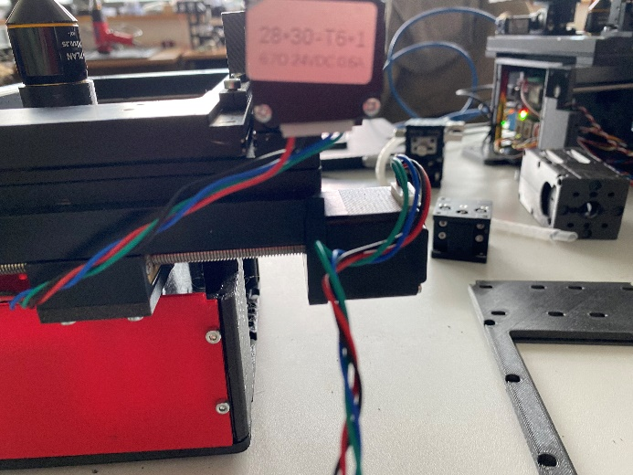

# openUC2 FiveD v3

## Design Files

:::warn
https://github.com/openUC2/openUC2_XYZ_Stagescanning_Microscope/
:::


## Version 3

This is a novel version of the XYZ microscope that also includes fluorescence imaging. It is not based on the UC2 cubes anymore but featues a monolithic body that is still 3D printed.

More information are comming soon!

## Introduction

A first video explains the basic operation of the device

<iframe width="560" height="315" src="https://www.youtube.com/embed/T0cRZOXp5fk?si=dgLqVprYvSsl_5Sr" title="YouTube video player" frameborder="0" allow="accelerometer; autoplay; clipboard-write; encrypted-media; gyroscope; picture-in-picture; web-share" allowfullscreen></iframe>

## Software

The device runs using ImSwitch with the following Configuration. Find the ImSwitch Installer here: https://github.com/openUC2/ImSwitchInstaller/releases/tag/v0.0.2 (go to latest release)

[Config](https://github.com/openUC2/ImSwitchConfig/blob/master/imcontrol_setups/example_uc2_hik_histo_andrew_1-12-24.json)
```json
{
  "positioners": {
    "ESP32Stage": {
      "managerName": "ESP32StageManager",
      "managerProperties": {
        "rs232device": "ESP32",
        "isEnable": true,
        "enableauto": false,
        "stepsizeX": -0.3125,
        "stepsizeY": -0.3125,
        "stepsizeZ": 0.3125,
        "homeSpeedX": 15000,
        "homeSpeedY": 15000,
        "homeSpeedZ": 15000,
        "isDualaxis": true,
        "homeDirectionX": 1,
        "backlashXOld": 15,
        "backlashYOld": 40,
        "backlashX": 0,
        "backlashY": 0,
        "homeEndstoppolarityY": 0,
        "homeDirectionY": -1,
        "homeDirectionZ": 0,
        "homeXenabled": 1,
        "homeYenabled": 1,
        "homeZenabled": 0,
        "initialSpeed": {
          "X": 15000,
          "Y": 15000,
          "Z": 15000
        }
      },
      "axes": [
        "X",
        "Y",
        "Z"
      ],
      "forScanning": true,
      "forPositioning": true
    }
  },
  "rs232devices": {
    "ESP32": {
      "managerName": "ESP32Manager",
      "managerProperties": {
        "host_": "192.168.43.129",
        "serialport": "COM5",
        "baudrate":115200,
        "debug":1
      }
    }
  },
  "lasers": {
    "LED": {
        "analogChannel": null,
        "digitalLine": null,
        "managerName": "ESP32LEDLaserManager",
        "managerProperties": {
          "rs232device": "ESP32",
          "channel_index": 1
        },
        "wavelength": 0,
        "valueRangeMin": 0,
        "valueRangeMax": 1023
      },
      "Laser 488": {
        "analogChannel": null,
        "digitalLine": null,
        "managerName": "ESP32LEDLaserManager",
        "managerProperties": {
          "rs232device": "ESP32",
          "channel_index": 2
        },
        "wavelength": 635,
        "valueRangeMin": 0,
        "valueRangeMax": 1023
      },
      "Laser 635": {
        "analogChannel": null,
        "digitalLine": null,
        "managerName": "ESP32LEDLaserManager",
        "managerProperties": {
          "rs232device": "ESP32",
          "channel_index": 3
        },
        "wavelength": 488,
        "valueRangeMin": 0,
        "valueRangeMax": 1023
      }

    },
  "detectors": {
    "WidefieldCamera": {
      "analogChannel": null,
      "digitalLine": null,
      "managerName": "HikCamManager",
      "managerProperties": {
        "isRGB": 1,
        "cameraListIndex": 0,
        "cameraEffPixelsize": 0.2257,
        "hikcam": {
          "exposure": 0,
          "gain": 0,
          "blacklevel": 100,
          "image_width": 1000,
          "image_height": 1000
        }
      },
      "forAcquisition": true,
      "forFocusLock": true
    },
    "Observer": {
      "analogChannel": null,
      "digitalLine": null,
      "managerName": "OpenCVCamManager",
      "managerProperties": {
        "cameraListIndex": 1,
        "cameraListIndexWIN": 0,
        "isRGB":1,
        "opencvcam": {
          "exposure": 10
        }
      },
      "forAcquisition": true
    }
  },
  "autofocus": {
    "camera": "WidefieldCamera",
    "positioner": "ESP32Stage",
    "updateFreq": 10,
    "frameCropx": 780,
    "frameCropy": 400,
    "frameCropw": 500,
    "frameCroph": 100
  },
  "mct": {
    "monitorIdx": 2,
    "width": 1080,
    "height": 1920,
    "wavelength": 0,
    "pixelSize": 0,
    "angleMount": 0,
    "patternsDirWin": "C:\\Users\\wanghaoran\\Documents\\ImSwitchConfig\\imcontrol_slm\\488\\",
    "patternsDir": "/users/bene/ImSwitchConfig/imcontrol_sim/488"
  },
  "PixelCalibration": {},
  "focusLock": {
    "camera": "WidefieldCamera",
    "positioner": "ESP32StageManager",
    "updateFreq": 4,
    "frameCropx": 0,
    "frameCropy": 0,
    "frameCropw": 0,
    "frameCroph": 0
  },
  "availableWidgets": [
    "Settings",
    "View",
    "Recording",
    "Image",
    "Laser",
    "Positioner",
    "Autofocus",
    "MCT",
    "UC2Config",
    "ImSwitchServer",
    "PixelCalibration",
    "HistoScan",
    "ROIScan"
  ],
  "nonAvailableWidgets": [
    "STORMRecon",
    "DPC",
    "Hypha",
    "FocusLock",
    "HistoScan",
    "FocusLock",
    "FOVLock"
  ]
}
```


## Assembly Instructions

### Assembly of the Optics Cube

To begin the assembly of the microscope, the following components are needed:

- The "ESP32 DEV-based UC2 standalone board V3"
- Screws
- Housing parts


Mount the middle plate with M3x12 screws:


Ensure the screws are fixed properly on both sides. Also, cover the screws with non-conductive tape to prevent any shorts on the ESP32-based board side:


The top plate is attached with 8 screws on the red edges. Then, flip the microscope and attach the bottom plate with adhesive feet. For better stability, it is recommended to use 4 adhesive feet. Then the microscope can be placed upright again.




### Assembly of the Optics Module (e.g., Camera)

Next, you will need the following parts:

- Camera
- Mirror
- Parts for the camera module

The mirror is placed in the module.




Apply double-sided tape around the camera for additional adhesion and assemble the camera housing parts.




Insert the camera module into the microscope as shown:


### Mounting the Stage on Top of the Optics Cube

The stage is attached to the top plate with 4 screws and nuts. Rotate the threaded spindles to access the screw holes.




Now the objective can be installed:


### Wiring Up the Motors and Endstops

Next, connect the stepper motors to the board:




If the zero point is incorrect after installing the firmware, you can reverse the connections accordingly:


To connect the endstops, first rewire them and then connect them to the board.


Next, you need to attach additional components. If necessary, drill new holes. The placement will depend on the objective, which needs to be positioned at the bottom left corner. After that, secure the components with two screws each.


Finally, attach the slide holder with 8 screws.


This completes the assembly of the UC2 FiveD v3 microscope. Follow each step carefully to ensure proper assembly and functionality.

## Troubleshoot

We learn from mistakes. So lets start learning. The system is fully open, meaning, you can adjust and change the vast majority of the parts on your own. The entire system consists of the openUC2 frame / skeleton and the 3D printed housing to shield it from dust and light. By removing all M3 cylindrical screws, you can detach the housing from the inner structure to eventually repair or alter the system.

You can find a full description of how to dissassemble the microscope here: https://openuc2.github.io/docs/PRODUCTION/INVESTIGATOR/ProductionXYZMicroscope

## Connecting the microscope to the browser and controll it

We encourage you to use the UC2ified ImSwitch software to control the microscope. You can find it in this repository: https://github.com/openUC2/ImSwitch/

However, if you want to quick-start the microscope and see if it works, you can open your browser and use the WEB-Serial interface to interact with the microscope.

Go to https://youseetoo.github.io/ and connect to your board (most right option saying **ESP32 DEV-based UC2 standalone board V2**). Select the COM Port which is holding the ESP32 and hit the *LOG* option, once the dialog opens. The alternative option will help you updating the firmware on the device. An in-depth explanation on how the firmware works can be found [here](https://openuc2.github.io/docs/Electronics/uc2e1).

In general, you need to send `JSON` strings in order to control the system. The strings relevant for the Z-microscope are:

### Home the XY-axis

It's important to always home the Motors in order to avoid them from getting stuck in an end position (**ATTENTION!**). The following string will move the motor until the endstop is hit. Afterwards it will release the switch:

```json
{"task":"/home_act", "home": {"steppers": [{"stepperid":1, "timeout": 2000, "speed": 15000, "direction":1, "endposrelease":3000}]}}
```

and

```json
{"task":"/home_act", "home": {"steppers": [{"stepperid":2, "timeout": 2000, "speed": 15000, "direction":1, "endposrelease":3000}]}}
```

Afterwards the internal position is set to 0. You can check that by entering:

```json
{"task": "/motor_get"}
```


### Move the Z-axis:

The motor (Nema12) with 200 steps/revolution runs with 16 microstepps and offers a leadscrew with 1mm/revolution. Hence, one step corresponds to `312.5nm`. Running the motor can be issued with the following command:

```json
{"task":"/motor_act",
    "motor":
    {
        "steppers": [
            { "stepperid": 3, "position": 1000, "speed": 15000, "isabs": 3, "isaccel":0}
        ]
    }
}
```

- `stepperid`: 3 correpsonds to the Z-axis
- `position`: steps to go (not physical units!)
- `speed`: steps / minute (do not exceed 20000)
- `isabs`: absolute or relative motion
- `isaccel`: for now, use only non-accelerated motion!

## Inserting the Modules

This shows how the optics module have to be slided into the FiveD assembly. There is a series of groves, slides and accompanying spring-loaded mechanisms to keep the module in exactly one place. It is mechanically well defined. The way to slide it in is a bit involved, but worth it:


*one of the positioning spheres (without spring) beaks first*


*immediately after this comes the first spring-loaded ball*


*Both balls have to pass over this hill on their bhan. But since one of them is spring-loaded, this should work.


*the second spring ball now plays along*


*The last two fixed balls find their groove almost immediately before the front ball moves up its ramp to the pins*


*Final position. All fixed balls in their "pin yokes" and both spring balls press the optics module against them*.


### Final result


## Safety

- in case of shattered glass, make sure you don't cut yourself
- Make sure you don't hurt yourself
- The moving parts can potentially hurt your finger
- The electronics - if used in a wrong way - can harm you
- edges may be sharp, make sure you don't cut yourself
