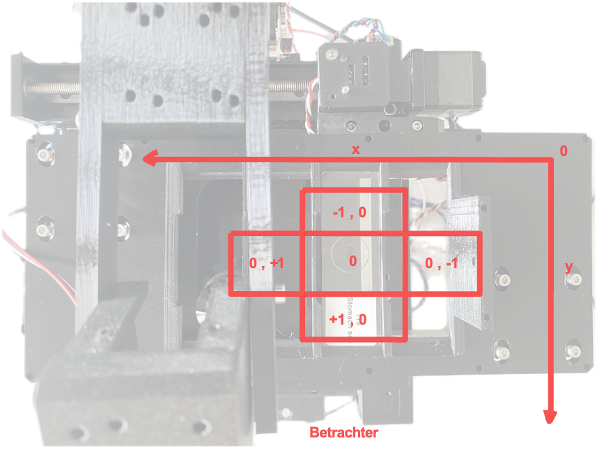

# Stage Mapping and Stage Calibration

## Stage Coordinates

In this tutorial, we will guide you through the process of aligning the coordinate systems for the UC2 microscope stage. Proper alignment ensures that the movement of the stage corresponds accurately with the image displayed on the screen, facilitating an intuitive user experience. In principle all of this can be handled in software (e.g. flipping the camera image, changing stage axis), but it's always good to start with a common ground from the hardware side.


*This is the microscope (UC2 XYZ v3) with the ingredients controlled by ImSwitch*

### Alignment of Axes

The goal of aligning the coordinate systems is to ensure they are correctly matched. The alignment of the stage is considered from the origin point (zero point). The desired behavior is as follows:
- When the stage moves to the right (x+), the image on the screen should also move to the right.
- When the stage moves upwards (y+), the image on the screen should move upwards as well.


This is illustrated in the following Figure. When viewing the sample from above with the microscope positioned in front, the image should match what is shown in Imswitch.
This is also represented by the `VirtualMicroscope` with the `VirtualStage` and `VirtualCamera` in this config (Config: https://github.com/openUC2/ImSwitchConfig/blob/master/imcontrol_setups/example_virtualmicroscope.json).


### Understanding Axes in NumPy

It's important to note the labeling of axes. In NumPy, x = 1 and y = 0. This means:
- The x-axis is the second axis (index 1) of an array.
- The y-axis is the first axis (index 0) of an array.


NumPy arrays are multidimensional, with axes numbered as follows:
- Axis 0 is the first axis (often the vertical direction).
- Axis 1 is the second axis (often the horizontal direction).

### Stage Coordinate System

When viewing the stage from above, the coordinate system is arranged as follows:

- **X-Axis (Horizontal)**
  - Positive direction: Right
  - Negative direction: Left
- **Y-Axis (Vertical)**
  - Positive direction: Up
  - Negative direction: Down




### Aligning Axes with Imswitch

To enable intuitive operation, the stage and camera axes must be correctly aligned with the coordinate system in Imswitch. To achieve this, the commands "flip x" and "flip y" are used. These commands invert the direction of the axes in the coordinate system, meaning that movement or position along the axes is reversed.

#### Steps for Aligning Axes:

1. **Initial Setup:**
   - Ensure the microscope and stage are properly connected to the control software (e.g., Imswitch).

2. **Define Origin:**
   - Identify the origin (zero point) of the stage coordinate system. (in Hardware this would be defined by the Endstops that are used for homing the axes; The motor will run - if the direction is set correctly - until it hits the switch)

3. **Test Movement:**
   - Move the stage to the right and observe the direction of the image on the screen.
     - If the image moves left, apply the "flip x" command.
   - Move the stage upwards and observe the direction of the image on the screen.
     - If the image moves down, apply the "flip y" command.

4. **Adjust Axes:**
   - Use the following commands as needed to align the axes:
     ```python
     # Flip the x-axis if necessary
     if x_movement_incorrect:
         stage.flip_x()

     # Flip the y-axis if necessary
     if y_movement_incorrect:
         stage.flip_y()
     ```

5. **Verify Alignment:**
   - After applying the flips, verify that the stage movements correspond correctly with the image movements on the screen.

6. **Save Configuration:**
   - Save the configuration settings to ensure the alignment persists across sessions.


## Stage Calibration

Richard Bowman and his team provided a very nice way to calibrate stage coordinates to camera pixel coordinates. We burtally integrated the open-source software which you can find here: https://gitlab.com/openflexure/microscope-extensions/camera-stage-mapping into ImSwitch. If you activate the `HistoScan` Controller and Widget you can start it either by the GUI or using the HTTP interface by calling http://localhost:8002/HistoScanController/startStageMapping (URL and PORT may differ). What the stage will do is moving a certain series of steps in XY, performs a cross-correlation of the images and computes the shift in XY of the mciroscope image on the camera, compares it to the expected shift on and returns the Image-To-Stage-Displacement Matrix as well as the Backlashvector. Both matrices/vectors are microscope specificand will help you matching e.g. stage coordinates for stitching software such as ASHLAR or OFM Stitching. This document should give you a rough idea of what's happening.

Some terminology:

- **Combine X and Y calibrations**: The calibration involves combining two separate measurements or calibration runs for the x and y directions, ensuring that the directions are orthogonal (at right angles to each other).

- **2x2 transformation matrix**: The `image_to_stage_displacement` matrix maps image displacements to stage displacements. This ensures that movements in the image coordinate system are accurately translated to movements in the stage coordinate system.

- **backlash_vector**: This is a vector estimating the backlash (mechanical slack or play in the system) in each direction. In this case, the estimated backlash is zero, indicating a precise calibration with no noticeable mechanical play.

- **backlash**: The function is expected to return the highest element of `backlash_vector` as a scalar value, which would be zero in this case.

## Interpreation of the Matrix

### Calibration Matrix `image_to_stage_displacement`

The entries of the calibration matrix `image_to_stage_displacement` can be given specific names and meanings based on their positions within the matrix. Let's denote the matrix as follows:

$$
\text{image\_to\_stage\_displacement} =
\begin{pmatrix}
0 & -1.0 \\
-1.0 & 0
\end{pmatrix}
$$
$$
\begin{pmatrix}
a & b \\
c & d
\end{pmatrix}
$$


#### Entries and Their Names

1. **a (0)**:
   - **Name:** `a`
   - **Meaning:** Represents the scaling factor from the x-coordinate in the image to the x-coordinate in the stage. Here, it is 0, indicating no direct mapping from image x to stage x.

2. **b (-1.0)**:
   - **Name:** `b`
   - **Meaning:** Represents the scaling factor from the y-coordinate in the image to the x-coordinate in the stage. The value -1.0 indicates an inverse and slightly scaled mapping from image y to stage x.

3. **c (-1.0)**:
   - **Name:** `c`
   - **Meaning:** Represents the scaling factor from the x-coordinate in the image to the y-coordinate in the stage. The value -1.0 indicates an inverse and slightly scaled mapping from image x to stage y.

4. **d (0)**:
   - **Name:** `d`
   - **Meaning:** Represents the scaling factor from the y-coordinate in the image to the y-coordinate in the stage. Here, it is 0, indicating no direct mapping from image y to stage y.

### Summary of the Matrix Entries

- **a (0)**: No direct mapping from image x to stage x.
- **b (-1.0)**: Inverse mapping from image y to stage x.
- **c (-1.0)**: Inverse mapping from image x to stage y.
- **d (0)**: No direct mapping from image y to stage y.

This calibration matrix indicates that there is a transformation involving a 90-degree rotation combined with an inverse scaling factor slightly above 1 between the image coordinates and the stage coordinates. The exact interpretation may depend on the specific application, but generally, it implies that movements in one direction in the image are mapped to movements in the perpendicular direction on the stage with a slight scaling adjustment.


## Interpretation of the Values

The following simulation of the `VirtualMicroscope` inside ImSwitch (Config: https://github.com/openUC2/ImSwitchConfig/blob/master/imcontrol_setups/example_virtualmicroscope.json):


The result of the stage mapping is a json file containing (under `/ImSwitch/calibFile.json`) the following important element:

```json
    "camera_stage_mapping_calibration": {
        "backlash": 0.0,
        "backlash_vector": [
            0.0,
            0.0,
            0.0
        ],
        "image_to_stage_displacement": [
            [
                0.0,
                -1.0
            ],
            [
                -1.0,
                0.0
            ]
        ]
    }
```


The provided matrices explains transforming image coordinates to stage coordinates and estimating backlash. Let's break down the interpretation of the entries:

### 1. `image_to_stage_displacement` Matrix

```python
mData["camera_stage_mapping_calibration"]["image_to_stage_displacement"] =
array([[ 0.        , -1.00135997],
       [-1.00135997,  0.        ]])
```

This matrix is a 2x2 transformation matrix used to map image coordinates to stage coordinates. Each entry in this matrix has a specific meaning:

- **\[0,0\] = 0**: There is no direct transformation of the x-coordinate in the image to the x-coordinate in the stage.
- **\[0,1\] = -1.00135997**: The y-coordinate in the image inversely affects the x-coordinate in the stage.
- **\[1,0\] = -1.00135997**: The x-coordinate in the image inversely affects the y-coordinate in the stage.
- **\[1,1\] = 0**: There is no direct transformation of the y-coordinate in the image to the y-coordinate in the stage.

The presence of -1.00135997 off-diagonal elements indicates that the transformation involves a negative and approximately unit scaling between the coordinates, implying a possible 90-degree rotation combined with a scaling factor close to -1.

### 2. `backlash_vector` Matrix

```python
mData["camera_stage_mapping_calibration"]["backlash_vector"] =
array([ 0.,  0.,  0.])
```

This vector represents the estimated backlash in each direction (x, y, and possibly z, though z is not utilized in a 2D context). Here, all elements are zero, indicating no measurable backlash in the x and y directions.
