## المجهر الضوئي بـ "البصريات اللانهائية"

ماذا يحدث عندما تقلب تلسكوب كبلر رأسًا على عقب؟

 

ضع العينة على بُعد 40 مم تقريبًا أمام العدسة وابحث عن الصورة على بُعد حوالي 100 مم خلف عدسة الأنبوب (باستخدام ورقة أو الحائط كشاشة) كما هو موضح في المخطط. حرّك العدسات حتى تحصل على صورة واضحة.

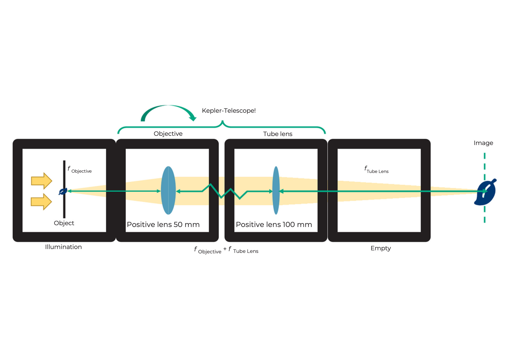

ضع العينة مع العدسة على الورقة كوحدة واحدة. ضع عدسة الأنبوب على بُعد 100 مم من شاشتك (ورقة، حائط). قم بتغيير المسافة بين العدسات - هل تتغير الصورة؟

 

## ماذا تعني "البصريات اللانهائية"؟

المجهر هو جهاز يتيح رؤية الأجسام أو تصويرها بتكبير عالٍ.

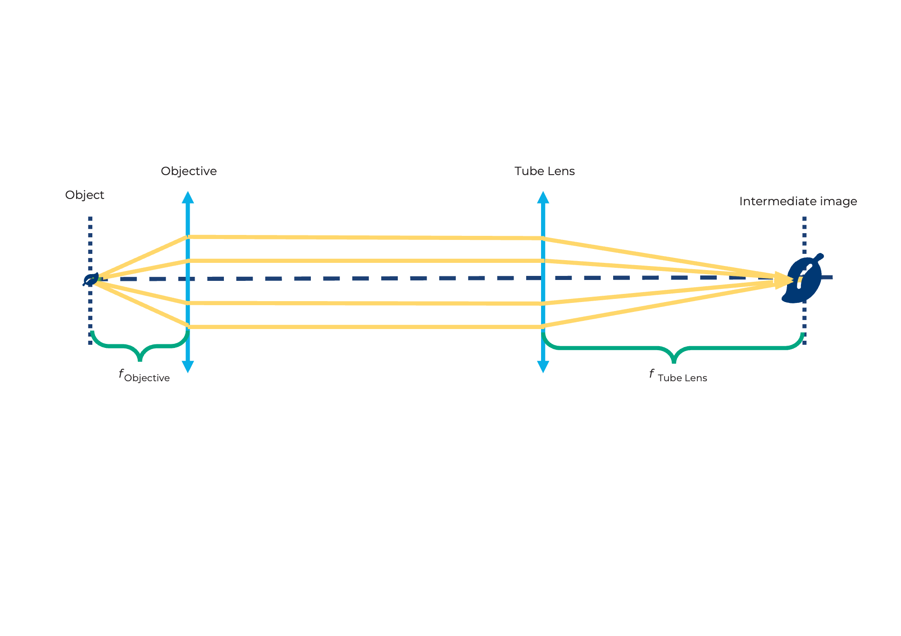

يمكن استخدام عدسات تلسكوب كبلر أيضًا في المجهر ولكن بترتيب مختلف.

 

## دليل عملي: المجهر الضوئي بالبصريات اللانهائية

### المواد المطلوبة:

- تلسكوب كبلر
- مصباح يدوي
- حامل عينة (داخل مكعب) مع عينة

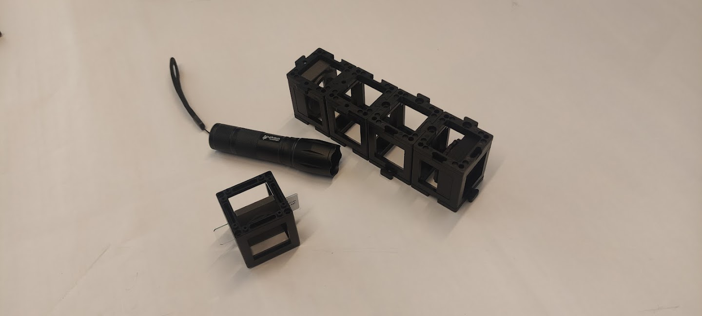

### التعليمات:

**الخطوة 1: أضف العينة**

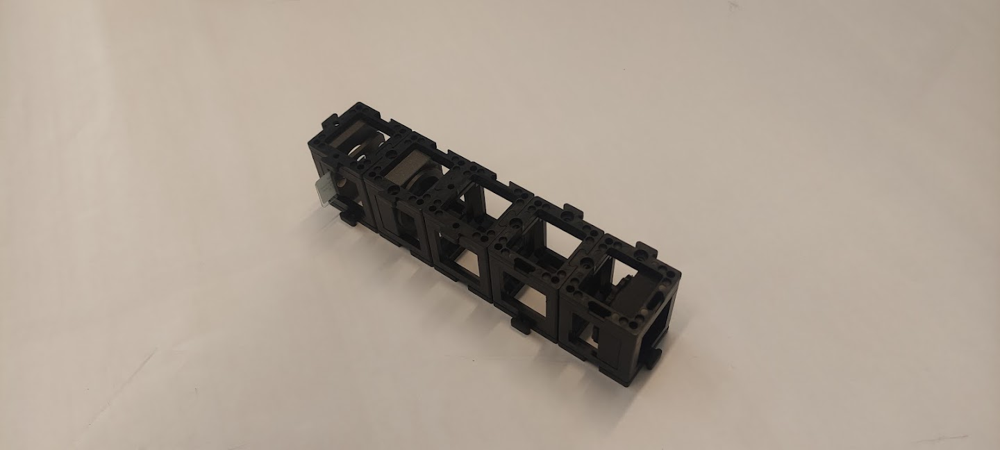

**الخطوة 2: ثبّت المكعبات بالقواعد**

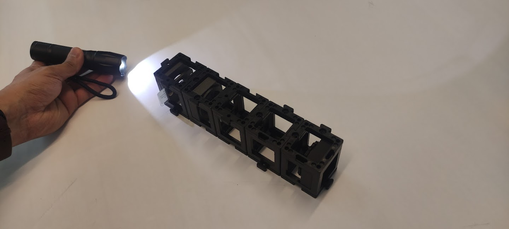
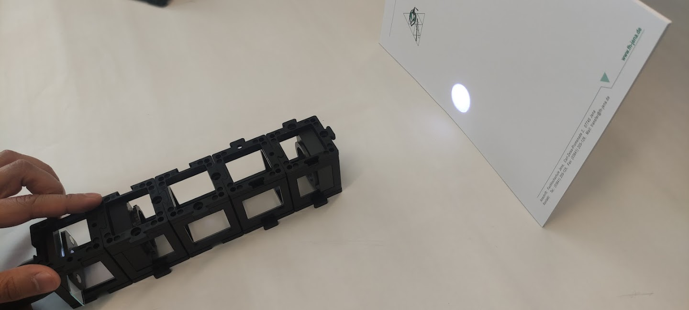

**الخطوة 3: ضبط المسافة**

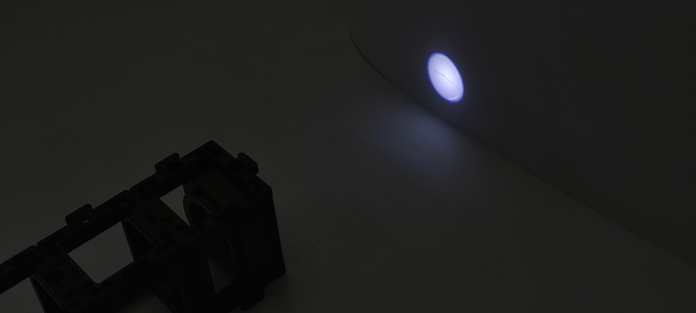

## المجهر بالبصريات اللانهائية مع العدسة العينية

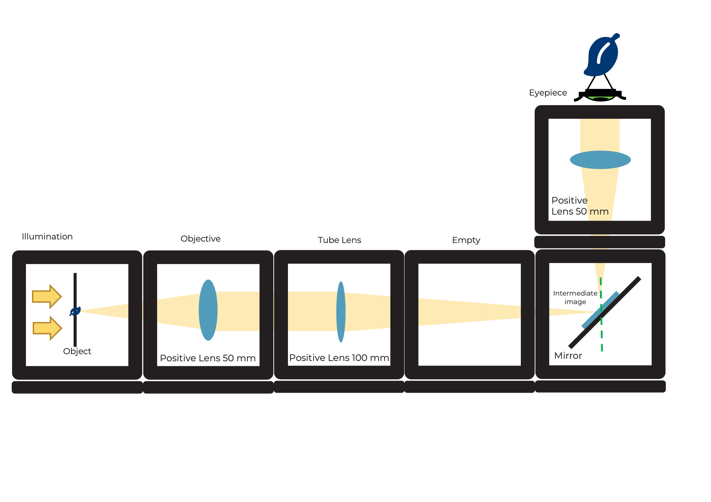

هل يمكنك رؤية الصورة المجهرية عبر العدسة العينية بعينيك؟ ما هو تأثير المرآة؟

 

## لماذا تُستخدم العدسة العينية؟

تُجهز المجاهر الحديثة بما يُسمى "البصريات اللانهائية" حيث لا تُنتج العدسة صورة وسيطة حقيقية، بل تخرج الأشعة بشكل متوازٍ.

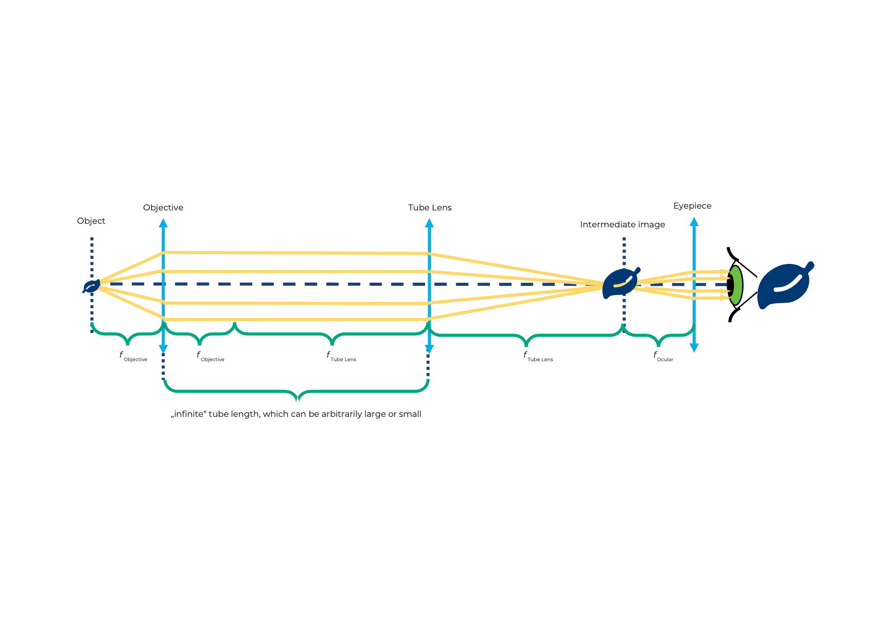

العدسة العينية تقوم فقط بتكبير الصورة الوسيطة.

 

## دليل عملي: المجهر بالبصريات اللانهائية والعدسة العينية

### المواد المطلوبة:

- تلسكوب كبلر
- مصباح يدوي
- ثماني قواعد
- حامل عينة (داخل مكعب) مع عينة
- مرآة (داخل مكعب)
- مكعب فارغ
- عدسة عينية (داخل مكعب)

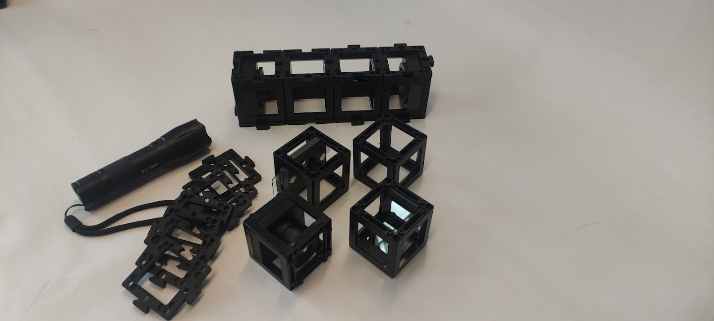

### التعليمات:

**الخطوة 1: إضافة مكعب حامل العينة**

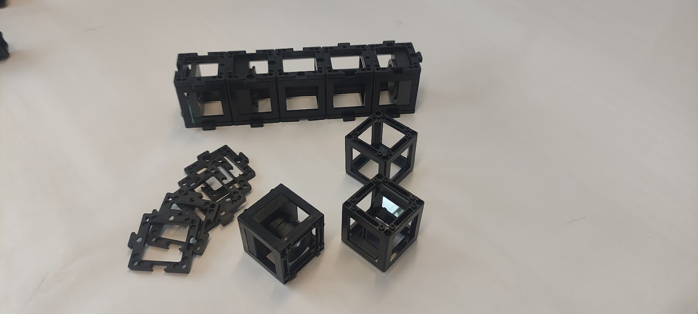

**الخطوة 2: وضع المكعبات الأخرى**

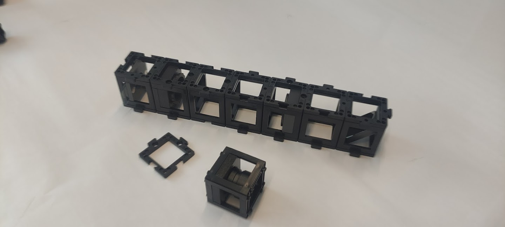

**الخطوة 3: وضع العدسة العينية**

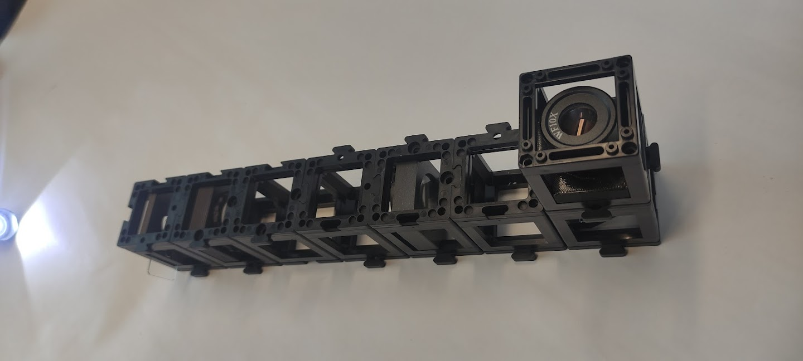

**الخطوة 3: ضع العدسة العينية**

ضع العدسة العينية فوق مكعب المرآة بالتوجيه الصحيح. قم بإضاءة العينة من مسافة مناسبة.

**الخطوة 5: اضبط للحصول على صورة واضحة**

انظر من خلال العدسة العينية. اضبط المسافة بين العدسات حتى ترى صورة واضحة. ملاحظة: إذا لم تتمكن من رؤية العينة، حاول ضبط موضع الشريحة بعناية حتى تظهر.

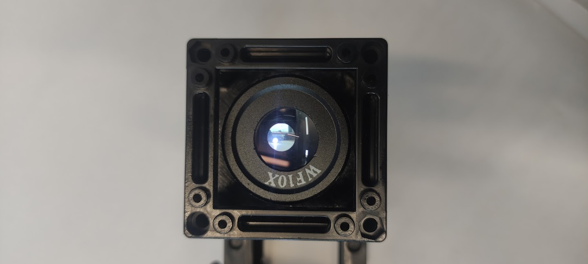  
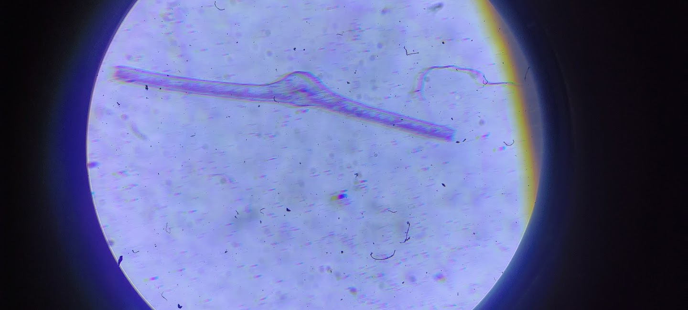

## مجهر ضوئي بـ "عدسات نهائية"

ضع المكعبات في الأماكن الموضحة في المخطط أدناه وانظر من خلال العدسة العينية.

قم ببناء المجهر مثل الساندويتش عن طريق إضافة طبقة ثانية باستخدام لوحة قاعدة. انظر من خلال العدسة العينية من الأعلى.

 

هل ترى الصورة من خلال العدسة العينية كما في السابق؟ هل يمكنك العثور على الصورة الحقيقية الوسيطة باستخدام ورقة؟

 

قم بتدوير الترس الصغير على حامل العدسة. هكذا يمكنك تحريك العدسة أو ضبطها. إذا لم تتمكن من التحريك أكثر، يمكنك أيضًا تحريك العدسة داخل الحامل.

 

## شرح بالفيديو: المجهر الضوئي بعدسات نهائية وعدسة عينية

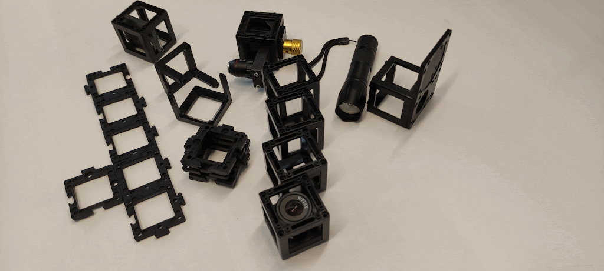

### المواد المطلوبة:

- عدسة ميكروسكوب (4x) مع حامل تروس (مرحلة خطية)  
- مصباح يدوي مع قاعدة مصباح  
- اثنتا عشرة لوحة قاعدة  
- حامل العينة (داخل مكعب) مع العينة  
- مرآة (داخل مكعب)  
- ثلاثة مكعبات فارغة  
- عدسة عينية (داخل مكعب)

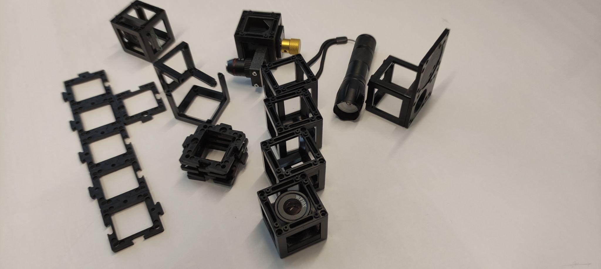

### المخطط (من الجانب):

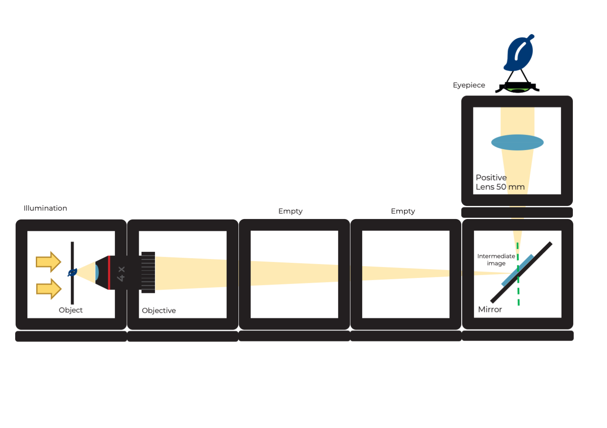

## تعليمات تجميع المجهر الضوئي بعدسات نهائية:

**الخطوة 1: وصل لوحات القاعدة**

قم بوصل لوحات القاعدة كما هو موضح.

**الخطوة 2: ضع العينة**

ضع العينة على اللوحة الموجودة في أقصى اليسار.

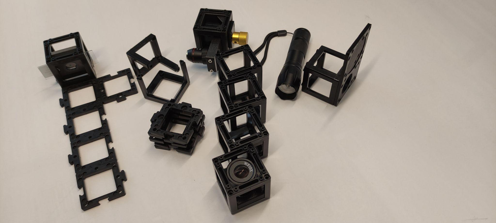

**الخطوة 3: بناء ووضع المكعبات**

قم ببناء مكعب يحتوي على العدسة الميكروسكوبية وضع كلاً من مكعب العدسة ومكعب الترس في أول لوحتين من القاعدة. أضف جميع الصور الإضافية كما هو موضح.

**الخطوة الفرعية 1:**  
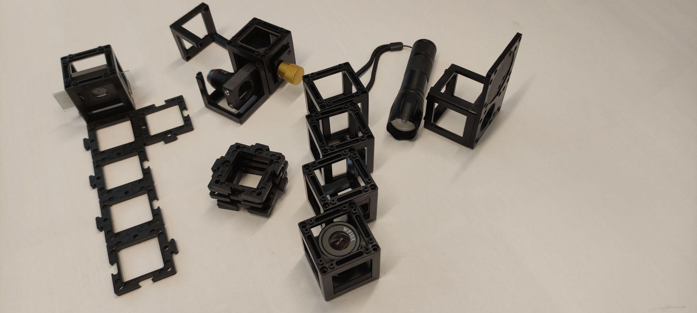

**الخطوة الفرعية 2:**  
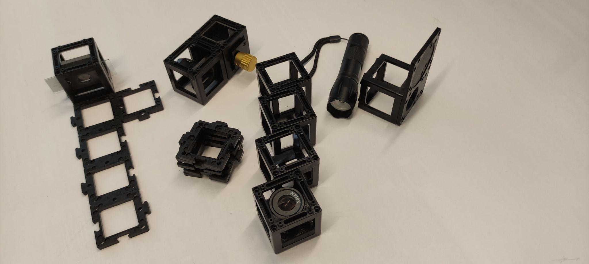

**الخطوة الفرعية 3:**  
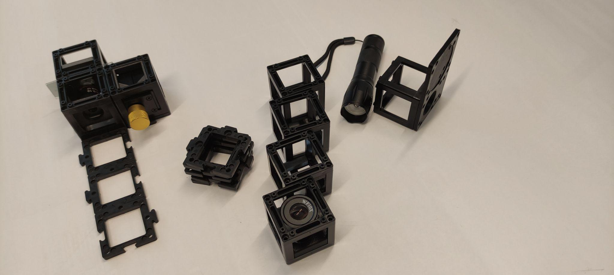

**الخطوة 4: عكس الضوء**

ضع مكعبين فارغين ومكعب المرآة في اللوحة الأخيرة بحيث يعكس الضوء الصادر من العينة إلى الأعلى.

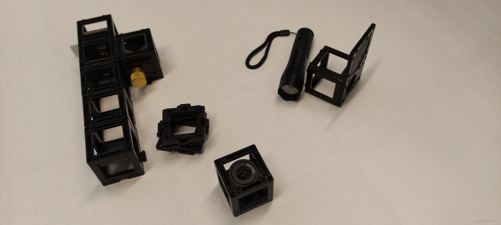

**الخطوة 5: تثبيت المكعبات**

ضع لوحات القاعدة فوق المكعبات لتثبيتها بإحكام.

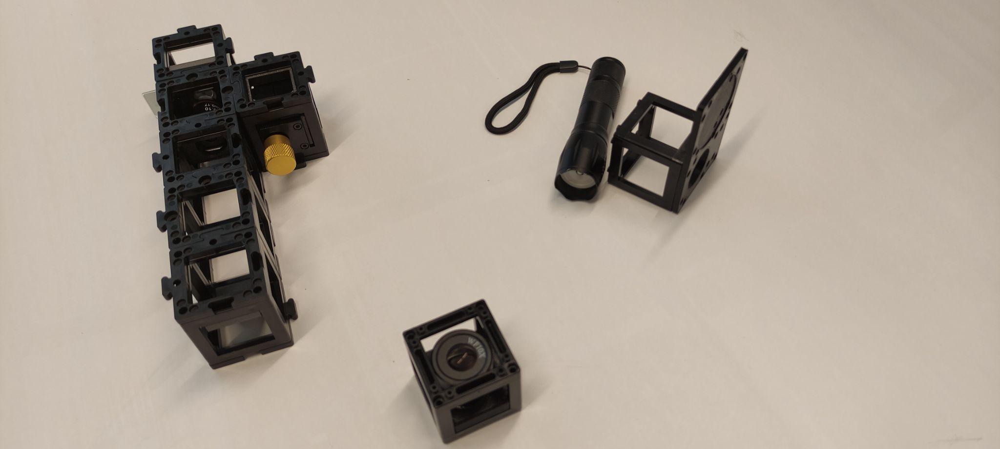

**الخطوة 6: تركيب العدسة العينية**

ضع العدسة العينية فوق مكعب المرآة. تأكد من التوجيه الصحيح للعدسة العينية.

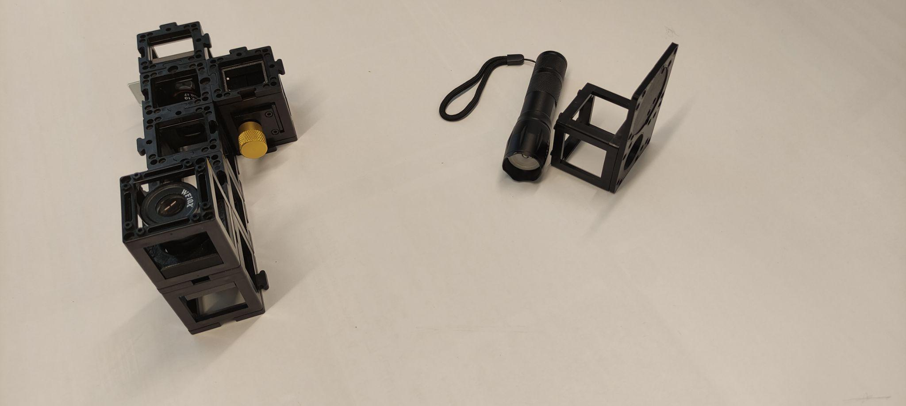

**الخطوة 7: إضاءة العينة**

ثبت المصباح على قاعدة وقم بإضاءة العينة من مسافة مناسبة. انظر من خلال العدسة العينية واضبط المسافة باستخدام الترس حتى ترى صورة مركزة للعينة.

## "البصريات المحدودة" مقابل "البصريات اللانهائية"

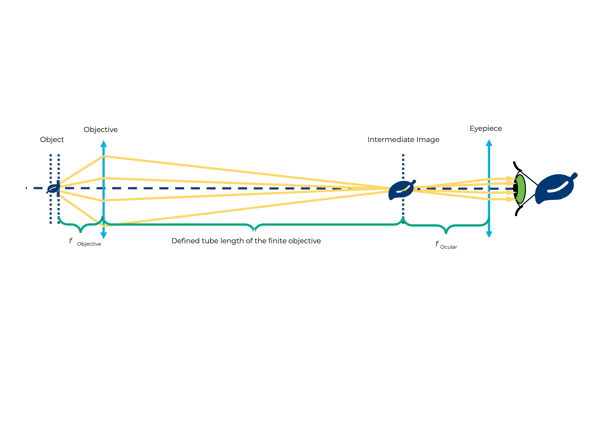

عادةً ما تكون عدسات المجاهر القديمة أو الأصغر حجمًا عدسات تُعرف باسم العدسات المحدودة. تتصرف كعدسة ذات طول بؤري قصير جدًا وتُنتج صورة وسيطة خلف العدسة على مسافة تُحدد بطول الأنبوب. هذا الطول مطبوع على العدسة ويبلغ 160 مم في عدستنا. هناك تتكون صورة وسيطة حقيقية يتم تكبيرها لاحقًا بواسطة العدسة العينية.

يمكن للمجاهر تركيز الجسم إما عن طريق تحريك الجسم أو العدسة. هنا نحرك العدسة باستخدام آلية بسيطة. يتم تحويل دوران الترس إلى حركة للعدسة. وللتحريك على مسافة أكبر، يمكنك أيضًا تحريك العدسة على السكة.

 

## "البصريات المحدودة" مقابل "البصريات اللانهائية"

ما هو تكبير الصورة الوسيطة؟ وما هو التكبير بعد العدسة العينية؟

**تكبير العدسة الشيئية**

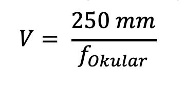  
كما هو مطبوع

**تكبير العدسة العينية**  
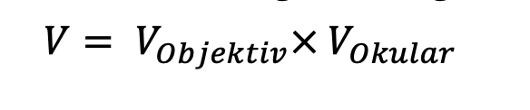

**التكبير الكلي**  
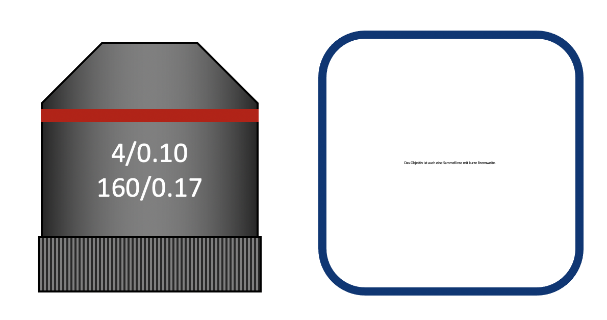

الصورة أكبر من تلك التي نحصل عليها باستخدام مجهر بصريات لانهائية. تكبير العدسة الشيئية هنا هو 4×. إذا كنت قد حسبت التكبير مع المجهر السابق، فلن تفاجأ بذلك.

 

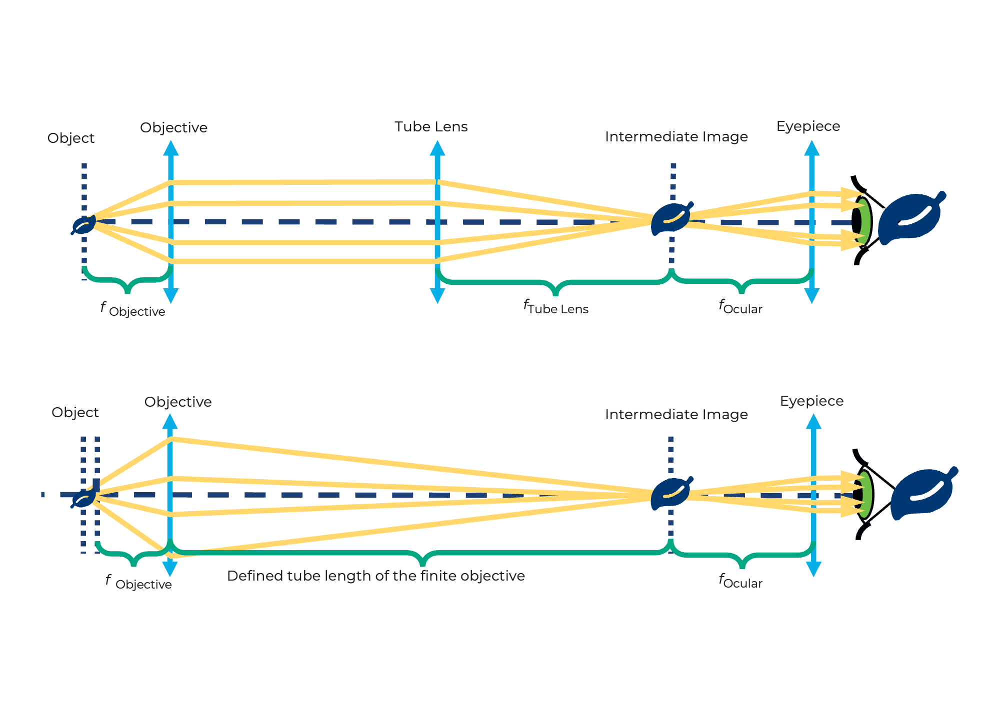

يتم الآن إنشاء الصورة الوسيطة فقط بواسطة العدسة وتقع على بعد 160 مم خلفها. سنكتشف لماذا في الخطوة التالية.

 

## العدسة الشيئية والعدسة العينية

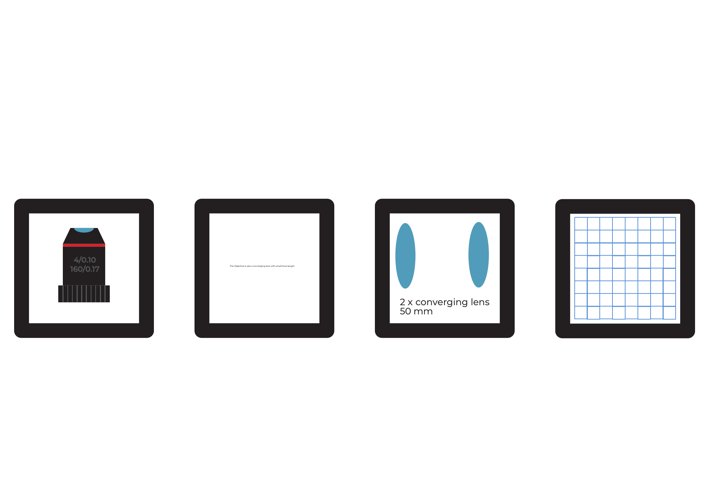

 

## هذه هي العدسة

العدسة هي نظام بصري يُنشئ صورة مكبرة لجسم ما. الأرقام المختلفة المطبوعة على العدسة لها معانٍ مختلفة:

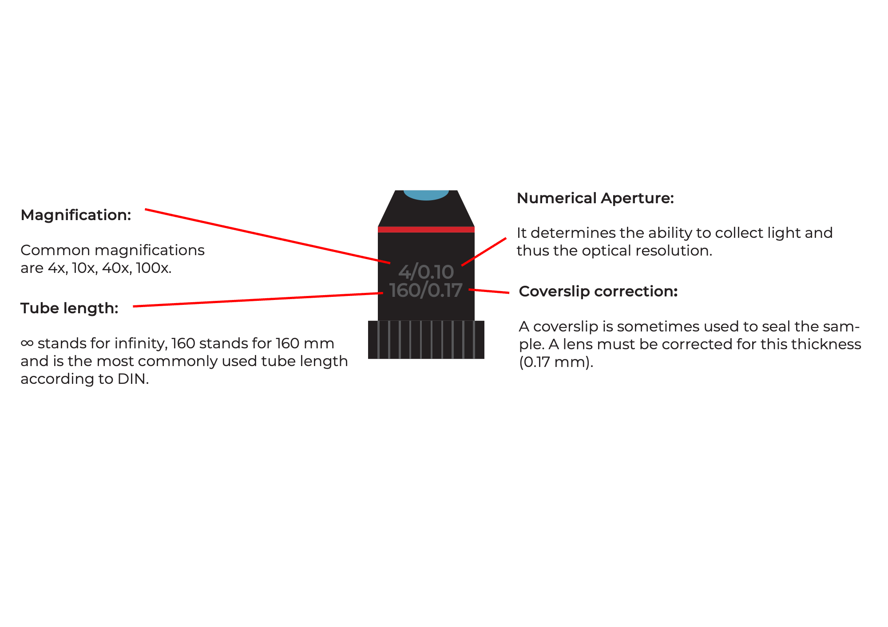

العدسة ذات التكبير 4× تحتوي على عدسة واحدة فقط بداخلها. أما العدسات ذات التكبير الأعلى، فهي أنظمة كاملة من العدسات.

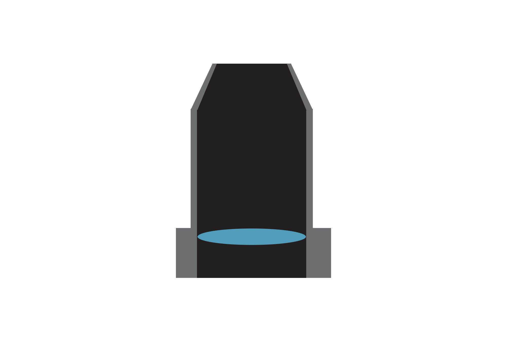

العدسة هي أيضًا عدسة مُجمّعة ذات طول بؤري قصير. العدسة 4× لها طول بؤري f = 32 مم. عند استخدامها كعدسة مكبرة، فإنها تعطي تكبيرًا أكبر من عدسة 40 مم. مجال الرؤية واضح ولكنه صغير.

 

## العدسة العينية

العدسة العينية هي في الواقع عدسة مكبرة لأنها تقوم بتكبير الصورة الوسيطة. العدسة العينية التي نستخدمها هنا هي من نوع رامسدن.  
يمكن أيضًا استخدام عدسة واحدة كعدسة عينية. ولكن مع عدسة رامسدن، التي تتكون من نظام عدستين، يكون مجال الرؤية أفضل لأنها تقلل من الأخطاء عند الحواف. تتكون عدسة رامسدن من عدستين لهما نفس الطول البؤري. الطول البؤري لعدسة رامسدن هو f = 3/4 f من العدسة الشيئية.

**ما هو تكبير عدسة رامسدن؟**

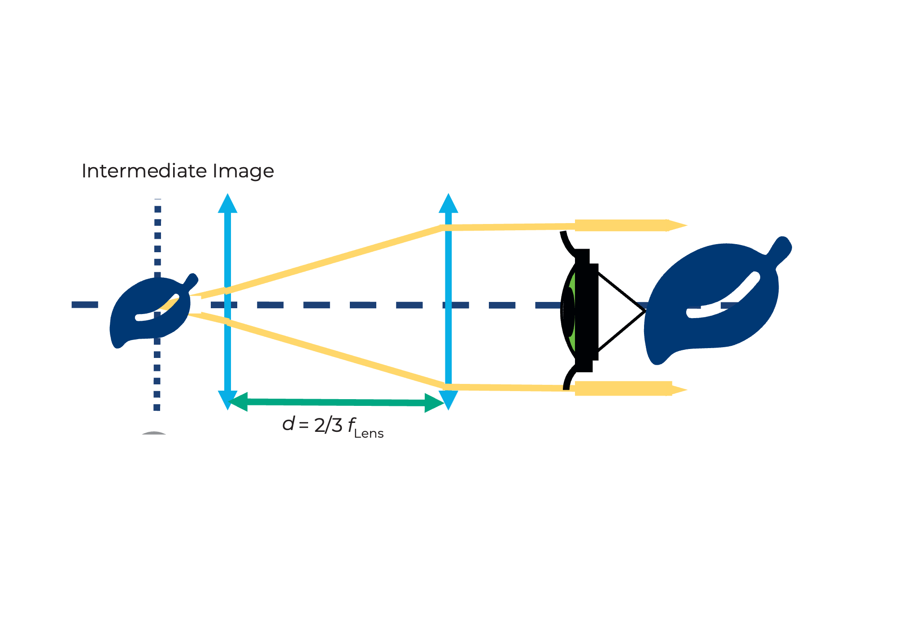

لكل عدسة عينية ما يُعرف بقرص رامسدن، وهو أصغر قطر لحزمة الضوء الخارجة من المجهر عبر العدسة العينية.

 

مجال الرؤية أكبر وتكون الصورة أوضح عند استخدام عدسة رامسدن.  
لكل عدسة عينية ما يُعرف بقرص رامسدن، وهو أصغر قطر لحزمة الضوء الخارجة.

 

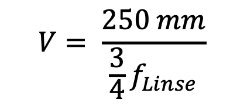
