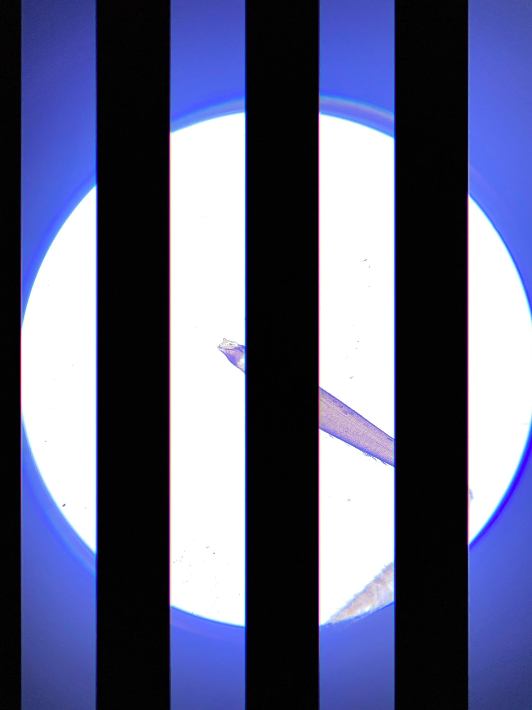
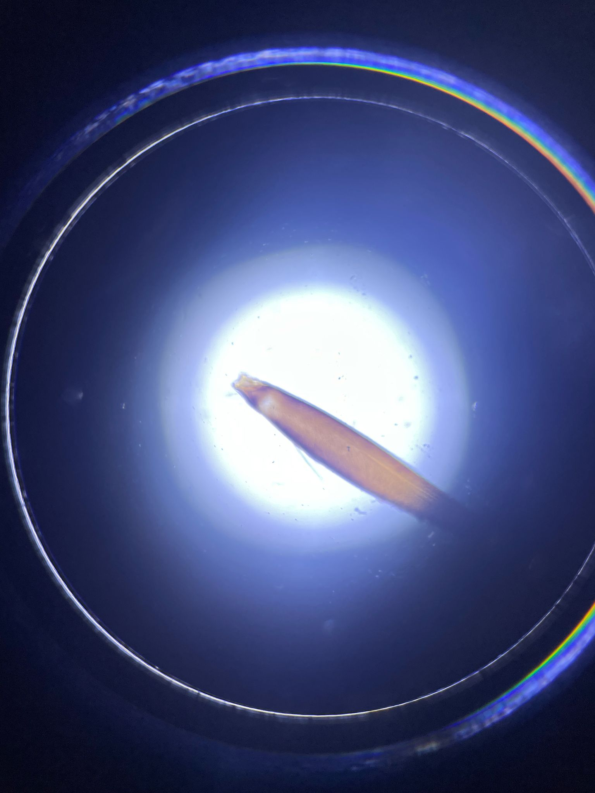
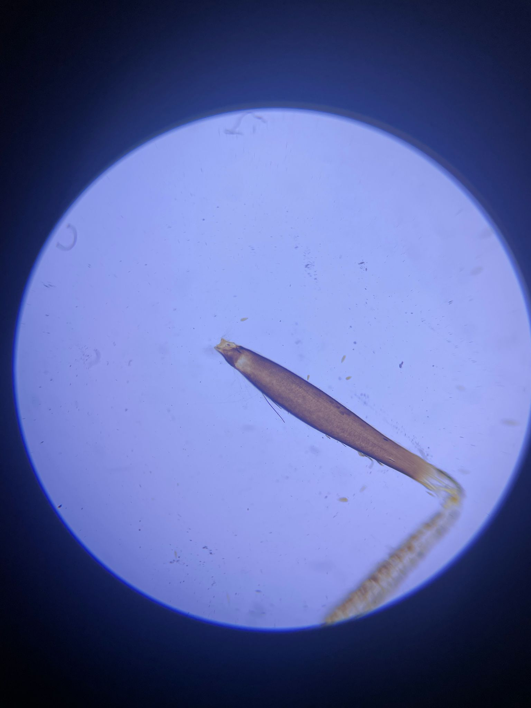

## استكشاف الأخطاء وإصلاحها وتحسين المجهر الذكي للهاتف

قد يحدث أن تكون نتائج التصوير ليست بالجودة المتوقعة. لهذا السبب، نقدم سلسلة من التوضيحات لتصحيح ذلك.  
بشكل عام، مع المكونات المحدّثة، يجب أن يبدو الإعداد كما يلي:

## حالة التصوير المثالية

## وضع المصباح اليدوي غير الصحيح

  
  
- يحتوي المصباح على ميزة غريبة لإرسال شيفرة مورس – هذا غير مفيد. اضغط الزر عدة مرات للعثور على أقوى إضاءة بين الأوضاع المختلفة.
- الخطوط التي تراها ناتجة عن تفاعل تعديل شدة الإضاءة بـ PWM مع مصراع الكاميرا المتدرج (Rolling Shutter).

## تركيز المصباح اليدوي شديد

- يمكن ضبط عدسة المصباح الأمامية – حرّكها للحصول على إضاءة متجانسة أكثر أو أقل للعينة. هذا يحقق شرط كولر (Köhler) عندما تكون الـ LED في بؤرة المكثف المتحرك.

## المصباح اليدوي ساطع جدًا

  
- استخدم مشتتًا للضوء أو بطاريات قديمة.

## المسافة بين الهاتف وعدسة العين كبيرة جدًا

  
  
- تأكد من أن المسافة بين الهاتف وعدسة العين مناسبة.
- يجب أن تتطابق بؤرة الخروج من العدسة مع بؤرة الدخول للكاميرا.

## زاوية مائلة بين المصباح والعينة (أشبه بالإضاءة المائلة أو المجال المظلم)

  
  
- عند تحريك مصدر الضوء، سترى تأثيرات مثل الظلال أو البروزات. هذا بسبب وظيفة النقل البصري الموجي (WOTF).

## تصوير جيد باستخدام مشتت بين المصباح والعينة

  
- الإضاءة غير المتماسكة تقلل التباين لكنها تعطي إضاءة متجانسة ولطيفة.

## تعريض زائد لكن جودة الصورة جيدة (إضاءة كولر)

## إضاءة مائلة (مجال مظلم)

  
- إضاءة مائلة جدًا – لا يصل الضوء المباشر إلى مستشعر الكاميرا.
