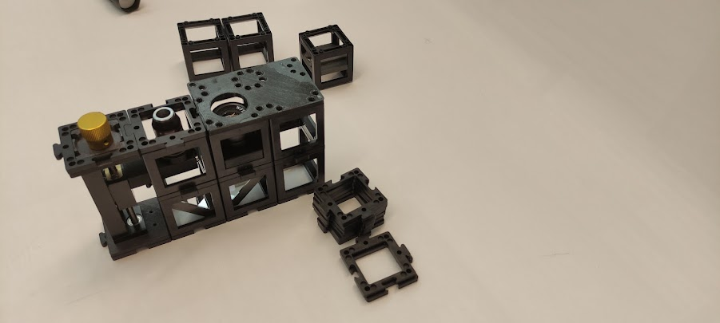

# Smartphone microscope

Build the smartphone microscope as shown. Use any two cubes here to safely place the smartphone.

 

Build the microscope like a sandwich by adding a second layer using a base plate. Look through the eyepiece from above.

 

Replace the Ramsden eyepiece with the 40mm lens. What is better for the eye and what for the smartphone?

 

## Tutorial: Smartphone Microscope

### Materials needed:

- Microscope objective 4x
- Microscope objective long mount with gear
- Ramsden-Eyepiece (in cube)
- Two non-kinematic mirrors (in cubes)
- Sample holder (in cube)
- Three empty cubes
- 11 base plates
- Smartphone base plate
- Torch lamp
- 50 mm lens (in cube)

### Diagram (Side view):

## Instructions for assembling the Smartphone Microscope:

This video shows you how to build the UC2 smartphone microscope as also indicated in the PDF manual. It shows some tricks how to make it more stable and how to operate the Z-stage

<iframe width="560" height="315" src="https://www.youtube.com/embed/q3-XW8Bfuww" title="YouTube video player" frameborder="0" allow="accelerometer; autoplay; clipboard-write; encrypted-media; gyroscope; picture-in-picture; web-share" allowfullscreen></iframe>

**Step 1: Build a four-base plate line**

**Step 2: Assemble the components**

Place the Microscope objective mount on one extreme followed by the two mirrors facing each other and one empty cube in the other extreme. Fix them with base plates.

**Step 3: Adjust the objective**

Build one cube with the microscope objective inside. Adjust the objective's height if necessary by using the gear.

**Step 4: Place the eyepiece**

Place the eyepiece next to the microscope objective and one empty cube next to it. Mind the right orientation of the eyepiece.

**Step 5: Align the smartphone base**

Place the smartphone base with the hole aligned with the eyepiece. Note: You can adjust the orientation of the smartphone base to adapt your smartphone's size.

**Step 6: Set up the sample holder**

Place the sample holder cube on top of the microscope objective. Mind the distance between them. You can adjust the coarse distance by sliding the sample holder inside the cube and the finer distance by using the gear.

**Step 7: Add the converging lens and lamp**

Place a converging lens cube on top of the sample holder cube and place the torch lamp on top. Place the smartphone aligned to the eyepiece.

**Step 8: Adjust for clarity**

Try to move the smartphone such that the whole eyepiece circle appears illuminated. Then, turn the gear to focus and get a sharp image of the specimen.

## Better with smartphone or eye?

The smartphone camera has a lens with a very short focal length because it has to fit into the thin smartphone. The lens then creates an image on the camera sensor whose properties are similar to those of the human eye.

The eye can see objects from both a distance and near. This property is called accommodation.

The smartphone camera can also do this, but it is called autofocus. It describes the ability to sharply image objects at different distances on the sensor.

The image from the eyepiece comes in parallel rays, as if coming from infinity. You observed with a relaxed eye (looking into the distance) or with a camera focused at infinity.

 

## Calculation results

