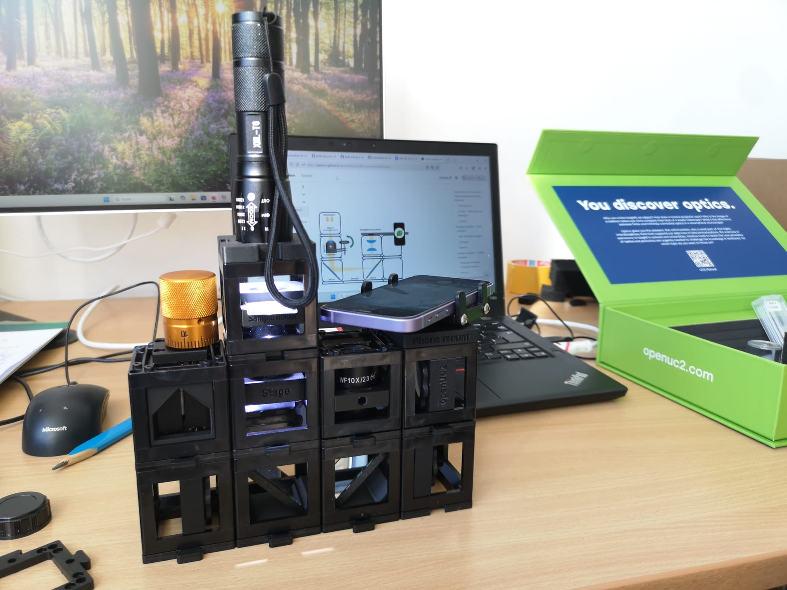
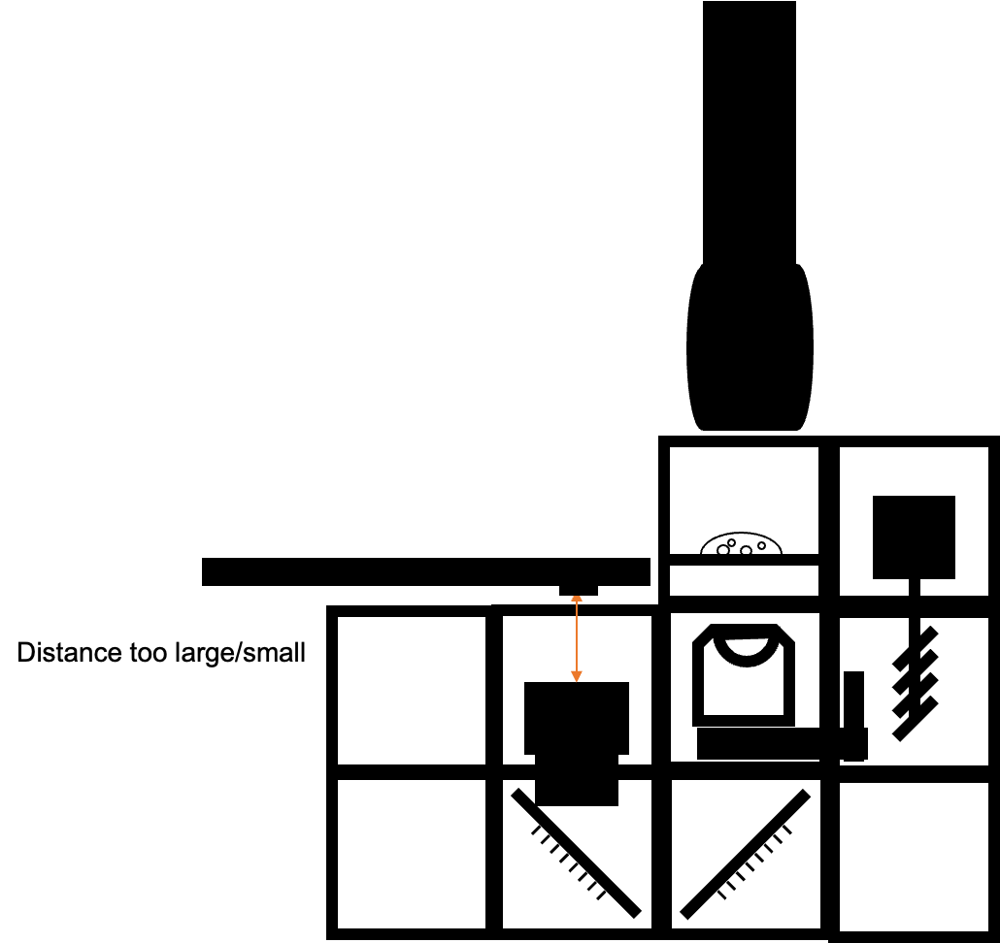

## Dépannage et amélioration du microscope pour smartphone

Il peut arriver que le résultat de l’imagerie ne soit pas aussi bon qu’il pourrait l’être. Pour cela, nous proposons une série d’explications pour y remédier.  
Dans l’ensemble, avec les composants mis à jour, l’installation devrait ressembler à ceci :

## Condition d’imagerie parfaite

## Mauvais mode de la lampe de poche

  
  
- La lampe de poche dispose d’une fonction étrange pour faire du morse – ce n’est pas utile. Appuie plusieurs fois sur le bouton pour trouver la lumière la plus brillante parmi tous les modes.
- Les bandes visibles sont dues à l’interaction entre la modulation PWM de l’intensité lumineuse et l’obturateur roulant de la caméra.

## Lampe de poche trop focalisée

- La lentille frontale de la lampe de poche est ajustable – bouge-la pour obtenir un éclairage plus ou moins homogène de l’échantillon. C’est la condition de Köhler lorsque la LED est au foyer du condenseur que tu déplaces.

## Lampe de poche trop lumineuse

  
- Utilise un diffuseur ou des piles usées.

## Distance trop grande entre le smartphone et l’oculaire

  
  
- Assure-toi que la distance entre le téléphone et l’oculaire est correcte.
- La pupille de sortie de l’oculaire doit correspondre à la pupille d’entrée du téléphone.

## Angle oblique entre la lampe et l’échantillon (type champ sombre)

  
  
- En bougeant la source lumineuse, on observe des effets comme des ombres ou des reliefs. Cela est dû à la WOTF (Wave-Optical Transfer Function).

## Imagerie correcte avec diffuseur entre la lampe et l’échantillon

  
- Une lumière incohérente réduit le contraste mais offre un éclairage homogène agréable.

## Surexposé mais bonne imagerie (éclairage Köhler)

## Éclairage oblique (champ sombre)

  
- Éclairage très oblique – aucune lumière directe n’atteint le capteur de la caméra.
