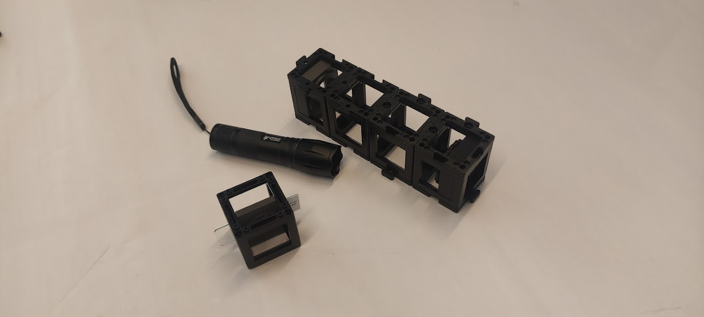
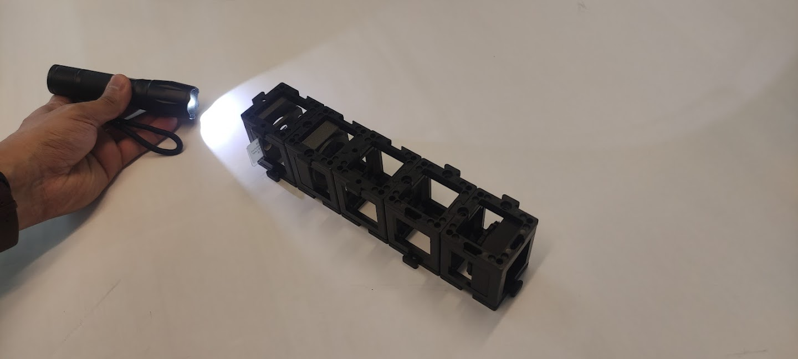
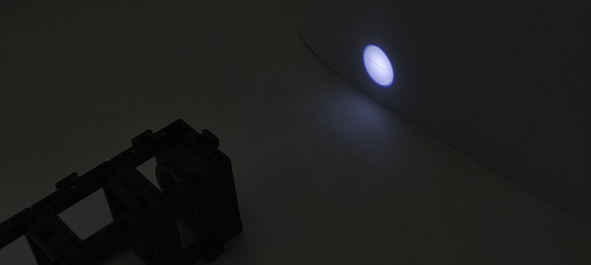
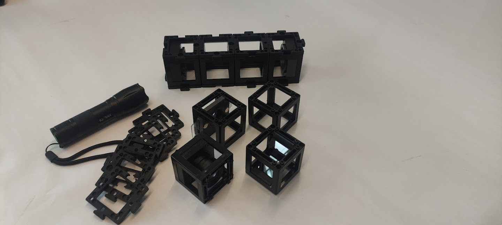
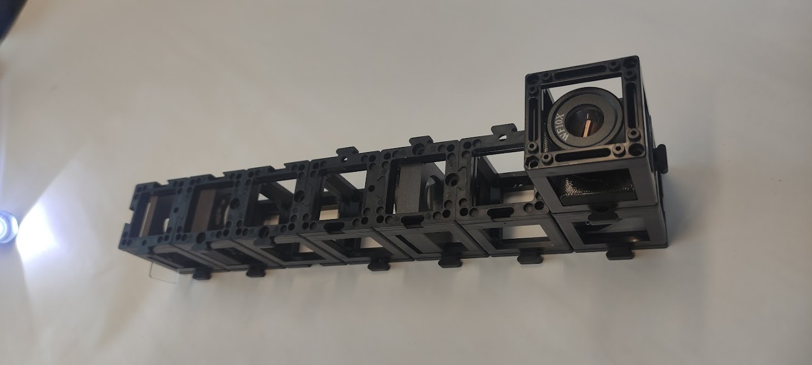

## Lichtmikroskop mit "Unendlichkeitsoptik"

Was passiert, wenn du das Kepler-Teleskop umdrehst?

 

Platziere das Objekt etwa 40 mm vor der Linse und finde das Bild etwa 100 mm hinter der Tubuslinse (verwende ein Papier oder die Wand als Schirm) wie im Diagramm gezeigt. Bewege die Linsen, um ein scharfes Bild zu erhalten.

Platziere das Objekt zusammen mit der Linse auf dem Papier als eine Einheit. Setze die Tubuslinse in einem Abstand von 100 mm zu deinem Schirm (Papier, Wand). Ändere den Abstand zwischen den Linsen - ändert sich das Bild?

 

## Das bedeutet "Unendlichkeitsoptik"

Ein Mikroskop ist ein Gerät, das Objekte mit hoher Vergrößerung betrachtet oder abbildet.

Das Bild wird als **Zwischenbild** bezeichnet, weil es oft noch weiter mit einem Okular vergrößert wird.

Das Objekt befindet sich ungefähr in der objektseitigen Brennebene der Linse. Dadurch werden alle einfallenden Strahlen hinter der Linse in ein paralleles Strahlenbündel umgewandelt. Die Linse hat eine kurze Brennweite.

Die Tubuslinse erzeugt ein reales Bild, indem sie die parallelen Strahlen sammelt, die die Tubuslinse in ihrer Brennebene treffen. Wenn wir sie hinter der Linse platzieren, wird das Objekt aus der Brennebene der Linse abgebildet. Die Tubuslinse hat eine längere Brennweite als das Objektiv.

Das Bild in der Ebene des Zwischenbildes ist umgekehrt, gespiegelt, vergrößert und real. Das reale Bild kann auf einem Schirm gesehen werden.

 

## Das bedeutet "Unendlichkeitsoptik"

Wie groß ist die Vergrößerung des Bildes?

Vergrößerung des Bildes

Die Linsen des Kepler-Teleskops können auch für ein Mikroskop verwendet werden, jedoch in anderer Reihenfolge.
Solange das Objekt in der Brennebene der Linse und der Schirm in der Brennebene der Tubuslinse ist, spielt der Abstand zwischen Linse und Tubuslinse keine Rolle, da die Lichtstrahlen parallel sind.

 

## Tutorial: Lichtmikroskop mit Unendlichkeitsoptik

### Benötigte Materialien:

- Keplers Teleskop
- Taschenlampe
- Probenhalter (im Würfel) mit Probe

### Diagramm (Seitenansicht):

### Anleitung zum Zusammenbau des Lichtmikroskops mit Unendlichkeitsoptik:

**Schritt 1: Probe hinzufügen**

Füge den Proben-Würfel hinter die 50-mm-Positivlinse hinzu. Vergiss nicht, die Bodenplatten hinzuzufügen.

**Schritt 2: Würfel mit Bodenplatten fixieren**

Verwende die Taschenlampe, um die Probe zu beleuchten. Suche einen Schirm (Notizbuch, Papier), um das Bild darauf zu projizieren.

**Schritt 3: Abstand einstellen**

Schalte das Umgebungslicht aus, um das Bild auf dem Schirm deutlich zu sehen. Justiere den Abstand zwischen Mikroskop und Schirm, bis du ein scharf fokussiertes Bild siehst (siehe Diagramm).

## Mikroskop mit "Unendlichkeitsoptik" und Okular

Kannst du das mikroskopische Bild durch die Okularlinse mit deinen Augen sehen? Welchen Effekt hat der Spiegel? Richte das Mikroskop ohne den Spiegel ein. Stelle sicher, dass du immer noch zwei leere Räume zwischen der Tubuslinse und dem Okular hast. Was beobachtest du dann?

 

Eine kurze Einführung in Spiegel und deren Anwendungen findest du hier:

<iframe width="560" height="315" src="https://www.youtube.com/embed/azxLqej7yqU" title="YouTube video player" frameborder="0" allow="accelerometer; autoplay; clipboard-write; encrypted-media; gyroscope; picture-in-picture" allowfullscreen></iframe>

## Wozu dient das Okular?

Neuere Mikroskope sind mit sogenannten "Unendlichkeitsoptiken" ausgestattet. In diesem Fall erzeugt die Linse kein reales Zwischenbild. Das Licht verlässt die Linse als unendliche parallele Strahlen. Am Ende des "unendlichen" Tubus befindet sich eine Tubuslinse. Diese erzeugt ein Zwischenbild, das dann durch das Okular erneut vergrößert wird.

Das Bild hinter dem Okular ist umgekehrt, umgekehrt, vergrößert und virtuell. Das virtuelle Bild kann mit dem Auge gesehen werden.

Diese Konfiguration ist sehr nützlich in modernen Mikroskopen, da sie das Einfügen zusätzlicher Komponenten wie Filter zwischen Objektiv und Tubuslinse erlaubt, ohne den optischen Weg zu beeinflussen.

Ein Filter kann verwendet werden, um die Helligkeit und Farbe des Bildes zu ändern.

 

## Das Okular ist dafür gut

Wie groß ist die Vergrößerung nach dem Okular?

Gesamtvergrößerung

Ein Okular ist eigentlich nur eine Linse, die das Zwischenbild vergrößert. Es bildet das virtuelle Bild so ab, dass du es mit deinen Augen sehen kannst.

 

Mit dem Spiegel kannst du nicht nur dich selbst sehen, sondern auch das einfallende Licht in jede Richtung reflektieren. So kannst du den optischen Weg falten und die Arbeit komfortabler gestalten. Der Spiegel beeinflusst zwar nicht die Vergrößerung, dreht aber das Bild in eine Richtung.

 

## Tutorial: Lichtmikroskop mit Unendlichkeitsoptik und Okular

### Benötigte Materialien:

- Keplers Teleskop
- Taschenlampe
- Acht Bodenplatten
- Probenhalter (im Würfel) mit Probe
- Spiegel (im Würfel)
- Leerwürfel
- Okular (im Würfel)

### Diagramm (Seitenansicht):

### Anleitung zum Zusammenbau des Lichtmikroskops mit Unendlichkeitsoptik und Okular:

**Schritt 1: Probenhalter-Würfel hinzufügen**

Füge den Probenhalter-Würfel im Keplers Teleskop neben der 50-mm-Sammellinse hinzu.

**Schritt 2: Neben der 100-mm-Linse zusammenbauen**

Montiere neben der 100-mm-Sammellinse einen Leerwürfel und daneben den Spiegelwürfel.

**Schritt 3: Das Okular platzieren**

Platziere das Okular oben auf dem Spiegelwürfel mit der richtigen Orientierung. Beleuchte die Probe aus ein

iger Entfernung.

**Schritt 5: Für ein scharfes Bild justieren**

Schaue durch das Okular. Justiere den Linsenabstand, bis du ein fokussiertes scharfes Bild siehst. Hinweis: Wenn du das Präparat nicht siehst, versuche vorsichtig die Position der Probe zu justieren, bis du das Präparat siehst.

