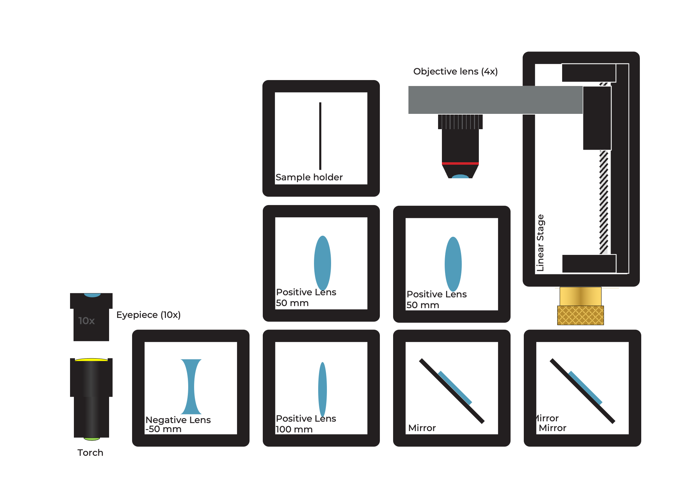
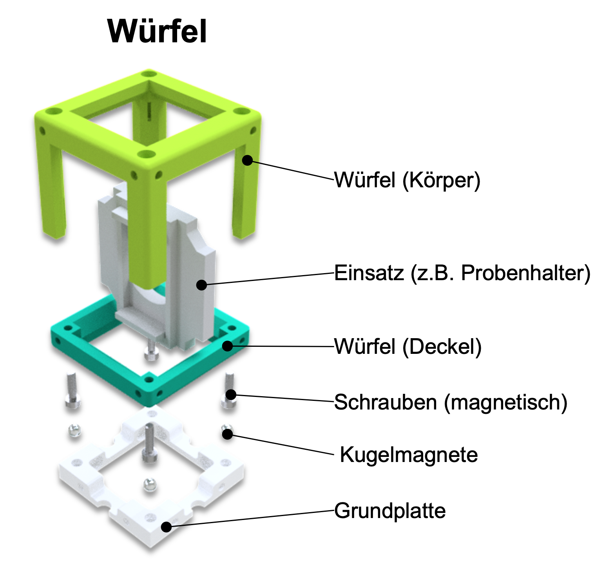
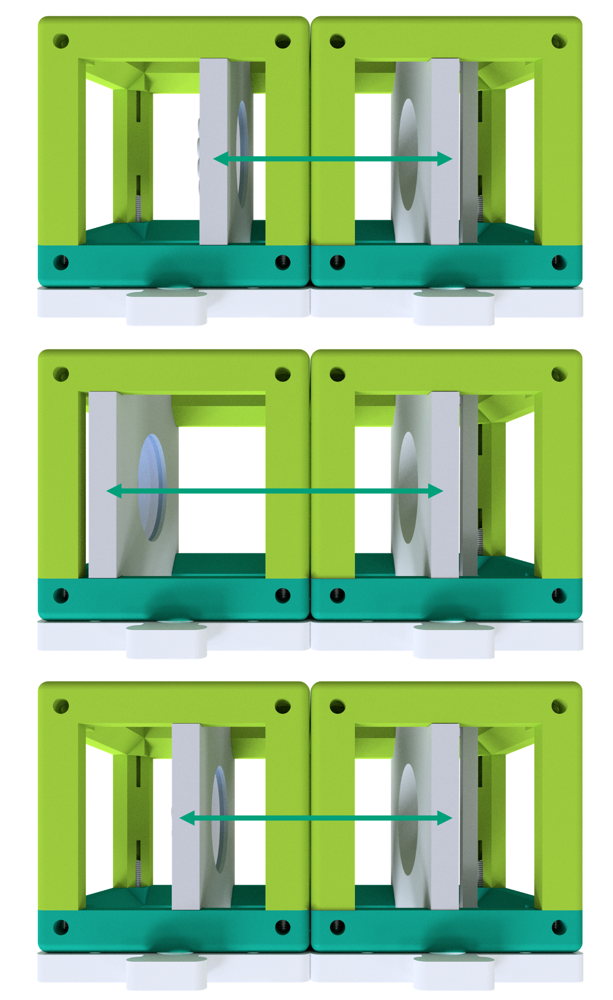

## ¿Qué hay en la MiniBOX?

:::warning
Hemos compilado este documento en un ***PDF*** que se puede descargar <a href="/MINIBOX/Manual_Corebox_EM.pdf" target="_blank" >aquí</a>
:::

**Soporte para muestras:** sostiene un objeto en un cubo  
**Lente:** afecta la forma en que se propaga la luz (cómo se dispersa)  
**Espejo:** refleja la luz  
**Objetivo de microscopio:** un sistema especial de lentes que amplía un objeto

Un recorrido rápido por una caja ejemplar y cómo se ven los cubos (estado octubre de 2022) se puede encontrar aquí:

<iframe width="560" height="315" src="https://www.youtube.com/embed/NZZ6n620eV0" title="YouTube video player" frameborder="0" allow="accelerometer; autoplay; clipboard-write; encrypted-media; gyroscope; picture-in-picture" allowfullscreen></iframe>

## ¿Qué es UC2?

El elemento central del proyecto UC2 es un cubo simple.  
El cubo consta de dos mitades y contiene un inserto deslizante.  
El inserto puede contener varios componentes ópticos (por ejemplo, lentes, espejos), lo que significa que se pueden implementar diferentes funciones con cada cubo.

### Tipo de cubo 1: moldeado por inyección con conexión de encaje

**Placa base**

**Placa base**

El cubo se puede montar en una placa base. Los módulos de la placa base se pueden unir como un rompecabezas.

## UC2 para imprimir tú mismo

El cubo UC2 también se puede imprimir en 3D. Se ve igual que el modelo moldeado por inyección, pero aquí consta de una tapa de cubo y un cuerpo de cubo, que se mantienen unidos con tornillos.  
Los tornillos son ideales para colocarse sobre la placa magnética.  
Combinando diferentes módulos de cubo, se pueden ensamblar fácilmente distintas estructuras ópticas. Se puede añadir una nueva función con cada cubo. Tu creatividad no tiene límites.

### Tipo de cubo 2: impreso en 3D con conexión magnética

**Cubo**

**Placa base con imanes**

En la placa base impresa en 3D hay pequeños imanes esféricos sobre los que se colocan los cubos.

¿Quieres más cubos? Entonces puedes construirlos tú mismo. Puedes encontrar todo [aquí](https://github.com/openUC2/UC2-GIT)

## Así es como encajan los cubos  
Duración: 1

Asegúrate de que los cubos estén colocados correctamente sobre la placa y que no estén inclinados. Al final, es importante que los insertos estén en el lugar correcto.  

Si no ves una imagen nítida, mueve los insertos (por ejemplo, una lente) hasta que la veas claramente. La flecha verde en la imagen te muestra cómo hacerlo.

Aquí puedes encontrar un pequeño video que explica el concepto central del cubo:

<iframe width="560" height="315" src="https://www.youtube.com/embed/Yl0lgNJu_AQ" title="YouTube video player" frameborder="0" allow="accelerometer; autoplay; clipboard-write; encrypted-media; gyroscope; picture-in-picture" allowfullscreen></iframe>

## ¿Qué significan los símbolos?  
Duración: 2

|||
|----|-----|  
|  |**Experimento:** ¡Si ves este bloque, hay algo para experimentar! Puedes colocar un cubo UC2 sobre este bloque. |
| |**Explicaciones:** Si ves este ícono, ¡hay algo que aprender! |
||**Cálculos:** Aquí hay algo que calcular. Toma lápiz y papel y empieza a resolver. |
||**Precaución:** ¡No toques las superficies de vidrio con los dedos! |
||**Limpieza de lentes:** Si ya tocaste la lente, puedes limpiarla con un paño para gafas. |

## ¿Qué puede hacer una lente?  
Duración: 2  

Toma uno o más de los cubos que tienen una lente y observa el símbolo UC2 mostrado aquí. Sostén el cubo en tu mano y cambia la distancia entre la lente y la imagen.

