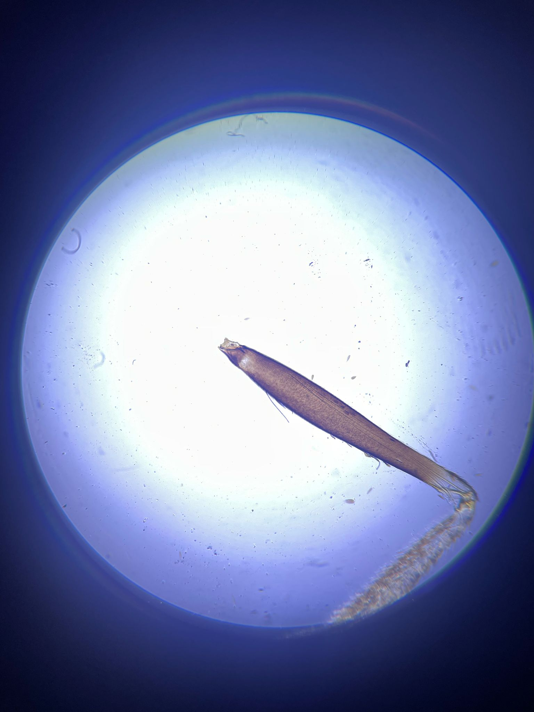

## Solución de problemas y mejora del microscopio con smartphone

Puede ocurrir que el resultado de la imagen no sea tan bueno como podría ser. Para esto proporcionamos una serie de explicaciones para corregirlo.  
En general, con los componentes actualizados, el montaje debería verse algo así:

## Condiciones de imagen perfectas

## Modo incorrecto de la linterna

  

- La linterna tiene una función peculiar para hacer código Morse, lo cual no es útil. Pulsa el botón varias veces hasta obtener la luz más brillante de todos los modos.
- Las franjas que ves se deben a la modulación PWM del brillo y al obturador enrollable de la cámara.

## Linterna demasiado enfocada

- La lente frontal de la linterna se puede enfocar. Muévela hasta obtener una iluminación del espécimen más o menos homogénea. Esta es la condición de Köhler cuando el LED está en el foco del condensador que se mueve.

## Linterna demasiado brillante

- Usa un difusor o baterías más viejas.

## Distancia entre el smartphone y el ocular demasiado grande

- Asegúrate de que la distancia entre el teléfono y el ocular sea la adecuada.
- La pupila de salida del ocular debe coincidir con la pupila de entrada del teléfono.

## Ángulo oblicuo entre la linterna y la muestra (tipo campo oscuro)

- Al mover la fuente de luz, verás efectos como sombras o relieves. Esto se debe a la función de transferencia de la onda (WOTF).

## Imagen aceptable con difusor entre la linterna y la muestra

- La imagen incoherente reduce el contraste pero proporciona una iluminación homogénea agradable.

## Imagen sobreexpuesta pero buena (iluminación de Köhler)

## Iluminación oblicua (campo oscuro)

- Iluminación muy oblicua, ninguna luz directa llega al sensor de la cámara.
