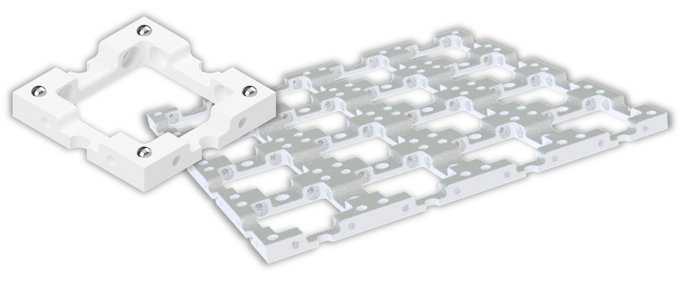

## ماذا يوجد في MiniBOX؟

:::tip
لقد قمنا بتجميع هذا المستند في ***ملف PDF*** يمكن تنزيله <a href="/MINIBOX/Manual_Corebox_EM.pdf" target="_blank" >هنا</a>
:::

**حامل العينة:** يحمل الجسم داخل المكعب\
**العدسة:** تؤثر على طريقة انتشار الضوء\
**المرآة:** تعكس الضوء\
**هدف المجهر:** نظام عدسات خاص يقوم بتكبير الجسم

يمكنك مشاهدة جولة سريعة لصندوق نموذجي وكيف تبدو المكعبات (الحالة في أكتوبر 2022) هنا:

<iframe width="560" height="315" src="https://www.youtube.com/embed/NZZ6n620eV0" title="مشغل فيديو يوتيوب" frameborder="0" allow="accelerometer; autoplay; clipboard-write; encrypted-media; gyroscope; picture-in-picture" allowfullscreen></iframe>

## ما هو UC2؟

العنصر الأساسي في مشروع UC2 هو مكعب بسيط.
يتكون المكعب من نصفين ويحتوي على إدراج متحرك.
يمكن أن يحتوي الإدراج على مكونات بصرية مختلفة (مثل العدسات والمرايا)، مما يعني أنه يمكن تنفيذ وظائف مختلفة مع كل مكعب.

### النوع الأول من المكعبات: مصبوب بالحقن مع توصيلات قابلة للتركيب

**القاعدة**

**القاعدة**

يمكن تركيب المكعب على قاعدة. يمكن تجميع وحدات القاعدة معًا مثل الأحجية.

## طباعة UC2 بنفسك

يمكن أيضًا طباعة مكعب UC2 بتقنية الطباعة ثلاثية الأبعاد. يبدو نفس النموذج المصبوب بالحقن، لكنه هنا يتكون من غطاء مكعب وجسم مكعب يتم تثبيتهما معًا بواسطة براغي. تعتبر البراغي رائعة لتثبيتها على اللوحة المغناطيسية. من خلال الجمع بين وحدات المكعب المختلفة، يمكن تجميع هياكل بصرية مختلفة بسهولة. يمكن إضافة وظيفة جديدة مع كل مكعب. لا حدود لإبداعك!

### النوع الثاني من المكعبات: مطبوع ثلاثي الأبعاد مع توصيل مغناطيسي

**المكعب**

**لوحة القاعدة مع المغناطيسات**

في لوحة القاعدة المطبوعة ثلاثي الأبعاد، توجد مغناطيسات كروية صغيرة يتم وضع المكعبات عليها.

هل تريد المزيد من المكعبات؟ يمكنك بناؤها بنفسك. يمكنك العثور على كل شيء [هنا](https://github.com/openUC2/UC2-GIT)

## كيف تتناسب المكعبات مع بعضها

تأكد من وضع المكعبات بشكل صحيح على اللوحة وعدم إمالتها. في النهاية، من المهم أن تكون الإدخالات في المكان الصحيح.

إذا لم ترَ صورة واضحة، حرك الإدخالات (مثل العدسة) حتى تراها بوضوح. يُظهر لك السهم الأخضر في الصورة كيفية القيام بذلك.

هنا يمكنك العثور على فيديو قصير يشرح المفهوم الأساسي للمكعب:

<iframe width="560" height="315" src="https://www.youtube.com/embed/Yl0lgNJu_AQ" title="مشغل فيديو يوتيوب" frameborder="0" allow="accelerometer; autoplay; clipboard-write; encrypted-media; gyroscope; picture-in-picture" allowfullscreen></iframe>

## ماذا تعني الرموز؟

|||
|----|-----|
||**تجربة:** إذا رأيت هذا الرمز، فهناك شيء يمكنك التجربة به! يمكنك وضع مكعب UC2 على هذا الرمز.|
||**تفسيرات:** إذا رأيت هذا الرمز، فهناك شيء لتتعلمه!|
||**حسابات:** هنا يمكنك إجراء بعض الحسابات. أحضر قلمًا وورقة وابدأ بالتفكير.|
||**تحذير:** لا تلمس الأسطح الزجاجية بأصابعك!|
||**تنظيف العدسات:** إذا قمت بلمس العدسة بالفعل، يمكنك تنظيفها بقطعة قماش للنظارات.|

## ماذا يمكن أن تفعل العدسة؟

خذ واحدًا أو أكثر من المكعبات التي تحتوي على عدسة وانظر إلى رمز UC2 المعروض هنا. أمسك بالمكعب في يدك وقم بتغيير المسافة بين العدسة والصورة.

