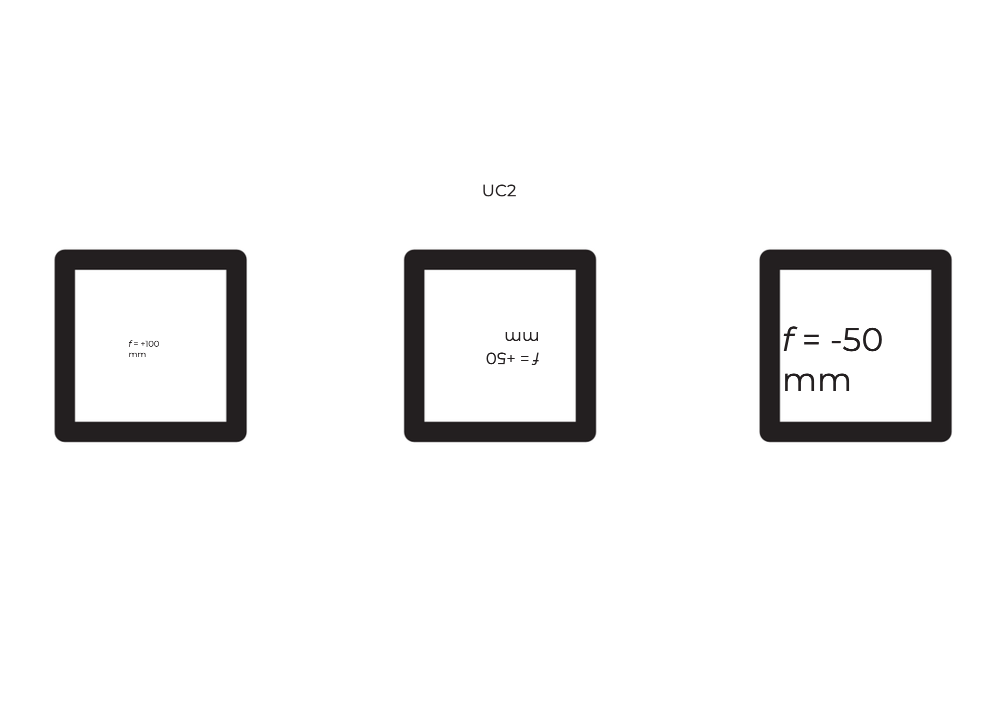
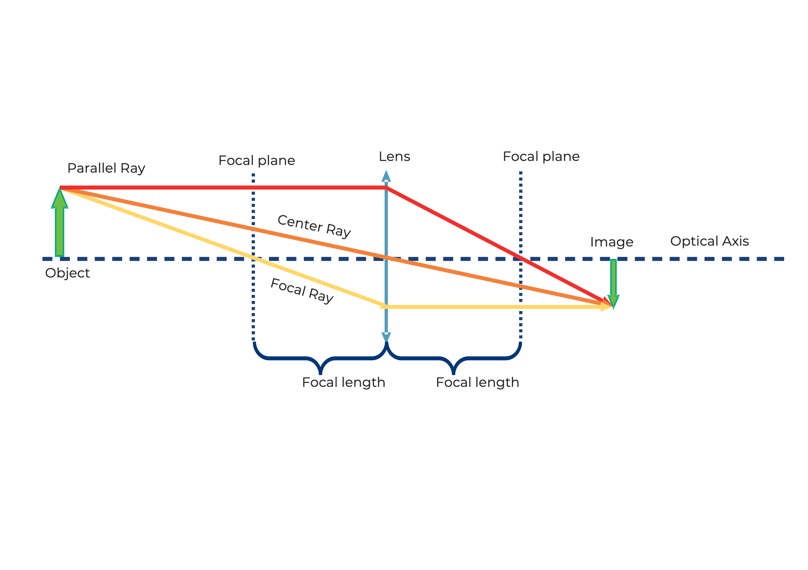
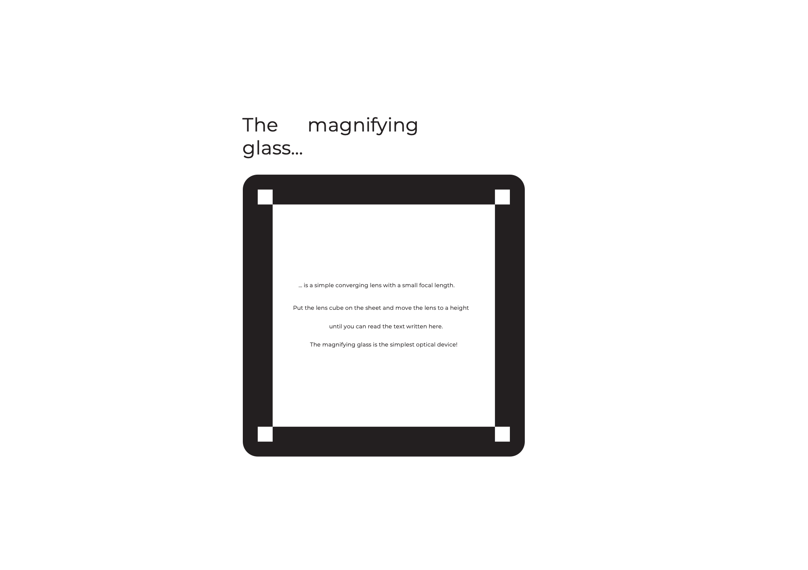
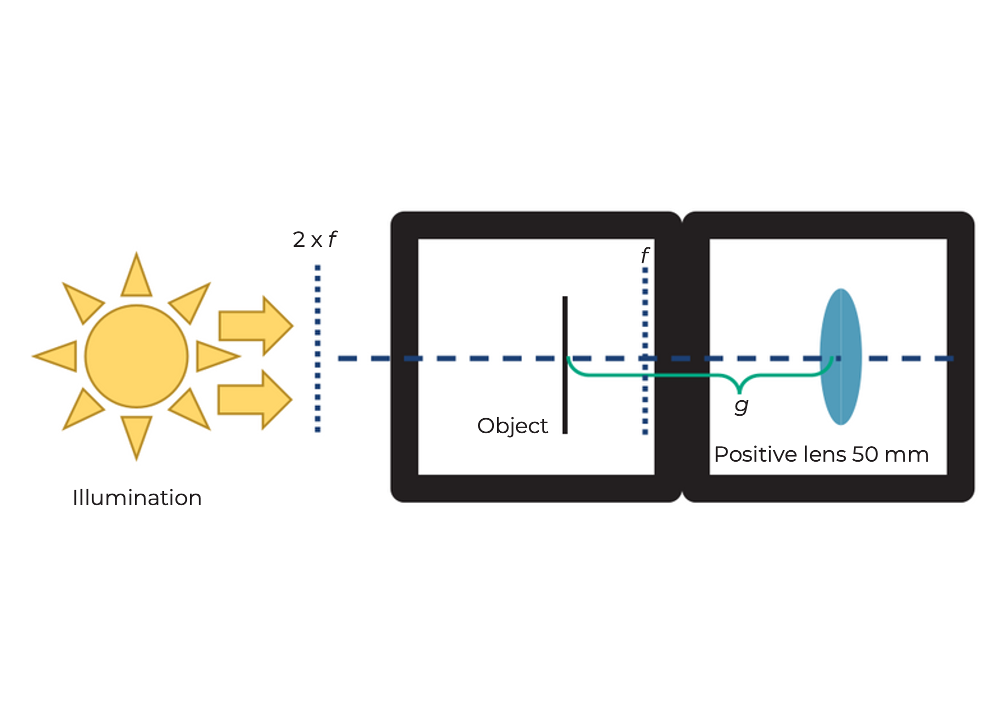

## العدسات

في بصريات الأشعة، يُمثَّل الضوء كمجموعة من الأشعة (الأسهم)، مما يُبسط الخصائص الفيزيائية للضوء. تمتلك الأشعة اتجاهًا ويتم تمثيلها بأسهم. تقوم العدسة "بكسر" الشعاع، مما يغير اتجاهه.

**البُعد البؤري** للعدسة يُمثل المسافة بين العدسة والمستوى البؤري حيث يقع البؤرة. يتم قياسه بالمليمترات (f = mm).

### العدسات المحدبة (الموجبة) والمقعرة (السالبة)

تكسر العدسات المحدبة الأشعة الضوئية المتوازية مع المحور البصري عند نقطة تُسمى البؤرة.

أما العدسات المقعرة فتُكسر الأشعة الضوئية المتوازية مع المحور البصري كما لو أنها نشأت من نقطة تُسمى "البؤرة الافتراضية".

## كيف "تكسر" العدسات الأشعة الضوئية؟

يمكنك العثور على البُعد البؤري للعدسة كرقم مطبوع على حامل العدسة. تحتوي MiniBOX على عدسة محدبة 100mm، وعدستين محدبتين 40mm، وعدسة سالبة -50mm.

تُسمى العدسة المحدبة أيضًا بالعدسة الموجبة أو العدسة المُحدبة. يكون الجزء الأوسط من العدسة دائمًا أكثر سمكًا من الحواف.

تُكبّر العدسة المحدبة الصورة. يختلف التكبير بين عدسة 40mm وعدسة 100mm. يمكن أن تكون الصورة قائمة أو مقلوبة.

 

تُسمى العدسة السالبة أحيانًا بعدسة مقعرة. يكون الجزء الأوسط من العدسة أرق من الحواف.

مع العدسة السالبة (-50mm) تكون الصورة دائمًا مُصغرة وقائمة.

 

نعتبر أن عدساتنا هي "عدسات رقيقة"، مما يعني أنه يمكن معاملتها كأنها سطح واحد دون الاهتمام بسُمكها، مما يُبسط الحسابات والتفسيرات.

هل لديك المزيد من الأسئلة؟ حاول استكشاف كيفية عمل العدسات بشكل أعمق...

 

## صورة العدسة

خذ مكعبات العدسات. باستخدام العدسة الصحيحة، حاول التعرف على معلومات البُعد البؤري المطبوعة على المكعبات.

هل يمكنك رؤية النص بنفس الحجم والاتجاه كما هو في "UC2"؟ ماذا يحدث عندما تغير المسافة بين العدسة والصورة؟

 

ماذا يحدث إذا استخدمت عدسة ذات بُعد بؤري خاطئ؟

 

## صورة كائن عبر عدسة موجبة

### الأشعة الرئيسية:
1. **الشعاع المركزي** (برتقالي): يمر دون انكسار عبر مركز العدسة.
2. **شعاع البؤرة** (أصفر): يمر عبر البؤرة على جانب الكائن ثم يصبح موازيًا للمحور البصري.
3. **الشعاع الموازي** (أحمر): يسير موازيًا للمحور البصري قبل أن ينكسر عبر البؤرة على الجانب الآخر.

يتشكل الصورة عند تقاطع جميع الأشعة.

## صورة كائن عبر عدسة سالبة

بالنسبة للعدسة السالبة، تتشكل الصورة دائمًا مُصغرة وافتراضية. يمكن رؤيتها بالعين ولكن لا يمكن عرضها على شاشة.

تعتمد الطريقة التي تُكوّن بها العدسة الصورة على معرفة البُعد البؤري لها.

 

## العدسة المحدبة كمكبرة

خذ مكعب العدسة UC2 ببُعد بؤري f=40mm واستخدمه كمكبرة.

هل يمكنك قراءة الأحرف الصغيرة من خلال العدسة المحدبة؟ ماذا ترى مكتوبًا؟

 

## كيف يعمل جهاز العرض السينمائي؟

ضع مكعب العدسة UC2 ببُعد بؤري 𝑓 =40mm خلف مكعب حامل العينة. يجب أن تكون المسافة بين الكائن والعدسة حوالي 50mm.

استخدم مصباحًا كضوء مصدر لترى التأثير.

 

كيف تكون اتجاه الصورة؟ حرك العدسة في المكعب لترى متى تصبح الصورة في البؤرة.

 

## كيف تحسب البُعد البؤري؟

استخدم المعادلة التالية لتحديد العلاقة بين مسافة الصورة ومسافة الكائن:

احسب التكبير باستخدام:

العدسة ذات بُعد بؤري f= 40 mm تعطي نتائج مختلفة حسب المسافة بين الكائن والعدسة.

 
