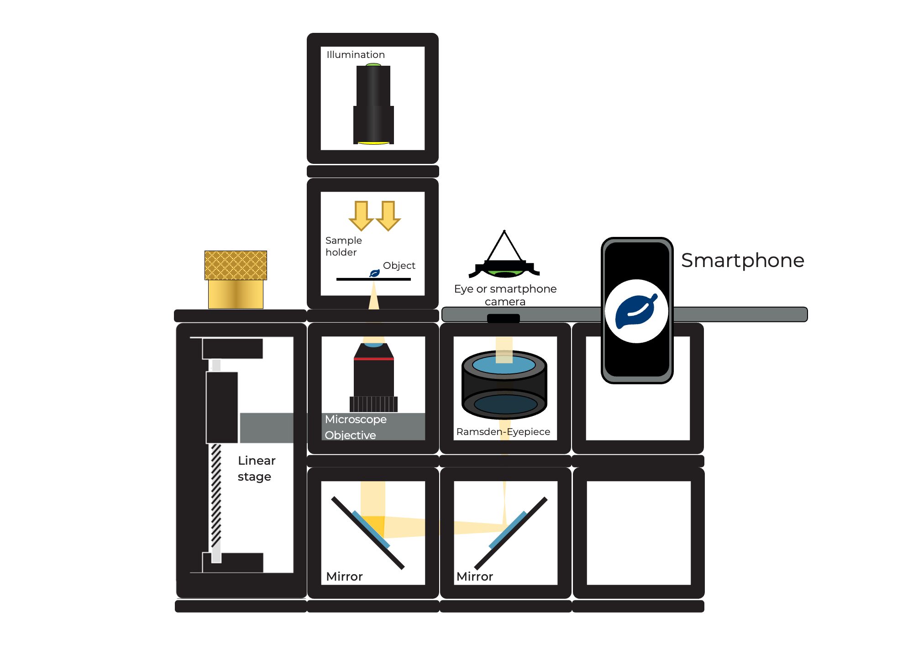
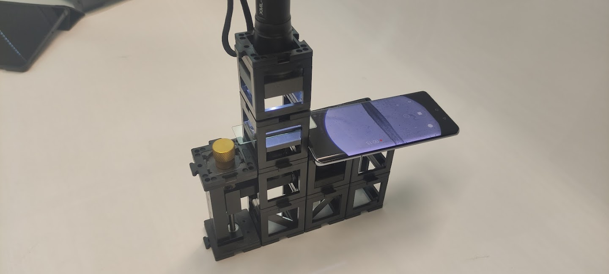
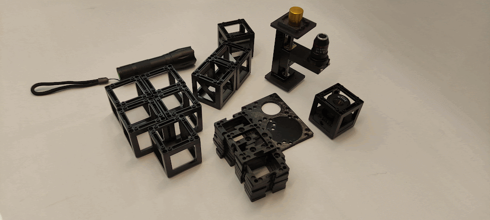
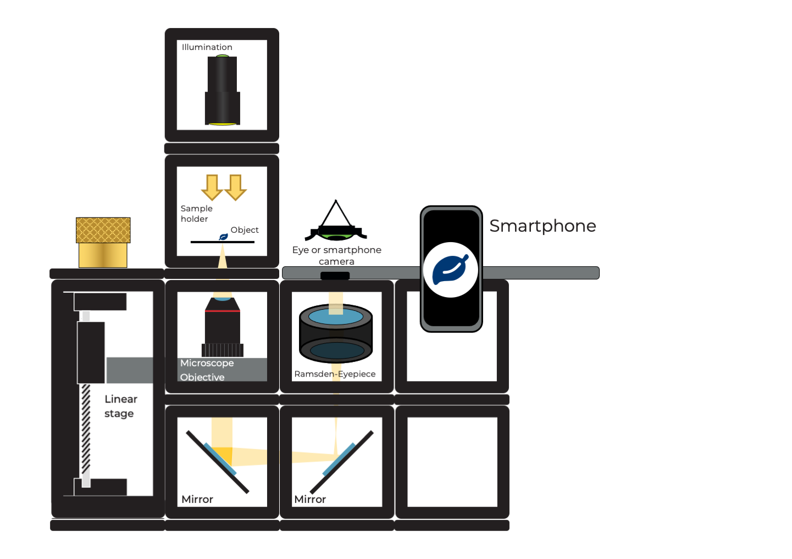
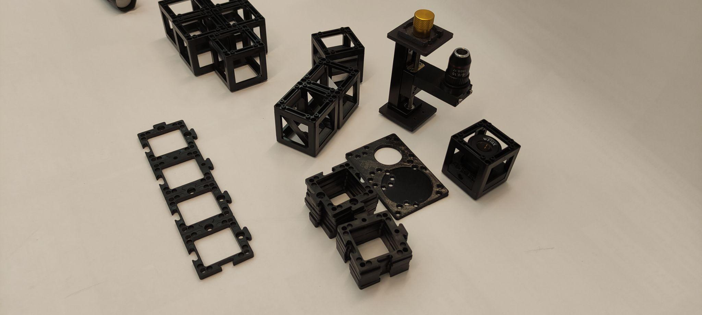
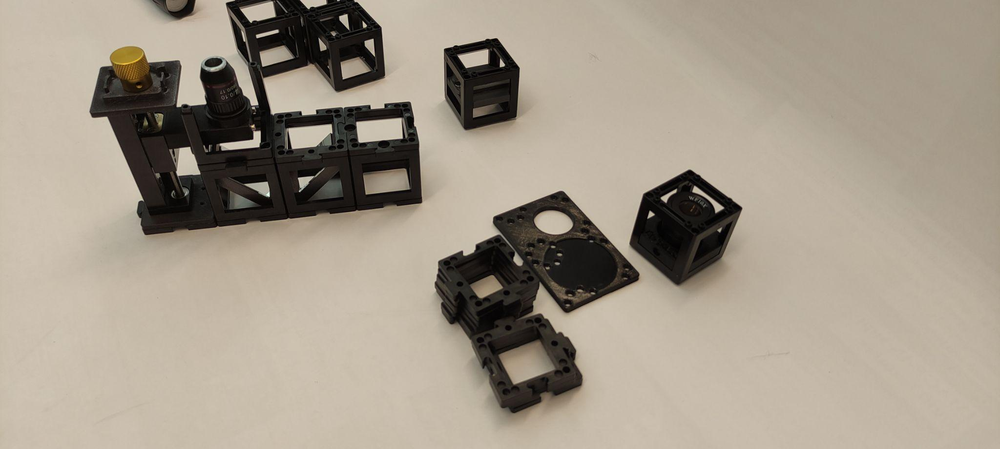
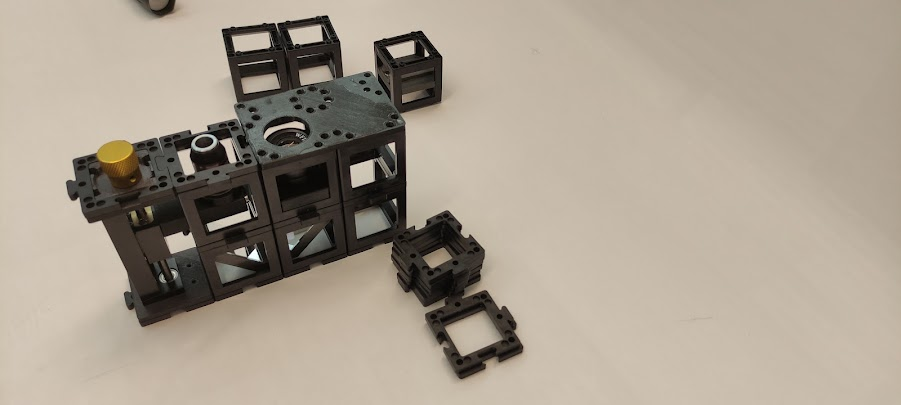
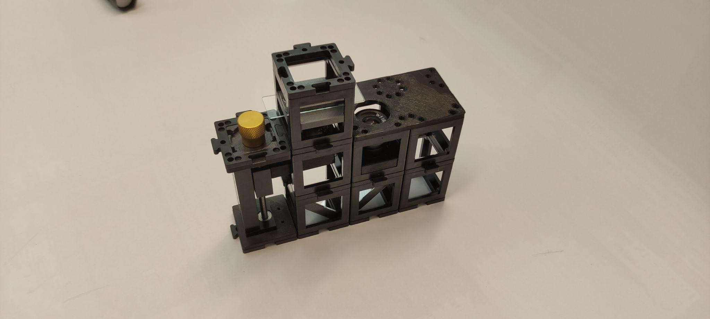
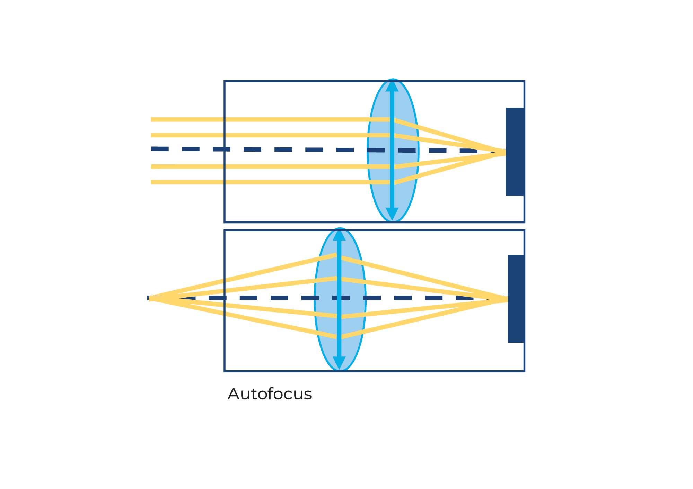
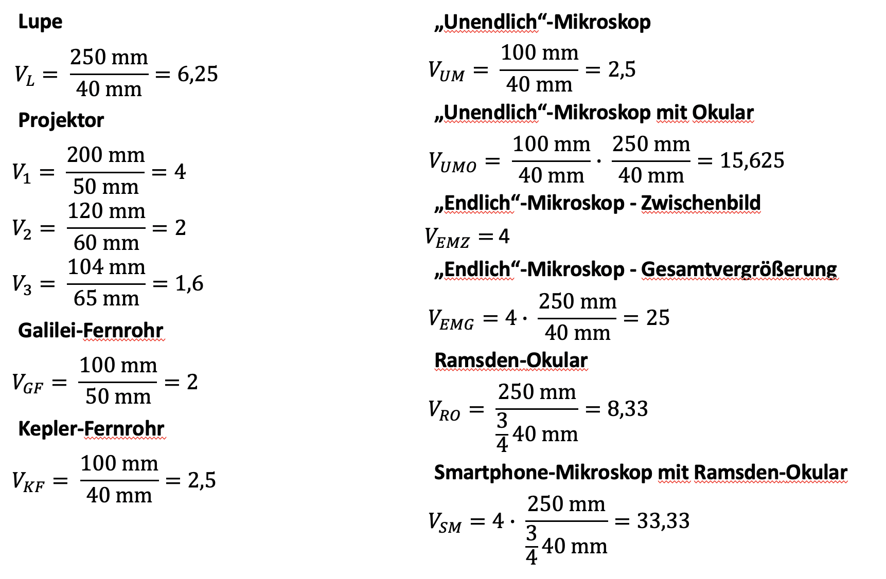

# مجهر الهاتف الذكي

قم ببناء مجهر الهاتف الذكي كما هو موضح. استخدم أي مكعبين لتثبيت الهاتف الذكي بأمان.

 

قم ببناء المجهر مثل الساندويتش عن طريق إضافة طبقة ثانية باستخدام لوحة قاعدة. انظر من خلال العدسة العينية من الأعلى.

 

استبدل عدسة رامسدن بعدسة 40 مم. ما هو الأفضل للعين؟ وما هو الأفضل للهاتف الذكي؟

 

## دليل: مجهر الهاتف الذكي

  

### المواد المطلوبة:

- عدسة ميكروسكوب 4x  
- عدسة ميكروسكوب مع حامل طويل وترس  
- عدسة رامسدن (داخل مكعب)  
- مرآتان غير كينماتيكية (داخل مكعبات)  
- حامل العينة (داخل مكعب)  
- ثلاثة مكعبات فارغة  
- 11 لوحة قاعدة  
- لوحة قاعدة للهاتف الذكي  
- مصباح يدوي  
- عدسة 50 مم (داخل مكعب)

### المخطط (من الجانب):

## تعليمات تجميع مجهر الهاتف الذكي:

يعرض هذا الفيديو كيفية بناء مجهر UC2 للهاتف الذكي كما هو موضح أيضًا في دليل PDF. ويوضح بعض الحيل لجعله أكثر استقرارًا وكيفية تشغيل المرحلة Z.

<iframe width="560" height="315" src="https://www.youtube.com/embed/q3-XW8Bfuww" title="YouTube video player" frameborder="0" allow="accelerometer; autoplay; clipboard-write; encrypted-media; gyroscope; picture-in-picture; web-share" allowfullscreen></iframe>

**الخطوة 1: بناء خط مكون من أربع لوحات قاعدة**

**الخطوة 2: تجميع المكونات**

ضع حامل العدسة الميكروسكوبية في أحد الطرفين، تليه المرآتان متقابلتان، ومكعب فارغ في الطرف الآخر. ثبّت هذه العناصر باستخدام لوحات القاعدة.

**الخطوة 3: ضبط العدسة**

قم ببناء مكعب يحتوي على العدسة الميكروسكوبية في الداخل. إذا لزم الأمر، اضبط ارتفاع العدسة باستخدام الترس.

  
  

**الخطوة 4: وضع العدسة العينية**

ضع العدسة العينية بجانب العدسة الميكروسكوبية ومكعبًا فارغًا بجانبها. تأكد من التوجيه الصحيح للعدسة العينية.

**الخطوة 5: محاذاة قاعدة الهاتف الذكي**

ضع قاعدة الهاتف الذكي بحيث يتطابق الثقب مع العدسة العينية. ملاحظة: يمكنك تعديل اتجاه قاعدة الهاتف حسب حجم هاتفك.

**الخطوة 6: إعداد حامل العينة**

ضع مكعب حامل العينة فوق العدسة الميكروسكوبية. راعِ المسافة بينهما. يمكنك ضبط المسافة التقريبية بتحريك الحامل داخل المكعب، والمسافة الدقيقة باستخدام الترس.

**الخطوة 7: إضافة العدسة المجمعة والمصباح**

ضع مكعب العدسة المجمعة فوق مكعب حامل العينة، ثم ضع المصباح اليدوي في الأعلى. ضع الهاتف الذكي بحيث يتطابق مع العدسة العينية.

**الخطوة 8: ضبط الوضوح**

حاول تحريك الهاتف الذكي حتى يظهر كامل دائرة العدسة العينية مضاءً. ثم قم بتدوير الترس للتركيز والحصول على صورة واضحة للعينة.

## أفضل مع الهاتف الذكي أم العين؟

كاميرا الهاتف الذكي تحتوي على عدسة ذات بُعد بؤري قصير جدًا لأنها يجب أن تكون صغيرة لتناسب سماكة الهاتف. تنشئ العدسة صورة على حساس الكاميرا بخصائص مشابهة لما تراه العين البشرية.

العين قادرة على رؤية الأشياء من بعيد وقريب، وهذه الخاصية تُعرف باسم "التكيّف البصري".

كاميرا الهاتف الذكي تستطيع فعل ذلك أيضًا، لكن يُطلق عليها "التركيز التلقائي". وهي القدرة على تصوير الأجسام بوضوح على مسافات مختلفة على الحساس.

الصورة القادمة من العدسة العينية تكون بأشعة متوازية، وكأنها قادمة من اللانهاية. لقد قمت بالمراقبة بعين مرتاحة (وكأنك تنظر إلى البعيد) أو بكاميرا مضبوطة على اللانهاية.

 

## نتائج الحساب

