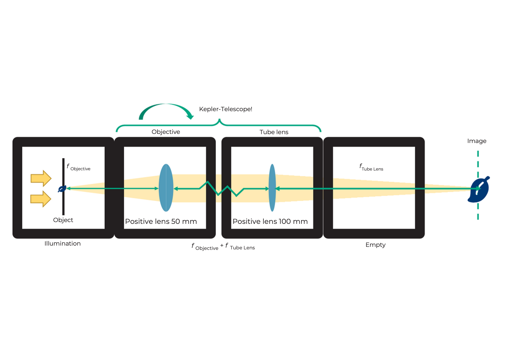
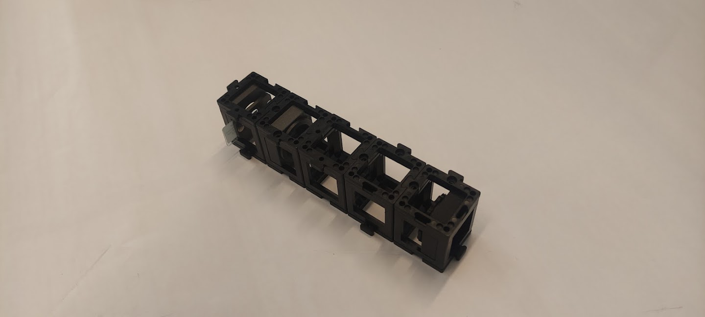
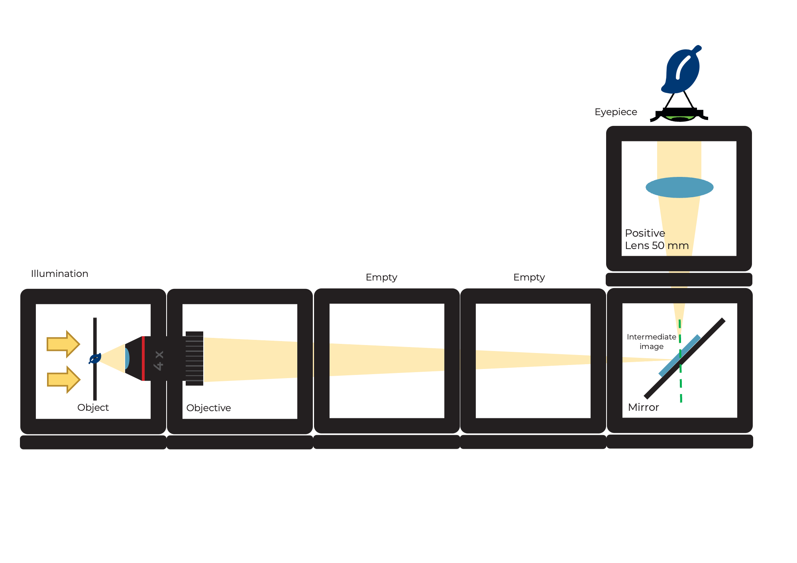
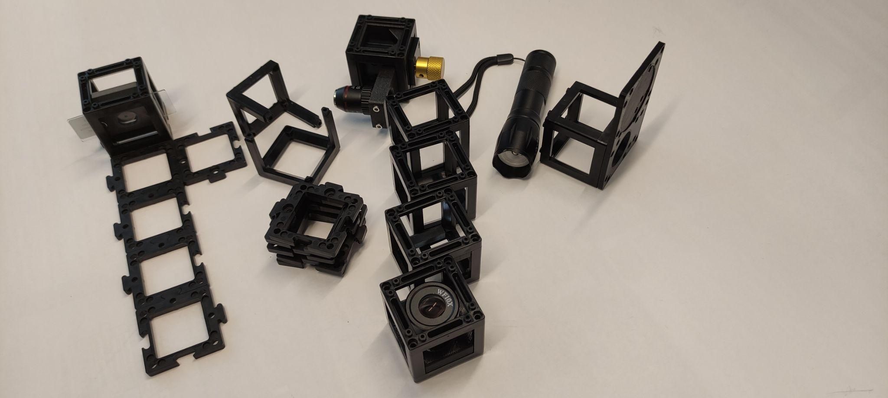

# Light microscope with "infinity optics"

What happens when you turn the Kepler telescope upside down?

 

Place the object about 40mm in front of the lens and find the image about 100mm behind the tube lens (using a paper or the wall as a screen) as shown in the diagram. Move the lenses to get a sharp image.

Place the object with the lens on the paper as one unit. Place the tube lens at a distance of 100mm from your screen (paper, wall). Change the distance between the lenses - does the image change?

 

## This means "infinity optics"

A microscope is a device that allows objects to be viewed or imaged at high magnification.

The image is called an **intermediate image** because it is often further enlarged with an eyepiece.

The object is roughly in the object-side focal plane of the lens. Thus, all incident rays are converted into a parallel bundle of rays behind the lens. The lens has a short focal length.

The tube lens creates a real image by collecting parallel rays that hit the tube lens in its focal plane. If we place them behind the lens, the object will be imaged from the focal plane of the lens. The tube lens has a longer focal length than the objective.

The image in the plane of the intermediate image is reversed, flipped, enlarged and real. The real image can be seen on a screen.

 

## This means "infinity optics"

What is the magnification of the image?

Magnification of the image

The lenses of the Kepler telescope can also be used for a microscope, but in a different order.
As long as the object is in the focal plane of the lens and the screen is in the focal plane of the tube lens, the distance between the lens and tube lens does not matter because the light rays are parallel.

 

## Tutorial: Light Microscope with Infinity Optics

### Materials needed:

- Kepler's telescope
- Torch lamp
- Sample holder (in cube) with sample

### Diagram (side view):

### Instructions for assembling the Light Microscope with Infinity Optics:

**Step 1: Add the sample**

Add the sample cube behind to the 50 mm positive lens. Don’t forget to add the base plates.

**Step 2: Fix the cubes with base plates**

Use the torch to illuminate the sample. Look for a screen (notebook, piece of paper) to project the image onto.

**Step 3: Adjust the distance**

Turn off ambient light to see the image on the screen clearly. Adjust the distance between the microscope and the screen until you see a sharp focused image (check the diagram).

## "Infinity optics" microscope with eyepiece

Can you see the microscopic image through the eyepiece lens with your eyes? What effect does the mirror have? Set up the microscope without the mirror. Make sure you still have two empty spaces between the tube lens and the eyepiece. Then what are you observing?

 

A quick intro into mirrors and its applications can be found here:

  <iframe 
    style={{position: 'absolute', top: 0, left: 0, width: '100%', height: '100%'}}
    src="https://www.youtube.com/embed/azxLqej7yqU" 
    title="YouTube video player" 
    frameBorder="0" 
    allow="accelerometer; autoplay; clipboard-write; encrypted-media; gyroscope; picture-in-picture" 
    allowFullScreen
  />

## What is the eyepiece good for?

Newer microscopes are equipped with so-called "infinity optics". In this case, the lens does not produce a real intermediate image. The light exits the lens as infinite parallel rays. At the end of the "infinite" tube is a tube lens. This creates an intermediate image, which is then enlarged again through the eyepiece.

The image behind the eyepiece is reversed, reversed, enlarged and virtual. The virtual image can be seen with the eye.

This configuration is very useful in modern microscopes as it allows additional components such as filters to be placed between the objective and tube lens without affecting the optical path.

A filter can be used to change the brightness and color of the image.

 

## The eyepiece is good for that

What is the magnification after the eyepiece?

overall magnification

An eyepiece is actually just a lens that enlarges the intermediate image. It maps the virtual image in such a way that you can see it with your eyes.

 

With the mirror you can not only see yourself, but also reflect the incoming light in any direction. So you can fold the optical path and make it more comfortable to work with. The mirror doesn't affect the magnification, but it does rotate the image in one direction.

 

## Tutorial: Light Microscope with Infinity Optics and Eyepiece

### Materials needed:

- Kepler's telescope
- Torch lamp
- Eight base plates
- Sample holder (in cube) with sample
- Mirror (in cube)
- Empty cube
- Eyepiece (in cube)

### Diagram (side view):

### Instructions for assembling the Light Microscope with Infinity Optics and Eyepiece:

**Step 1: Add the sample-holder cube**

Add the sample-holder cube in the Kepler's telescope next to the 50 mm converging lens.

**Step 2: Assemble next to the 100 mm lens**

Next to the 100 mm converging lens, assemble one empty cube and the mirror cube next to it.

**Step 3: Place the eyepiece**

Place the eyepiece on top of the mirror cube with the right orientation. Illuminate the sample from a considerable distance.

**Step 5: Adjust for a sharp image**

Look through the eyepiece. Adjust the lenses distance until you see a focused sharp image. Note: If you don’t see the specimen try to adjust the slide’s position carefully until you see the specimen.

## Light microscope with "finite optics"

Place the dice in the positions shown in the diagram below and look through the eyepiece.

Build the microscope like a sandwich by adding a second layer using a base plate. Look through the eyepiece from above.

 

Do you see the image through the eyepiece as before? Can you find the real intermediate image with a piece of paper?

 

Turn the small gear on the lens holder. This is how you move or focus the lens. If you can't go any further, you can also move the lens in the holder.

 

## Tutorial: Light Microscope with Finite Optics and Eyepiece

### Materials needed:

- Microscope objective (4x) with gear mount (linear stage)
- Torch lamp with lamp base
- Twelve base plates
- Sample holder (in cube) with sample
- Mirror (in cube)
- Three empty cubes
- Eyepiece (in cube)

### Diagram (side view):

## Instructions for assembling the Light Microscope with Finite Optics:

**Step 1: Connect the base plates**

Connect the base plates in the following way.

**Step 2: Place the sample**

Place the sample on the leftmost plate.

**Step 3: Build and place the cubes**

Build a cube with the microscope objective inside and place both microscope objective and gear cubes in the next two base plates. Include all additional images as shown.

**Sub Step 1:**

**Sub Step 2:**

**Sub Step 3:**

**Step 4: Reflect the light**

Place two empty cubes and the cube with the mirror at the last base plate such that it reflects the light coming from the sample upwards.

**Step 5: Secure the cubes**

Place the base plates on top of the cubes to fix them tightly.

**Step 6: Attach the eyepiece**

Place the eyepiece on top of the mirror cube. Mind the right orientation of the eyepiece.

**Step 7: Illuminate the sample**

Fix the lamp with a base and illuminate the sample from a considerable distance. Look through the eyepiece and adjust the microscope distance using the gear until you see a focused image of the specimen.

## "Finite optics" versus "infinite optics"

Lenses from older or smaller microscopes are usually what's called *finite* lenses. They behave like a lens with an extremely short focal length and create an intermediate image behind the lens at a distance defined by the tube length. This length is printed on the lens and corresponds to 160 mm in our case. A real intermediate image is formed there, which is then magnified by the eyepiece.

Microscopes can focus on the object by moving either the object or the lens. Here, we move the lens using a simple mechanism. The rotation of the gear results in displacement of the objective lens. For larger adjustments, you can also move the lens along the rail.

 

## "Finite optics" versus "infinite optics"

What is the magnification of the intermediate image?  
And what is the magnification after the eyepiece?

**Objective magnification**

  
As printed

**Eyepiece magnification**  

**Total magnification**  

The image is larger than with the infinite optics microscope. The objective magnification here is 4×. If you calculated the magnification with the previous microscope, this won’t surprise you.

 

The intermediate image is now formed solely by the objective lens and is located 160 mm behind it. We’ll find out why in the next step.

 

## Objective and eyepiece

 

## This is the lens

A lens is an optical system that creates an enlarged image of an object.  
The different numbers printed on the lens have different meanings:

The 4× lens contains just a single lens element. Lenses with higher magnification are full lens systems.

The lens is also a converging lens with a short focal length. The 4× lens has a focal length of f = 32 mm. When used as a magnifying glass, it provides higher magnification than the 40 mm lens. The field of view is sharp but small.

 

## The eyepiece

An eyepiece is actually a magnifying lens, because it enlarges the intermediate image.  
The eyepiece we’re using here is a **Ramsden-type eyepiece**.  
A single lens can also be used as an eyepiece. However, with a Ramsden eyepiece—composed of a two-lens system—the field of view is better because it introduces fewer errors at the edges. The Ramsden eyepiece consists of two lenses with the same focal length.  
Its focal length is:  
**f (Ramsden eyepiece) = 3/4 f (objective lens)**

**What is the magnification of the Ramsden eyepiece?**

Every eyepiece has what’s called a Ramsden disk, which is the smallest diameter of the light beam exiting the microscope through the eyepiece.

 

The field of view is wider, and the image appears clearer with the Ramsden eyepiece.  
Every eyepiece has a so-called Ramsden disk, which is the smallest diameter of the exiting light beam.

 

