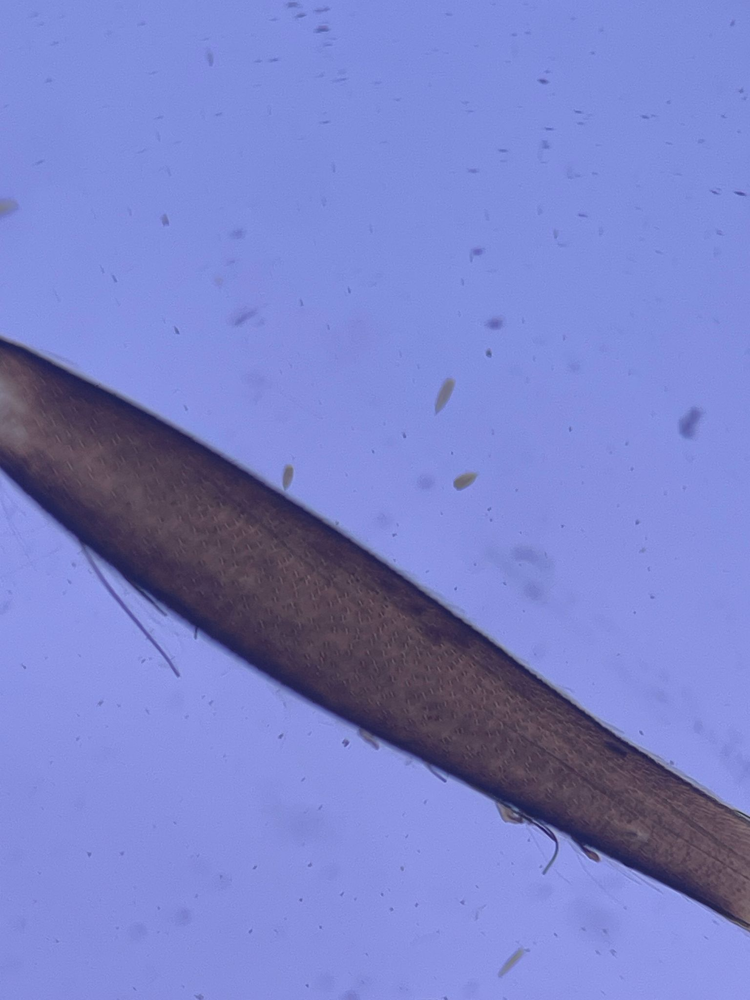
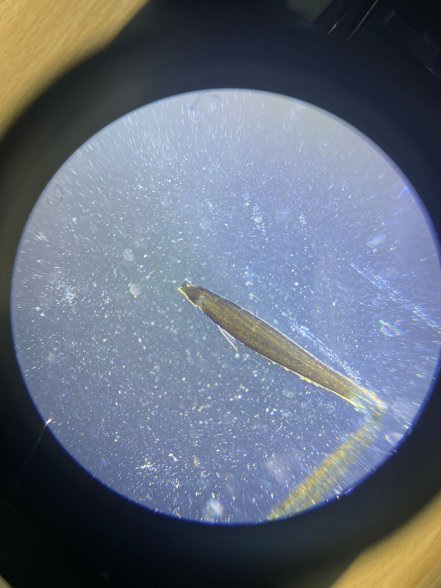

## Troubleshooting and Improving the Smartphone Microscope

It may happen that the imaging result doesn't look as good as it could look like. For this we provide a series of explanations to correct for this
Overall, with the updated components, the setup should look like something like this:

## Perfect Imaging Condition

## Wrong Flashlight Mode

- the flashlight has a funky feature to do morse code, this is not helpful, press the button a couple of times to see the brightes light of all different modes
- The stripes you see is the beating of the pwm controlled intensity and the rolling shutter of the camera

## Flashlight too much focussed

- The front lens of the flashlight can be focussed - move it to see a more-less homogeneous illuminated sample - this is koehler condition when the led is in focus of the condenser that you move

## Flashlight too bright

- use a diffuser or older batteries

## Distance between Smartphone and Eyepiece too large

- ensure the distance between phone and eyepiece matches
- the Exit pupil of the eyepiece has to match entrance pupil of the phone

## Oblique Angle between Flashlight and Sample (kinda darkfield)

- when moving the light-source you will see effects such as shadows or reliefs. This is due to the WOTF

## Ok Imaging with diffuser between flashlight and sample

- incoherent imaging reduces the contrast but gives nice homogeneous illumination

## Overexposed but good imaging (koehler illumination)

## Oblique Illuimation (Darkfield)

- very opblique illumination, no direct light hits the camera sensor
