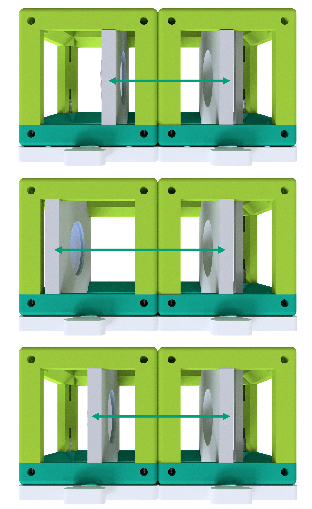

---

id: uc2miniboxFR
title: UC2 miniBOX (français)

---

## Qu'y a-t-il dans la MiniBOX ?

:::tip
Nous avons compilé ce document en ***PDF*** que vous pouvez télécharger <a href="/MINIBOX/Manual_Corebox_EM.pdf" target="_blank">ici</a>
:::

**Support d'échantillon :** maintient un objet dans un cube\
**Lentille :** affecte la façon dont la lumière est propagée (étalée)\
**Miroir :** réfléchit la lumière\
**Objectif de microscope :** un système de lentilles spéciales qui agrandit un objet

Une visite rapide à travers une boîte exemplaire et à quoi ressemblent les cubes (état d'octobre 2022) peut être trouvée ici :

<iframe width="560" height="315" src="https://www.youtube.com/embed/NZZ6n620eV0" title="Lecteur vidéo YouTube" frameborder="0" allow="accelerometer; autoplay; clipboard-write; encrypted-media; gyroscope; picture-in-picture" allowfullscreen></iframe>

## Qu'est-ce que UC2 ?

L'élément central du projet UC2 est un simple cube.
Le cube est constitué de deux moitiés et abrite un insert coulissant.
L'insert peut contenir divers composants optiques (par exemple, des lentilles, des miroirs), ce qui signifie que différentes fonctions peuvent être mises en œuvre avec chaque cube.

### Cube type 1 : moulé par injection avec connexion par plug

**Plaque de base**

**Plaque de base**

Le cube peut être monté sur une plaque de base. Les modules de la plaque de base peuvent être assemblés comme un puzzle.

## UC2 pour l'impression vous-même

Le cube UC2 peut également être imprimé en 3D. Il ressemble au modèle moulé par injection, mais ici il est constitué d'un couvercle de cube et du corps du cube, qui sont maintenus ensemble par des vis. Les vis sont idéales pour être placées sur la plaque magnétique. En combinant différents modules de cubes, différentes structures optiques peuvent être facilement assemblées. Une nouvelle fonction peut être ajoutée avec chaque cube. Votre créativité ne connaît pas de limites.

### Cube type 2 : imprimé en 3D avec connexion magnétique

**Dé**

**Plaque de base avec aimants**

Dans la plaque de base imprimée en 3D, il y a de petits aimants sphériques sur lesquels les cubes sont placés.

Vous voulez plus de cubes ? Alors vous pouvez les construire vous-même. Vous pouvez tout trouver [ici](https://github.com/openUC2/UC2-GIT)

## C'est ainsi que les cubes s'assemblent
Durée : 1

Assurez-vous que les cubes sont correctement placés sur la plaque et ne sont pas inclinés. À la fin, il est important que les inserts soient à la bonne place.
docs/01_Toolboxes/01_DiscoveryCore/IMAGES/MINIBOX/2.png

Si vous ne voyez pas une image nette, déplacez les inserts (par exemple, la lentille) jusqu'à ce que vous la voyiez clairement. La flèche verte sur l'image vous montre comment faire.

Ici, vous pouvez trouver une petite vidéo qui explique le concept de base du cube

<iframe width="560" height="315" src="https://www.youtube.com/embed/Yl0lgNJu_AQ" title="Lecteur vidéo YouTube" frameborder="0" allow="accelerometer; autoplay; clipboard-write; encrypted-media; gyroscope; picture-in-picture" allowfullscreen></iframe>

## Que signifient les symboles ?
Durée : 2

|||
|----|-----|  
|  |Expérience : Si vous voyez ce bloc, il y a quelque chose à expérimenter ! Vous pouvez placer un cube UC2 sur ce bloc. |
|  |**Explications :** Si vous voyez cette icône, il y a quelque chose à apprendre ! |
||**Calculs :** Il y a quelque chose à calculer ici. Prenez un stylo et du papier et commencez les puzzles. |
||**Attention :** Ne touchez pas les surfaces en verre avec vos doigts ! |
||**Nettoyage des lentilles :** Si vous avez déjà touché la lentille, vous pouvez la nettoyer avec un chiffon pour lunettes. |

## Que peut faire une lentille ?
Durée : 2

Prenez un ou plusieurs cubes qui contiennent une lentille et regardez le symbole UC2 montré ici. Tenez le cube dans votre main et changez la distance entre la lentille et l'image.

