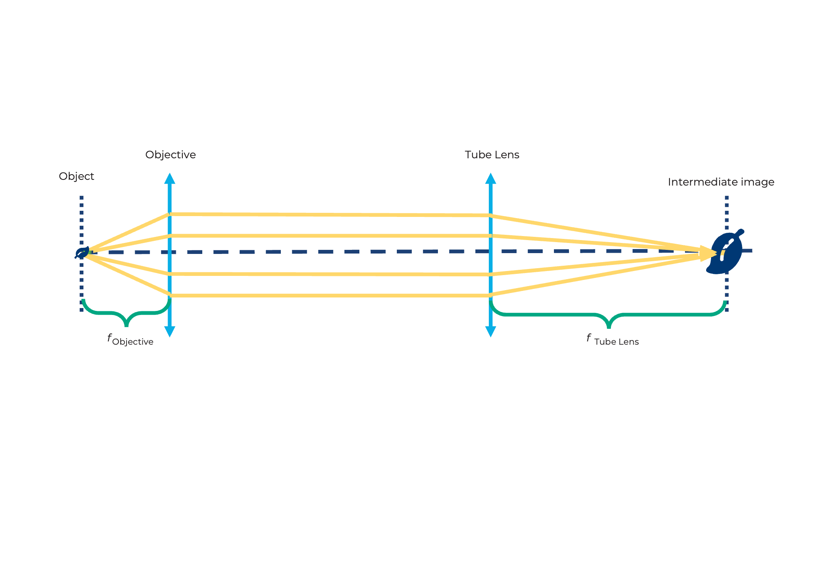
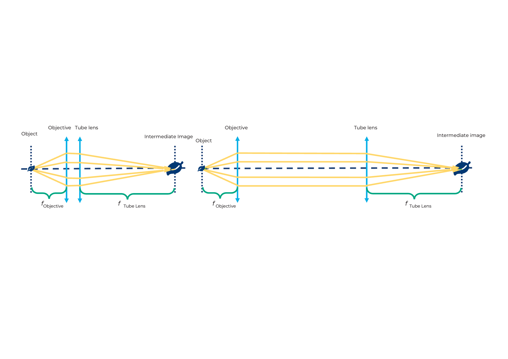
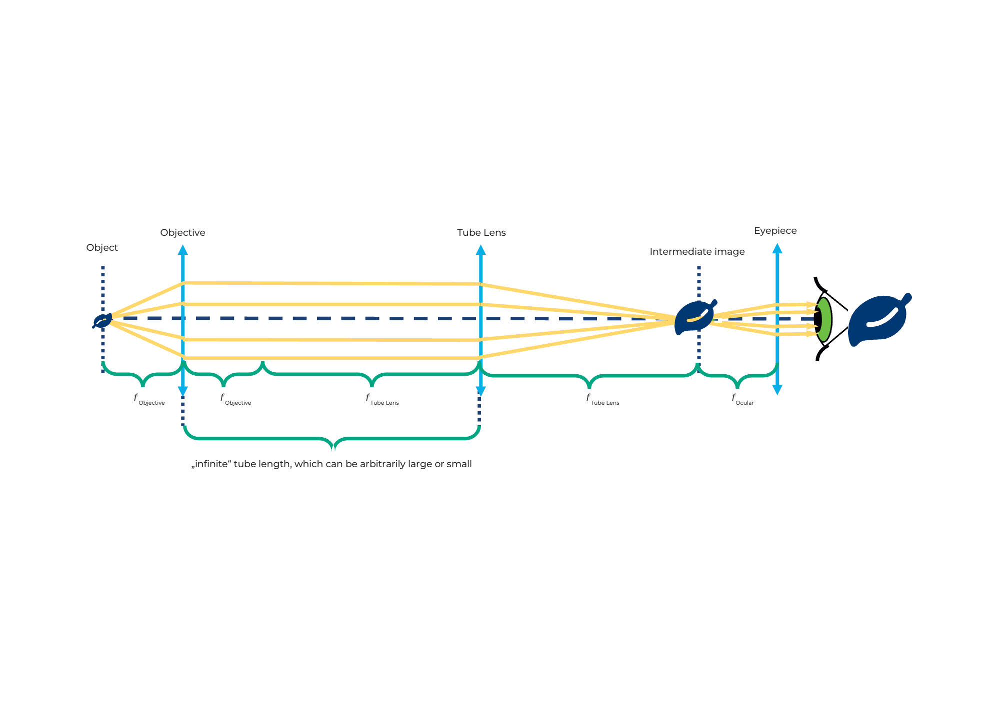
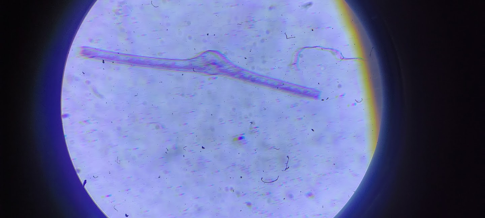
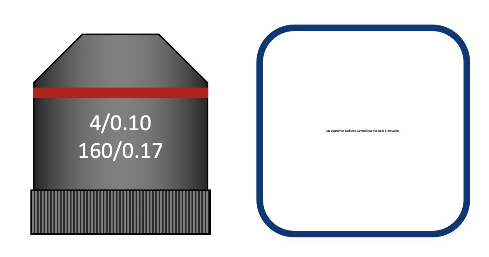
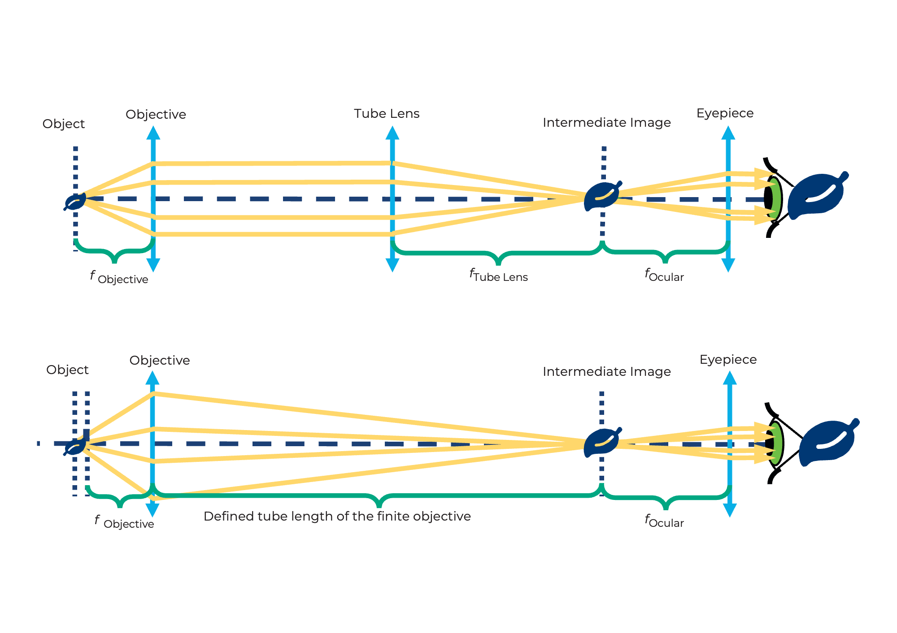
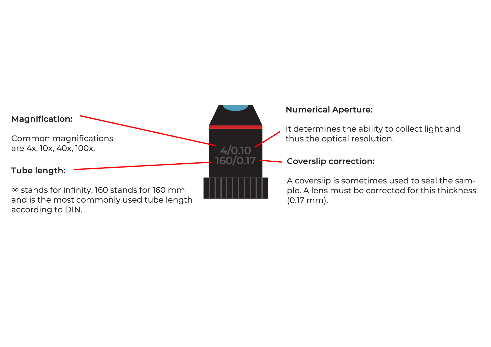
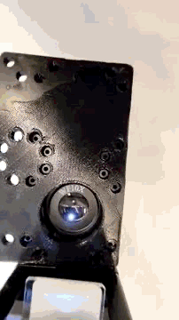
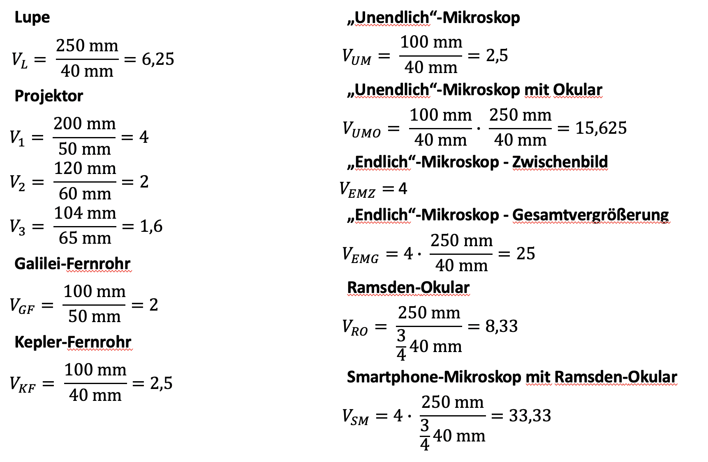

---

id: coreMicroscopeFR
title: Microscope

---

## Microscope optique avec "optique à l'infini"

Que se passe-t-il lorsque vous retournez le télescope de Kepler ?

 

Placez l'objet à environ 40 mm devant la lentille et trouvez l'image à environ 100 mm derrière la lentille du tube (en utilisant du papier ou le mur comme écran) comme indiqué dans le schéma. Déplacez les lentilles pour obtenir une image nette.

Placez l'objet avec la lentille sur le papier comme une seule unité. Placez la lentille du tube à une distance de 100 mm de votre écran (papier, mur). Changez la distance entre les lentilles - l'image change-t-elle ?

 

## Cela signifie "optique à l'infini"

Un microscope est un appareil qui permet de voir ou d'imager des objets à fort grossissement.

L'image est appelée une **image intermédiaire** car elle est souvent encore agrandie avec un oculaire.

L'objet est approximativement dans le plan focal côté objet de la lentille. Ainsi, tous les rayons incidents sont convertis en un faisceau parallèle de rayons derrière la lentille. La lentille a une courte distance focale.

La lentille du tube crée une image réelle en collectant les rayons parallèles qui frappent la lentille du tube dans son plan focal. Si nous les plaçons derrière la lentille, l'objet sera imagé depuis le plan focal de la lentille. La lentille du tube a une distance focale plus longue que l'objectif.

L'image dans le plan de l'image intermédiaire est inversée, retournée, agrandie et réelle. L'image réelle peut être vue sur un écran.

 

## Cela signifie "optique à l'infini"

Quel est le grossissement de l'image ?

Grossissement de l'image

Les lentilles du télescope de Kepler peuvent également être utilisées pour un microscope, mais dans un ordre différent. Tant que l'objet est dans le plan focal de la lentille et que l'écran est dans le plan focal de la lentille du tube, la distance entre la lentille et la lentille du tube n'a pas d'importance car les rayons lumineux sont parallèles.

 

## Tutoriel : Microscope optique avec optique à l'infini

### Matériaux nécessaires :

- Télescope de Kepler
- Lampe torche
- Porte-échantillon (dans un cube) avec échantillon

### Schéma (vue latérale) :

### Instructions pour assembler le microscope optique avec optique à l'infini :

**Étape 1 : Ajouter l'échantillon**

Ajoutez le cube de l'échantillon derrière la lentille positive de 50 mm. N'oubliez pas d'ajouter les plaques de base.

**Étape 2 : Fixez les cubes avec des plaques de base**

Utilisez la lampe torche pour éclairer l'échantillon. Cherchez un écran (cahier, morceau de papier) pour projeter l'image.

**Étape 3 : Ajustez la distance**

Éteignez la lumière ambiante pour voir l'image sur l'écran clairement. Ajustez la distance entre le microscope et l'écran jusqu'à ce que vous voyiez une image nette (vérifiez le schéma).

## Microscope à "optique à l'infini" avec oculaire

Pouvez-vous voir l'image microscopique à travers la lentille de l'oculaire avec vos yeux ? Quel effet a le miroir ? Montez le microscope sans le miroir. Assurez-vous d'avoir encore deux espaces vides entre la lentille du tube et l'oculaire. Que voyez-vous alors ?

 

Une introduction rapide aux miroirs et à leurs applications peut être trouvée ici :

  <iframe 
    style={{position: 'absolute', top: 0, left: 0, width: '100%', height: '100%'}}
    src="https://www.youtube.com/embed/azxLqej7yqU" 
    title="Lecteur vidéo YouTube" 
    frameBorder="0" 
    allow="accelerometer; autoplay; clipboard-write; encrypted-media; gyroscope; picture-in-picture" 
    allowFullScreen
  />

## À quoi sert l'oculaire ?

Les microscopes modernes sont équipés d'une "optique à l'infini". Dans ce cas, la lentille ne produit pas d'image intermédiaire réelle. La lumière sort de la lentille sous forme de rayons parallèles infinis. À l'extrémité du tube "infini" se trouve une lentille de tube. Cela crée une image intermédiaire, qui est ensuite agrandie à nouveau par l'oculaire.

L'image derrière l'oculaire est inversée, retournée, agrandie et virtuelle. L'image virtuelle peut être vue avec l'œil.

Cette configuration est très utile dans les microscopes modernes car elle permet de placer des composants supplémentaires tels que des filtres entre l'objectif et la lentille du tube sans affecter le chemin optique.

Un filtre peut être utilisé pour modifier la luminosité et la couleur de l'image.

 

## L'oculaire sert à cela

Quel est le grossissement après l'oculaire ?

grossissement total

Un oculaire est en fait juste une lentille qui agrandit l'image intermédiaire. Il projette l'image virtuelle de manière à ce que vous puissiez la voir avec vos yeux.

 

Avec le miroir, vous pouvez non seulement vous voir, mais aussi réfléchir la lumière entrante dans n'importe quelle direction. Ainsi, vous pouvez plier le chemin optique et rendre le travail plus confortable. Le miroir n'affecte pas le grossissement, mais il fait tourner l'image dans une direction.

 

## Tutoriel : Microscope optique avec optique à l'infini et oculaire

### Matériaux nécessaires :

- Télescope de Kepler
- Lampe torche
- Huit plaques de base
- Porte-échantillon (dans un cube) avec échantillon
- Miroir (dans un cube)
- Cube vide
- Oculaire (dans un cube)

### Schéma (vue latérale) :

### Instructions pour assembler le microscope optique avec optique à l'infini et oculaire :

**Étape 1 : Ajouter le cube porte-échantillon**

Ajoutez le cube porte-échantillon dans le télescope de Kepler à côté de la lentille convergente de 50 mm.

**Étape 2 : Assemblez à côté de la lentille de 100 mm**

À côté de la lentille convergente de 100 mm, assemblez un cube vide et le cube miroir à côté.

**Étape 3 : Placez l'oculaire**

Placez l'oculaire sur le cube miroir avec la bonne orientation. Éclairez l'échantillon à une distance considérable.

**Étape 5 : Ajustez pour une image nette**

Regardez à travers l'oculaire. Ajustez la distance des lentilles jusqu'à ce que vous voyiez une image nette et claire. Remarque : Si vous ne voyez pas l'échantillon, essayez d'ajuster la position de la lame jusqu'à ce que vous voyiez l'échantillon.

## Microscope optique avec "optique finie"

Placez les cubes dans les positions indiquées dans le schéma ci-dessous et regardez à travers l'oculaire.

Construisez le microscope comme un sandwich en ajoutant une deuxième couche en utilisant une plaque de base. Regardez à travers l'oculaire par le haut.

 

Voyez-vous l'image à travers l'oculaire comme avant ? Pouvez-vous trouver l'image intermédiaire réelle avec un morceau de papier ?

 

Tournez le petit engrenage sur le support de lentille. C'est ainsi que vous déplacez ou focalisez la lentille. Si vous ne pouvez pas aller plus loin, vous pouvez également déplacer la lentille dans le support.

 

## Tutoriel : Microscope optique avec optique finie et oculaire

### Matériaux nécessaires :

- Objectif de microscope (4x) avec support d'engrenage (étage linéaire)
- Lampe torche avec base de lampe
- Douze plaques de base
- Porte-échantillon (dans un cube) avec échantillon
- Miroir (dans un cube)
- Trois cubes vides
- Oculaire (dans un cube)

### Schéma (vue latérale) :

### Instructions pour assembler le microscope optique avec optique finie :

**Étape 1 : Connectez les plaques de base**

Connectez les plaques de base de la manière suivante.

**Étape 2 : Placez l'échantillon**

Placez l'échantillon sur la plaque la plus à gauche.

**Étape 3 : Construisez et placez les cubes**

Construisez un cube avec l'objectif de microscope à l'intérieur et placez l'objectif du microscope et les cubes d'engrenages sur les deux plaques de base suivantes. Incluez toutes les images supplémentaires comme indiqué.

**Sous-étape 1 :**

**Sous-étape 2 :**

**Sous-étape 3 :**

**Étape 4 : Réfléchissez la lumière**

Placez deux cubes vides et le cube avec le miroir sur la dernière plaque de base de manière à ce qu'il reflète la lumière provenant de l'échantillon vers le haut.

**Étape 5 : Fixez les cubes**

Placez les plaques de base sur les cubes pour les fixer fermement.

**Étape 6 : Attachez l'oculaire**

Placez l'oculaire sur le cube miroir. Respectez la bonne orientation de l'oculaire.

**Étape 7 : Éclairez l'échantillon**

Fixez la lampe avec une base et éclairez l'échantillon à une distance considérable. Regardez à travers l'oculaire et ajustez la distance du microscope en utilisant l'engrenage jusqu'à ce que vous voyiez une image nette de l'échantillon.

## "Optique finie" versus "optique à l'infini"

Les lentilles des anciens microscopes ou des microscopes plus petits sont souvent des lentilles dites finies. Elles se comportent comme une lentille avec une distance focale extrêmement courte et créent une image intermédiaire derrière la lentille avec une distance d'image définie par la longueur du tube. La longueur du tube est imprimée et correspond à 160 mm pour notre lentille. L'image intermédiaire réelle est créée là et est agrandie par les optiques de l'oculaire.

Les microscopes ont la capacité de mettre au point ou de focaliser l'objet soit en déplaçant l'objet soit en déplaçant la lentille. Ici, nous déplaçons la lentille à travers un mécanisme simple. La rotation de l'engrenage est traduite en un déplacement de l'objectif. Pour des mouvements plus importants, vous pouvez également déplacer la lentille dans le rail.

 

## "Optique finie" versus "optique à l'infini"

Quel est le grossissement de l'image intermédiaire ? Et quel est le grossissement après l'oculaire ?

grossissement de la lentille

comme écrit dessus

grossissement de l'oculaire

grossissement total

L'image est plus grande qu'avec le microscope à l'infini. Le grossissement de la lentille ici est de 4x. Si vous avez calculé le grossissement avec le microscope précédent, cela ne vous surprendra certainement pas.

 

L'image intermédiaire est maintenant seulement formée par la lentille et se trouve à 160 mm derrière elle. Nous découvrirons pourquoi à l'étape suivante.

 

## Objectif et oculaire

 

## Voici la lentille

Une lentille est un système optique qui crée une image agrandie d'un objet. Les différents numéros imprimés sur la lentille ont des significations différentes :

La lentille 4x n'a qu'une seule lentille à l'intérieur. Les lentilles avec un grossissement plus élevé sont des systèmes de lentilles complets.

La lentille est également une lentille convergente avec une courte distance focale. La lentille 4x a une distance focale de f=32 mm. Lorsqu'elle est utilisée comme loupe, elle a un grossissement plus élevé que la lentille de 40 mm. Le champ de vision est net mais petit.

 

## L'oculaire

Un oculaire est en fait une loupe car il agrandit l'image intermédiaire. L'oculaire que nous utilisons ici est un oculaire de Ramsden.
Une seule lentille peut également être utilisée comme oculaire. Cependant, avec un oculaire de Ramsden constitué d'un système de lentilles, le champ de vision est meilleur car il crée moins d'erreurs au bord du champ de vision. L'oculaire de Ramsden est constitué de deux lentilles ayant la même distance focale. Sa distance focale est f oculaire de Ramsden = 3/4 f lentille

Quel est le grossissement de l'oculaire de Ramsden ?

Chaque oculaire a un disque de Ramsden, qui est le plus petit diamètre du faisceau lumineux qui sort du microscope à travers l'oculaire.

 

Le champ de vision est plus grand et l'image semble plus nette avec l'oculaire de Ramsden. Chaque oculaire a un disque de Ramsden, qui est le plus petit diamètre

 

## Microscope pour smartphone

Construisez le microscope pour smartphone comme montré. Utilisez deux cubes ici pour placer le smartphone en toute sécurité.

 

Construisez le microscope comme un sandwich en ajoutant une deuxième couche en utilisant une plaque de base. Regardez à travers l'oculaire par le haut.

 

Remplacez l'oculaire de Ramsden par la lentille de 40 mm. Qu'est-ce qui est mieux pour l'œil et qu'est-ce qui est mieux pour le smartphone ?

 

## Tutoriel : Microscope pour smartphone

### Matériaux nécessaires :

- Objectif de microscope 4x
- Support long d'objectif de microscope avec engrenage
- Oculaire de Ramsden (dans un cube)
- Deux miroirs non cinématiques (dans des cubes)
- Porte-échantillon (dans un cube)
- Trois cubes vides
- 11 plaques de base
- Plaque de base pour smartphone
- Lampe torche
- Lentille de 50 mm (dans un cube)

### Schéma (vue latérale) :

### Instructions pour assembler le microscope pour smartphone :

**Étape 1 : Construire une ligne de quatre plaques de base**

**Étape 2 : Assembler les composants**

Placez le support d'objectif de microscope à une extrémité suivi des deux miroirs se faisant face et d'un cube vide à l'autre extrémité. Fixez-les avec des plaques de base.

**Étape 3 : Ajuster l'objectif**

Construisez un cube avec l'objectif de microscope à l'intérieur. Ajustez la hauteur de l'objectif si nécessaire en utilisant l'engrenage.

**Étape 4 : Placer l'oculaire**

Placez l'oculaire à côté de l'objectif de microscope et un cube vide à côté. Respectez la bonne orientation de l'oculaire.

**Étape 5 : Aligner la base du smartphone**

Placez la base du smartphone avec le trou aligné avec l'oculaire. Remarque : Vous pouvez ajuster l'orientation de la base du smartphone pour adapter la taille de votre smartphone.

**Étape 6 : Installer le porte-échantillon**

Placez le cube porte-échantillon au-dessus de l'objectif de microscope. Respectez la distance entre eux. Vous pouvez ajuster la distance approximative en faisant glisser le porte-échantillon à l'intérieur du cube et la distance plus fine en utilisant l'engrenage.

**Étape 7 : Ajouter la lentille convergente et la lampe**

Placez un cube de lentille convergente au-dessus du cube porte-échantillon et placez la lampe torche au-dessus. Placez le smartphone aligné avec l'oculaire.

**Étape 8 : Ajuster pour la clarté**

Essayez de déplacer le smartphone de manière à ce que tout le cercle de l'oculaire apparaisse illuminé. Ensuite, tournez l'engrenage pour focaliser et obtenir une image nette de l'échantillon.

## Mieux avec le smartphone ou l'œil ?

L'appareil photo du smartphone a une lentille avec une distance focale très courte car elle doit s'adapter à l'épaisseur du smartphone. La lentille crée alors une image sur le capteur de la caméra dont les propriétés sont similaires à celles de l'œil humain.

L'œil peut voir des objets à la fois de loin et de près. Cette propriété est appelée accommodation.

L'appareil photo du smartphone peut également faire cela, mais cela s'appelle autofocus. Cela décrit la capacité à imager nettement des objets à différentes distances sur le capteur.

L'image de l'oculaire provient de rayons parallèles, comme si elle venait de l'infini. Vous avez observé avec un œil détendu (regardant au loin) ou avec une caméra mise au point à l'infini.

 

## Résultats des calculs

