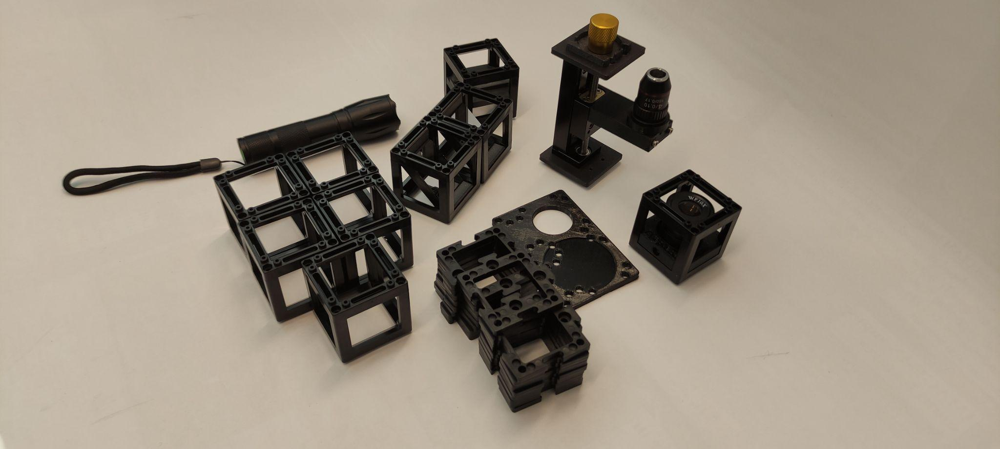
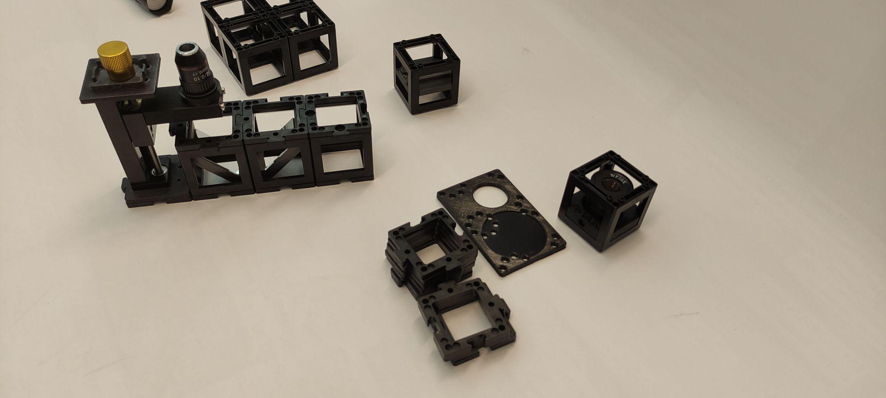
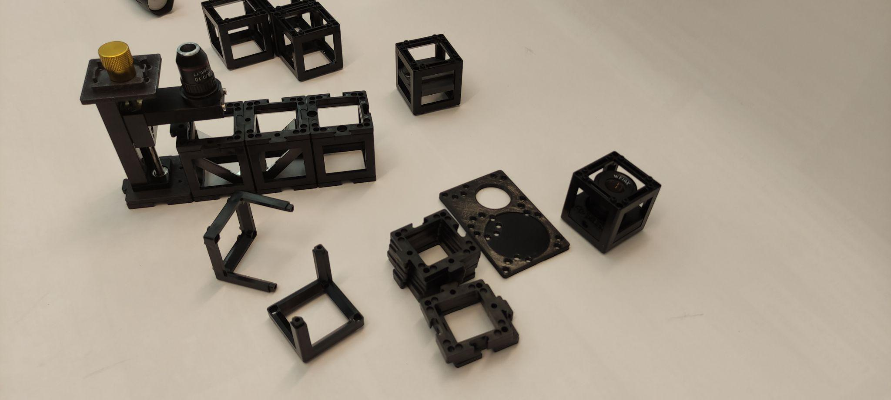
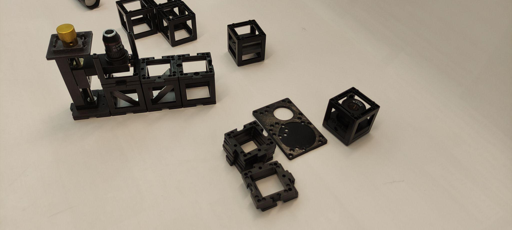

# Microscope pour smartphone

Construisez le microscope pour smartphone comme montré. Utilisez deux cubes ici pour placer le smartphone en toute sécurité.

 

Construisez le microscope comme un sandwich en ajoutant une deuxième couche en utilisant une plaque de base. Regardez à travers l'oculaire par le haut.

 

Remplacez l'oculaire de Ramsden par la lentille de 40 mm. Qu'est-ce qui est mieux pour l'œil et qu'est-ce qui est mieux pour le smartphone ?

 

## Tutoriel : Microscope pour smartphone

### Matériaux nécessaires :

- Objectif de microscope 4x
- Support long d'objectif de microscope avec engrenage
- Oculaire de Ramsden (dans un cube)
- Deux miroirs non cinématiques (dans des cubes)
- Porte-échantillon (dans un cube)
- Trois cubes vides
- 11 plaques de base
- Plaque de base pour smartphone
- Lampe torche
- Lentille de 50 mm (dans un cube)

### Schéma (vue latérale) :

### Instructions pour assembler le microscope pour smartphone :

Cette vidéo vous montre comment assembler le microscope pour smartphone UC2, comme indiqué dans le manuel PDF. Elle présente quelques astuces pour le stabiliser et l'utilisation de la platine Z.

<iframe width="560" height="315" src="https://www.youtube.com/embed/q3-XW8Bfuww" title="YouTube video player" frameborder="0" allow="accelerometer; autoplay; clipboard-write; encrypted-media; gyroscope; picture-in-picture; web-share" allowfullscreen></iframe>

**Étape 1 : Construire une ligne de quatre plaques de base**

**Étape 2 : Assembler les composants**

Placez le support d'objectif de microscope à une extrémité suivi des deux miroirs se faisant face et d'un cube vide à l'autre extrémité. Fixez-les avec des plaques de base.

**Étape 3 : Ajuster l'objectif**

Construisez un cube avec l'objectif de microscope à l'intérieur. Ajustez la hauteur de l'objectif si nécessaire en utilisant l'engrenage.

**Étape 4 : Placer l'oculaire**

Placez l'oculaire à côté de l'objectif de microscope et un cube vide à côté. Respectez la bonne orientation de l'oculaire.

**Étape 5 : Aligner la base du smartphone**

Placez la base du smartphone avec le trou aligné avec l'oculaire. Remarque : Vous pouvez ajuster l'orientation de la base du smartphone pour adapter la taille de votre smartphone.

**Étape 6 : Installer le porte-échantillon**

Placez le cube porte-échantillon au-dessus de l'objectif de microscope. Respectez la distance entre eux. Vous pouvez ajuster la distance approximative en faisant glisser le porte-échantillon à l'intérieur du cube et la distance plus fine en utilisant l'engrenage.

**Étape 7 : Ajouter la lentille convergente et la lampe**

Placez un cube de lentille convergente au-dessus du cube porte-échantillon et placez la lampe torche au-dessus. Placez le smartphone aligné avec l'oculaire.

**Étape 8 : Ajuster pour la clarté**

Essayez de déplacer le smartphone de manière à ce que tout le cercle de l'oculaire apparaisse illuminé. Ensuite, tournez l'engrenage pour focaliser et obtenir une image nette de l'échantillon.

## Mieux avec le smartphone ou l'œil ?

L'appareil photo du smartphone a une lentille avec une distance focale très courte car elle doit s'adapter à l'épaisseur du smartphone. La lentille crée alors une image sur le capteur de la caméra dont les propriétés sont similaires à celles de l'œil humain.

L'œil peut voir des objets à la fois de loin et de près. Cette propriété est appelée accommodation.

L'appareil photo du smartphone peut également faire cela, mais cela s'appelle autofocus. Cela décrit la capacité à imager nettement des objets à différentes distances sur le capteur.

L'image de l'oculaire provient de rayons parallèles, comme si elle venait de l'infini. Vous avez observé avec un œil détendu (regardant au loin) ou avec une caméra mise au point à l'infini.

 

## Résultats des calculs

