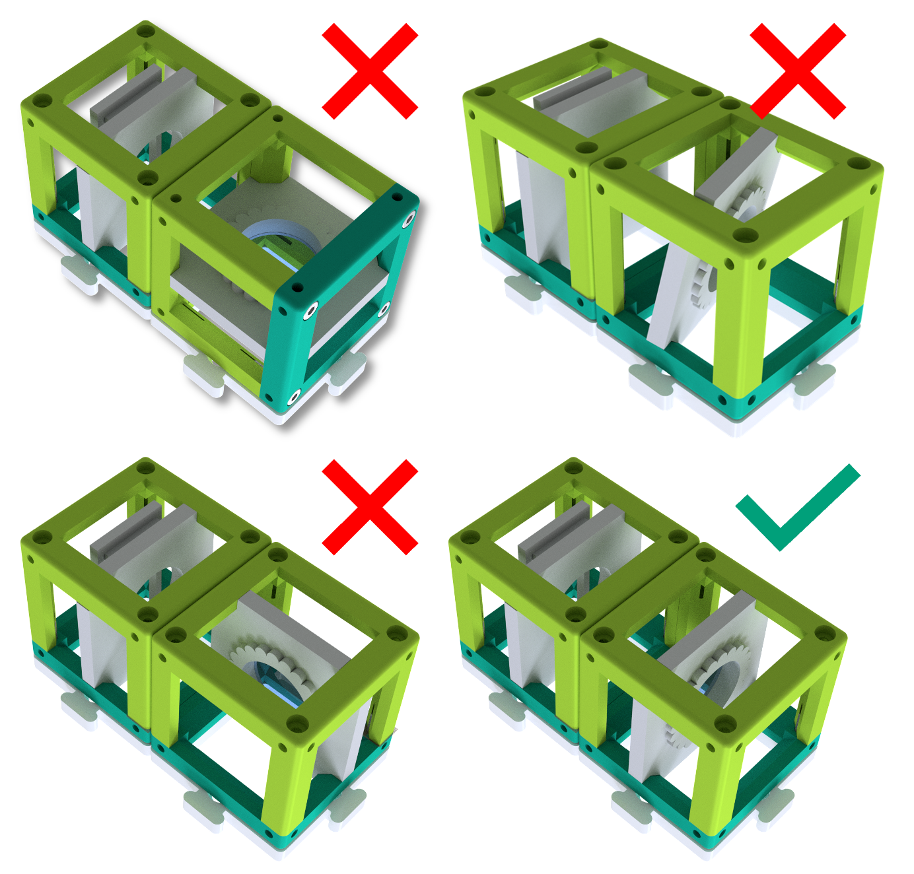

## Was ist in der MiniBOX enthalten?

::: tip
Wir haben dieses Dokument in eine ***PDF***-Datei kompiliert, die <a href="/MINIBOX/Manual_Corebox_DE.pdf" target="_blank" >hier</a> heruntergeladen werden kann.
:::

**Probenhalter:** hält ein Objekt in einem Würfel\
**Linse:** beeinflusst die Art und Weise, wie Licht verbreitet wird\
**Spiegel:** reflektiert das Licht\
**Mikroskopobjektiv:** ein spezielles Linsensystem, das ein Objekt vergrößert

Eine schnelle Tour durch eine beispielhafte Box und wie die Würfel aussehen (Stand Oktober 2022) finden Sie hier:

<iframe width="560" height="315" src="https://www.youtube.com/embed/NZZ6n620eV0" title="YouTube-Video-Player" frameborder="0" allow="accelerometer; autoplay; clipboard-write; encrypted-media; gyroscope; picture-in-picture" allowfullscreen></iframe>

## Was ist UC2?

Das Kernelement des UC2-Projekts ist ein einfacher Würfel.
Der Würfel besteht aus zwei Hälften und beherbergt einen schiebbaren Einsatz.
Der Einsatz kann verschiedene optische Komponenten aufnehmen (z.B. Linsen, Spiegel), was bedeutet, dass mit jedem Würfel unterschiedliche Funktionen implementiert werden können.

### Würfeltyp 1: spritzgegossen mit Steckverbindung

**Bodenplatte**

**Bodenplatte**

Der Würfel kann auf einer Bodenplatte montiert werden. Die Bodenplattenmodule können wie ein Puzzle zusammengesetzt werden.

## UC2 zum Selbstausdrucken

Der UC2-Würfel kann auch 3D-gedruckt werden. Er sieht genauso aus wie das spritzgegossene Modell, besteht hier jedoch aus einem Würfeldeckel und dem Würfelkörper, die mit Schrauben zusammengehalten werden. Die Schrauben eignen sich hervorragend zur Anbringung auf der Magnetplatte. Durch das Kombinieren verschiedener Würfelmodule können leicht verschiedene optische Strukturen zusammengestellt werden. Mit jedem Würfel kann eine neue Funktion hinzugefügt werden. Ihrer Kreativität sind keine Grenzen gesetzt.

### Würfeltyp 2: 3D-gedruckt mit magnetischer Verbindung

**Würfel**

**Bodenplatte mit Magneten**

In der 3D-gedruckten Bodenplatte befinden sich kleine kugelförmige Magnete, auf denen die Würfel platziert werden.

Möchten Sie mehr Würfel? Dann bauen Sie sie selbst. Alles, was Sie brauchen, finden Sie [hier](https://github.com/openUC2/UC2-GIT)

## So passen die Würfel zusammen
Dauer: 1

Stellen Sie sicher, dass die Würfel richtig auf der Platte platziert und nicht gekippt sind. Am Ende ist es wichtig, dass die Einsätze richtig positioniert sind.
docs/01_Toolboxes/01_DiscoveryCore/IMAGES/MINIBOX/2.png

Wenn Sie kein scharfes Bild sehen, bewegen Sie die Einsätze (z.B. Linse), bis Sie es klar sehen. Der grüne Pfeil im Bild zeigt Ihnen, wie das geht.

Hier finden Sie ein kleines Video, das das Kernkonzept des Würfels erklärt

<iframe width="560" height="315" src="https://www.youtube.com/embed/Yl0lgNJu_AQ" title="YouTube-Video-Player" frameborder="0" allow="accelerometer; autoplay; clipboard-write; encrypted-media; gyroscope; picture-in-picture" allowfullscreen></iframe>

## Was bedeuten die Symbole?

|||
|----|-----|  
|  |**Experimentieren:**

 Wenn Sie diesen Block sehen, gibt es etwas zu experimentieren! Sie können einen UC2-Würfel auf diesen Block setzen. |
|  |**Erklärungen**: Wenn Sie dieses Symbol sehen, gibt es etwas zu lernen! |
||**Rechnungen:** Hier gibt es etwas zu rechnen. Nehmen Sie einen Stift und Papier und beginnen Sie mit den Rätseln. |
||**Vorsicht:** Berühren Sie die Glasoberflächen nicht mit Ihren Fingern! |
||**Reinigung der Linsen:** Wenn Sie die Linse bereits berührt haben, können Sie sie mit einem Brillentuch reinigen. |

## Was kann eine Linse bewirken?

Nehmen Sie einen oder mehrere der Würfel, die eine Linse enthalten, und betrachten Sie das hier gezeigte UC2-Symbol. Halten Sie den Würfel in Ihrer Hand und ändern Sie den Abstand zwischen der Linse und dem Bild.

