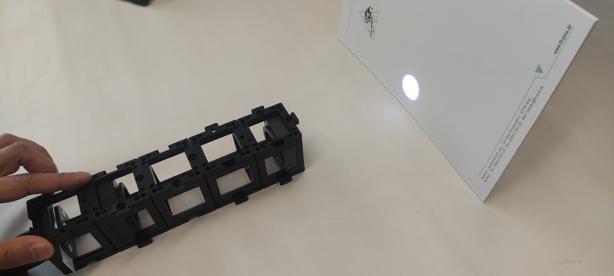
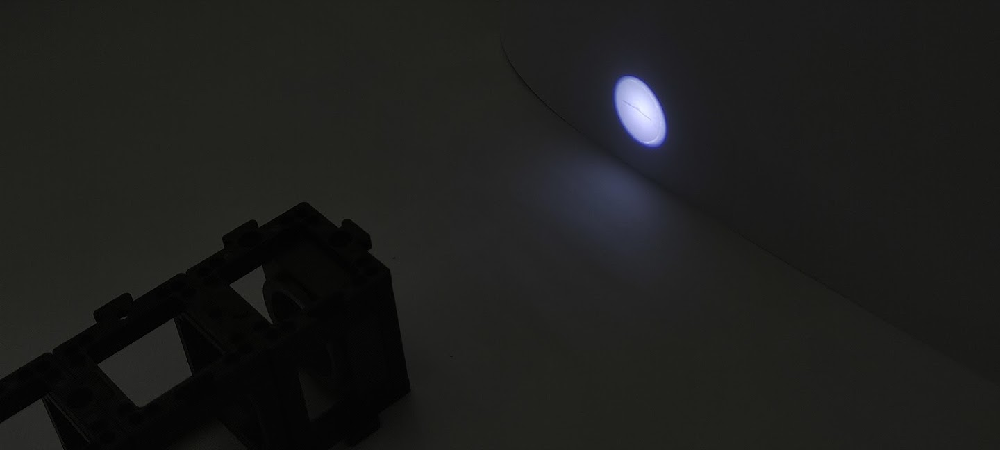
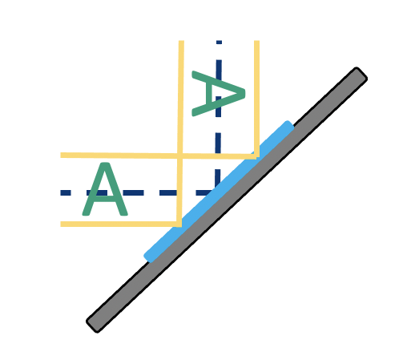
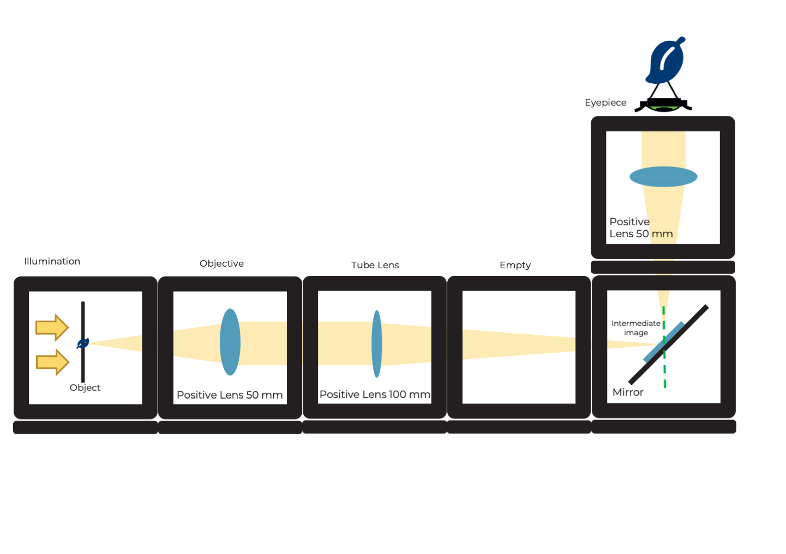
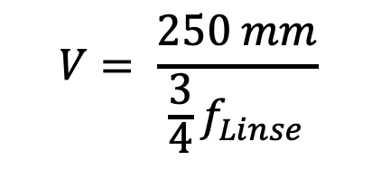

## Lichtmikroskop mit "Unendlichkeitsoptik"

Was passiert, wenn du das Kepler-Teleskop umdrehst?

 

Platziere das Objekt etwa 40 mm vor der Linse und finde das Bild etwa 100 mm hinter der Tubuslinse (verwende ein Papier oder die Wand als Schirm) wie im Diagramm gezeigt. Bewege die Linsen, um ein scharfes Bild zu erhalten.

Platziere das Objekt zusammen mit der Linse auf dem Papier als eine Einheit. Setze die Tubuslinse in einem Abstand von 100 mm zu deinem Schirm (Papier, Wand). Ändere den Abstand zwischen den Linsen - ändert sich das Bild?

 

## Das bedeutet "Unendlichkeitsoptik"

Ein Mikroskop ist ein Gerät, das Objekte mit hoher Vergrößerung betrachtet oder abbildet.

Das Bild wird als **Zwischenbild** bezeichnet, weil es oft noch weiter mit einem Okular vergrößert wird.

Das Objekt befindet sich ungefähr in der objektseitigen Brennebene der Linse. Dadurch werden alle einfallenden Strahlen hinter der Linse in ein paralleles Strahlenbündel umgewandelt. Die Linse hat eine kurze Brennweite.

Die Tubuslinse erzeugt ein reales Bild, indem sie die parallelen Strahlen sammelt, die die Tubuslinse in ihrer Brennebene treffen. Wenn wir sie hinter der Linse platzieren, wird das Objekt aus der Brennebene der Linse abgebildet. Die Tubuslinse hat eine längere Brennweite als das Objektiv.

Das Bild in der Ebene des Zwischenbildes ist umgekehrt, gespiegelt, vergrößert und real. Das reale Bild kann auf einem Schirm gesehen werden.

 

## Das bedeutet "Unendlichkeitsoptik"

Wie groß ist die Vergrößerung des Bildes?

Vergrößerung des Bildes

Die Linsen des Kepler-Teleskops können auch für ein Mikroskop verwendet werden, jedoch in anderer Reihenfolge.
Solange das Objekt in der Brennebene der Linse und der Schirm in der Brennebene der Tubuslinse ist, spielt der Abstand zwischen Linse und Tubuslinse keine Rolle, da die Lichtstrahlen parallel sind.

 

## Tutorial: Lichtmikroskop mit Unendlichkeitsoptik

### Benötigte Materialien:

- Keplers Teleskop
- Taschenlampe
- Probenhalter (im Würfel) mit Probe

### Diagramm (Seitenansicht):

### Anleitung zum Zusammenbau des Lichtmikroskops mit Unendlichkeitsoptik:

**Schritt 1: Probe hinzufügen**

Füge den Proben-Würfel hinter die 50-mm-Positivlinse hinzu. Vergiss nicht, die Bodenplatten hinzuzufügen.

**Schritt 2: Würfel mit Bodenplatten fixieren**

Verwende die Taschenlampe, um die Probe zu beleuchten. Suche einen Schirm (Notizbuch, Papier), um das Bild darauf zu projizieren.

**Schritt 3: Abstand einstellen**

Schalte das Umgebungslicht aus, um das Bild auf dem Schirm deutlich zu sehen. Justiere den Abstand zwischen Mikroskop und Schirm, bis du ein scharf fokussiertes Bild siehst (siehe Diagramm).

## Mikroskop mit "Unendlichkeitsoptik" und Okular

Kannst du das mikroskopische Bild durch die Okularlinse mit deinen Augen sehen? Welchen Effekt hat der Spiegel? Richte das Mikroskop ohne den Spiegel ein. Stelle sicher, dass du immer noch zwei leere Räume zwischen der Tubuslinse und dem Okular hast. Was beobachtest du dann?

 

Eine kurze Einführung in Spiegel und deren Anwendungen findest du hier:

  <iframe 
    style={{position: 'absolute', top: 0, left: 0, width: '100%', height: '100%'}}
    src="https://www.youtube.com/embed/azxLqej7yqU" 
    title="YouTube video player" 
    frameBorder="0" 
    allow="accelerometer; autoplay; clipboard-write; encrypted-media; gyroscope; picture-in-picture" 
    allowFullScreen
  />

## Wozu dient das Okular?

Neuere Mikroskope sind mit sogenannten "Unendlichkeitsoptiken" ausgestattet. In diesem Fall erzeugt die Linse kein reales Zwischenbild. Das Licht verlässt die Linse als unendliche parallele Strahlen. Am Ende des "unendlichen" Tubus befindet sich eine Tubuslinse. Diese erzeugt ein Zwischenbild, das dann durch das Okular erneut vergrößert wird.

Das Bild hinter dem Okular ist umgekehrt, umgekehrt, vergrößert und virtuell. Das virtuelle Bild kann mit dem Auge gesehen werden.

Diese Konfiguration ist sehr nützlich in modernen Mikroskopen, da sie das Einfügen zusätzlicher Komponenten wie Filter zwischen Objektiv und Tubuslinse erlaubt, ohne den optischen Weg zu beeinflussen.

Ein Filter kann verwendet werden, um die Helligkeit und Farbe des Bildes zu ändern.

 

## Das Okular ist dafür gut

Wie groß ist die Vergrößerung nach dem Okular?

Gesamtvergrößerung

Ein Okular ist eigentlich nur eine Linse, die das Zwischenbild vergrößert. Es bildet das virtuelle Bild so ab, dass du es mit deinen Augen sehen kannst.

 

Mit dem Spiegel kannst du nicht nur dich selbst sehen, sondern auch das einfallende Licht in jede Richtung reflektieren. So kannst du den optischen Weg falten und die Arbeit komfortabler gestalten. Der Spiegel beeinflusst zwar nicht die Vergrößerung, dreht aber das Bild in eine Richtung.

 

## Tutorial: Lichtmikroskop mit Unendlichkeitsoptik und Okular

### Benötigte Materialien:

- Keplers Teleskop
- Taschenlampe
- Acht Bodenplatten
- Probenhalter (im Würfel) mit Probe
- Spiegel (im Würfel)
- Leerwürfel
- Okular (im Würfel)

### Diagramm (Seitenansicht):

### Anleitung zum Zusammenbau des Lichtmikroskops mit Unendlichkeitsoptik und Okular:

**Schritt 1: Probenhalter-Würfel hinzufügen**

Füge den Probenhalter-Würfel im Keplers Teleskop neben der 50-mm-Sammellinse hinzu.

**Schritt 2: Neben der 100-mm-Linse zusammenbauen**

Montiere neben der 100-mm-Sammellinse einen Leerwürfel und daneben den Spiegelwürfel.

**Schritt 3: Das Okular platzieren**

Platziere das Okular oben auf dem Spiegelwürfel mit der richtigen Orientierung. Beleuchte die Probe aus ein

iger Entfernung.

**Schritt 5: Für ein scharfes Bild justieren**

Schaue durch das Okular. Justiere den Linsenabstand, bis du ein fokussiertes scharfes Bild siehst. Hinweis: Wenn du das Präparat nicht siehst, versuche vorsichtig die Position der Probe zu justieren, bis du das Präparat siehst.

## Lichtmikroskop mit „endlicher Optik“

Platziere die Würfel in den im Diagramm unten gezeigten Positionen und schau durch das Okular.

Baue das Mikroskop wie ein Sandwich, indem du eine zweite Ebene mit einer Bodenplatte hinzufügst. Schaue von oben durch das Okular.

 

Siehst du das Bild durch das Okular wie zuvor? Kannst du das reale Zwischenbild mit einem Blatt Papier finden?

 

Drehe das kleine Zahnrad am Linsenhalter. So bewegst oder fokussierst du die Linse. Wenn es nicht weitergeht, kannst du die Linse auch im Halter verschieben.

 

## Anleitung: Lichtmikroskop mit endlicher Optik und Okular

### Benötigtes Material:

- Mikroskopobjektiv (4x) mit Zahnradhalterung (Linearführung)
- Taschenlampenleuchte mit Lampenfuß
- Zwölf Bodenplatten
- Probenhalter (im Würfel) mit Probe
- Spiegel (im Würfel)
- Drei leere Würfel
- Okular (im Würfel)

### Aufbau (Seitenansicht):

## Anleitung zum Aufbau des Lichtmikroskops mit endlicher Optik:

**Schritt 1: Bodenplatten verbinden**

Verbinde die Bodenplatten wie folgt.

**Schritt 2: Probe platzieren**

Lege die Probe auf die linkeste Bodenplatte.

**Schritt 3: Würfel aufbauen und platzieren**

Baue einen Würfel mit dem Mikroskopobjektiv im Inneren und platziere sowohl das Objektiv als auch den Zahnrad-Würfel auf den nächsten beiden Bodenplatten. Füge alle weiteren Bilder wie gezeigt hinzu.

**Unterschritt 1:**

**Unterschritt 2:**

**Unterschritt 3:**

**Schritt 4: Licht reflektieren**

Platziere zwei leere Würfel und den Würfel mit Spiegel auf der letzten Bodenplatte so, dass das von der Probe kommende Licht nach oben reflektiert wird.

**Schritt 5: Würfel fixieren**

Lege Bodenplatten auf die Würfel, um sie fest zu fixieren.

**Schritt 6: Okular anbringen**

Platziere das Okular auf dem Spiegel-Würfel. Achte auf die richtige Ausrichtung des Okulars.

**Schritt 7: Probe beleuchten**

Befestige die Lampe mit einem Fuß und beleuchte die Probe aus einiger Entfernung. Schaue durch das Okular und justiere die Mikroskop-Distanz mit dem Zahnrad, bis du ein scharfes Bild des Präparats siehst.

## "Endliche Optik" versus "Unendliche Optik"

Linsen aus älteren oder kleineren Mikroskopen sind meist sogenannte *endliche* Linsen. Sie verhalten sich wie eine Linse mit extrem kurzer Brennweite und erzeugen ein Zwischenbild hinter der Linse in einem Abstand, der durch die Tubuslänge definiert ist. Diese Länge ist auf der Linse aufgedruckt und beträgt bei unserer Linse 160 mm. Dort entsteht ein reelles Zwischenbild, das anschließend durch das Okular vergrößert wird.

Mikroskope können fokussieren, indem entweder das Objekt oder die Linse bewegt wird. Hier bewegen wir die Linse über einen einfachen Mechanismus. Die Drehung des Zahnrads führt zur Verschiebung des Objektivs. Für größere Bewegungen kann die Linse auch auf der Schiene verschoben werden.

 

## "Endliche Optik" versus "Unendliche Optik"

Wie groß ist die Vergrößerung des Zwischenbildes?  
Und wie groß ist die Vergrößerung nach dem Okular?

**Vergrößerung des Objektivs**

  
wie aufgedruckt

**Vergrößerung des Okulars**  

**Gesamtvergrößerung**  

Das Bild ist größer als beim Mikroskop mit unendlicher Optik. Die Objektivvergrößerung beträgt hier 4×. Wenn du die Vergrößerung beim vorherigen Mikroskop berechnet hast, überrascht dich das sicher nicht.

 

Das Zwischenbild wird jetzt nur durch die Linse erzeugt und befindet sich 160 mm hinter ihr. Warum das so ist, klären wir im nächsten Schritt.

 

## Objektiv und Okular

 

## Das ist die Linse

Eine Linse ist ein optisches System, das ein vergrößertes Bild eines Objekts erzeugt.  
Die verschiedenen Zahlen auf der Linse haben unterschiedliche Bedeutungen:

Die 4×-Linse enthält nur ein einziges Linsenelement. Linsen mit höherer Vergrößerung sind komplette Linsensysteme.

Die Linse ist außerdem eine Sammellinse mit kurzer Brennweite. Die 4×-Linse hat eine Brennweite von f = 32 mm. Als Lupe verwendet, hat sie eine höhere Vergrößerung als die 40-mm-Linse. Das Sichtfeld ist scharf, aber klein.

 

## Das Okular

Ein Okular ist im Grunde eine Lupe, da es das Zwischenbild vergrößert.  
Das hier verwendete Okular ist ein **Ramsden-Okular**.  
Auch eine einzelne Linse kann als Okular verwendet werden.  
Mit einem Ramsden-Okular, das aus einem Linsensystem besteht, ist das Sichtfeld jedoch besser, da weniger Fehler an den Bildrändern entstehen. Das Ramsden-Okular besteht aus zwei Linsen mit gleicher Brennweite.  
Seine Brennweite ist:  
**f (Ramsden-Okular) = 3/4 f (der Linse)**

**Wie groß ist die Vergrößerung des Ramsden-Okulars?**

Jedes Okular besitzt eine sogenannte Ramsden-Scheibe – das ist der kleinste Durchmesser des Lichtbündels, das durch das Okular aus dem Mikroskop austritt.

 

Das Sichtfeld ist größer und das Bild erscheint klarer mit dem Ramsden-Okular.  
Jedes Okular besitzt eine sogenannte Ramsden-Scheibe – das ist der kleinste Durchmesser des austretenden Lichtbündels.

 

