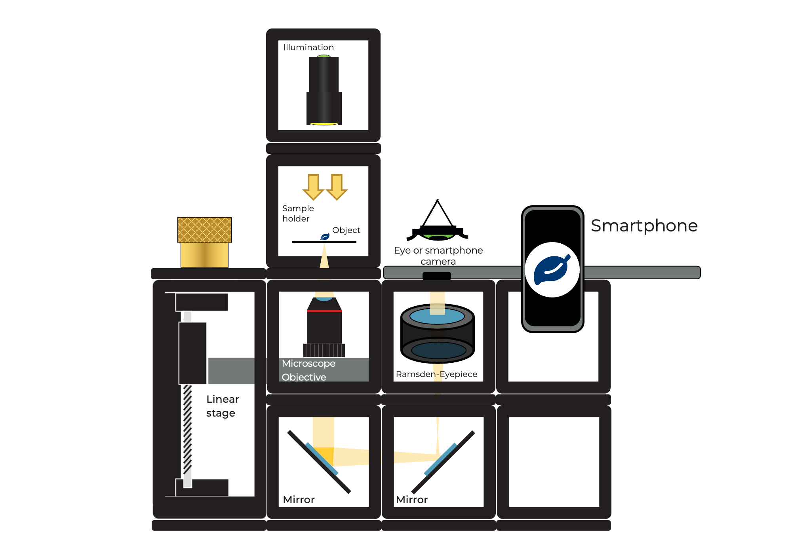
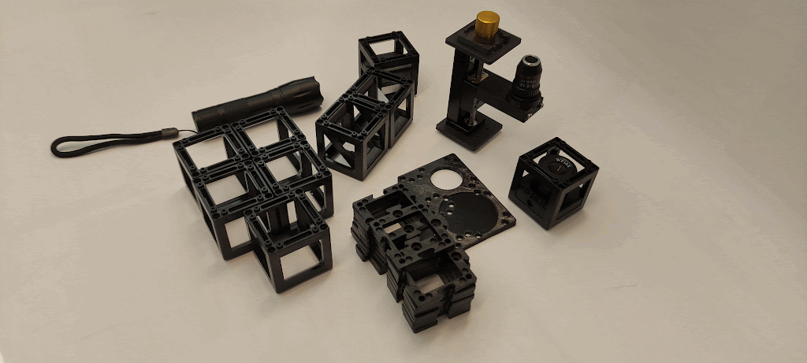
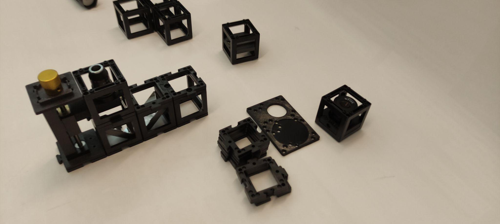
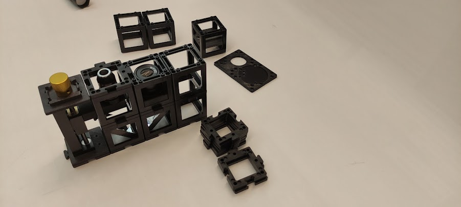
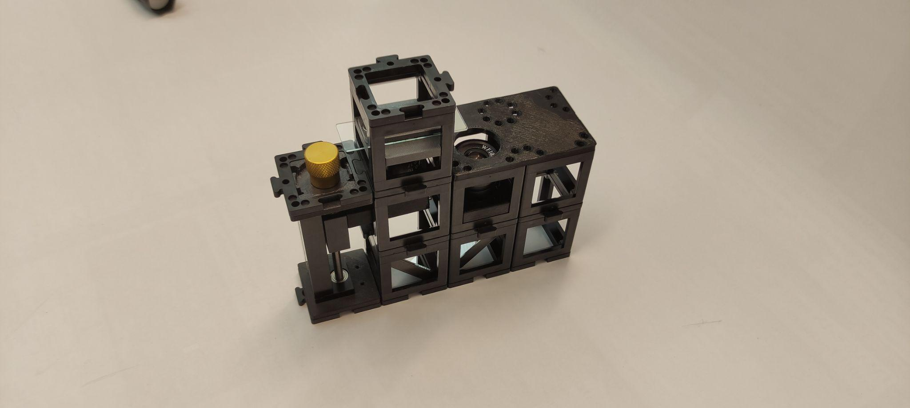
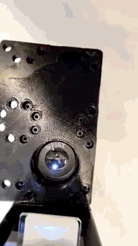

## Smartphone-Mikroskop

Baue das Smartphone-Mikroskop wie gezeigt auf. Verwende hier beliebige zwei Würfel, um das Smartphone sicher zu positionieren.

 

Baue das Mikroskop wie ein Sandwich, indem du eine zweite Ebene mit einer Bodenplatte hinzufügst. Schaue von oben durch das Okular.

 

Ersetze das Ramsden-Okular durch die 40-mm-Linse. Was ist besser für das Auge und was für das Smartphone?

 

## Anleitung: Smartphone-Mikroskop

### Benötigtes Material:

- Mikroskopobjektiv 4x  
- Mikroskopobjektiv-Halterung mit Zahnrad  
- Ramsden-Okular (im Würfel)  
- Zwei nicht-kinematische Spiegel (in Würfeln)  
- Probenhalter (im Würfel)  
- Drei leere Würfel  
- 11 Bodenplatten  
- Smartphone-Bodenplatte  
- Taschenlampenleuchte  
- 50 mm Linse (im Würfel)

### Aufbau (Seitenansicht):

## Anleitung zum Aufbau des Smartphone-Mikroskops:

Dieses Video zeigt dir, wie du das UC2-Smartphone-Mikroskop aufbaust, wie auch in der PDF-Anleitung beschrieben. Es zeigt einige Tricks, wie du es stabiler machst und wie du die Z-Achse bedienst.

  <iframe 
    style={{position: 'absolute', top: 0, left: 0, width: '100%', height: '100%'}}
    src="https://www.youtube.com/embed/q3-XW8Bfuww" 
    title="YouTube video player" 
    frameBorder="0" 
    allow="accelerometer; autoplay; clipboard-write; encrypted-media; gyroscope; picture-in-picture" 
    allowFullScreen
  />

**Schritt 1: Vier Bodenplatten in einer Linie anordnen**

**Schritt 2: Komponenten aufbauen**

Platziere die Halterung mit Mikroskopobjektiv an einem Ende, gefolgt von den beiden sich gegenüberliegenden Spiegeln, und einem leeren Würfel am anderen Ende. Fixiere sie mit Bodenplatten.

**Schritt 3: Objektiv justieren**

Baue einen Würfel mit dem Mikroskopobjektiv im Inneren. Justiere die Höhe des Objektivs bei Bedarf mit dem Zahnrad.

  
  

**Schritt 4: Okular platzieren**

Platziere das Okular neben dem Mikroskopobjektiv und einen leeren Würfel daneben. Achte auf die richtige Ausrichtung des Okulars.

**Schritt 5: Smartphone-Halter ausrichten**

Platziere die Smartphone-Halterung so, dass das Loch mit dem Okular übereinstimmt. Hinweis: Du kannst die Ausrichtung an dein Smartphone anpassen.

**Schritt 6: Probenhalter platzieren**

Platziere den Probenhalter-Würfel über dem Mikroskopobjektiv. Achte auf den Abstand zwischen beiden. Du kannst die Grobeinstellung durch Verschieben im Würfel und die Feineinstellung mit dem Zahnrad vornehmen.

**Schritt 7: Sammellinse und Lampe hinzufügen**

Platziere einen Würfel mit Sammellinse auf dem Probenhalter und die Taschenlampe darüber. Richte das Smartphone auf das Okular aus.

**Schritt 8: Schärfe einstellen**

Bewege das Smartphone so, dass der ganze Okularkreis ausgeleuchtet erscheint. Drehe dann das Zahnrad, bis du ein scharfes Bild des Präparats siehst.

## Besser mit Smartphone oder Auge?

Die Kamera des Smartphones besitzt eine Linse mit sehr kurzer Brennweite, da sie in das dünne Gehäuse passen muss. Diese Linse erzeugt ein Bild auf dem Sensor, dessen Eigenschaften dem menschlichen Auge ähneln.

Das Auge kann sowohl weit entfernte als auch nahe Objekte sehen – diese Fähigkeit nennt man Akkommodation.

Auch das Smartphone kann das – es nennt sich hier Autofokus. Das bedeutet, dass Objekte in unterschiedlichen Entfernungen scharf auf den Sensor abgebildet werden können.

Das Bild aus dem Okular besteht aus parallelen Lichtstrahlen – so als käme es aus dem Unendlichen. Du beobachtest mit entspanntem Auge (wie beim Blick in die Ferne) oder mit einer Kamera, die auf Unendlich fokussiert ist.

 

## Rechenergebnisse

