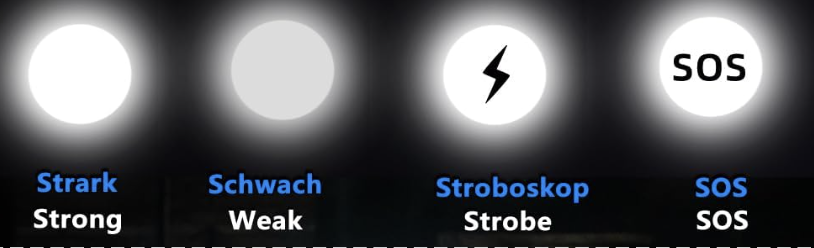
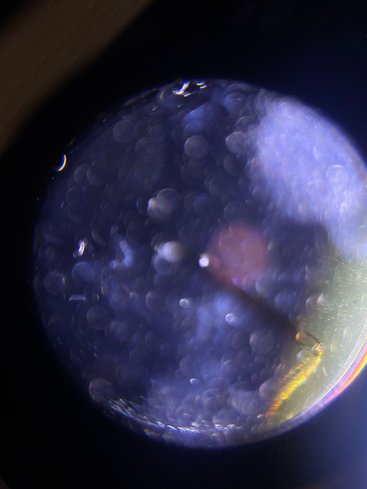

## Fehlerbehebung und Verbesserung des Smartphone-Mikroskops

Es kann vorkommen, dass das Bildergebnis nicht so gut aussieht, wie es aussehen könnte. Dafür bieten wir eine Reihe von Erklärungen an, um dies zu korrigieren.  
Insgesamt sollte der Aufbau mit den aktualisierten Komponenten ungefähr so aussehen:

## Perfekte Bildgebungsbedingung

## Falscher Taschenlampenmodus

  
  
- Die Taschenlampe hat eine seltsame Funktion zur Morsecode-Simulation – das ist nicht hilfreich. Drücke den Knopf ein paar Mal, um das hellste Licht aller Modi zu finden.
- Die Streifen, die du siehst, entstehen durch das Zusammenspiel der PWM-geregelten Helligkeit der Lampe und des Rolling Shutters der Kamera.

## Taschenlampe zu stark fokussiert

- Die Frontlinse der Taschenlampe kann fokussiert werden – bewege sie, um eine mehr oder weniger homogene Ausleuchtung der Probe zu erreichen. Dies entspricht der Köhler-Bedingung, wenn die LED im Fokus des verschiebbaren Kondensors liegt.

## Taschenlampe zu hell

  
- Verwende einen Diffusor oder ältere Batterien.

## Abstand zwischen Smartphone und Okular zu groß

  
  
- Stelle sicher, dass der Abstand zwischen Smartphone und Okular passt.
- Die Austrittspupille des Okulars muss mit der Eintrittspupille des Smartphones übereinstimmen.

## Schräger Winkel zwischen Taschenlampe und Probe (eine Art Dunkelfeld)

  
  
- Wenn du die Lichtquelle bewegst, siehst du Effekte wie Schatten oder Reliefs. Das liegt an der WOTF (Wave-Optical Transfer Function).

## Gute Bildgebung mit Diffusor zwischen Taschenlampe und Probe

  
- Inkohärente Beleuchtung reduziert den Kontrast, sorgt aber für eine schöne homogene Ausleuchtung.

## Überbelichtet, aber gute Bildgebung (Köhler-Beleuchtung)

## Schräge Beleuchtung (Dunkelfeld)

  
- Sehr schräge Beleuchtung – kein direktes Licht trifft auf den Kamerasensor.
