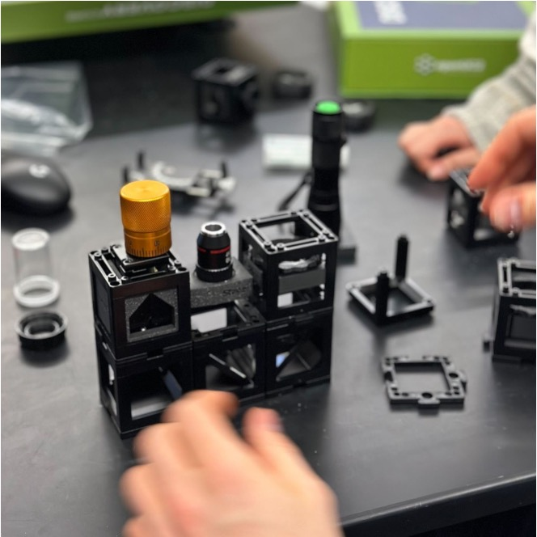

:::tip
Abbiamo compilato questo documento in un ***PDF*** che può essere scaricato <a href="/MINIBOX/Manual_Corebox_EM.pdf" target="_blank" >qui</a>
:::

# CoreBOX

**1. [Panoramica degli Esperimenti](coreBOXit#parte-1-esperimenti-ottici-di-base)**

**2. Approfondimento degli Esperimenti**

## Introduzione 
La CoreBOX è il nostro prodotto educativo di base e si concentra su 3 aspetti:

1. **Comprensione dell'ottica di base:** Aiutare gli studenti a comprendere e sperimentare l'ottica di base.
2. **Comprensione della microscopia di base:** Aiutare gli studenti a comprendere e sperimentare i primi esperimenti microscopici.
3. **Comprensione dei componenti UC2 di base:** Fornire una comprensione del nostro sistema di cubi come base per costruire configurazioni più complesse con le nostre scatole più sofisticate.

## Parte 1: Esperimenti Ottici di Base

### Panoramica: Quali esperimenti sono possibili?

Gli esperimenti sono divisi in due gruppi: **Ottica e Microscopia**. Con le parti incluse nella CoreBOX, possono essere eseguiti almeno 8 esperimenti.

| Ottica                           | Microscopia                                    |
|----------------------------------|-----------------------------------------------|
| Lente d'Ingrandimento           | Microscopio 1: Microscopio all'Infinito       |
| Lunghezze Focali                | Microscopio 2: Microscopio Finito con Z-Stage |
| Proiettore                      | Microscopio 3: Microscopio per Smartphone     |
| Telescopio 1: Telescopio di Galileo |                                          |
| Telescopio 2: Telescopio di Kepler  |                                          |

### Esperimento 1: Lente d'Ingrandimento

#### PARTI NECESSARIE
Lente da 50mm

#### CONFIGURAZIONE
Questo è molto semplice e non ha una vera configurazione. Gli studenti prendono una delle lenti da 50mm e guardano attraverso di essa.

#### OBIETTIVO:
In questo esperimento gli studenti vedono come una lente ingrandisce quello che guardano.

Maggiori dettagli possono essere trovati qui: [Lens-Wiki](https://openuc2.github.io/docs/Toolboxes/DiscoveryCore/ENGLISH/CoreLens/)

### Esperimento 2: Lunghezze Focali

#### PARTI NECESSARIE

- Lente da 50mm
- Lente da 100mm
- Lente da 50mm

#### CONFIGURAZIONE

Ora abbiamo bisogno di altre due lenti, ma ancora non è necessario alcun assemblaggio. Lo studente sceglie una geometria fissa, per esempio una lettera sulla carta della guida utente e la guarda attraverso le diverse lenti

#### OBIETTIVO:

Gli studenti dovrebbero rendersi conto di come le diverse lunghezze focali influiscono su quello che vedono attraverso la lente. Questa comprensione è la base per capire come la distanza tra diverse lenti influisce sulle configurazioni che costruiremo più tardi.

Maggiori dettagli possono essere trovati qui: [Lens-Wiki](https://openuc2.github.io/docs/Toolboxes/DiscoveryCore/ENGLISH/CoreLens/)

