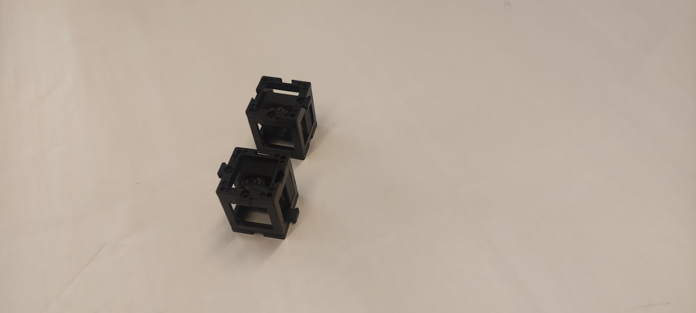
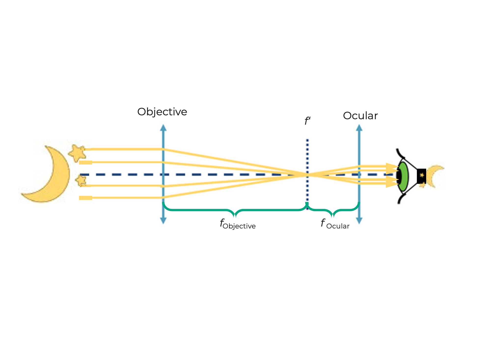
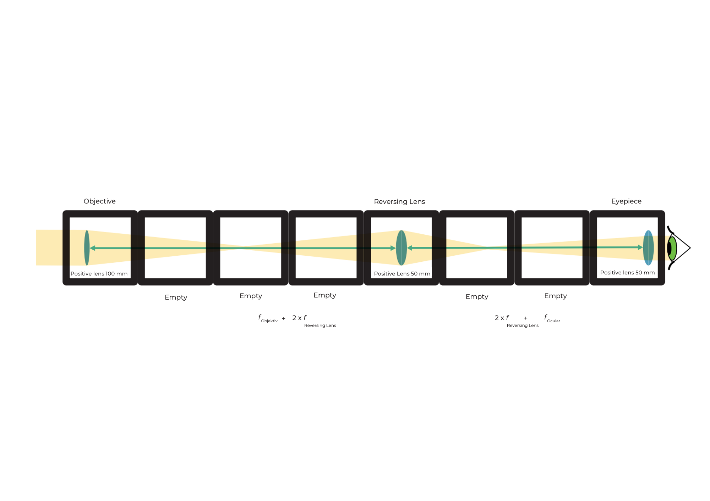
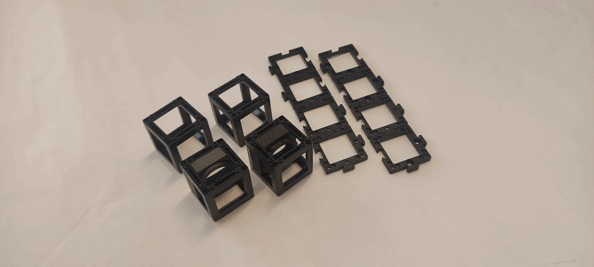
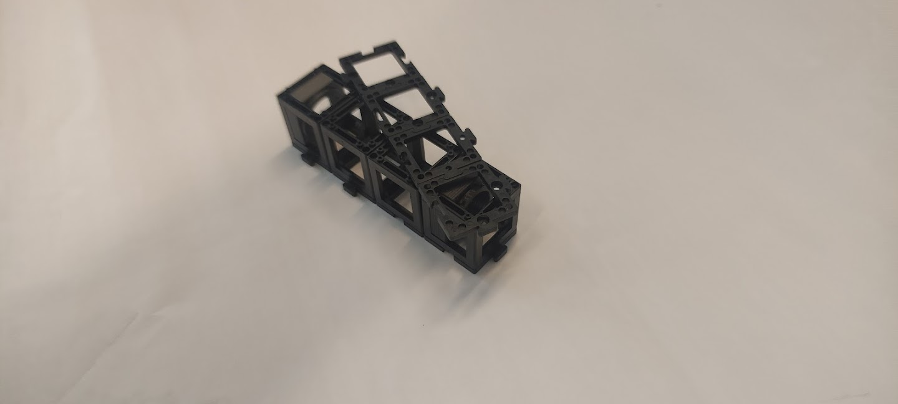

## Cos'è un telescopio di Galileo?
Durata: 10

Posiziona i cubi delle lenti sul foglio come mostrato nel diagramma, poi guarda attraverso il telescopio in lontananza.

Come appare l'immagine?
Come è orientata l'immagine?

 

Mentre guardi attraverso il telescopio, regola le distanze tra i componenti per vedere un'immagine nitida!

 

## Questo è un telescopio di Galileo

Un telescopio è uno strumento ottico che fa apparire gli oggetti distanti molte volte più vicini o più grandi.

La lente sul lato dell'oggetto è chiamata lente obiettivo.

La lente rivolta verso l'occhio è chiamata oculare.
Il telescopio di Galileo è usato anche nei binocoli da teatro.

## Ecco come funziona il telescopio di Galileo

Qual è l'ingrandimento di questo telescopio di Galileo?

Formula per calcolare l'ingrandimento

Non è possibile ottenere un ingrandimento molto alto con questo telescopio. Ma è molto compatto.

L'immagine è sempre

* Ingrandita con l'ingrandimento dalla formula sopra
* Dritta
* Correttamente orientata

Il campo visivo è piccolo.

 

## Tutorial: Telescopio di Galileo

### Materiali necessari:
- Quattro piastre di base
- Lente positiva da 100 mm (nel cubo)
- Lente negativa da -50 mm (nel cubo)

### Diagramma (vista laterale):

### Istruzioni per assemblare il telescopio di Galileo:

**Passo 1: Posiziona le piastre di base sopra**

Posiziona una piastra di base sopra ogni cubo lente.

**Passo 2: Posiziona le piastre di base sotto**

Posiziona una piastra di base sotto ogni cubo lente.

**Passo 3: Assembla i cubi**

Assembla i due cubi in modo che la distanza tra le superfici delle lenti sia la massima.

**Passo 4: Regola la distanza delle lenti**

Regola la distanza tra lente negativa e positiva al massimo possibile.

**Passo 5: Usa il telescopio!**

Cerca un oggetto in distanza e usa il telescopio di Galileo per guardarlo.

## Cos'è un telescopio di Kepler?

Imposta le lenti nelle posizioni corrette come mostrato nel diagramma. Poi guarda attraverso il telescopio in lontananza.

Come appare l'immagine?
Come è orientata l'immagine?

 

Mentre guardi attraverso il telescopio, varia le distanze tra i componenti per vedere un'immagine così nitida!

 

## Questo è un telescopio di Kepler

Questo tipo di telescopio è spesso usato in astronomia.

## Ecco come funziona il telescopio di Kepler

Qual è l'ingrandimento di questo telescopio di Kepler?

Formula per calcolare l'ingrandimento

Questo telescopio può ottenere un ingrandimento più alto del telescopio Galileiano. Ma crea l'immagine opposta. Tuttavia, questo non è un problema per osservare le stelle.

L'immagine è sempre

* Ingrandita dall'ingrandimento dalla formula sopra
* Invertita
* Lati invertiti

Il campo visivo è
più grande che con il telescopio di Galileo.

 

## Tutorial: Telescopio di Kepler

### Materiali necessari:
- Otto piastre di base
- Lente positiva da 100 mm (nel cubo)
- Lente positiva da 50 mm (nel cubo)
- Due cubi vuoti

### Diagramma (vista laterale):

### Istruzioni per assemblare il telescopio di Kepler:

**Passo 1: Allinea i cubi**

Allinea i cubi in modo che le due lenti siano agli estremi e i due cubi vuoti al centro.

**Passo 2: Fissa i cubi con piastre di base**

Fissa i cubi con le piastre di base posizionandole sopra e sotto.

**Passo 3: Regola la distanza**

Regola la distanza tra le lenti come mostrato nell'immagine.

**Passo 4: Usa il telescopio di Kepler**

Cerca un oggetto in distanza e usa il telescopio di Kepler per guardarlo.

## Cos'è un cannocchiale terrestre?

Il cannocchiale terrestre è lungo, quindi lo schema non è della stessa dimensione.
Imposta le lenti nelle posizioni corrette come mostrato nel diagramma e guarda in lontananza attraverso il telescopio.

che risulta in

Come si confronta l'immagine qui con il telescopio di Kepler?

 

Mentre guardi attraverso il telescopio, regola le distanze tra i componenti per vedere un'immagine nitida!

 

## Ecco come funziona il cannocchiale terrestre

L'ingrandimento è come quello del telescopio di Kepler. La lente raddrizzante cambia solo l'orientamento (l'immagine è invertita), non l'ingrandimento.

Un'immagine dritta è necessaria per le osservazioni terrestri. I veri telescopi terrestri usano sistemi di prismi per ruotare l'immagine e mantenerla compatta.

L'immagine è

* Ingrandita con lo stesso ingrandimento del telescopio di Kepler
* Dritta
* Speculare

 