## Lentes

En la óptica de rayos, la luz se representa como un conjunto de rayos (flechas), lo que simplifica las propiedades físicas de la luz. Un rayo tiene una dirección y, por lo tanto, se dibuja con una flecha. Una lente "refracta" el rayo, cambiando su dirección.

La **distancia focal** de una lente corresponde a la distancia desde la lente hasta el plano focal en el que se encuentra el punto focal. Se indica en milímetros (f = mm).

### Lentes convergentes (positivas) y divergentes (negativas)

Las lentes convergentes refractan los rayos de luz que viajan paralelos al eje óptico en un punto llamado punto focal.

Las lentes divergentes refractan los rayos de luz que viajan paralelos al eje óptico como si provinieran de un punto llamado foco "virtual".

## Las lentes “refractan” los rayos de luz

Puedes encontrar la distancia focal de la lente como un número impreso en el soporte de la lente. La MiniBOX incluye una lente convergente de 100 mm, dos lentes convergentes de 40 mm y una lente negativa de -50 mm. Los números indican la distancia focal.

La lente convergente también se llama lente positiva o convexa. La parte central de la lente es siempre más gruesa que los bordes.

La lente convergente amplía la imagen. El aumento es diferente para la lente de 40 mm y la de 100 mm. La imagen puede estar derecha o invertida.

 

La lente negativa (lente divergente) a veces también se llama lente negativa o cóncava. La parte central de la lente es siempre más delgada que los bordes.

Con la lente negativa (aquí: lente de -50 mm) la imagen siempre está reducida y siempre está derecha.

 

Suponemos que nuestras lentes son las llamadas "lentes delgadas". Esto significa que podemos considerarlas como un plano único y no preocuparnos por su grosor. Esto hace que las explicaciones y cálculos sean mucho más fáciles.

¿Las respuestas te generaron más preguntas? Entonces investiga exactamente cómo funcionan las lentes...

 

## Imagen con una lente

Ahora toma los cubos de lente. Con la lente adecuada, intenta descifrar la información de distancia focal en los cubos mostrados. Mueve la lente sobre la escritura hasta que sea del mismo tamaño que el texto "UC2".

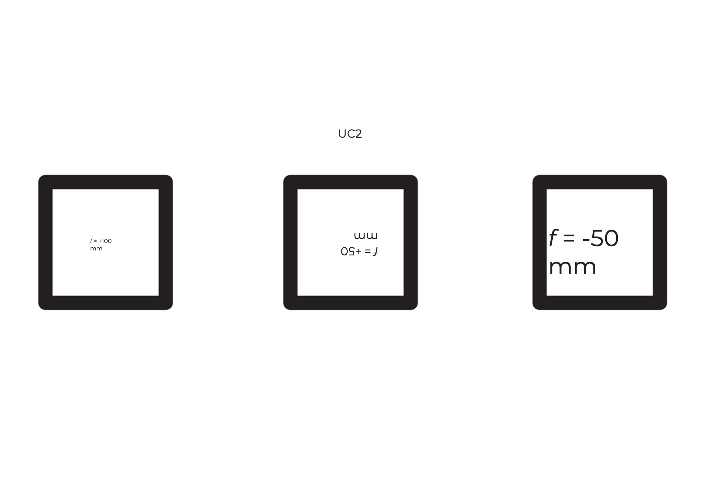

¿Puedes ver el texto con el mismo tamaño y orientación que "UC2"? ¿Qué sucede cuando cambias la distancia entre la lente y la imagen?

 

¿Qué sucede si usas una lente con la distancia focal equivocada?

 

## Imagen de un objeto a través de una lente positiva

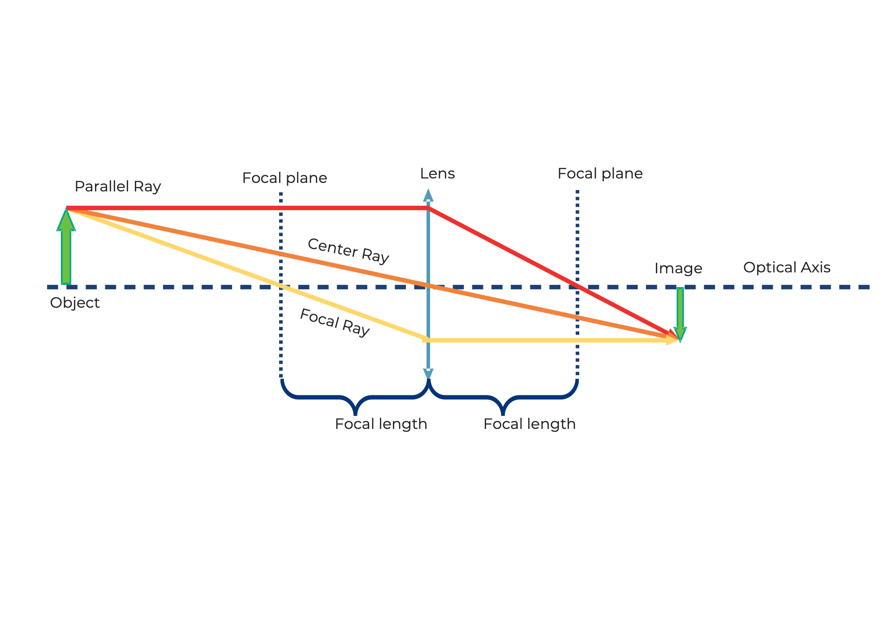

Tomemos la lente convergente como ejemplo. Comenzamos con un objeto (flecha verde) y observamos qué sucede con los rayos que parten de la parte superior. Hay infinitos rayos en todas las direcciones, pero para el dibujo, bastan los siguientes tres:

1. El **rayo central** (naranja) pasa sin desviarse por el centro de la lente.
2. El **rayo focal** (amarillo) también comienza en la punta de la flecha, pero pasa por el foco del lado del objeto a una distancia focal f. Después de la lente, continúa a la misma altura, pero ahora paralelo al eje óptico.
3. El **rayo paralelo** (rojo) inicialmente corre paralelo al eje óptico, pero luego se refracta en la lente de modo que pasa por el punto focal del lado de la imagen a la distancia f.

La imagen se forma donde todos los rayos se cruzan. Este principio se aplica para todos los puntos o rayos que emanan de un objeto. Dependiendo de qué lente se use y de la posición del objeto, las propiedades de la imagen cambian, como tamaño, orientación y posición.

## Imagen de un objeto a través de una lente negativa

En el caso de la lente negativa, usamos el mismo método para representar la trayectoria de los rayos. A diferencia del caso de la lente convergente, la imagen siempre está reducida y es virtual. La magnificación depende de la posición del objeto frente a la lente. A diferencia de la lente convergente, la imagen se crea en el lado del objeto y por lo tanto se llama imagen virtual. Puedes verla directamente con tus ojos, pero no proyectarla sobre una pantalla.

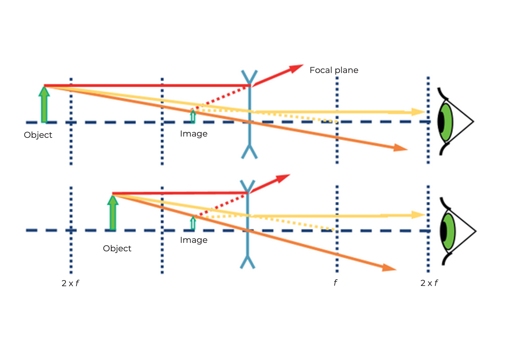

La forma en que una lente crea una imagen se puede predecir conociendo su distancia focal. Por lo tanto, debe mantenerse una cierta distancia para poder ver la escritura con la lente especificada en la hoja anterior.

 

La magnificación y el lugar donde se forma la imagen dependen de la distancia focal de la lente y de la distancia entre la lente y el objeto.

 

Con la lente divergente (f = -50 mm) siempre ves una imagen virtual reducida. Una imagen virtual solo puede verse con el ojo. Hasta ahora solo hemos visto imágenes virtuales.

 

## La lente convergente como lupa

Toma el cubo de lente UC2 con distancia focal f = 40 mm y úsalo como lupa.

¿Puedes leer las letras pequeñas a través de la lente convergente? ¿Qué está escrito allí?

 

Una lente en acción se puede ver aquí:

<iframe width="560" height="315" src="https://www.youtube.com/embed/rCtZjRKU8" title="YouTube video player" frameborder="0" allow="accelerometer; autoplay; clipboard-write; encrypted-media; gyroscope; picture-in-picture" allowfullscreen></iframe>

## Esto es lo que hacen las lentes convergentes

Con las lentes convergentes, la imagen y la magnificación dependen de la posición del objeto.

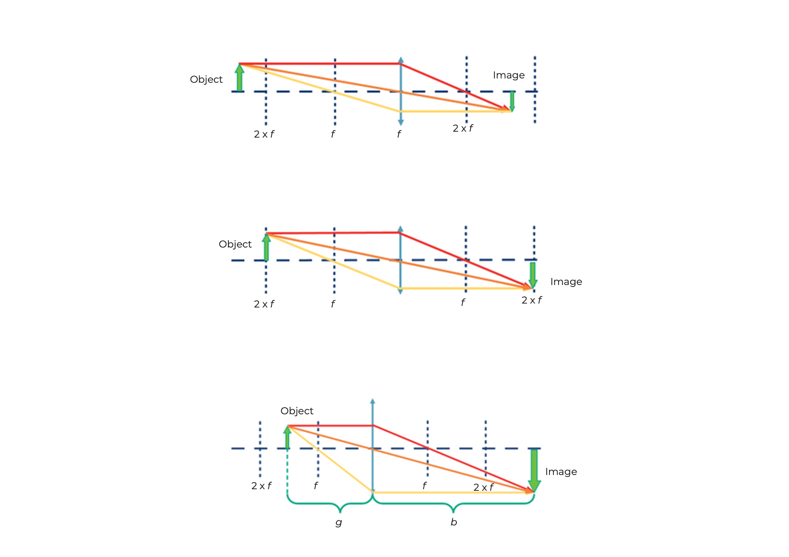

Si la distancia entre el objeto y la lente es más del doble de la distancia focal de la lente, entonces la imagen es...
- Invertida
- Invertida lateralmente
- Reducida
- Real

Si la distancia entre el objeto y la lente es exactamente el doble de la distancia focal, entonces la imagen es...
- Invertida
- Invertida lateralmente
- Del mismo tamaño
- Real

Si la distancia entre el objeto y la lente es mayor que la distancia focal y menor que el doble de la distancia focal, entonces la imagen es...
- Invertida
- Invertida lateralmente
- Ampliada
- Real

### Distancia del objeto (g)
La distancia entre el objeto y el plano de la lente se llama g.

### Distancia de la imagen (b)
La distancia entre el plano de la lente y la imagen formada por la lente se denomina b.

La lente convergente puede producir una imagen real. La imagen real puede verse en una pantalla.

## Por eso la lupa amplía

### ¡Efecto lupa!

Si la distancia entre el objeto y la lente es menor que la distancia focal de la lente, entonces la imagen es...
- Derecha
- Correctamente orientada
- Ampliada
- Virtual

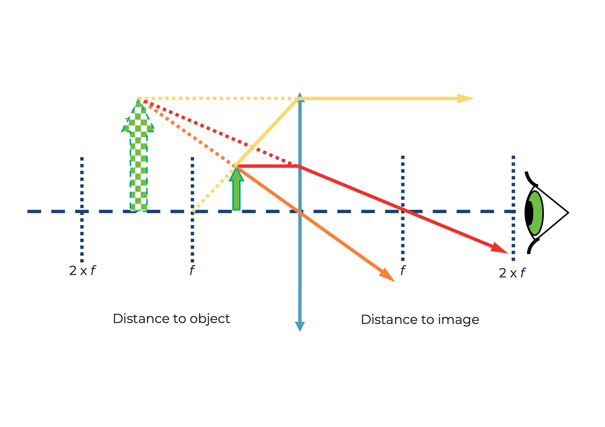

La lupa es el dispositivo óptico más simple, ya que consiste solo en una lente convergente con una distancia focal adecuada. ¿Por qué el cubo con la lente de 50 mm amplía el texto pequeño? Si el objeto está dentro de la distancia focal de la lente – es decir, a menos de 50 mm de la lente – la lente crea una imagen virtual que está detrás del objeto real. El ojo la percibe ampliada. Consulta el diagrama anterior.

 

Calcula la magnificación de la lupa usando la siguiente fórmula:

250 mm es la distancia de visión clara – es decir, la distancia entre el objeto y el ojo a la que la mayoría de las personas pueden leer bien. Más sobre esto en la sección de “acomodación” del ojo.

## ¿Cómo funciona un proyector de cine?

Toma el cubo de lente UC2 con distancia focal f = 40 mm y colócalo detrás del cubo portamuestras. La distancia entre el objeto y la lente (es decir, la distancia del objeto g) debe ser de aproximadamente 50 mm. Si ahora iluminas el objeto con la linterna, lo verás enfocado a una distancia de aprox. 200 mm en la pared. Un proyector de cine tiene una tira de película en lugar del objeto y, por supuesto, una fuente de luz mucho más potente.

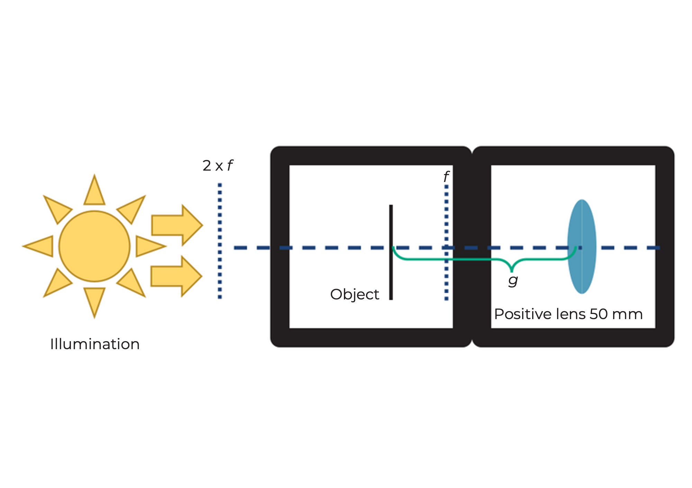

Utiliza una linterna (por ejemplo, la de tu móvil) como fuente de luz y colócala delante del objeto

 

Utiliza la imagen o el texto en la portaobjeto como objeto

 

¿Cómo está orientada la imagen? Mueve la lente hacia adelante y hacia atrás en el cubo y observa cuándo la imagen está enfocada. Encuentra la imagen para g = 50 mm, 60 mm, 65 mm y mide la distancia entre la lente y la imagen.

 

## ¿Cómo funciona un proyector de cine?

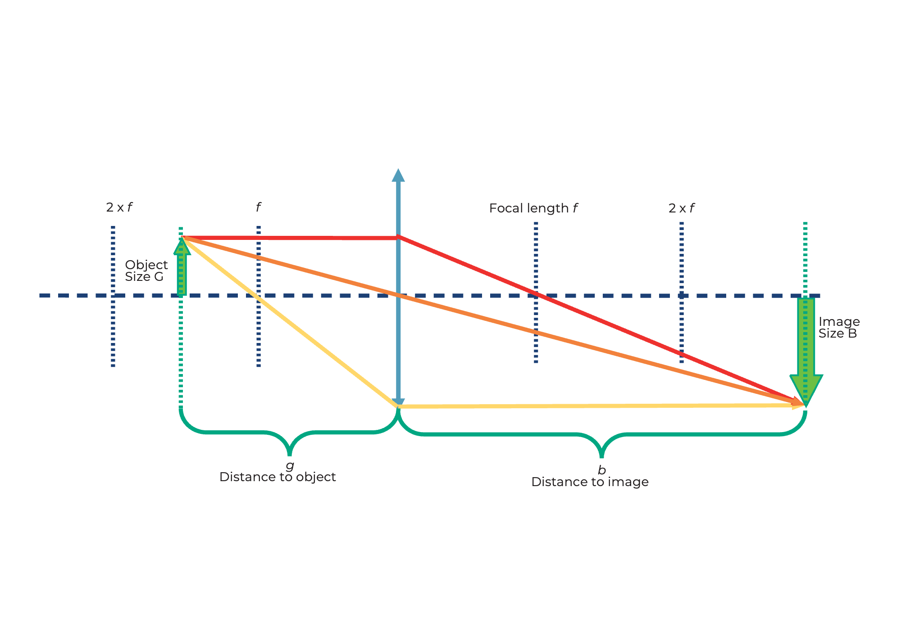

### ¿Dónde está la imagen?
Cuando un objeto se representa a través de una lente convergente, la posición y el tamaño de la imagen dependen de la distancia (g) del objeto a la lente y de su distancia focal (f).  
La ecuación de la lente describe la relación entre la distancia de la imagen (b) y la distancia del objeto (g):

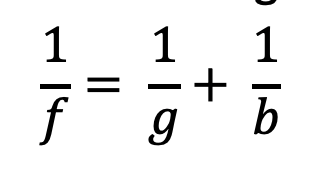

### ¿Qué tamaño tiene la imagen?
La ampliación del objeto en la pantalla se puede calcular fácilmente con la siguiente fórmula:

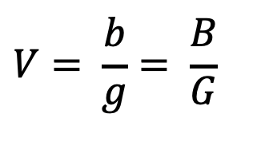

## Cómo funciona el proyector

Verifica si tu observación concuerda con el cálculo

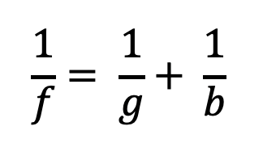

Calcula la ampliación del proyector para los diferentes valores de g y b.

Nuestra lente tiene una distancia focal de f = 40 mm.

Para g = 50 mm → b = 200 mm

Para g = 60 mm → b = 120 mm

Para g = 65 mm → b = 104 mm

 

El proyector siempre produce una imagen ampliada e invertida (al revés).  
La posición de la imagen y su magnificación dependen de la posición y tamaño del objeto.

 

## Tutorial: Determinar la distancia focal de una lente positiva

### Materiales necesarios:
- Fuente de luz (por ejemplo, la iluminación de la sala)
- Lente positiva
- Pantalla (por ejemplo, una mesa, una hoja de papel, etc.)

### Instrucciones:
1. Coloca la lente positiva de modo que mire hacia la fuente de luz. Alinea una pantalla paralela al plano focal de la lente.
2. Modifica la distancia entre la lente y la pantalla.
3. Observa cuidadosamente y anota la posición en la que la fuente de luz forma una imagen nítida en la superficie de la pantalla.

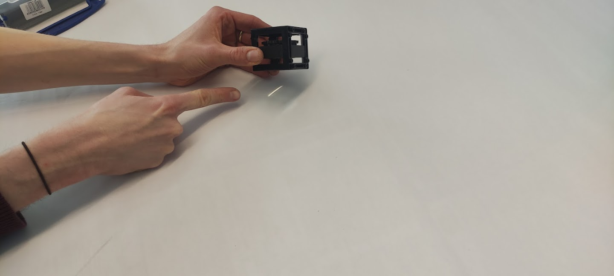
