## ¿Qué es un telescopio de Galileo?
Duración: 10

Coloca los cubos de lentes sobre la base como se muestra en el diagrama, luego mira a través del telescopio hacia la distancia.

¿Cómo se ve la imagen?  
¿Cómo está orientada la imagen?

 

¡Mientras miras a través del telescopio, ajusta las distancias entre los componentes para ver una imagen nítida!

 

## Este es un telescopio de Galileo

Un telescopio es un instrumento óptico que hace que los objetos lejanos parezcan mucho más cercanos o grandes.

La lente del lado del objeto se llama lente objetivo.

La lente que está frente al ojo se llama ocular.  
El telescopio de Galileo también se utiliza en los binoculares de ópera.

## Así funciona el telescopio de Galileo

¿Cuál es el aumento de este telescopio de Galileo?

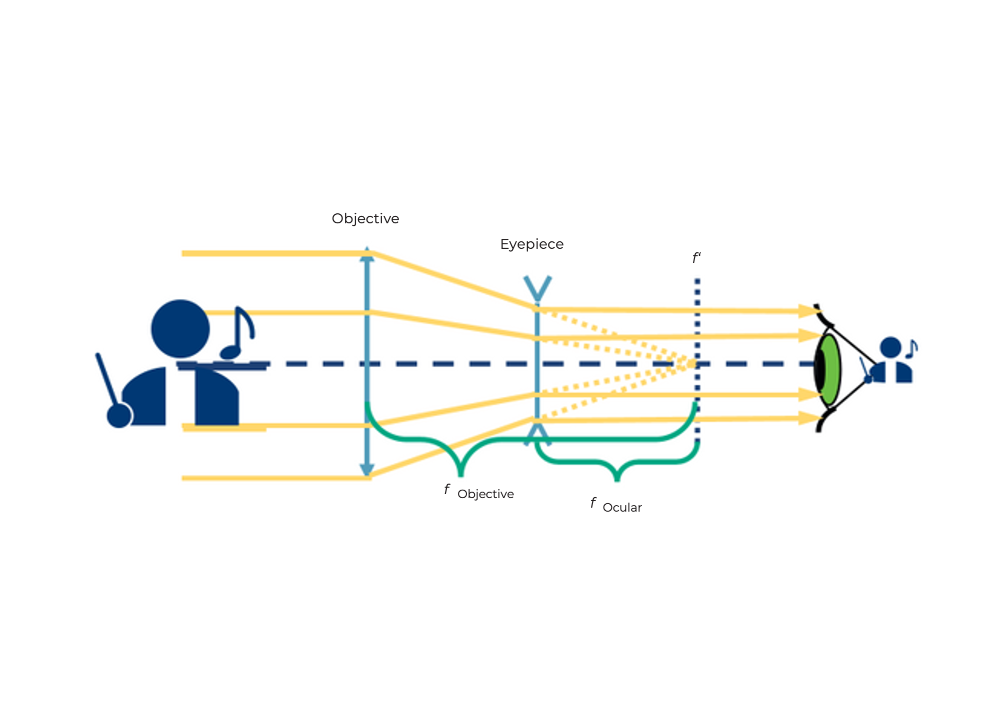

Fórmula para calcular el aumento

No es posible alcanzar un aumento muy alto con este telescopio. Pero es muy compacto.

La imagen es siempre:

* Ampliada según la fórmula anterior  
* Vertical  
* No invertida

El campo de visión es pequeño.

 

## Tutorial: Telescopio de Galileo

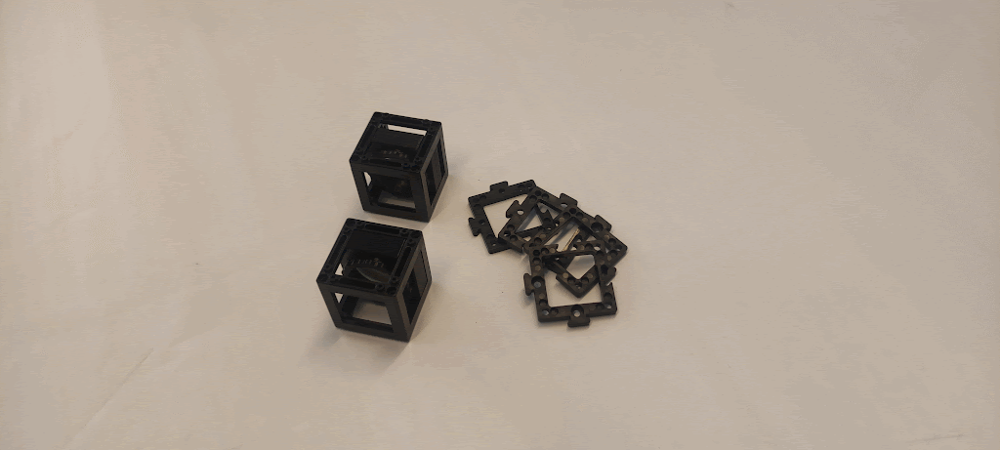

### Materiales necesarios:
- Cuatro placas base  
- Lente positiva de 100 mm (en cubo)  
- Lente negativa de -50 mm (en cubo)

### Diagrama (vista lateral):
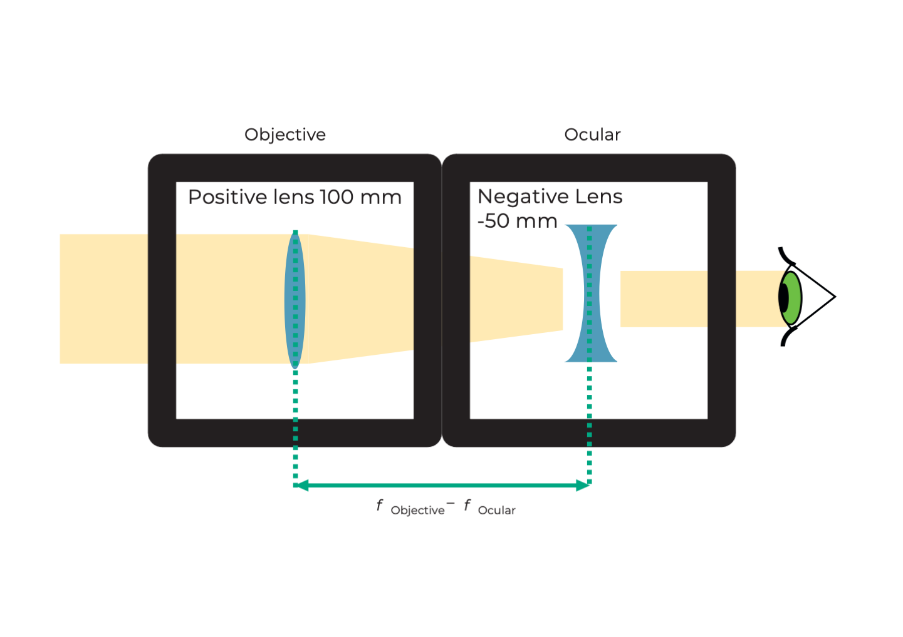

### Instrucciones para ensamblar el telescopio de Galileo:

**Paso 1: Coloca las placas base en la parte superior**

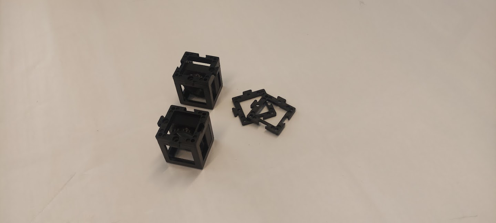  
Coloca una placa base en la parte superior de cada cubo de lente.

**Paso 2: Coloca las placas base en la parte inferior**  
  
Coloca una placa base en la parte inferior de cada cubo de lente.

**Paso 3: Ensambla los cubos**  
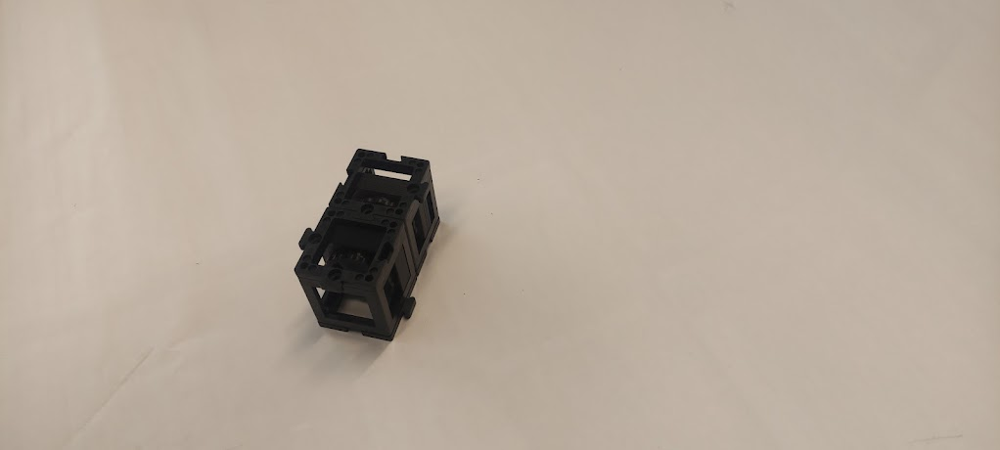  
Ensambla los dos cubos de manera que la distancia entre las superficies de las lentes sea la mayor posible.

**Paso 4: Ajusta la distancia entre las lentes**  
  
Ajusta la distancia entre la lente negativa y la positiva al máximo posible.

**Paso 5: ¡Usa el telescopio!**  
  
Busca un objeto en la distancia y utilízalo para observarlo con el telescopio de Galileo.

## ¿Qué es un telescopio de Kepler?

Coloca las lentes en las posiciones correctas como se muestra en el diagrama. Luego mira a través del telescopio hacia la distancia.

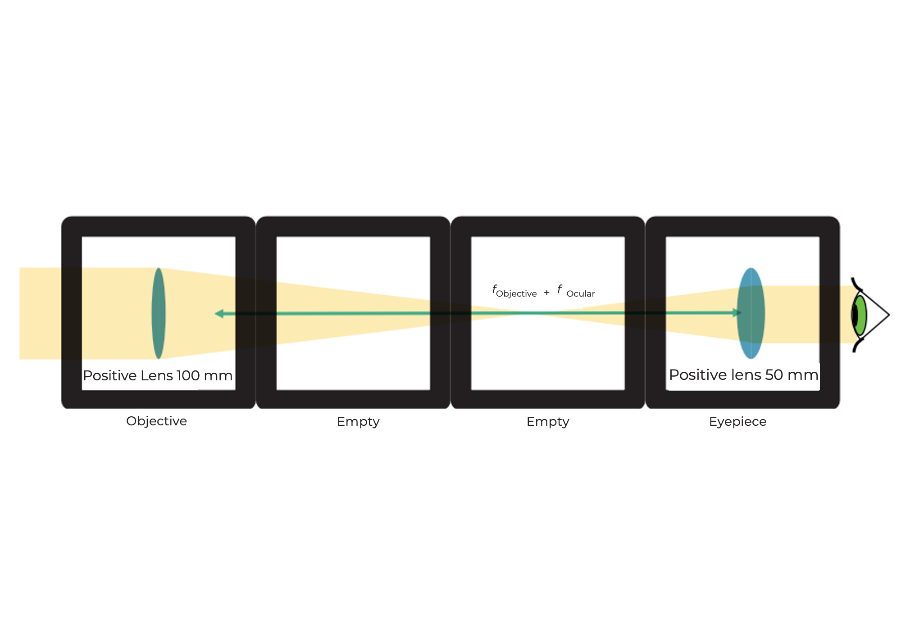

¿Cómo se ve la imagen?  
¿Cómo está orientada la imagen?

 

¡Mientras miras a través del telescopio, ajusta las distancias entre los componentes para ver una imagen nítida!

 

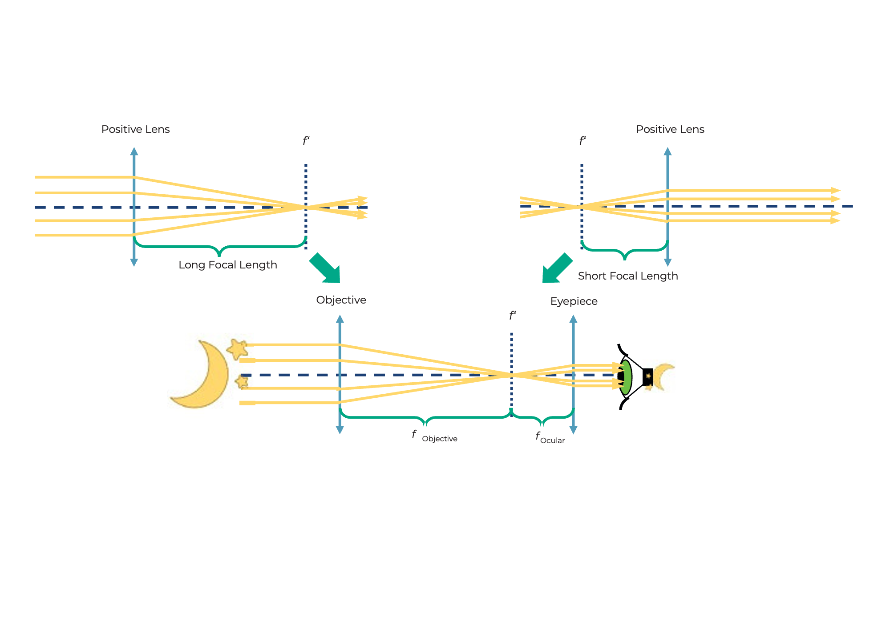

## Este es un telescopio de Kepler

Este tipo de telescopio se utiliza a menudo en astronomía.

## Así funciona el telescopio de Kepler

¿Cuál es el aumento de este telescopio de Kepler?

Fórmula para calcular el aumento

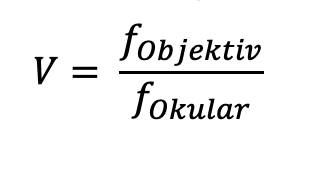

Este telescopio puede alcanzar un mayor aumento que el telescopio de Galileo. Pero genera una imagen invertida. Sin embargo, esto no es un problema para la observación de estrellas.

La imagen es siempre:

* Ampliada según la fórmula anterior  
* Invertida  
* Lado izquierdo y derecho intercambiados

El campo de visión es mayor que el del telescopio de Galileo.

 

## Tutorial: Telescopio de Kepler

### Materiales necesarios:
- Ocho placas base  
- Lente positiva de 100 mm (en cubo)  
- Lente positiva de 50 mm (en cubo)  
- Dos cubos vacíos

### Diagrama (vista lateral):

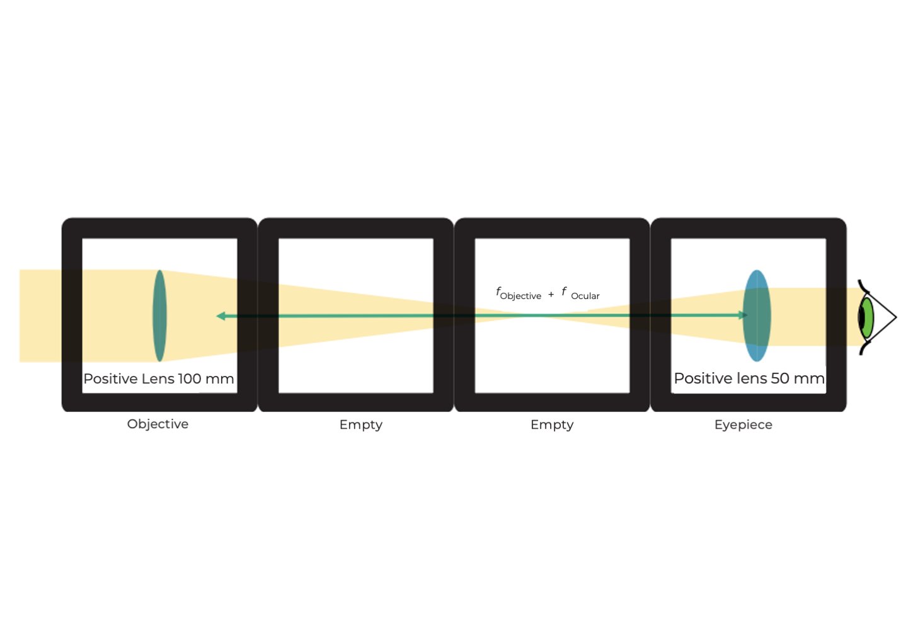

### Instrucciones para ensamblar el telescopio de Kepler:

**Paso 1: Alinear los cubos**

Alinea los cubos de modo que las dos lentes estén en los extremos y los dos cubos vacíos en el centro.

**Paso 2: Fijar los cubos con placas base**

Fija los cubos con las placas base colocándolas arriba y abajo.

**Paso 3: Ajustar la distancia**

Ajusta la distancia entre las lentes como se muestra en la imagen.

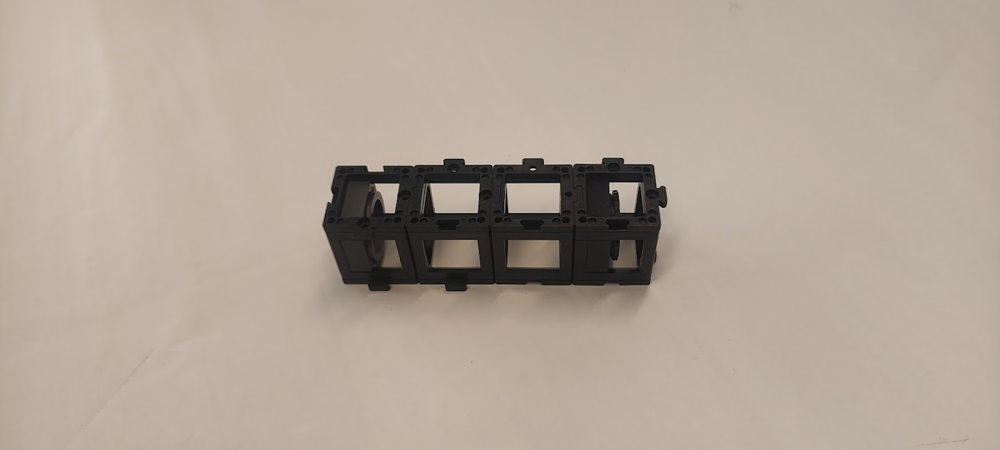

**Paso 4: Usar el telescopio de Kepler**

Busca un objeto a lo lejos y obsérvalo con el telescopio de Kepler.

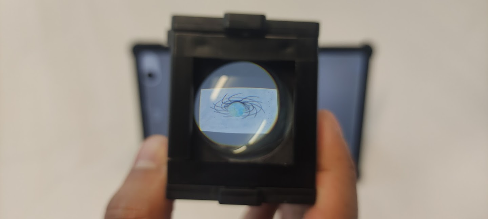

## ¿Qué es un telescopio terrestre?

El telescopio terrestre es largo, por lo que el esquema no está a escala real.  
Coloca las lentes en las posiciones correctas como se muestra en el diagrama y mira a lo lejos a través del telescopio.

lo que resulta en

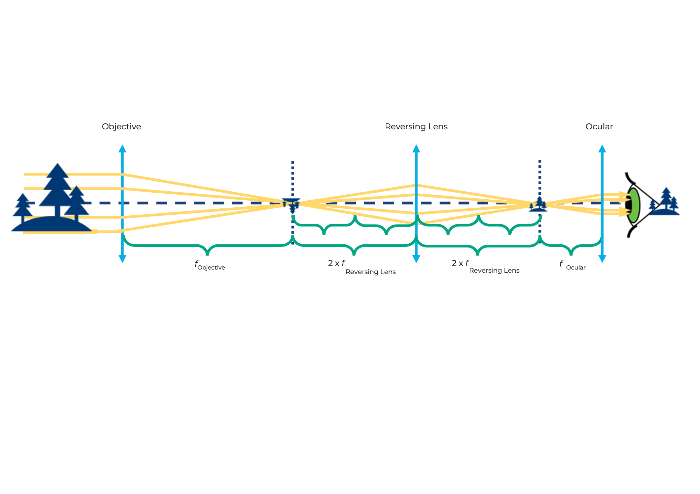

¿Cómo se compara la imagen aquí con la del telescopio de Kepler?

 

¡Mientras miras a través del telescopio, ajusta las distancias entre los componentes para ver una imagen nítida!

 

## Así funciona el telescopio terrestre

El aumento es como el del telescopio de Kepler. La lente erectora solo cambia la orientación (la imagen se invierte), no el aumento.

Una imagen derecha es necesaria para observaciones terrestres. Los verdaderos telescopios terrestres utilizan sistemas de prismas para rotar la imagen y mantenerla compacta.

La imagen es:
* Ampliada con el mismo aumento que el telescopio de Kepler  
* Vertical  
* Espejada
