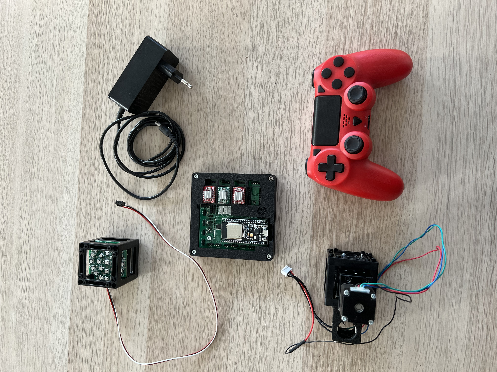
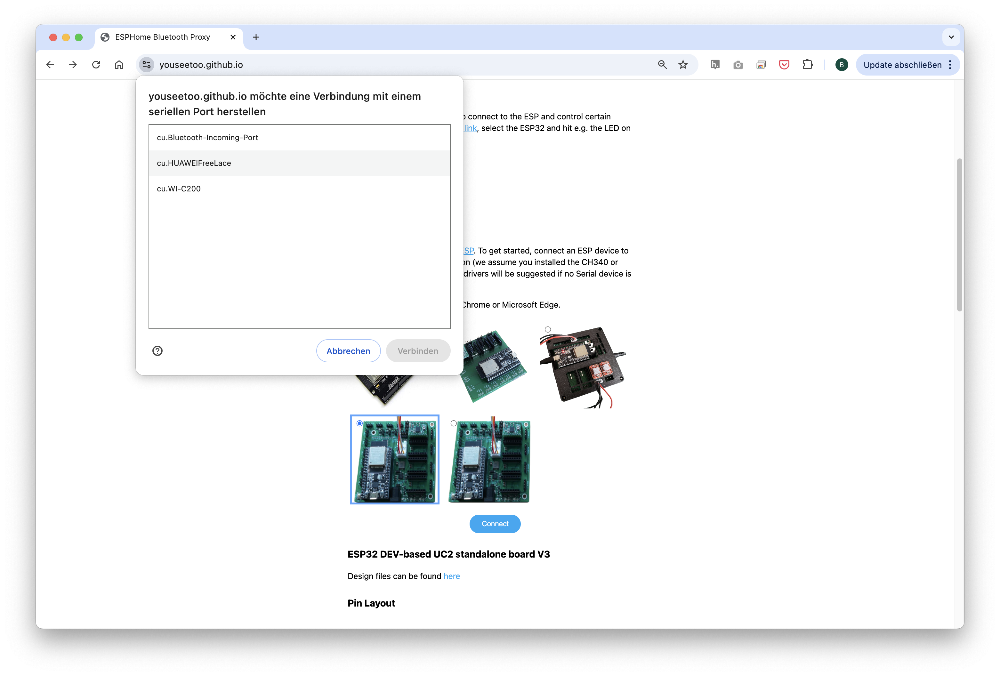
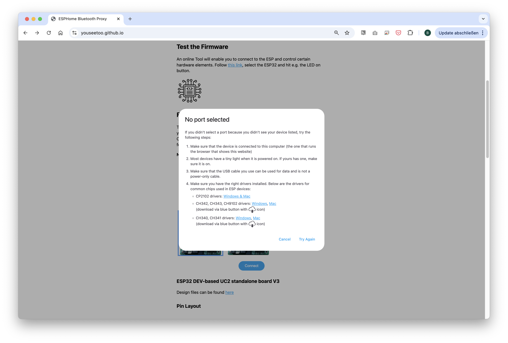
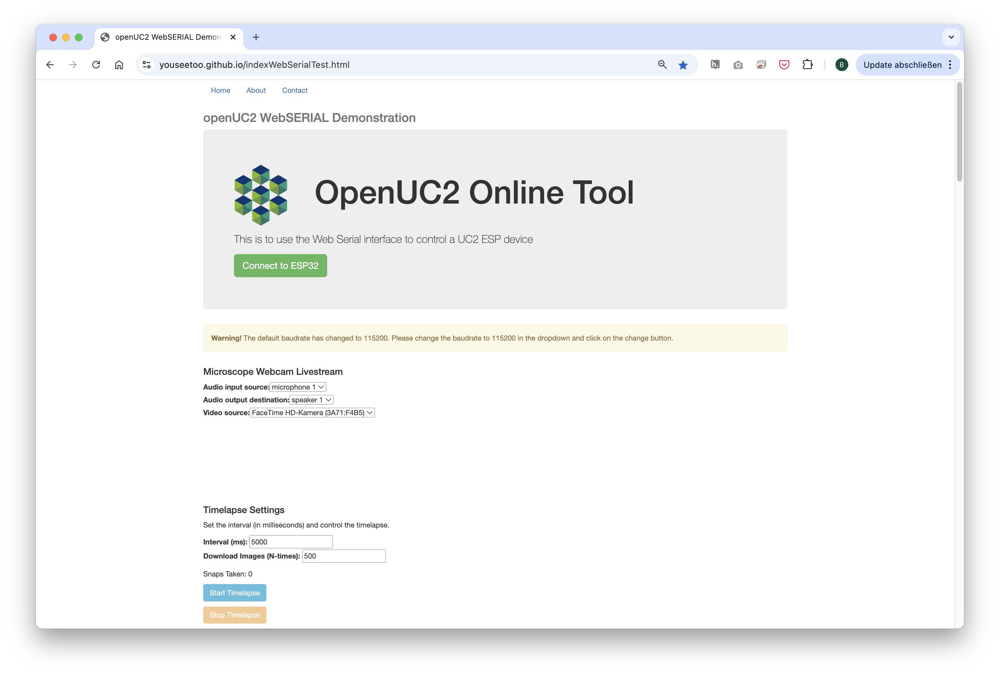
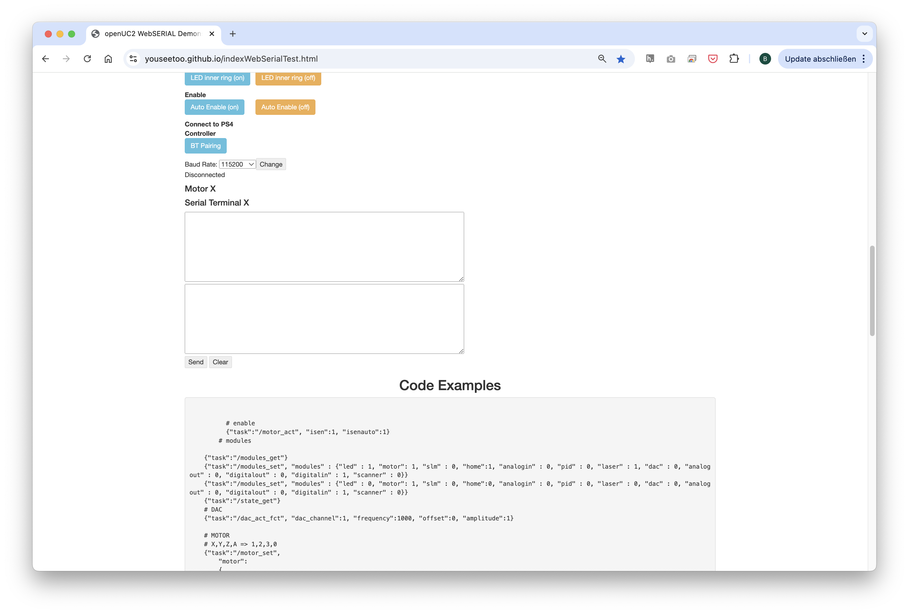
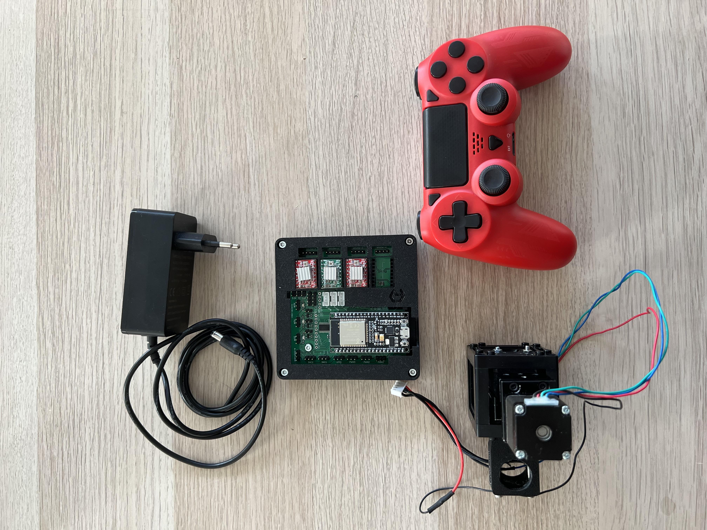
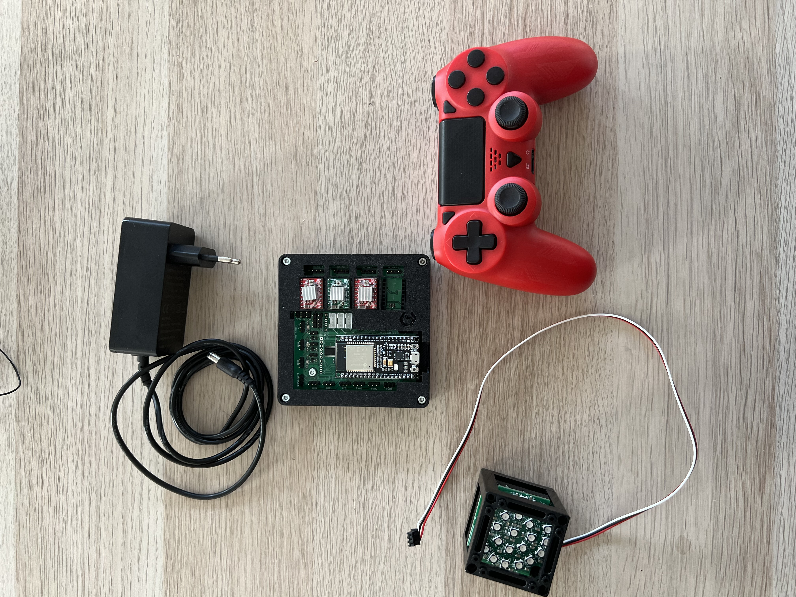

# openUC2 Discovery Electronics Kit - Extended Tutorial


## Introduction

The openUC2 Discovery Electronics Kit empowers users to explore advanced microscopy techniques by combining geometric optics and automation. By utilizing affordable, modular components, this kit allows you to build a fully functioning digital microscope with smart features. It’s an ideal learning tool for educators, students, and hobbyists interested in microscopy, optics, and electronics.


*Electronics components to have a lot of fun with open-source fully automated microscopy*

This tutorial will guide you through building and operating a motorized microscope. By the end of this experiment, you’ll understand how to control a motorized Z-stage for precise focusing, use an LED array for illumination, and experiment with digital contrast methods.

### Applications
This kit is perfect for classrooms or workshops where participants learn how to build and program optical systems. With the added automation, it’s also useful for research projects needing consistent imaging over time or where manual focus and lighting adjustments are too cumbersome. This could include biology labs, maker spaces, or environments that foster innovation in digital imaging.

---
## Components Included in the Kit:

### In Cubes:
2. **Motorized Z-Stage** (NEMA 11 stepper motor)
3. **openUC2 LED Array** (3 concentric circles with NeoPixels)

### Not in Cubes:
1. **Objective Lens** (RMS compatible, 10x finite)
2. **openUC2 Electronic Board** (ESP32-based control unit)
4. **Micro USB Cable** (for connecting ESP32)
4. **USB-C Cable** (for connecting LED Array)
5. **Controller** (PlayStation-style)
6. **12V Power Supply** (to power motors and lights)
4. **Baseplates** (8x for modular setup)


---

## Experiment #1: Testing the USB Serial Interface via the Web

In this first experiment, we’ll walk through how to control the motorized Z-stage and LED array using the web-based serial interface.

### Step 1: Hardware Setup for Testing and controlling the Z-focus Motor
**⚠️ Caution!**
If you need to change any of the cables or their position, always unplug
 the 12V power cable before doing so. Otherwise, the electronic
components might get damaged!

**⚠️**
These instructions based on the Pin-layout of the **ESO32-DEV-based UC2 standalone board V3 (beta)**)
find the Pin-layout for the **ESO32-DEV-based UC2 standalone board V4** [here](https://openuc2.github.io/docs/Electronics/UC2StandaloneBoard/uc2e2v4)

- connect the LED-Matrix to the Mainboard at `LED1`
- Connect the Z-stage to the position `Z-Motor` on the main board. Ensure there's a motor driver.
- Plug in the micro-USB at your ESP32 and connect to your PC.
- Plug in the 12V power cable.

### Step 2: Flashing the ESP32 Firmware
1. Before proceeding, ensure your ESP32 board has the latest firmware. You can download and flash the firmware via the official [openUC2 website](https://youseetoo.github.io/), selecting the your version, then then click on the connect button.

<p align="center">
  
  <br />
  <em>Flashing process shown for the ESP32-DEV-based UC2 standalone board V3 (beta).</em>
</p>


The source-code can be found [here](https://github.com/youseetoo/uc2-esp32)

2. Connect the ESP32 to your computer using the micro-USB cable.



3. In your Chrome browser and click on "Connect." A dialog will prompt you to select the COM port for your ESP32. Once connected, you can install the latest firmware by simply clicking the "Install" button. If nothing shows up, you can install the drivers from the following propmpt that results when you hit anywhere on the screen:



4. Wait until the firmware has been flashed successfully.

### Step 3: Connecting and Testing the Web Interface
 (valid since March 2025)
1. After flashing the firmware, go to the testing section on the same website. You’ll find buttons to control the motor and LEDs (This can be tested with the hardware connected or with only the ESP32 connected via USB)



2. Connect to your ESP32 board using the "Connect" button again, ensuring the correct COM port is selected.



3. Once connected, test the system by sending a simple command:

```json
{"task":"/motor_act", "motor": { "steppers": [ { "stepperid": 3, "position": -1000, "speed": 1000, "isabs": 0, "isaccel": 0} ] } }
```

This command will move the Z-axis motor by -1000 steps (1 full rotation) at a speed of 1000 steps per second. Each step corresponds to a movement of 300nm when using microstepping. You’ll see the motor rotate, adjusting the focus.

> **Note:** Ensure the command string has no line breaks.


###Step 4: testing in the Web Interface
(valid since March 2025)
After completing the test, go back to the first tab to control the other components via buttons:
- `Motor Z(+)` and `Motor Z(-)` control the Z-stage.
- `LED (on)` and `LED (off)` control the LED-matrix panel, as well as the other buttons in this section to turn on single LEDs or a ring pattern.



**[VIDEO:] Connect Motor:**

<div style={{position: 'relative', paddingBottom: '56.25%', height: 0, overflow: 'hidden'}}>
  <iframe
    style={{position: 'absolute', top: 0, left: 0, width: '100%', height: '100%'}}
    src="https://www.youtube.com/embed/TsWAeWl2T10?si=Z3GzSg2Xhjy6u3jf"
    title="YouTube video player"
    frameBorder="0"
    allow="accelerometer; autoplay; clipboard-write; encrypted-media; gyroscope; picture-in-picture"
    allowFullScreen
  />
</div>


### Step 4: Controlling the LED Array (obsolete since March 2025)

1. Use the web interface to turn the LEDs on and off or control brightness.
2. Try adjusting the LED patterns (e.g., lighting only certain rings) using the available commands. This turns a ll red. Try to turn on individual LEDs. For this checkout the Documentation to the Command set/API [here](https://openuc2.github.io/docs/Electronics/Advanced/UC2-ESP/APIDescription/INTRO)

```json
{"task":"/ledarr_act", "led":{"LEDArrMode":1, "led_array":[{"id":0, "r":0, "g":50, "b":0}]}}

```




Experiment with other colors by changing the RGB values.

**[VIDEO:] Connect LED:**

<div style={{position: 'relative', paddingBottom: '56.25%', height: 0, overflow: 'hidden'}}>
  <iframe
    style={{position: 'absolute', top: 0, left: 0, width: '100%', height: '100%'}}
    src="https://www.youtube.com/embed/l8rRLvF6X6g?si=w-AXCYUHzXj2p1m5"
    title="YouTube video player"
    frameBorder="0"
    allow="accelerometer; autoplay; clipboard-write; encrypted-media; gyroscope; picture-in-picture"
    allowFullScreen
  />
</div>


This first exercise gives you a solid introduction to controlling basic components of the openUC2 system. In future tutorials, we will explore more advanced techniques, such as automated focus stacking and digital phase-contrast imaging -> for this you can have a look [here](https://openuc2.github.io/docs/Toolboxes/InfinityBox/DPCmicroscopy)

Feel free to experiment further with different motor and LED settings to familiarize yourself with the control interface. If you have question reach out to us in our forum: openuc2.discourse.group.

### Experiment #2: Building a Microscope and Controlling it with the PS4 Controller

In this experiment, you will build a digital microscope using the components from the openUC2 Discovery Kit and learn how to control the microscope’s motorized stage and LED array using a PS4 controller. This setup allows for intuitive control, perfect for navigating a sample on the XY stage or adjusting focus.


### Step 1: Pairing the PS4 Controller

The UC2-ESP firmware is designed to support various input devices, including the PS4 controller, making it easier to interact with the microscope. You’ve already worked with USB Serial commands, but using the PS4 controller will give you a more flexible, hands-on approach.

#### How to Pair the PS4 Controller:

For more detailed instructions on pairing, refer to the [UC2 PS4 Controller Pairing Guide](https://openuc2.github.io/docs/Electronics/PS4-Controller/PS4-Controller)(valid since June 2025). But briefly:

1. First, put your PS4 controller into pairing mode by holding down the **Share** button and the **PS button** simultaneously until the light bar starts blinking.
2. Open the serial prompt in your browser (connected to the ESP32 board) or use the web interface.
3. Enter the command:

```json
{"bt_scan":1}
```
This will initiate the Bluetooth scan on the ESP32, which will detect and pair with the controller. Alternatively, you can use the **"Pair Controller"** button in the web interface.

4. Once paired, you should be able to control the motorized stage using the analog sticks on the controller and switch the LED array on/off using the buttons.

### Step 2: Building the Microscope

Next, you will build a motorized digital microscope using the components provided in the kit. This setup will be similar to the **smartphone microscope**, which can be found in detail [here](https://openuc2.github.io/docs/Toolboxes/CoreBox/ENGLISH/coreMicroscope#tutorial-smartphone-microscope), but with the added feature of a motorized Z-stage for fine-tuning the focus and the monocrhome USB-3 caemra

#### Components Needed (in addition to the Smartphone micrsocope):
- **Objective Lens** (RMS 10x or 4x)
- **Motorized Z-Stage** (NEMA 11 stepper motor)
- **LED Array** (for illumination)
- **ESP32 Electronics Board** (with 12V power supply)
- **PS4 Controller**

#### Step-by-Step Assembly:
1. **Mount the Objective Lens**: Attach the RMS-compatible objective to the lens holder on the Z-stage.
2. **Assemble the Z-Stage**: Attach the motorized Z-stage to the base plate and secure the camera above it using the provided baseplates and cubes.
3. **Connect the Electronics**: Plug in the ESP32 board, motorized stage, and LED array. Ensure the 12V power supply is connected to provide power to the motors and LEDs.

For detailed assembly steps, refer to the **smartphone microscope** tutorial, which provides an in-depth guide to building the optical system.

Now that the microscope is built and the PS4 controller is paired, you can control the motorized Z-stage and LED array:

- **Move the Z-stage**: Use the **left analog stick** to move the stage up and down (adjust focus).
- **Control the LEDs**: Use the **controller buttons** to turn the LED array on/off and cycle through different illumination patterns.

This setup allows you to navigate through your sample and adjust focus without touching the hardware, which is particularly useful when working with sensitive samples or in teaching environments where ease of use is essential.


### Experiment #3: Controlling the UC2 Electronics using ImSwitch

In this experiment, you'll combine everything you've learned so far by controlling the UC2 system through ImSwitch, a powerful software interface designed for modular microscopy control. This tutorial provides a basic introduction to setting up ImSwitch, configuring your microscope components, and automating functions such as stage movement and LED control.

---

### Step 1: Installing ImSwitch

There are two ways to install ImSwitch, depending on your system preferences.

#### Method 1: Install ImSwitch via Python Package (with Napari support)

A more detailed explantion can be found here: https://openuc2.discourse.group/t/imswitch-installation-on-mac-and-windows/37

1. **Set up your Python environment** (using Conda or Mamba):
   ```bash
   mamba create -n imswitchhackathon python=3.9 -y
   mamba activate imswitchhackathon
   ```

2. **Install ImSwitch**:
   ```bash
   pip install https://github.com/openUC2/ImSwitch/archive/refs/heads/master.zip # this installs the lastest master
   # do the same if you want to update the system
   # alternative:
   git clone https://github.com/openUC2/ImSwitch/
   cd ImSwitch
   pip install -e .
   ```

3. **Optional**: Install the required dependencies for QT and Napari:
   ```bash
   pip install pyqtgraph qdarkstyle
   ```

This setup will allow you to run ImSwitch with full functionality, including graphical user interface (GUI) support for Napari.

#### Method 2: Running ImSwitch using Docker

For a simpler, platform-agnostic solution, you can run ImSwitch using Docker:

1. **Pull the Docker container**:
   ```bash
   sudo docker pull ghcr.io/openuc2/imswitch-noqt-x64:latest
   ```

2. **Run the Docker container**:
   ```bash
   sudo docker run -it --rm -p 8001:8001 -p 2222:22 \
   -e HEADLESS=1 \
   -e HTTP_PORT=8001 \
   -e CONFIG_FILE=example_uc2_hik_flowstop.json \
   -e CONFIG_PATH=/config \
   -v ~/Downloads:/config \
   --privileged ghcr.io/openuc2/imswitch-noqt-x64:latest
   ```

Once you have ImSwitch installed and running, you can access the web interface at `localhost:8001` to control the system.

For detailed instructions on Docker installation, visit the [ImSwitch Docker Guide](https://openuc2.github.io/docs/ImSwitch/Advanced/ImSwitchDocker).

---

### Step 2: Using the ImSwitch Config File

Now that ImSwitch is installed, you need to configure it for your specific setup. Here is an example configuration file (`uc2_hik_histo.json`) for controlling the UC2 system:

```json
{
  "positioners": {
    "ESP32Stage": {
      "managerName": "ESP32StageManager",
      "managerProperties": {
        "rs232device": "ESP32",
        "stepsizeX": -0.3125,
        "stepsizeY": -0.3125,
        "stepsizeZ": 0.3125,
        "homeSpeedX": 15000,
        "homeSpeedY": 15000,
        "homeSpeedZ": 15000
      },
      "axes": ["X", "Y", "Z"],
      "forScanning": true
    }
  },
  "rs232devices": {
    "ESP32": {
      "managerName": "ESP32Manager",
      "managerProperties": {
        "host_": "192.168.43.129",
        "serialport": "COM3"
      }
    }
  },
  "lasers": {
    "LED": {
      "managerName": "ESP32LEDLaserManager",
      "managerProperties": {
        "rs232device": "ESP32",
        "channel_index": 1
      },
      "wavelength": 635
    }
  },
  "detectors": {
    "WidefieldCamera": {
      "managerName": "HikCamManager",
      "managerProperties": {
        "isRGB": 1,
        "hikcam": {
          "exposure": 0,
          "gain": 0,
          "blacklevel": 100,
          "image_width": 1000,
          "image_height": 1000
        }
      },
      "forAcquisition": true
    }
  },
  "autofocus": {
    "camera": "WidefieldCamera",
    "positioner": "ESP32Stage",
    "updateFreq": 10,
    "frameCropx": 780,
    "frameCropy": 400
  }
}
```

This file configures the ESP32 stage, LED control, and the camera for widefield imaging. Ensure the `host_` and `serialport` match your system setup.

---

### Step 3: Running the Microscope with ImSwitch

1. **Launch ImSwitch**:
   ```bash
   python -m imswitch
   ```

2. **Select the Configuration**:
   Upon launch, choose **"Virtual Microscope"** or load your custom configuration file, such as `uc2_hik_histo.json`.

3. **Control the System**:
   Use the ImSwitch GUI to move the motorized stage, control the LED array, and capture images. The interface allows you to automate tasks such as focus stacking and digital phase-contrast imaging.

### Video Tutorial

For a visual guide on how to set up ImSwitch and control the UC2 system, watch the following video:

<div style={{position: 'relative', paddingBottom: '56.25%', height: 0, overflow: 'hidden'}}>
  <iframe
    style={{position: 'absolute', top: 0, left: 0, width: '100%', height: '100%'}}
    src="https://www.youtube.com/embed/Iw_Bg9aYe1U?si=VQgLP854Hg29dwxW"
    title="YouTube video player"
    frameBorder="0"
    allow="accelerometer; autoplay; clipboard-write; encrypted-media; gyroscope; picture-in-picture"
    allowFullScreen
  />
</div>
