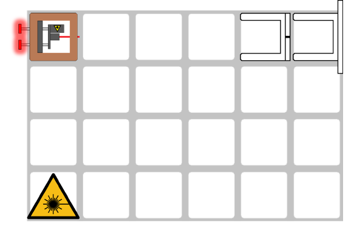
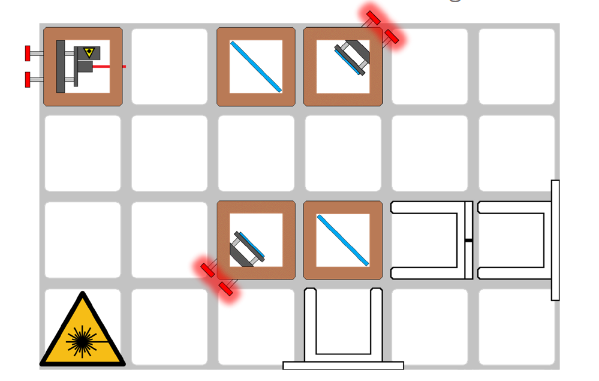
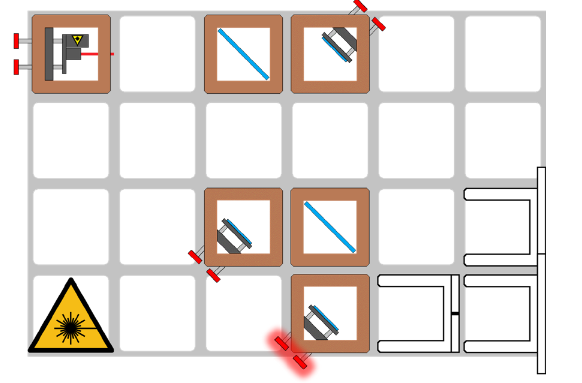
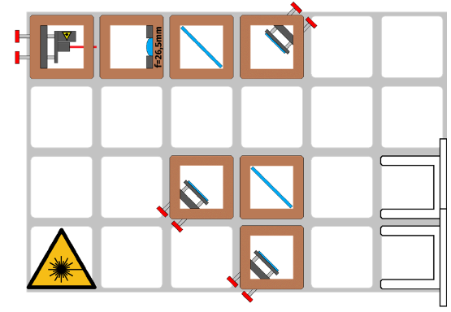
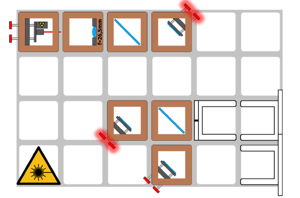
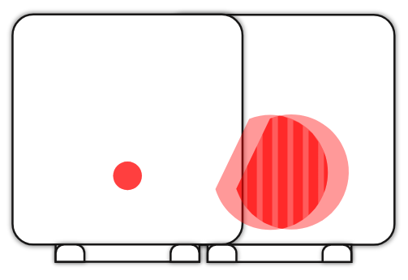

# Tutorial: Mach-Zehnder Interferometer

In this workshop, we will construct a Mach-Zehnder Interferometer using the openUC2 modular microscope toolbox. The Mach-Zehnder Interferometer is a powerful optical device that enables quantitative phase imaging and split-beam interferometry, making it invaluable for microscopy applications, materials science, and precision measurements.

The QBox is a collaboration between openUC2 and OQ3

### Materials Needed

**Optical Components:**
- Laser diode (coherent light source, 532 nm wavelength, minimum 10 mW)
- Two precision kinematic mirrors in UC2 cubes for beam steering
- one 45°-mirror
- Two 50:50 beam splitter cubes with broadband anti-reflection coating
- 44.5 mm focal length converging lens for beam conditioning
- Pinhole aperture

**Mechanical Components:**
- UC2 modular microscope toolbox with minimum 8 optical cubes
- Base plates (minimum 9) for mounting and stability
- Precision screwdrivers (1.5mm hex key) for fine alignment adjustments

**Safety and Environment:**
- Laser safety goggles (OD 4+ for 532 nm wavelength)
- Vibration isolation or heavy, stable optical table
- Environmental enclosure for air current protection

### Diagram

*Black and white box diagram showing the Mach-Zehnder Interferometer layout*

### Theory of Operation

The Mach-Zehnder Interferometer splits coherent light into two separate paths (reference and sample arms) using the first beam splitter. The reference beam travels through air or a known medium, while the sample beam passes through or reflects from the specimen being studied. Both beams are then recombined at a second beam splitter, creating an interference pattern that contains information about the optical path differences introduced by the sample.

Unlike the Michelson Interferometer, the Mach-Zehnder design provides separate, independent paths for reference and sample beams, offering greater flexibility for sample insertion and manipulation. This configuration is particularly advantageous for transmission microscopy and quantitative phase imaging applications.

*exemplary Setup for microscopicimaging showing off-axis holography configuration*

### Theoretical Background

**Split-Beam Interferometry Principles**

The Mach-Zehnder Interferometer operates on the principle of amplitude division, where the incident beam is split into two components of approximately equal intensity. Each beam travels through different optical paths before being recombined. The resulting interference pattern depends on:

1. **Optical Path Difference (OPD)**: $$\Delta = n_1 L_1 - n_2 L_2$$, where n is the refractive index and L is the path length
2. **Phase Difference**: $$\delta = \frac{2\pi}{\lambda} \times \text{OPD}$$
3. **Interference Condition**: Constructive interference occurs when $$\delta = 2\pi m$$ (m = integer)

**Mathematical Description of Interference**

The intensity distribution in the interference pattern is given by:
$$
I(x,y) = I_1 + I_2 + 2\sqrt{I_1 I_2}\cos[\varphi(x,y)]
$$

Where $$\varphi(x,y)$$ represents the local phase difference caused by sample-induced optical path variations.

**Quantitative Phase Imaging**

One of the most powerful applications of the Mach-Zehnder Interferometer is quantitative phase imaging, which allows measurement of:
- **Refractive index variations** in transparent samples
- **Thickness variations** in thin films and biological specimens  
- **Dynamic processes** in living cells and materials
- **Density fluctuations** in fluids and gases

The phase shift introduced by a transparent object is:
$$
\Delta\varphi = \frac{2\pi}{\lambda} \times t \times (n_{\text{sample}} - n_{\text{medium}})
$$

Where t is the thickness and n represents refractive indices.

**Phase Unwrapping and Data Analysis**

The interference fringes contain phase information that must be extracted through mathematical processing:
- **Fringe analysis**: Determines local phase from fringe spacing and orientation
- **Phase unwrapping**: Removes 2π ambiguities to obtain continuous phase maps
- **Quantitative measurements**: Converts phase data to physical quantities (thickness, refractive index, etc.)

**Sensitivity and Resolution Considerations**

The system sensitivity depends on:
- **Phase sensitivity**: $$\Delta\varphi_{\text{min}} \approx \frac{\lambda}{100 \times \text{visibility}}$$, typically $$\sim \frac{\lambda}{100}$$ for good systems
- **Spatial resolution**: Limited by numerical aperture of imaging system
- **Temporal resolution**: Determined by camera frame rate and sample dynamics

**Comparison with Other Interferometric Techniques**

| Technique | Advantages | Disadvantages | Best Applications |
|-----------|------------|---------------|-------------------|
| Mach-Zehnder | Separate beam paths, easy sample access | Requires stable environment | Transmission microscopy, flow studies |
| Michelson | Compact, simple alignment | Reflection-based, limited sample access | Surface profiling, displacement measurement |
| Shearing | Self-referencing, robust | Complex data analysis | Turbulence studies, wave front sensing |

**Modern Applications and Technology Transfer**

Mach-Zehnder Interferometry has found extensive applications in:
- **Biomedical imaging**: Cell biology, tissue analysis, drug testing
- **Materials science**: Thin film characterization, surface analysis  
- **Quality control**: Industrial inspection, defect detection
- **Fluid dynamics**: Flow visualization, density measurements
- **Telecommunications**: Fiber optic testing, optical component characterization
- **Astronomical interferometry**: High-resolution imaging of celestial objects

## Tutorial: Mach-Zehnder Interferometer
This guide will walk you through the assembly step by step. You can follow the process according to the functional modules or refer to the diagram above for orientation.

**⚠️ ATTENTION!**

NEVER LOOK DIRECTLY INTO THE LASER! EYE WILL BE DAMAGED DIRECTLY

NEVER SWITCH ON THE LASER WITHOUT INTENDED USE

BEAM HAS TO GO AWAY FROM ONESELF - ALWAYS!

 ###  Assemble the Optical Components

1. **Align the Laser Diode** with the Pinhole

2. **Add two beam splitters and two 45° mirrors** and adjust them so that both beams hit the pinhole centered.

3. **Add another 45° mirror** and adjust it so that the pinhole is centered.

4. **Position a lens (f=44.5mm)** in the beam path. You may already see interference patterns.

5. **Position a pinhole screen** in front of
one of the exits. If necessary, place the screen next to the grid to increase the distance.

5. **Adjust the mirrors** so that the two partial beams lie exactly on top of each other on the screen behind
the pinhole. Remove the pinhole when an interference pattern is visible.

**Your Setup is complete**

---

## Basic Interferometry Setup and Alignment

### 1.1: Establish Interference Fringes

Turn on the laser and observe the interference pattern. Adjust the reference mirror to create clear, visible fringes across the field of view.

*TODO: Add image of properly aligned fringe pattern*

### 1.2: Characterize Fringe Properties

Measure and document:
- Fringe spacing and orientation
- Fringe contrast (visibility)
- Stability over time

### 1.3: Sensitivity Testing

Make small adjustments to the reference mirror and observe how the fringe pattern responds. This demonstrates the high sensitivity of interferometric measurements.

---
## Safety Guidelines and Best Practices

### Laser Safety Protocol

**⚠️ CRITICAL SAFETY WARNINGS:**

1. **NEVER look directly into the laser beam or its reflections**
2. **Always wear appropriate laser safety goggles (OD 4+ for 532 nm)**
3. **Ensure all laser beams are properly terminated or contained**
4. **Post warning signs in the experimental area**
5. **Maintain minimum necessary laser power for observations**

### Experimental Safety Considerations

- **Secure all optical components** to prevent movement during measurements
- **Use proper sample handling techniques** to avoid contamination
- **Ensure electrical safety** with all electronic components
- **Maintain clean, organized workspace** to prevent accidents

**TODO**: Add institution-specific safety protocols and emergency procedures

---

## Troubleshooting Guide

### Common Problems and Solutions

#### Problem: Poor Fringe Visibility
**Possible Causes:**
- Misaligned beam paths
- Unequal beam intensities
- Poor coherence or spatial quality
- Environmental vibrations

**Solutions:**
1. Check beam alignment using screen at multiple positions
2. Balance beam intensities with neutral density filters
3. Improve spatial filtering and beam quality
4. Isolate setup from vibrations

#### Problem: No Interference Pattern
**Possible Causes:**
- Complete beam misalignment
- Blocked beam paths
- Insufficient beam overlap
- Wrong beam splitter orientation

**Solutions:**
1. Verify both beams reach the detector
2. Check for obstructions in beam paths
3. Systematically realign all optical components
4. Ensure proper beam splitter orientation and coating

#### Problem: Unstable Fringes
**Possible Causes:**
- Mechanical vibrations
- Air currents
- Temperature fluctuations
- Loose optical mounts

**Solutions:**
1. Use vibration isolation or heavy table
2. Enclose optical paths to minimize air currents
3. Allow thermal equilibration to
