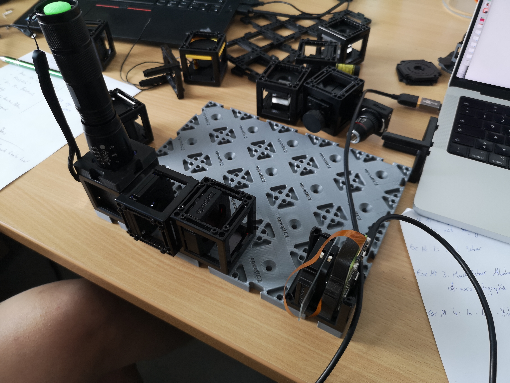
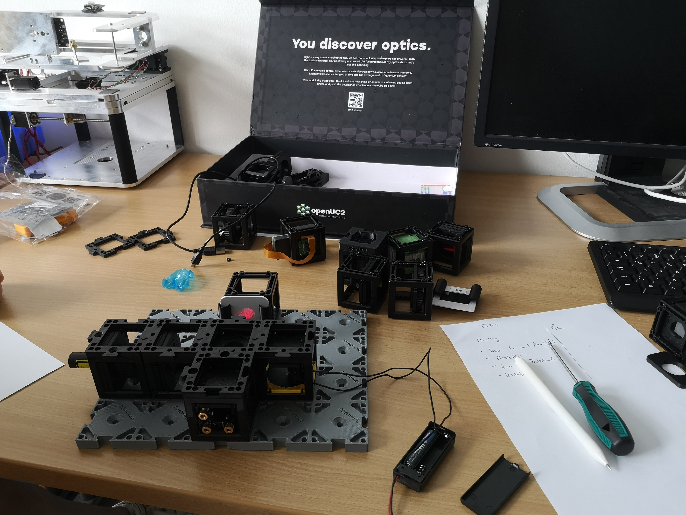

# HoloBox – Modular Interferometry & Digital Holography in a Box

*A fully open-source learning system for optics, interferometry, and holography.*

The **HoloBox** is a modular, open-source toolbox that brings classical and digital optics experiments into classrooms, labs, and maker spaces.
Built on the openUC2 cube system, it enables hands-on experiments ranging from **Michelson/Mach-Zehnder interferometry** to **inline digital holography** and **lensless microscopy**.
The system combines **precise optical hardware**, **open electronics**, and **modern digital workflows** such as **Jupyter notebooks**, **Python image reconstruction**, and **AI-ready embedded cameras**.

The entire project is open-source: hardware, firmware, software, and teaching materials. More can be found here: https://github.com/openUC2/TechnicalDocs-openUC2-HoloBox

This is a collaboration between **openUC2 GmbH** and the **Institute for Physics Education at the University of Münster**, supported by the [Wilhelm und Else Heraeus-Stiftung](https://www.we-heraeus-stiftung.de/).

## What You Can Do With the HoloBox

The HoloBox enables a wide spectrum of optical experiments:

### **Classical Optics & Interference**

* Build and align a **Michelson interferometer**
* Explore the **Mach–Zehnder interferometer**
* Perform **double-slit and grating diffraction**
* Observe **interference fringes**, stability, drift, phase shifts
* Observe temperature induced variations in the **Michelson Interferometer**
* Reconstruct **Inline Holography Microscopy/Digital Holography Microscopy (DHM)** using a Raspberry Pi 
* Visualize thermal expansion by heating one arm of an interferometer

### **Digital Holography**

* Capture **inline holograms** using a point source and the Raspberry Pi Camera
* Reconstruct the hologram numerically using a Python-based UI or Jupyter notebooks
* Perform **digital refocusing**, **Fourier analysis**, and **phase retrieval** (comming soon)
* Understand the connection between physical waves and numerical propagation

### **Lensless Microscopy**

* Image microscopic samples with/without an objective lens
* Detect **microplastics**, **plankton**, or other transparent objects
* Explore Fresnel propagation and digital reconstruction of real samples

### **Interdisciplinary Learning**

* Combine physics with **biology**, **environmental science**, or **computer vision**
* Use programmable electronics (LED modulation, heaters, piezo elements)
* Learn scientific computing through interactive coding tasks

## What’s Included in the Box

The HoloBox comes in two modular versions. Schools, labs, and hackers can start with the **Base Set** and expand later with the **Digital Extension**.

### **1. Base Set – Interferometry & Wave Optics**

Includes everything needed for classical optical experiments:

* Precision openUC2 injection-molded cubes
* 50 mm optical rails & mounts
* Front-surface mirrors
* Beam splitter
* Low-cost laser module
* Screens for fringe observation
* Apertures, slits, gratings
* Worksheets / Wunderbooks
* Printed build instructions

This set enables:

* Michelson interferometer
* Mach–Zehnder interferometer
* Diffraction experiments
* Basic holography (scratch holograms)

#### Inline Holography 

**Reconstruction using the ImSwitch Inline Holography Plugin**

#### Michelson Interferometer

#### Mach Zehnder Interferometer

### **2. Digital Extension – Holography & Computation**

Adds the digital and computational layer:

* **Raspberry Pi Camera** (smart camera that runs our dedicated Operating Sytsem)
* Download the image from here and flash to the SD card https://github.com/openUC2/TechnicalDocs-openUC2-HoloBox/releases/
* Electronics module for:

  * LED control
  * Thermal/piezo phase shifting
  * Triggering and syncing
* Python and Jupyter notebook tutorials
* Digital reconstruction workflows
* Sample experiments (microplastics, plankton, etc.)

This set enables:

* Inline holography
* Hologram reconstruction
* Lensless microscopy
* Computational imaging
* Integration into coding classes

## Modularity & Open-Source Philosophy

The HoloBox is fully modular and open:

* All CAD files are openly published (STL/STEP)
* Parts can be replaced or extended via 3D printing
* Supported by a growing openUC2 community
* Compatible with the UC2 miniBOX, coreBOX, and Quantum MiniLabs
* Designed for repairability and long-term use
* Firmware, software, workflows, and notebooks are open source

The goal:
**Make advanced optics accessible, affordable, and hackable.**

## Getting Started

1. **Get your kits from openUC2**
   Write us a mail: purchase@openuc2.com - STP files will be shared once we're fully done with development

2. **Run your first experiment**
   Choose between Michelson, Mach-Zehnder, diffraction, or holography.

3. **Connect the Raspberry Pi Camera (optional)**
   Start capturing digital holograms or real-time interference patterns. Connect to the Wifi Hotspot (password: `holobox123`) and open the website http://192.168.4.1

4. **Open the Webiste**
   Learn how to:

   * Load holograms
   * Reconstruct using Fresnel propagation
   * Perform digital refocusing
   * Visualize spacetime fringes and frequencies

5. **Modify & extend**
   Print new modules, explore new samples, or write your own analysis scripts.

## Documentation & Resources

Links will be added once this repo structure is finalized.

## Who Is Behind the HoloBox?

The HoloBox is a collaboration between:

* **openUC2 GmbH** – hardware, electronics, software & production
* **University of Münster – Institute for Physics Education** – didactic design & teaching materials
* Supported by regional & national STEM networks

## Roadmap

* Additional digital reconstruction methods
* Phase-shifting holography
* Multi-wavelength illumination
* Plugin for ImSwitch
* Extended classroom activities
* Community-submitted modules

## License

All hardware, firmware, and software are released under open licenses:

* Hardware → **CERN OHL / CC-BY**
* Software → **MIT**
* Teaching materials → **CC-BY**

