# Kombiniere Calliope mit dem Michelson Interferometer

## Flyer: Experiment für Schulen

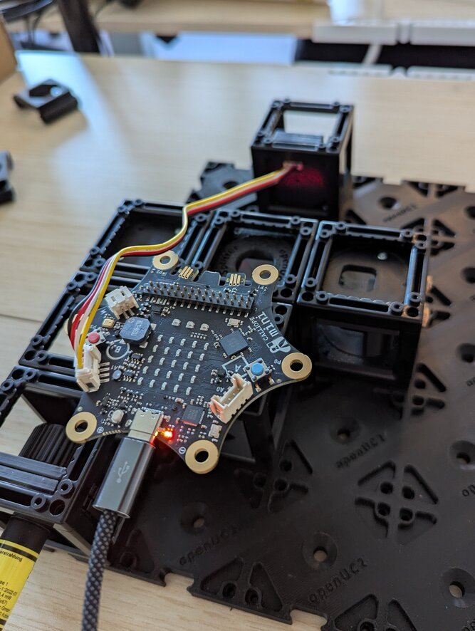

Im Interferometer wird ein Laser-Strahl geteilt, kurz getrennt geführt, und dann wieder gemischt. Dadurch entsteht ein Ring-Muster auf einem Schirm, weil an unterschiedlichen Stellen konstruktive und destruktive Interferenz auftritt.

In Wissenschaft und Technik werden Interferometer oft als Sensoren genutzt, weil jede winzige Veränderung der Licht-Pfade eine große Änderung im Interferenz-Muster bewirkt. So kann man zum Beispiel Turbulenzen in Luft sichtbar machen oder winzige Unebenheiten von Oberflächen ausmessen.

Durch Beheizen eines des Spiegel-Elemente und die Ausdehnung des Materials entsteht eine winzige Verkürzung eines der Pfade. Eine Pfadlängen-Veränderung um nur 325 Nanometer bewirkt eine komplette Umkehr des Interferenzmusters, was durch das Experiment in Echtzeit und mit den Augen beobachtbar wird.

Das Michelson-Interferometer ist bundesweit Bestandteil des Physik-Lehrplans im Abitur. Unsere robuste Bauweise und der Aufbau durch "zusammenstecken" ermöglicht aber auch schon weit vorher praktische Stoffeinheiten und Praktika. Mit dem Calliope Mini 3 können SuS die Beheizung programmieren und Messdaten aus dem Experiment sammeln, um dann z.B. in der Protokoll-Abgabe physische Zusammenhänge zu beweisen.

- Das Zusammenstecken des Interferometers verfestigt das Wissen über den Aufbau des Michelson-Interferometers (Anforderungsbereich 1).
- Das Feinjustieren der Spiegel fördert Intuition und erfordert Verständnis über die Funktion, die die optischen Komponenten im Aufbau haben (Anforderungsbereich 2).
- Eine Experiment-Methode zu entwerfen, zu programmieren, Daten zu sammeln, und daraus Zusammenhänge zu folgern ist echtes wissenschaftliches Arbeiten (Anforderungsbereich 3)!

## Anatomie der beheizbaren Spiegel-Armatur

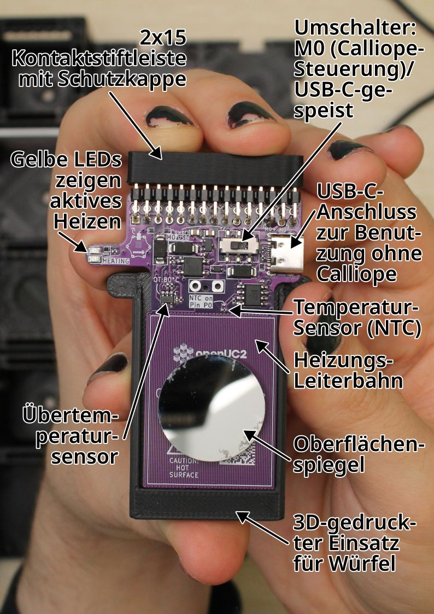

### Umschalter: M0 (Calliope-Steuerung)/USB-C-gespeist

Wenn der Plastikhebel des Umschalters in der linken Position steht, kann die Heizung mit dem "M0"-Ausgang des Calliope Mini 3 gesteuert werden. Ist der Plastikhebel in der rechten Position, ist die Heizung direkt mit der Stromversorgung des USB-C-Anschlusses verbunden.

### USB-C-Anschluss zur Benutzung ohne Calliope

Wenn hier eine Stromquelle verbunden ist, heizt die Heizung, wenn auch der Umschalter auf der rechten "USB"-Position steht. Es heizt und stoppt nur, wenn die Stromquelle entfernt wird, der Umschalter umgeschalten wird, oder bei Übertemperatur (über 80°C).

### Temperatur-Sensor (NTC)

Der Temperatursensor ist ein Widerstand mit negativem Thermalkoeffizienten, also nimmt der Widerstand ab, wenn die Temperatur zunimmt. Die Teilenummer ist NCP15WF104F03RC von muRata.

Die "B constant 25-80°C" ist 4303K. Das Datenblatt hat eine Werte-Tabelle (Suchbegriff im Dokument: "NCP15WF104D").

127.1k@20°C,100k@25°C,50.7k@40°C,22.2k@60°C,10.5k@80°C.

Der NTC ist auf der hohen Seite eines Spannungeteilers zu 3.3V, wo die Mitte an den positiven Input eines LM385 Operationsverstärkers als Puffer geht, und auf der niedrigen Seite ist ein 49.9k Ohm-Widerstand zu GND.

Am besten wäre, die Calliope ADC-Werte mit bekannten Temperatur-Referenzen zu kalibrieren, oder willkürliche Einheiten zu akzeptieren.

### Heizungs-Leiterbahn

Die Heizungs-Leiterbahn ist eine einzelne lange Kupfer-Leiterbahn der Leiterplatte, und sie geht auf der Rückseite der Leiterplatte weiter. Die mäandrierende Leiterbahn ist 0.2 mm breit, insgesamt 5916 mm lang, und gedruckt mit einer Kupferdicke von 1 oz/sqft. Ihr Widerstand (errechnet) sollte 14.4 Ohm bei 25°C sein, und 17.4 Ohm bei 80°C.

Per Calliope M0 (auf 100%) sowie per USB sollten an den Enden hier 4.6V anliegen.

### Oberflächenspiegel

Der kreisrunde Spiegel reflektiert auf seiner vordersten, exponierten Oberfläche und hat einen Durchmesser von 24 mm. Der Spiegel ist mit einem Pad aus doppelseitigem Klebeband auf die Heizungsfläche geklebt.

### 3D-gedruckter Einsatz für Würfel

Die Leiterplatte ist mit in ein 3D-Druckteil wieder mit einem doppelseitigem Klebepad geklebt. Die Seitenkanten des 3D-Drucks erlauben es dem Teil, in die Rillen der Innenkanten des Würfels zu rutschen und das Teil so zu fixieren. Mit einem zusätzlichen 3D-Druckteil kann die Armatur im 45°-Winkel in den Würfel gesetzt werden.

### Übertemperatursensor

Dieser Sensor unterbricht das Heizen, wenn der Sensor über 80°C heiß wird. Das Heizen setzt wieder ein, wenn die Temperatur unter 78°C fällt. Er unterbricht das Heizen in beiden Modi, Calliope M0 sowie USB. Wenn die Heizung unterbrochen ist, sind auch die gelben LEDs aus.

### Gelbe LEDs zeigen aktives Heizen

Wenn Spannung auf der Heizungs-Leiterbahn ist, dann leuchtet eine der gelben LEDs. Bei USB-C-Strom oder wenn Calliope M0 auf einen positiven Wert eingestellt ist, leuchtet die obere LED. Ist Calliope M0 auf einen negativen Wert gestellt, leuchtet die untere LED.

### 2x15 Kontaktstiftleiste mit Schutzkappe

Diese Kontaktstiftleiste kann in die Unterseite eines Calliope Mini 3 gesteckt werden, wobei der USB-Port am Calliope weg vom Spiegel zeigen muss.

Damit werden die folgenden Calliope-Pins verbunden:

| Function         | Calliope pin |
| ---------------- | ------------ |
| Heizung          | M0           |
| Temperatursensor | P0 (analog)  |

## Schritt-für-Schritt-Anleitung

### Teileliste

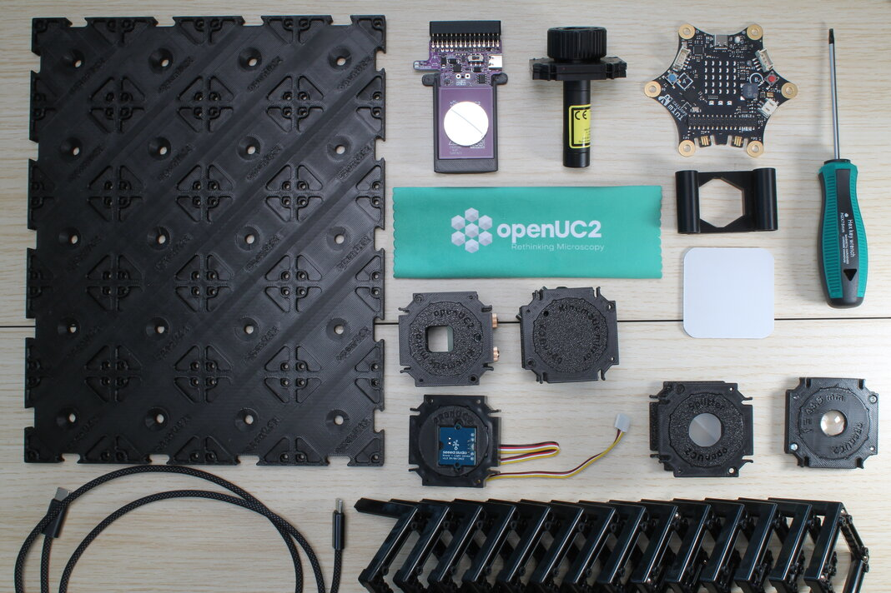

Und etwas, womit man den Calliope programmieren kann, wie einen Laptop.

### 1. Den Laserstrahl auf dem Schirm zentrieren

Baue ein Michelson-Interferometer mit Schirm, und schalte den Laser an. Suche jetzt nach dem Schraubenzieher, der in die Madenschrauben der kinematischen Spiegelhalterungen passt. Er sollte einen Hex-Antrieb der Größe H2 haben.

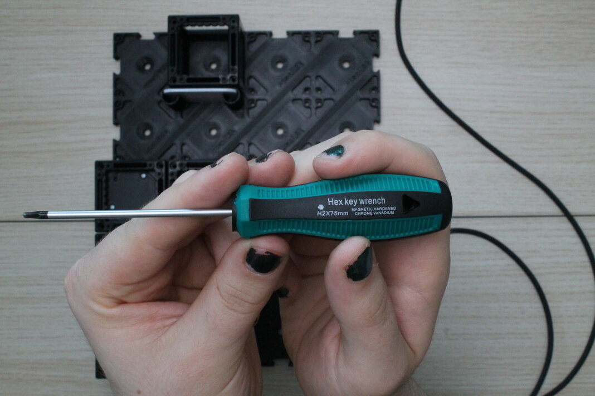

Stelle den kinematischen Spiegel, der auf 45° eingebaut ist, so ein, dass der Laserstrahl zentral auf dem Schirm zu sehen ist. Das kann man gut machen, während nur dieser eine kinematische Spiegel im Experiment ist.

### 2. Stelle die Heizung auf "M0" und stecke den Calliope auf

Auf der violetten Leiterplatte, stelle den Umschalter nach __links__, damit er in der "M0" position steht. Der Plastik-Hebel sollte auf der linken Seite sein.

Ziehe die Schutzkappe von der 2x15-pin Kontaktstiftleiste. Ziehe sie gerade ab und sei vorsichtig, die Kontaktstifte nicht zu verbiegen.

Stecke die Spiegelheizungsarmatur ins Experiment, in die fünfte Rille des Würfels und sodass der Spiegel zum Schirm zeigt. Die Oberfläche des Spiegels sollte jetzt perfekt im Zentrum des Würfels sein.

Drücke jetzt vorsichtig den Calliope Mini V3 auf die Kontaktstiftleiste. Dabei sollte der USB-C-Anschluss vom Calliope vom Schirm weg zeigen. Versuche, die Kontaktstifte in das Gegenstück auf dem Calliope zu drücken, indem du an beiden Seiten gleichmäßig drückst, damit die Kontaktstifte nicht verbiegen.

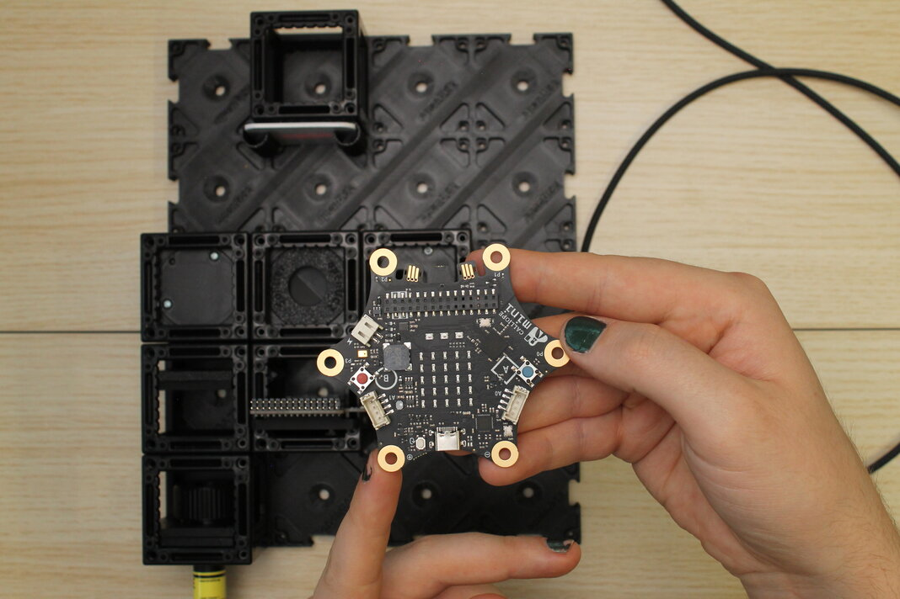

### 3. Verbinde den Calliope über USB-C und stelle den Spiegel ein, um ein Interferenzmuster zu bekommen

Stecke ein USB-C-Kabel in den Calliope und in den Laptop, der ihn programmieren soll. Führe das Kabel auf dem Tisch so, dass es nicht im Weg ist und dass nichts daran hängen bleibt. Wenn der Laptop läuft und Strom auf USB rausgibt, sollte eine rote LED in der Nähe des USB-Anschlusses auf dem Calliope leuchten.

Stelle nun den kinematischen Spiegel in dem anderen Arm des Interferometers ein, bis ein Interferenzmuster auf dem Schirm sichtbar wird. Drehe dazu mit dem Schraubendreher die 3 Madenschrauben des Kinematikspiegels, um den Winkel nach oben/unten, links/rechts und diagonal zu ändern.

Tipp: Der Laserstrahl (inklusive Staub auf der Aufweitungs-Linse und dem 45°-Spiegel) wird durch den Strahlenteiler-Würfel "kopiert", und soll danach wieder vereinigt werden, dass die Kopien genau aufeinander liegen. Versuche, die Staubkörner aufeinander zu bringen, die du auf dem Schirm siehst. Wenn die aufeinander liegen, sollte ein Ringmuster oder ein Streifenmuster (der Rand des Ringmusters) sichtbar werden.

Versuche, den zentralen Ring vollständig auf den Schirm zu bekommen. Um ihn herum sind die Regionen der Verstärkung und Auslöschung am breitesten, und das kann man am einfachsten sehen.

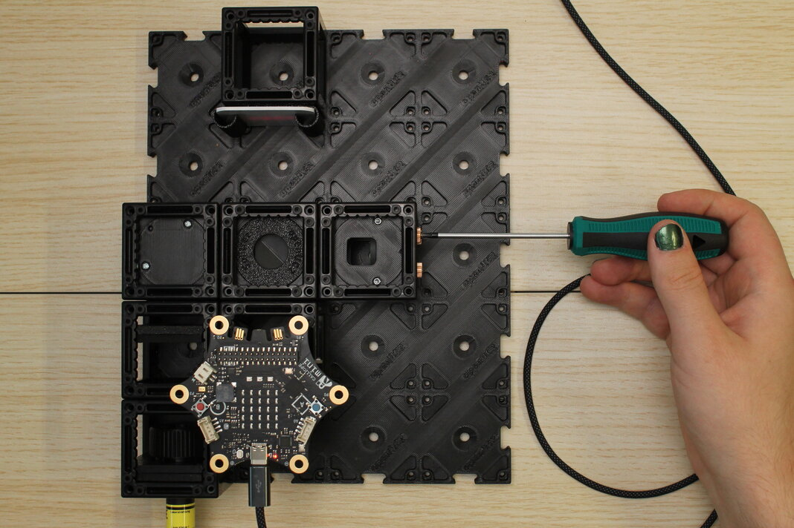

### 4. Programmiere den Calliope, den Spiegel zu beheizen

Wir wollen erstmal mit den Augen beobachten, was passiert, wenn der eine Spiegel im Interferometer beheizt wird.

Auf dem Laptop mit Chromium-basiertem Browser (Edge oder Chrome), gehe auf makecode.calliope.cc und lege ein neues Projekt an. Gib dem Projekt einen Namen und wähle v3 aus (weil das der Calliope Mini 3 ist).

Um den Spiegel zu heizen, nutze den Block aus dem "Motoren"-Menü. Die lila Leiterplatte hat die Heizungs-Leiterbahn verbunden mit den "M0"-Pins des Calliope, also kannst du die voreingestellte Motornummer so lassen.

Wird der Motor an gemacht, fließt Strom durch die lange Leiterbahn auf der Leiterplatte und erwärmt sich langsam. Weil das elektrisch gesehen einfach ein Widerstand ist, heizt es gleich gut wenn es auf 100% oder -100% eingestellt ist.

Während es heizt, kannst du eine der gelben LEDs leuchten sehen. Wenn M0 in der + Richtung läuft, leuchtet die obere LED, und in - Richtung leuchtet die untere gelbe LED.

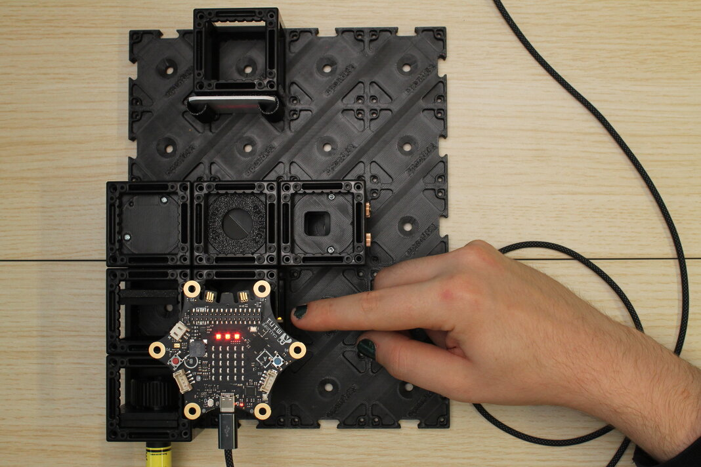

Wenn alles richtig eingestellt ist, solltest du sehen, wie das Muster "wächst", wenn der Spiegel heizt, und "schrumpft", wenn er abkühlt. Die Fläche im innersten Kreis wechselt einfach zwischen hell und dunkel.

### 5. Setze einen Lichtsensor statt dem Schirm ein

Mit unserem Aufbau können wir bis jetzt zwar die Heizung durch Programmieren steuern, müsen das Interferenzmuster aber mit unseren Augen (oder einer Handykamera) beobachten. Um es wissenschaftlicher zu beobachten, sollten wir einen Lichtsensor hinzufügen und den Calliope die Lichtintensität an einem kleinen Punkt im Interferenzmuster messen lassen.

Der Grove Light Sensor von Seeed Studio sollte in einem 3D-gedruckten runden Teil sein, was zwischen zwei "master insert"-Platten klemmt. Du brauchst auch ein Grove-Kabel, was mindestens 20 cm lang ist. Das zum Lichtsensor mitgelieferte Kabel reicht aus.

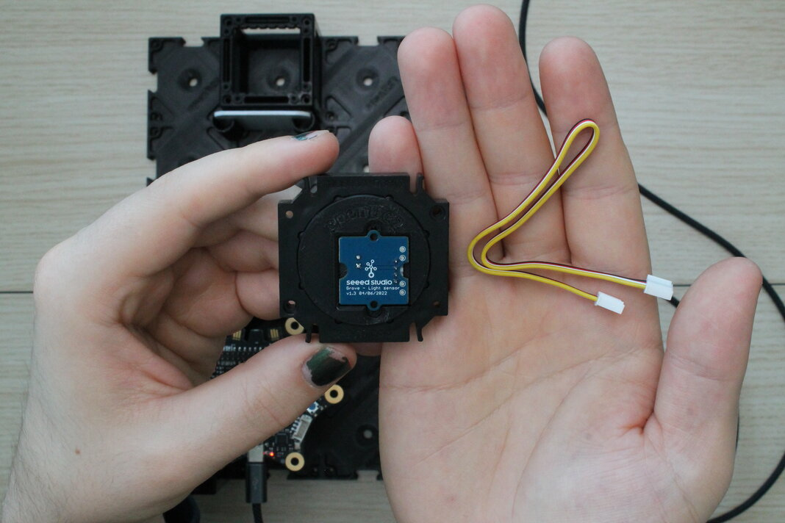

Auf der Seite mit der Lochblende und dem Grove-Anschluss, stecke ein Kabelende in den Anschluss.

Um das in einen Würfel zu bringen, musst du vielleicht den Würfel auseinandernehmen, der den Schirm hält. Das Sensorkabel sollte über der Lochblende reingesteckt sein, wenn es im Experiment ist, also stelle den Lichtsensoraufbau so in eine Würfel-Hälfte, dass der Kabelstecker maximal weit weg von den Noppen des Würfels ist.

Schließe den Würfel mit einer anderen Würfelhälfte. Stelle sicher, dass der Einsatz gerade im Wüfel sitzt, und dass die Würfelhälften vollständig ineinandergesteckt sind.

Setze den Sensorwürfel dort ein, wo der Schirm war, und drücke ihn in die Basisplatte.

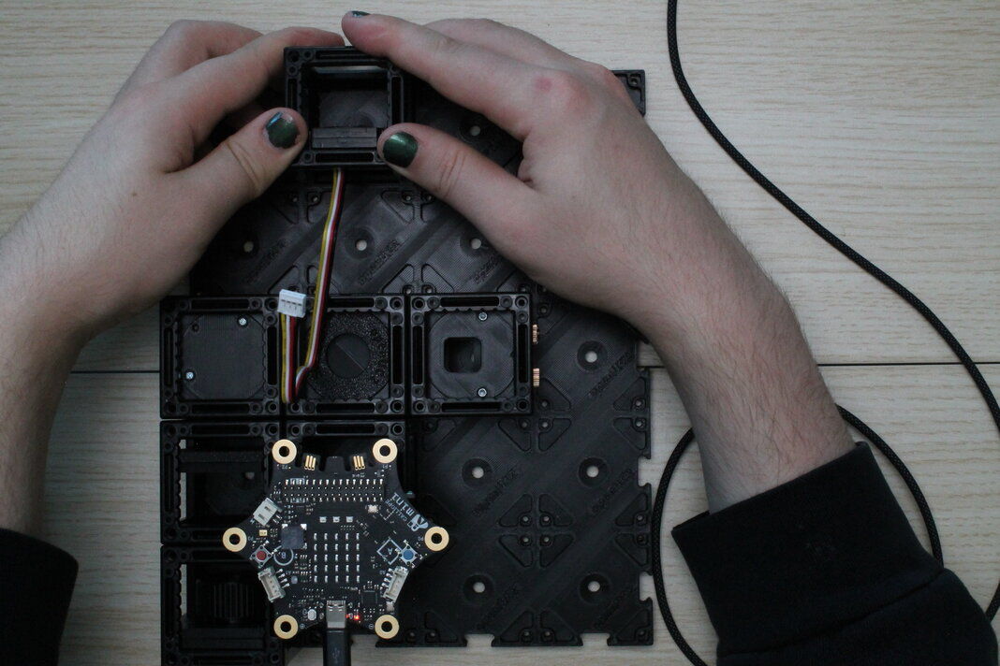

### 6. Verbinde mit dem Calliope und justiere neu, um das Interferenzmuster wiederzubekommen

Stecke das andere Ende des Grove-Kabels in den "A1"-Steckplatz auf der Oberseite des Calliope. Das Kabel ist etwas kurz, aber die Länge sollte ausreichen, wenn das Kabel wirklich oberhalb der Lochblende im Sensor steckt.

Lehne den weißen Schirm an den Würfel mit dem Lichtsensor an, um den Laserstrahl wieder sehen zu können, und justiere den kinematischen Spiegel im anderen Arm des Interferometers, um wieder das Interferenzmuster zu bekommen. Der Winkel von dem beheizten Spiegel ist leicht anders als zuvor, weil jetzt das Sensorkabel dran zieht.

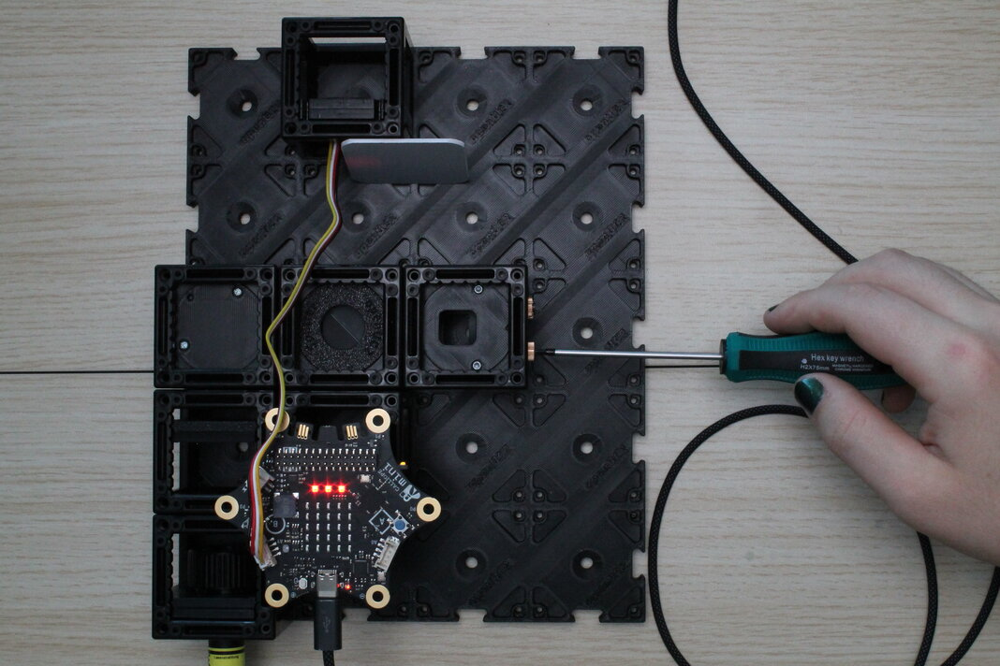

### 7. Programmiere den Calliope, die Temperatur der Heizung und die Lichtintensität zu messen, und über Seriell zu senden

In Makecode, baue ein Programm, sodass der Calliope die Heizung in langsamen Abständen immer wieder an- und ausschaltet.

Lies die ganze Zeit Temperatur (analog) und Lichtintensität (analog) aus. Sende die Messwerte über Seriell zum Computer. Sende Namen und Wert in einer Zeile, sodass der Computer die empfangenen Daten auseinanderhalten kann.

| Funktion           | Calliope pin |
| ------------------ | ------------ |
| Heizung            | M0           |
| Temperatur-Sensor  | P0 (analog)  |
| Grove Light Sensor | C16 (A1 RX)  |

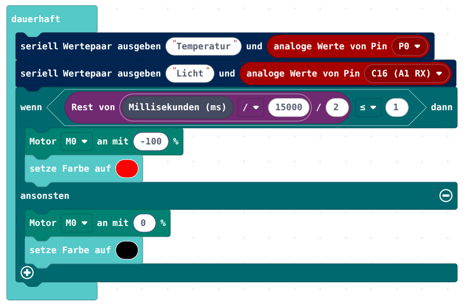

Öffne die Anzeige der empfangenen Daten unter der Abbildung des Calliope. Es sollten jetzt automatisch 2 schöne Graphen gezeichnet werden, wo sogar die Achsen automatisch skalieren.

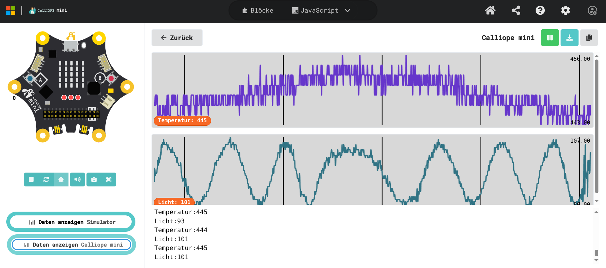

Die empfangenen analogen Daten entsprechen der Spannung, die der Calliope an den Pins sieht. Er teilt den Bereich zwischen 0V und 3.3V linear in 1024 Teile. Allerdings arbeiten die anderen Bauteile wie NTC und Lichtsensor (Photodiode) nicht linear. Die einfachste Methode, die physischen Größen auf die Messwerte zu kalibrieren, wäre, bekannte Referenzquellen zu nehmen, die Sensoren denen auszusetzen, und den gemessenen Wert zu notieren. Allerdings ist die relative Veränderung der zwei Messwerte als Beobachtung auch gut genug.
